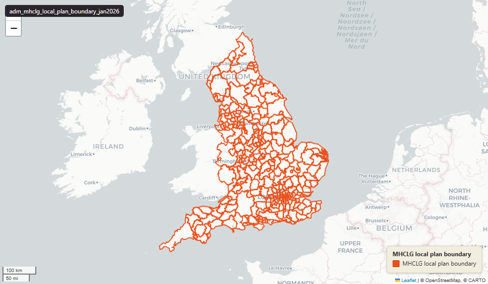

# MHCLG Local plan boundary, January 2026

Local Plan Boundary

`adm_mhclg_local_plan_boundary_jan2026`

**SOURCE**

- Ministry of Housing, Communities and Local Government (MHCLG), published via Planning Data (planning.data.gov.uk).

**DOCUMENTATION**

- Dataset page : https://www.planning.data.gov.uk/dataset/local-plan-boundary
- Field specification : https://digital-land.github.io/specification/dataset/local-plan-boundary

**DEFINITIONS**

- Local plan boundary is the development plan area prepared by a local planning authority.

**SCOPE**

- England only.
- 575 polygon rows representing 364 distinct upstream entity IDs across 363 local planning authorities.

**CRS**

- EPSG:27700 (British National Grid / BNG).

**LICENCE**

- Open Government Licence v3.0.

**DATA QUALITY CAVEATS**

- The upstream geometry is multipolygon; the loader exploded each multipolygon into single-part Polygon rows. One entity can occupy many rows (entity 4211319 has 53 parts).

**UPDATE REQUIRED**

- New data found from data source on 18 March 2026. Current data is 9 January 2026. An update is scheduled in the next turn.

**LOADED INTO uk_baseline**

- Loaded by PNC, January 2026.

MSOA SPLIT (added 30 June 2026)

- Geometry split to one row per (source feature x MSOA 2021). Each row carries that MSOA's msoa21cd / msoa21nm / msoa21hclnm and best-fit lad22 / lad25. The source feature's original primary key is preserved as `source_fid`; `gid` is a fresh surrogate primary key.
- Keep-everything (3 July 2026): geometry outside every MSOA — offshore, estuarine, or beyond the generalised coastline — is retained as rows with NULL geography columns (source_fid links the parts), so the layer holds the complete source geometry.

## Columns

| Column | Type | Description / unit |
|---|---|---|
| `fid` | `bigint` |  |
| `dataset` | `character varying` |  |
| `end_date` | `character varying` |  |
| `entity` | `character varying` |  |
| `entry_date` | `date` |  |
| `name` | `character varying` |  |
| `organisation_entity` | `character varying` |  |
| `prefix` | `character varying` |  |
| `quality` | `character varying` |  |
| `reference` | `character varying` |  |
| `start_date` | `character varying` |  |
| `typology` | `character varying` |  |
| `organisations` | `character varying` |  |
| `local_planning_authorities` | `character varying` |  |
| `msoa21cd` | `character varying` | Middle Layer Super Output Area (MSOA) 2021 code of this piece. Open Government Licence v3.0. |
| `msoa21nm` | `character varying` | Official ONS MSOA 2021 name of this piece. Open Government Licence v3.0. |
| `msoa21hclnm` | `text` | House of Commons Library readable MSOA name of this piece. Open Parliament Licence. |
| `lad22cd` | `text` | Local Authority District 2022 code (2021 LAD geography, anchored to the MSOA 2021 name scoping), best-fit from this piece's msoa21cd. Open Government Licence v3.0. |
| `lad22nm` | `text` | Local Authority District 2022 name (2021 LAD geography), best-fit from this piece's msoa21cd. Open Government Licence v3.0. |
| `lad25cd` | `text` | Local Authority District 2025 code (current administering authority), best-fit from this piece's msoa21cd. Open Government Licence v3.0. |
| `lad25nm` | `text` | Local Authority District 2025 name (current administering authority), best-fit from this piece's msoa21cd. Open Government Licence v3.0. |
| `geom` | `geometry(MultiPolygon,27700)` |  |
| `source_fid` | `integer` | Primary key of the source feature in the pre-split layer uk.adm_mhclg_local_plan_boundary_jan2026__preswap_jun30 (non-unique here: a feature spanning N MSOAs has N rows). |
| `gid` | `bigint` |  |
