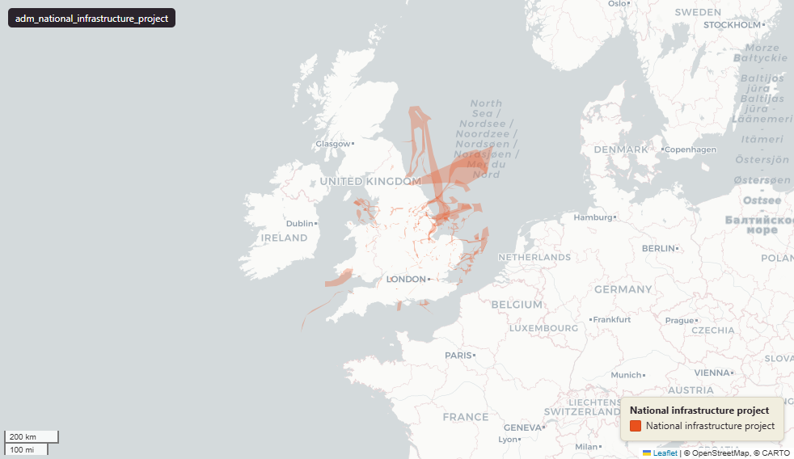

# Planning Inspectorate National Infrastructure Project boundaries, England & Wales, July 2026

National Infrastructure Projects

`adm_national_infrastructure_project`

**SOURCE**

- Planning Inspectorate (PINS), National Infrastructure Consenting service. Downloaded from the projects-map "download all project boundaries" endpoint on 23 July 2026.

**DOCUMENTATION**

- Projects map      : https://national-infrastructure-consenting.planninginspectorate.gov.uk/projects-map
- Service home      : https://national-infrastructure-consenting.planninginspectorate.gov.uk/
- Boundary download : https://national-infrastructure-consenting.planninginspectorate.gov.uk/projects-map/download-boundaries

**DEFINITIONS**

- Nationally Significant Infrastructure Projects (NSIP): "These are large scale projects like power stations, highways and power lines." (Planning Inspectorate, National Infrastructure Consenting service)

**SCOPE**

- England & Wales, including offshore project envelopes. 351 boundary features across 268 distinct case references. Boundaries received between 6 September 2017 and 20 July 2026.

**CRS**

- EPSG:27700 (British National Grid). Reprojected at load from EPSG:4326 (WGS 84), the source GeoJSON coordinate reference system.

**LICENCE**

- Open Government Licence v3.0. Crown copyright.

**DATA QUALITY CAVEATS**

- "Project boundaries and markers are approximate" (National Infrastructure Consenting projects map); not a substitute for the definitive Development Consent Order application plans.
- One row is one boundary feature, not one project: 351 features across 268 case references, so some projects carry more than one boundary submission.
- 13 features (case references EN0110020, EN0110033, EN0110036, EN0110037, EN010055, EN010141, EN020009, EN0210004, EN070001, EN0710009, TR010027, TR0310002) have invalid geometry, mostly ring self-intersections, stored as received; repair before analytical joins.
- area_ha includes large offshore envelopes (for example Dogger Bank at roughly 1.7 million hectares) and is indicative; for the 13 invalid features it is unreliable.
- No field-level data dictionary is published for this download; the four source fields are carried by their source names.

**ENRICHMENT**

- area_ha: hectares computed at load from the British National Grid geometry.

**NOT IN THIS DATASET**

- Project stage, sector or type, applicant, key dates and documents are not in the boundary download. They are on each project page, keyed by case_reference, at the National Infrastructure Consenting service, and in the planning.data.gov.uk Nationally Significant Infrastructure Project datasets.

**LOADED INTO uk_baseline**

- Loaded by PNC, 23 July 2026.

## Columns

| Column | Type | Description / unit |
|---|---|---|
| `gid` | `bigint` |  |
| `case_reference` | `text` | Source field `caseReference`. No publisher field definition; carried by source name. |
| `project_name` | `text` | Source field `projectName`. No publisher field definition; carried by source name. |
| `file_name` | `text` | Source field `fileName`. No publisher field definition; carried by source name. |
| `received_date` | `timestamp with time zone` | Source field `receivedDate`. No publisher field definition; carried by source name. Bare source dates stored at 00:00:00 UTC. |
| `area_ha` | `double precision` | Hectares, computed at load from the EPSG:27700 geometry. Approximate (source boundaries are approximate); unreliable for the 13 invalid-geometry features. |
| `geom` | `geometry(MultiPolygon,27700)` | Boundary geometry, EPSG:27700 (British National Grid), MultiPolygon, reprojected at load from EPSG:4326. Source boundaries are approximate; 13 features have invalid geometry. |
