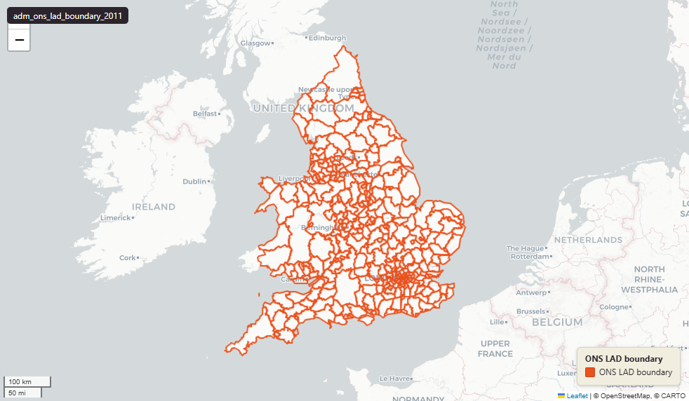

# ONS Local Authority Districts (LAD), England & Wales extent, December 2011

`adm_ons_lad_boundary_2011`

<a href="http://localhost:7800/?layer=uk_baseline.adm_ons_lad_boundary_2011" target="_blank" rel="noopener">Open in the Dashboard &#8599;</a> (start your local Dashboard first)

**SOURCE**

- Office for National Statistics (ONS), Open Geography Portal.

**DOCUMENTATION**

- Dataset page : https://geoportal.statistics.gov.uk/datasets/ons::local-authority-districts-december-2011-boundaries-ew-bfe-2/about
- Digital boundaries methods : https://www.ons.gov.uk/methodology/geography/geographicalproducts/digitalboundaries

**DEFINITIONS**

- "Full resolution - extent of the realm (usually this is the Mean Low Water mark but, in some cases, boundaries extend beyond this to include offshore islands)." (ONS digitalboundaries page, definition of BFE)

**SCOPE**

- England & Wales.
- 348 LADs (2011 boundary set).

**CRS**

- EPSG:27700 (British National Grid / BNG).

**LICENCE**

- Open Government Licence v3.0.

## Columns

| Column | Type | Description / unit |
|---|---|---|
| `id` | `integer` | ArcGIS source identifier preserved at load. |
| `geom` | `geometry(MultiPolygon,27700)` | Source field "geometry"; MultiPolygon in EPSG:27700 (British National Grid). BFE = full resolution, extent of the realm — see table comment. |
| `objectid` | `bigint` | Source field "OBJECTID"; ArcGIS surrogate key from upstream. |
| `lad11cd` | `character varying(9)` | Source field "LAD11CD"; ONS GSS 9-character LAD code (2011). |
| `lad11cdo` | `character varying(4)` | Source field "LAD11CDO"; older 4-character LAD legacy code (pre-GSS). |
| `lad11nm` | `character varying(28)` | Source field "LAD11NM"; human-readable LAD name (English). |
| `lad11nmw` | `character varying(24)` | Source field "LAD11NMW"; human-readable LAD name (Welsh, populated where applicable). |
| `globalid` | `character varying(38)` | Source field "GlobalID"; ArcGIS GUID-format unique identifier. |
