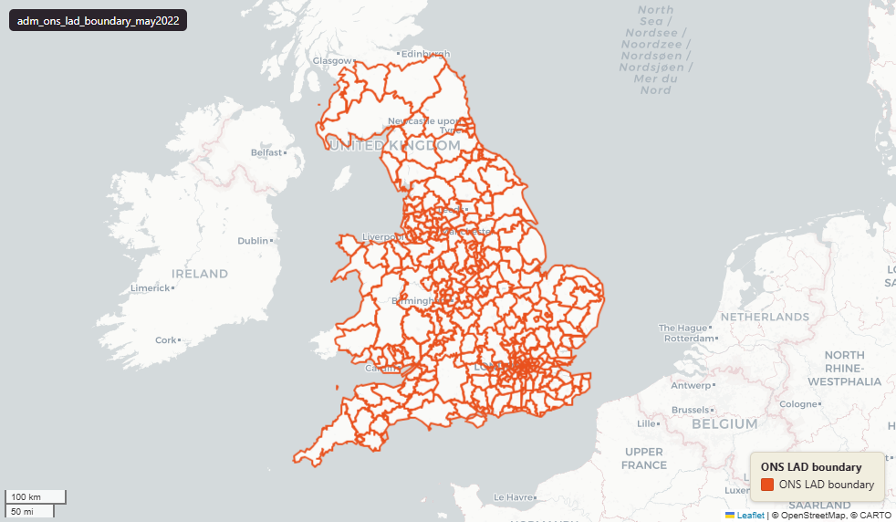

# ONS Local Authority Districts (LAD), UK extent, May 2022

`adm_ons_lad_boundary_may2022`

<a href="http://localhost:7800/?layer=uk_baseline.adm_ons_lad_boundary_may2022" target="_blank" rel="noopener">Open in the Dashboard &#8599;</a> (start your local Dashboard first)

**SOURCE**

- Office for National Statistics (ONS), Open Geography Portal.

**DOCUMENTATION**

- Dataset page : https://geoportal.statistics.gov.uk/datasets/local-authority-districts-may-2022-boundaries-uk-bfe-v3-2
- Digital boundaries methods : https://www.ons.gov.uk/methodology/geography/geographicalproducts/digitalboundaries

**DEFINITIONS**

- "Full resolution - extent of the realm (usually this is the Mean Low Water mark but, in some cases, boundaries extend beyond this to include offshore islands)." (ONS digitalboundaries page, definition of BFE)

**SCOPE**

- United Kingdom (England, Wales, Scotland, Northern Ireland).
- 374 LADs.

**CRS**

- EPSG:27700 (British National Grid / BNG).

**LICENCE**

- Open Government Licence v3.0.

## Columns

| Column | Type | Description / unit |
|---|---|---|
| `id_original` | `integer` | ArcGIS source identifier preserved at load; not stable across ONS re-publications. |
| `lad22cd` | `character varying(9)` | Source field "LAD22CD"; ONS GSS 9-character LAD code (e.g. "E06000001" for Hartlepool). |
| `lad22nm` | `character varying(36)` | Source field "LAD22NM"; human-readable LAD name. |
| `bng_e` | `integer` | Source field "BNG_E"; British National Grid easting of LAD centroid. Unit: "metres". |
| `bng_n` | `integer` | Source field "BNG_N"; British National Grid northing of LAD centroid. Unit: "metres". |
| `long` | `double precision` | Source field "LONG"; longitude of LAD centroid. Unit: "degrees". |
| `lat` | `double precision` | Source field "LAT"; latitude of LAD centroid. Unit: "degrees". |
| `globalid` | `character varying(38)` | Source field "GlobalID"; ArcGIS GUID-format unique identifier. |
| `geom` | `geometry(MultiPolygon,27700)` | Source field "geometry"; MultiPolygon in EPSG:27700 (British National Grid). BFE = full resolution, extent of the realm — see table comment. |
| `fid` | `bigint` |  |
| `area_ha` | `double precision` | Area in hectares, computed at load from the geometry. Unit: hectares. Stale if geometry is later edited. |
