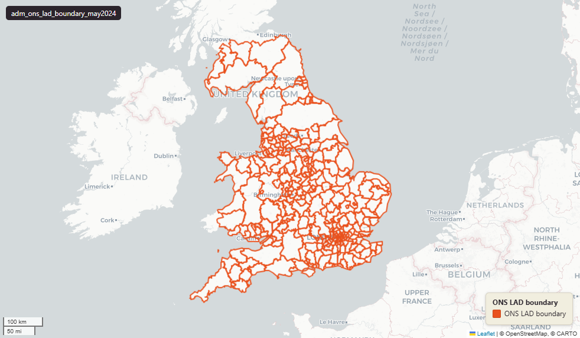

# ONS Local Authority Districts (LAD), UK extent, May 2024

Local Authority District Boundary 2024

`adm_ons_lad_boundary_may2024`

**SOURCE**

- Office for National Statistics (ONS), Open Geography Portal.

**DOCUMENTATION**

- Dataset page : https://geoportal.statistics.gov.uk/datasets/ons::local-authority-districts-may-2024-boundaries-uk-bfe-2/about
- Digital boundaries methods : https://www.ons.gov.uk/methodology/geography/geographicalproducts/digitalboundaries

**DEFINITIONS**

- Local Authority (LA) boundaries define the exact geographic limits of a council's jurisdiction.

**SCOPE**

- United Kingdom (England, Wales, Scotland, Northern Ireland).
- 361 LADs.

**CRS**

- EPSG:27700 (British National Grid / BNG).

**LICENCE**

- Open Government Licence v3.0.

**DATA QUALITY CAVEATS**

- Geography keys are NULL on 43 of 361 rows, measured 28 July 2026: 43 are in Scotland or Northern Ireland, outside the England and Wales lookup.
- County and Spatial Development Strategy columns are England and Wales only; rows elsewhere carry no county or SDS. Wales and the Isles of Scilly carry a county but no SDS. Rows with no Local Authority District code are NULL in all four columns.
- `lad25cd` and `lad25nm` cover England and Wales only; Scottish and Northern Irish rows carry no 2025 district code.

**ENRICHMENT**

- `sds_name` / `sds_group` — Spatial Development Strategy area and devolution status, a Prior + Partners categorisation over Ministry of Housing, Communities and Local Government (MHCLG) English devolution policy, joined at load on the row's Local Authority District 2025 code via uk.ref_lad25_ctyua25_sds_lu_jul2026.

## Columns

| Column | Type | Description / unit |
|---|---|---|
| `id_original` | `integer` | ArcGIS source identifier preserved at load; not stable across ONS re-publications. |
| `lad24cd` | `character varying(9)` | Source field "LAD24CD"; ONS GSS 9-character LAD code. |
| `lad24nm` | `character varying(36)` | Source field "LAD24NM"; human-readable LAD name (English). |
| `lad24nmw` | `character varying(24)` | Source field "LAD24NMW"; human-readable LAD name (Welsh, populated where applicable). |
| `bng_e` | `integer` | Source field "BNG_E"; British National Grid easting of LAD centroid. Unit: "metres". |
| `bng_n` | `integer` | Source field "BNG_N"; British National Grid northing of LAD centroid. Unit: "metres". |
| `long` | `double precision` | Source field "LONG"; longitude of LAD centroid. Unit: "degrees". |
| `lat` | `double precision` | Source field "LAT"; latitude of LAD centroid. Unit: "degrees". |
| `geom` | `geometry(MultiPolygon,27700)` | Source field "geometry"; MultiPolygon in EPSG:27700 (British National Grid). BFE = full resolution, extent of the realm — see table comment. |
| `fid` | `bigint` |  |
| `area_ha` | `double precision` | Area in hectares, computed at load from the geometry. Unit: hectares. Stale if geometry is later edited. |
| `lad25cd` | `text` | Local Authority District 2025 code (current administering authority). Traced via uk.ref_lad25_ctyua25_sds_lu_jul2026 from the row's Local Authority District 2024 code, with Barnsley and Sheffield recoded to their 1 April 2025 codes. Open Government Licence v3.0. |
| `lad25nm` | `text` | Local Authority District 2025 name (current administering authority). Traced via uk.ref_lad25_ctyua25_sds_lu_jul2026 from the row's Local Authority District 2024 code, with Barnsley and Sheffield recoded to their 1 April 2025 codes. Open Government Licence v3.0. |
| `ctyua25cd` | `text` | County or unitary authority code at 1 April 2025. Joined at load via uk.ref_lad25_ctyua25_sds_lu_jul2026 on the row's Local Authority District 2025 code. Open Government Licence v3.0. |
| `ctyua25nm` | `text` | County or unitary authority name at 1 April 2025. Joined at load via uk.ref_lad25_ctyua25_sds_lu_jul2026 on the row's Local Authority District 2025 code. Open Government Licence v3.0. |
| `sds_name` | `text` | Spatial Development Strategy (SDS) area, a Prior + Partners categorisation over Ministry of Housing, Communities and Local Government (MHCLG) English devolution policy. Joined at load via uk.ref_lad25_ctyua25_sds_lu_jul2026 on the row's Local Authority District 2025 code. Open Government Licence v3.0. |
| `sds_group` | `text` | Devolution status of the Spatial Development Strategy area: Existing Devolution Footprints, Devolution Priority Programme, Other Proposed Geographies or Remaining Areas. Joined at load via uk.ref_lad25_ctyua25_sds_lu_jul2026 on the row's Local Authority District 2025 code. Open Government Licence v3.0. |
