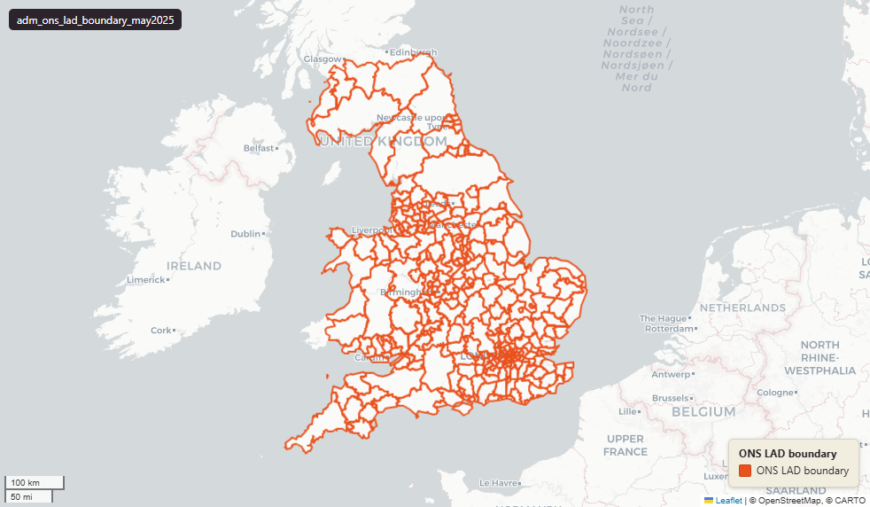

# ONS Local Authority Districts (LAD), UK extent, May 2025

Local Authority District Boundary

`adm_ons_lad_boundary_may2025`

**SOURCE**

- Office for National Statistics (ONS), Open Geography Portal.

**DOCUMENTATION**

- Dataset page : https://geoportal.statistics.gov.uk/datasets/local-authority-districts-may-2025-boundaries-uk-bfe-v2/about
- Digital boundaries methods : https://www.ons.gov.uk/methodology/geography/geographicalproducts/digitalboundaries

**DEFINITIONS**

- In England, Local Authority (LA) boundaries define the exact geographic limits of a council's jurisdiction.

**SCOPE**

- United Kingdom (England, Wales, Scotland, Northern Ireland).
- 361 LADs.

**CRS**

- EPSG:27700 (British National Grid / BNG).

**LICENCE**

- Open Government Licence v3.0.

## Columns

| Column | Type | Description / unit |
|---|---|---|
| `id` | `integer` | ArcGIS source identifier preserved at load; not stable across ONS re-publications. |
| `geom` | `geometry(MultiPolygon,27700)` | Source field "geometry"; MultiPolygon in EPSG:27700 (British National Grid). BFE = full resolution, extent of the realm — see table comment. |
| `fid` | `bigint` |  |
| `lad25cd` | `character varying(9)` | Source field "LAD25CD"; ONS GSS 9-character LAD code. |
| `lad25nm` | `character varying(100)` | Source field "LAD25NM"; human-readable LAD name (English). |
| `lad25nmw` | `character varying(100)` | Source field "LAD25NMW"; human-readable LAD name (Welsh, populated where applicable). |
| `bng_e` | `integer` | Source field "BNG_E"; British National Grid easting of LAD centroid. Unit: "metres". |
| `bng_n` | `integer` | Source field "BNG_N"; British National Grid northing of LAD centroid. Unit: "metres". |
| `long` | `double precision` | Source field "LONG"; longitude of LAD centroid. Unit: "degrees". |
| `lat` | `double precision` | Source field "LAT"; latitude of LAD centroid. Unit: "degrees". |
| `globalid` | `character varying(38)` | Source field "GlobalID"; ArcGIS GUID-format unique identifier. |
