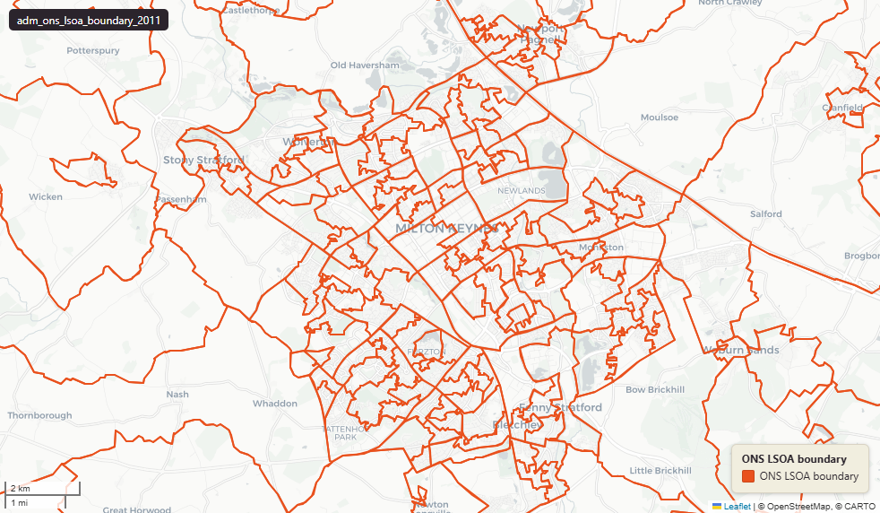

# ONS Lower layer Super Output Areas (LSOA), England & Wales extent, December 2011

Lower Layer Super Output Area Boundary 2011

`adm_ons_lsoa_boundary_2011`

**SOURCE**

- Office for National Statistics (ONS), Open Geography Portal.

**DOCUMENTATION**

- Dataset page : https://geoportal.statistics.gov.uk/datasets/ons::lower-layer-super-output-areas-december-2011-boundaries-ew-bfc-v3/about
- Digital boundaries methods : https://www.ons.gov.uk/methodology/geography/geographicalproducts/digitalboundaries

**DEFINITIONS**

- Lower Layer Super Output Areas (LSOAs) are small, stable census statistical areas built from groups of Output Areas, of similar population size — about 1,500 residents on average (roughly 1,000–3,000 people).

**SCOPE**

- England & Wales.
- 34,753 LSOAs (2011 Census geography).

**CRS**

- EPSG:27700 (British National Grid / BNG).

**LICENCE**

- Open Government Licence v3.0.

## Columns

| Column | Type | Description / unit |
|---|---|---|
| `id` | `integer` | ArcGIS source identifier preserved at load. |
| `geom` | `geometry(MultiPolygon,27700)` | Source field "geometry"; MultiPolygon in EPSG:27700. BFC = full resolution clipped to Mean High Water — see table comment. |
| `objectid` | `bigint` | Source field "OBJECTID"; ArcGIS surrogate key from upstream. |
| `lsoa11cd` | `character varying(9)` | Source field "LSOA11CD"; ONS GSS 9-character LSOA code. |
| `lsoa11nm` | `character varying(33)` | Source field "LSOA11NM"; human-readable LSOA name. |
| `bng_e` | `integer` | Source field "BNG_E"; British National Grid easting of LSOA centroid. Unit: "metres". |
| `bng_n` | `integer` | Source field "BNG_N"; British National Grid northing of LSOA centroid. Unit: "metres". |
| `long_` | `double precision` | Source field "LONG_"; longitude of LSOA centroid. Unit: "degrees". Trailing underscore preserved from upstream. |
| `lat` | `double precision` | Source field "LAT"; latitude of LSOA centroid. Unit: "degrees". |
| `shape_leng` | `double precision` | Source field "Shape_Length"; legacy ArcGIS shape length. Unit: "metres" (EPSG:27700 perimeter). |
| `globalid` | `character varying(38)` | Source field "GlobalID"; ArcGIS GUID-format unique identifier. |
