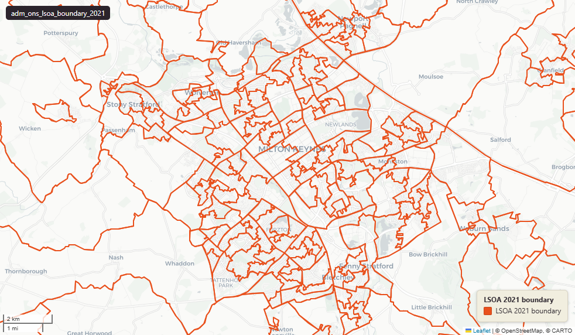

# ONS Lower layer Super Output Areas (LSOA), England & Wales extent, December 2021

Lower Layer Super Output Area Boundary 2021

`adm_ons_lsoa_boundary_2021`

**SOURCE**

- Office for National Statistics (ONS), Open Geography Portal.

**DOCUMENTATION**

- Dataset page : https://geoportal.statistics.gov.uk/datasets/ons::lower-layer-super-output-areas-december-2021-boundaries-ew-bsc-v4-2/about
- Digital boundaries methods : https://www.ons.gov.uk/methodology/geography/geographicalproducts/digitalboundaries

**DEFINITIONS**

- Lower Layer Super Output Areas (LSOAs) are small, stable census statistical areas built from groups of Output Areas, of similar population size — about 1,500 residents on average (roughly 1,000–3,000 people).

**SCOPE**

- England & Wales.
- 35,672 LSOAs (2021 Census geography).

**CRS**

- EPSG:27700 (British National Grid / BNG).

**LICENCE**

- Open Government Licence v3.0.

**ENRICHMENT**

- `msoa21hclnm` — House of Commons Library readable MSOA name, joined at load on msoa21cd from House of Commons Library MSOA Names v2.3 (13 February 2026). Open Parliament Licence.
- msoa21cd, msoa21nm : joined from ONS LSOA -> MSOA lookup (2021 MSOA).
- wd22cd, wd22nm : joined from ONS LSOA -> Ward lookup (2022 ward).
- lad22cd, lad22nm : joined from ONS LSOA -> LAD lookup (2022 LAD).
- rgn22cd, rgn22nm : joined from ONS LSOA -> Region lookup (2022 region).
- sds_boundary : Spatial Development Strategy area name (e.g. "Greater London").

## Columns

| Column | Type | Description / unit |
|---|---|---|
| `id` | `integer` | ArcGIS source identifier preserved at load. |
| `geom` | `geometry(MultiPolygon,27700)` | Source field "geometry"; MultiPolygon in EPSG:27700. BSC = super-generalised (200m) clipped to coastline. |
| `fid` | `bigint` |  |
| `lsoa21cd` | `character varying` | Source field "LSOA21CD"; ONS GSS 9-character LSOA code. |
| `lsoa21nm` | `character varying` | Source field "LSOA21NM"; human-readable LSOA name. |
| `msoa21cd` | `character varying` | Joined at load from ONS LSOA->MSOA lookup; 2021 MSOA GSS code. |
| `msoa21nm` | `character varying` | Joined at load from ONS LSOA->MSOA lookup; 2021 MSOA name. |
| `wd22cd` | `character varying` | Joined at load from ONS LSOA->Ward lookup; 2022 Ward GSS code. |
| `wd22nm` | `character varying` | Joined at load from ONS LSOA->Ward lookup; 2022 Ward name. |
| `lad22cd` | `character varying` | Joined at load from ONS LSOA->LAD lookup; 2022 LAD GSS code. |
| `lad22nm` | `character varying` | Joined at load from ONS LSOA->LAD lookup; 2022 LAD name. |
| `rgn22cd` | `character varying` | Joined at load from ONS LSOA->Region lookup; 2022 Region GSS code. |
| `rgn22nm` | `character varying` | Joined at load from ONS LSOA->Region lookup; 2022 Region name. |
| `sds_boundary` | `character varying` | Internal categorisation: Spatial Development Strategy (SDS) area where the geometry falls (e.g. "Greater London", "West Midlands", "Greater Manchester"). Blank or NULL where the geometry is outside any SDS area. |
| `msoa21hclnm` | `text` | House of Commons Library readable MSOA name. Source field `msoa21hclnm` from House of Commons Library MSOA Names v2.3 (13 February 2026), joined at load on msoa21cd. Open Parliament Licence. |
