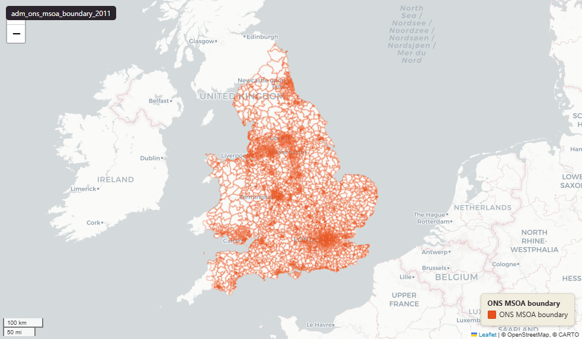

# ONS Middle layer Super Output Areas (MSOA), England & Wales extent, December 2011

Boundary

`adm_ons_msoa_boundary_2011`

**SOURCE**

- Office for National Statistics (ONS), Open Geography Portal.

**DOCUMENTATION**

- Dataset page : https://geoportal.statistics.gov.uk/datasets/ons::middle-layer-super-output-areas-december-2011-boundaries-ew-bgc-v3-1/about
- Digital boundaries methods : https://www.ons.gov.uk/methodology/geography/geographicalproducts/digitalboundaries

**DEFINITIONS**

- "Generalised (20m) - clipped to the coastline (Mean High Water mark)." (ONS digitalboundaries page, definition of BGC)

**SCOPE**

- England & Wales.
- 7,201 MSOAs (2011 Census geography).

**CRS**

- EPSG:27700 (British National Grid / BNG).

**LICENCE**

- Open Government Licence v3.0.

## Columns

| Column | Type | Description / unit |
|---|---|---|
| `id` | `integer` | ArcGIS source identifier preserved at load. |
| `geom` | `geometry(MultiPolygon,27700)` | Source field "geometry"; MultiPolygon in EPSG:27700. BGC = 20m generalised, clipped to Mean High Water — see table comment. |
| `objectid` | `bigint` | Source field "OBJECTID"; ArcGIS surrogate key from upstream. |
| `msoa11cd` | `character varying(9)` | Source field "MSOA11CD"; ONS GSS 9-character MSOA code. |
| `msoa11nm` | `character varying(32)` | Source field "MSOA11NM"; human-readable MSOA name (English). |
| `msoa11nmw` | `character varying(50)` | Source field "MSOA11NMW"; human-readable MSOA name (Welsh, populated where applicable). |
| `bng_e` | `integer` | Source field "BNG_E"; British National Grid easting of MSOA centroid. Unit: "metres". |
| `bng_n` | `integer` | Source field "BNG_N"; British National Grid northing of MSOA centroid. Unit: "metres". |
| `long` | `double precision` | Source field "LONG"; longitude of MSOA centroid. Unit: "degrees". |
| `lat` | `double precision` | Source field "LAT"; latitude of MSOA centroid. Unit: "degrees". |
| `globalid` | `character varying(38)` | Source field "GlobalID"; ArcGIS GUID-format unique identifier. |
