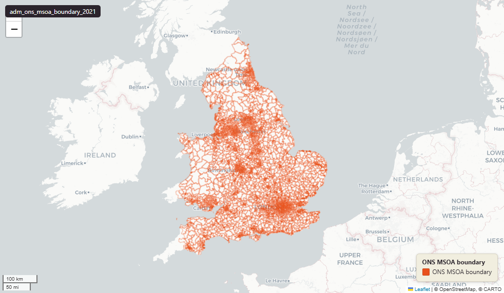

# ONS Middle layer Super Output Areas (MSOA), England & Wales extent, December 2021

`adm_ons_msoa_boundary_2021`

<a href="http://localhost:7800/?layer=uk_baseline.adm_ons_msoa_boundary_2021" target="_blank" rel="noopener">Open in the Dashboard &#8599;</a> (start your local Dashboard first)

**SOURCE**

- Office for National Statistics (ONS), Open Geography Portal.

**DOCUMENTATION**

- Dataset page : https://geoportal.statistics.gov.uk/datasets/middle-layer-super-output-areas-december-2021-boundaries-ew-bgc-v3-2/about
- Digital boundaries methods : https://www.ons.gov.uk/methodology/geography/geographicalproducts/digitalboundaries

**DEFINITIONS**

- "Generalised (20m) - clipped to the coastline (Mean High Water mark)." (ONS digitalboundaries page, definition of BGC)

**SCOPE**

- England & Wales.
- 7,264 MSOAs (2021 Census geography).

**CRS**

- EPSG:27700 (British National Grid / BNG).

**LICENCE**

- Open Government Licence v3.0.

**LOADED INTO uk_baseline**

- Loaded by PNC, May 2026.

## Columns

| Column | Type | Description / unit |
|---|---|---|
| `gid` | `integer` |  |
| `msoa21cd` | `character varying` | Source field "MSOA21CD"; ONS GSS 9-character MSOA code. |
| `msoa21nm` | `character varying` | Source field "MSOA21NM"; human-readable MSOA name (English). |
| `msoa21nmw` | `character varying` | Source field "MSOA21NMW"; human-readable MSOA name (Welsh, populated where applicable). |
| `bng_e` | `integer` | Source field "BNG_E"; British National Grid easting of MSOA centroid. Unit: "metres". |
| `bng_n` | `integer` | Source field "BNG_N"; British National Grid northing of MSOA centroid. Unit: "metres". |
| `lat` | `real` | Source field "LAT"; latitude of MSOA centroid. Unit: "degrees". |
| `long` | `real` | Source field "LONG"; longitude of MSOA centroid. Unit: "degrees". |
| `globalid` | `character varying` | Source field "GlobalID"; ArcGIS GUID-format unique identifier. |
| `geom` | `geometry(MultiPolygon,27700)` | Source field "geometry"; MultiPolygon in EPSG:27700. BGC = 20m generalised, clipped to Mean High Water — see table comment. |
