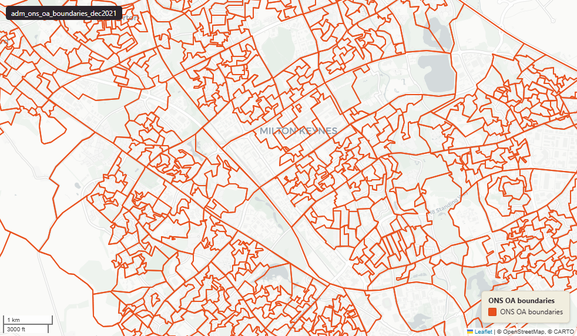

# ONS Output Areas (OA), England & Wales extent, 2021 Census geography, December 2021

Output Area Boundary 2021

`adm_ons_oa_boundaries_dec2021`

**SOURCE**

- Office for National Statistics (ONS), via data.gov.uk.

**DOCUMENTATION**

- Dataset page : https://www.data.gov.uk/dataset/4d4e021d-fe98-4a0e-88e2-3ead84538537/output-areas-december-2021-boundaries-ew-bgc-v21
- Digital boundaries methods : https://www.ons.gov.uk/methodology/geography/geographicalproducts/digitalboundaries

**DEFINITIONS**

- Output Areas (OAs) are the smallest census geography, built from postcodes to be socially homogeneous, with at least 100 residents and 40 households (about 125 households on average).

**SCOPE**

- England & Wales.
- 188,880 OAs.

**CRS**

- EPSG:27700 (British National Grid / BNG).

**LICENCE**

- Open Government Licence v3.0.

**DATA QUALITY CAVEATS**

- County and Spatial Development Strategy columns are England and Wales only; rows elsewhere carry no county or SDS. Wales and the Isles of Scilly carry a county but no SDS. Rows with no Local Authority District code are NULL in all four columns.
- Enrichment coverage measured 5 August 2026 across 188,880 rows: msoa21cd, msoa21nm, msoa21hclnm, lad22cd, lad22nm, lad25cd, lad25nm, ctyua25cd and ctyua25nm are all filled on 188,880 rows with no NULLs; sds_name and sds_group are filled on 178,596 rows and NULL on 10,284, being Wales 10,275 and the Isles of Scilly 9. Every NULL is a fact about geography; none is recoverable.

**ENRICHMENT**

- Route attr_join on lsoa21cd, applied 5 August 2026 through the uk_new staging schema. LSOAs nest wholly within MSOAs, so the join is exact rather than best-fit, and the row count is unchanged at 188,880. No numeric value was changed, recomputed or apportioned. Backbone uk_baseline.adm_ons_msoa_boundary_2021; county and SDS lookup uk.ref_lad25_ctyua25_sds_lu_jul2026.
- `sds_name` / `sds_group` — Spatial Development Strategy area and devolution status, a Prior + Partners categorisation over Ministry of Housing, Communities and Local Government (MHCLG) English devolution policy, joined at load on the row's Local Authority District 2025 code via uk.ref_lad25_ctyua25_sds_lu_jul2026.
- `msoa21hclnm` — House of Commons Library readable MSOA name, joined at load on lsoa21cd via the ONS 2021 output-area hierarchy (uk_baseline.adm_ons_msoa_boundary_2021). Open Parliament Licence.

**LOADED INTO uk_baseline**

- Loaded by PNC, February 2026.

## Columns

| Column | Type | Description / unit |
|---|---|---|
| `id` | `integer` | ArcGIS source identifier preserved at load. |
| `geom` | `geometry(MultiPolygon,27700)` | Source field "geometry"; MultiPolygon in EPSG:27700. BGC = 20m generalised, clipped to Mean High Water — see table comment. |
| `fid` | `bigint` |  |
| `oa21cd` | `character varying(9)` | Source field "OA21CD"; ONS GSS 9-character OA code. |
| `lsoa21cd` | `character varying(9)` | Joined at load from ONS OA->LSOA lookup; 2021 LSOA GSS code. |
| `lsoa21nm` | `character varying(40)` | Joined at load; 2021 LSOA name (English). |
| `lsoa21nmw` | `character varying(29)` | Joined at load; 2021 LSOA name (Welsh, populated where applicable). |
| `bng_e` | `integer` | Source field "BNG_E"; OA centroid easting. Unit: "metres". |
| `bng_n` | `integer` | Source field "BNG_N"; OA centroid northing. Unit: "metres". |
| `lat` | `double precision` | Source field "LAT"; OA centroid latitude. Unit: "degrees". |
| `long` | `double precision` | Source field "LONG"; OA centroid longitude. Unit: "degrees". |
| `globalid` | `character varying(38)` | Source field "GlobalID"; ArcGIS GUID-format unique identifier. |
| `msoa21cd` | `text` | Middle Layer Super Output Area (MSOA) 2021 code of the row's Lower Layer Super Output Area (LSOA); LSOAs nest wholly within MSOAs. Joined at load on lsoa21cd via uk_baseline.adm_ons_lsoa_boundary_2021, then uk_baseline.adm_ons_msoa_boundary_2021. Open Government Licence v3.0. |
| `msoa21nm` | `text` | Official Office for National Statistics MSOA 2021 name of the row's Lower Layer Super Output Area (LSOA); LSOAs nest wholly within MSOAs. Joined at load on lsoa21cd via uk_baseline.adm_ons_lsoa_boundary_2021, then uk_baseline.adm_ons_msoa_boundary_2021. Open Government Licence v3.0. |
| `msoa21hclnm` | `text` | House of Commons Library readable MSOA name of the row's Lower Layer Super Output Area (LSOA); LSOAs nest wholly within MSOAs. Joined at load on lsoa21cd via uk_baseline.adm_ons_lsoa_boundary_2021, then uk_baseline.adm_ons_msoa_boundary_2021, which carries the House of Commons Library name. Open Parliament Licence. |
| `lad22cd` | `text` | Local Authority District 2022 code (2021 LAD geography, anchored to the MSOA 2021 name scoping), best-fit assigned from the row's Lower Layer Super Output Area (LSOA); LSOAs nest wholly within MSOAs. Joined at load on lsoa21cd via uk_baseline.adm_ons_lsoa_boundary_2021, then uk_baseline.adm_ons_msoa_boundary_2021. Open Government Licence v3.0. |
| `lad22nm` | `text` | Local Authority District 2022 name (2021 LAD geography), best-fit assigned from the row's Lower Layer Super Output Area (LSOA); LSOAs nest wholly within MSOAs. Joined at load on lsoa21cd via uk_baseline.adm_ons_lsoa_boundary_2021, then uk_baseline.adm_ons_msoa_boundary_2021. Open Government Licence v3.0. |
| `lad25cd` | `text` | Local Authority District 2025 code (current administering authority), best-fit assigned from the row's Lower Layer Super Output Area (LSOA); LSOAs nest wholly within MSOAs. Joined at load on lsoa21cd via uk_baseline.adm_ons_lsoa_boundary_2021, then uk_baseline.adm_ons_msoa_boundary_2021. Open Government Licence v3.0. |
| `lad25nm` | `text` | Local Authority District 2025 name (current administering authority), best-fit assigned from the row's Lower Layer Super Output Area (LSOA); LSOAs nest wholly within MSOAs. Joined at load on lsoa21cd via uk_baseline.adm_ons_lsoa_boundary_2021, then uk_baseline.adm_ons_msoa_boundary_2021. Open Government Licence v3.0. |
| `ctyua25cd` | `text` | County or unitary authority code at 1 April 2025. Joined at load via uk.ref_lad25_ctyua25_sds_lu_jul2026 on the row's Local Authority District 2025 code. Open Government Licence v3.0. |
| `ctyua25nm` | `text` | County or unitary authority name at 1 April 2025. Joined at load via uk.ref_lad25_ctyua25_sds_lu_jul2026 on the row's Local Authority District 2025 code. Open Government Licence v3.0. |
| `sds_name` | `text` | Spatial Development Strategy (SDS) area, a Prior + Partners categorisation over Ministry of Housing, Communities and Local Government (MHCLG) English devolution policy. Joined at load via uk.ref_lad25_ctyua25_sds_lu_jul2026 on the row's Local Authority District 2025 code. Open Government Licence v3.0. |
| `sds_group` | `text` | Devolution status of the Spatial Development Strategy area: Existing Devolution Footprints, Devolution Priority Programme, Other Proposed Geographies or Remaining Areas. Joined at load via uk.ref_lad25_ctyua25_sds_lu_jul2026 on the row's Local Authority District 2025 code. Open Government Licence v3.0. |
