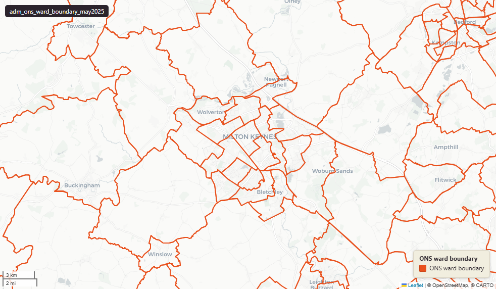

# ONS Wards (electoral wards), England & Wales extent, May 2025

Ward Boundary 2025

`adm_ons_ward_boundary_may2025`

**SOURCE**

- Office for National Statistics (ONS), Open Geography Portal.

**DOCUMENTATION**

- Dataset page : https://geoportal.statistics.gov.uk/datasets/6ba7cf950a504d82809131c945fe70f1_0/about
- Digital boundaries methods : https://www.ons.gov.uk/methodology/geography/geographicalproducts/digitalboundaries

**DEFINITIONS**

- Wards (electoral wards) are the base unit of UK electoral geography.

**SCOPE**

- England & Wales.
- 8,405 wards.

**CRS**

- EPSG:27700 (British National Grid / BNG).

**LICENCE**

- Open Government Licence v3.0.

**DATA QUALITY CAVEATS**

- A further 817 rows carry a Scottish or Northern Irish district code, so they hold a district but no county or Spatial Development Strategy — the lookup covers England and Wales only.
- County and Spatial Development Strategy columns are England and Wales only; rows elsewhere carry no county or SDS. Wales and the Isles of Scilly carry a county but no SDS. Rows with no Local Authority District code are NULL in all four columns.

**ENRICHMENT**

- `sds_name` / `sds_group` — Spatial Development Strategy area and devolution status, a Prior + Partners categorisation over Ministry of Housing, Communities and Local Government (MHCLG) English devolution policy, joined at load on the row's Local Authority District 2025 code via uk.ref_lad25_ctyua25_sds_lu_jul2026.
- lad25cd, lad25nm, lad25nmw : joined from ONS Ward -> LAD lookup (2025 LAD).
- rgn22cd, rgn22nm : joined from ONS Ward -> Region lookup (2022 region).

**LOADED INTO uk_baseline**

- Loaded by PNC, May 2026.

## Columns

| Column | Type | Description / unit |
|---|---|---|
| `gid` | `integer` |  |
| `wd25cd` | `character varying` | Source field "WD25CD"; ONS GSS 9-character Ward code. |
| `wd25nm` | `character varying` | Source field "WD25NM"; human-readable Ward name (English). |
| `wd25nmw` | `character varying` | Source field "WD25NMW"; human-readable Ward name (Welsh, populated where applicable). |
| `lad25cd` | `character varying` | Joined at load from ONS Ward->LAD lookup; 2025 LAD GSS code. |
| `lad25nm` | `character varying` | Joined at load; 2025 LAD name (English). |
| `lad25nmw` | `character varying` | Joined at load; 2025 LAD name (Welsh, populated where applicable). |
| `bng_e` | `integer` | Source field "BNG_E"; Ward centroid easting. Unit: "metres". |
| `bng_n` | `integer` | Source field "BNG_N"; Ward centroid northing. Unit: "metres". |
| `long` | `double precision` | Source field "LONG"; Ward centroid longitude. Unit: "degrees". |
| `lat` | `double precision` | Source field "LAT"; Ward centroid latitude. Unit: "degrees". |
| `globalid` | `character varying` | Source field "GlobalID"; ArcGIS GUID-format unique identifier. |
| `geom` | `geometry(MultiPolygon,27700)` | Source field "geometry"; MultiPolygon in EPSG:27700. BGC = 20m generalised, clipped to Mean High Water — see table comment. |
| `area_ha` | `double precision` | Area in hectares, computed at load from the geometry. Unit: hectares. Stale if geometry is later edited. |
| `rgn22cd` | `text` | Joined at load from ONS Ward->Region lookup; 2022 Region GSS code. |
| `rgn22nm` | `text` | Joined at load; 2022 Region name. |
| `ctyua25cd` | `text` | County or unitary authority code at 1 April 2025. Joined at load via uk.ref_lad25_ctyua25_sds_lu_jul2026 on the row's Local Authority District 2025 code. Open Government Licence v3.0. |
| `ctyua25nm` | `text` | County or unitary authority name at 1 April 2025. Joined at load via uk.ref_lad25_ctyua25_sds_lu_jul2026 on the row's Local Authority District 2025 code. Open Government Licence v3.0. |
| `sds_name` | `text` | Spatial Development Strategy (SDS) area, a Prior + Partners categorisation over Ministry of Housing, Communities and Local Government (MHCLG) English devolution policy. Joined at load via uk.ref_lad25_ctyua25_sds_lu_jul2026 on the row's Local Authority District 2025 code. Open Government Licence v3.0. |
| `sds_group` | `text` | Devolution status of the Spatial Development Strategy area: Existing Devolution Footprints, Devolution Priority Programme, Other Proposed Geographies or Remaining Areas. Joined at load via uk.ref_lad25_ctyua25_sds_lu_jul2026 on the row's Local Authority District 2025 code. Open Government Licence v3.0. |
