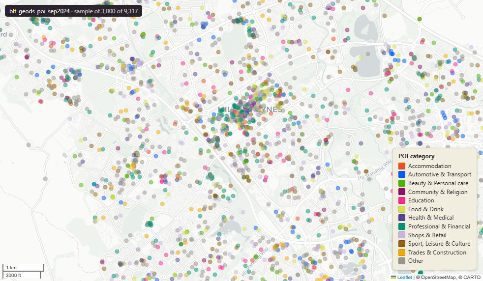

# GeoDS UK Points of Interest, September 2024

`blt_geods_poi_sep2024`

<a href="http://localhost:7800/?layer=uk_baseline.blt_geods_poi_sep2024" target="_blank" rel="noopener">Open in the Dashboard &#8599;</a> (start your local Dashboard first)

**SOURCE**

- Geographic Data Service (GeoDS, formerly Consumer Data Research Centre / CDRC).
- Upstream POI provider: Overture Maps Foundation; POIs contributed by Meta and Microsoft.
- Census-key columns (lsoa21cd, lad22cd/nm, wd21cd/nm) and (easting, northing) are derived at our load (see ENRICHMENT below), not from the GeoDS file.

**DOCUMENTATION**

- GeoDS dataset page : https://data.geods.ac.uk/dataset/point-of-interest-data-for-the-united-kingdom
- Overture Maps schema : https://docs.overturemaps.org/
- H3 spatial index reference : https://h3geo.org/docs/
- Validation paper : Ballantyne & Berragan (2024), Environment and Planning B 51(8)

**DEFINITIONS**

- "This dataset contains Point of Interest (POI) data for the United Kingdom, obtained from the Overture Maps Foundation." (GeoDS dataset page)
- "Users should be cautious of utilising POIs sourced entirely from Microsoft, as these often exhibit high levels of attribute incompleteness." (GeoDS dataset page)

**SCOPE**

- United Kingdom (country = "GB", ISO 3166-1 alpha-2 code for the UK).
- 2,455,987 POIs.

**CRS**

- EPSG:27700 (British National Grid / BNG). Reprojected at load from upstream WGS84.

**LICENCE**

- Community Database License Agreement - Permissive v2 (CDLA-Permissive v2).

**ENRICHMENT**

- easting, northing : derived from lat/long at load.
- lsoa21cd : spatial intersect with ONS 2021 LSOA boundaries.
- lad22cd, lad22nm : spatial intersect with ONS 2022 LAD boundaries.
- wd21cd, wd21nm : spatial intersect with ONS 2021 Ward boundaries.

**UPDATE REQUIRED**

- GeoDS released V1.1 of this dataset on 2026-05-07. This load is the September 2024 Overture release; refresh planned.

**LOADED INTO uk_baseline**

- Loaded September 2024.

## Columns

| Column | Type | Description / unit |
|---|---|---|
| `primary_name` | `character varying` | Source field "primary_name"; canonical display name of the POI (Overture schema). May be NULL for incompletely-attributed POIs. |
| `main_category` | `character varying` | Source field "main_category"; top-level Overture POI category (e.g. "education", "religious_organization"). |
| `alternate_category` | `character varying` | Source field "alternate_category"; secondary Overture categories, pipe-delimited (e.g. "shopping\|pet_store"). NULL when only the main category is set. |
| `address` | `character varying` | Source field "address"; street address as recorded upstream. |
| `locality` | `character varying` | Source field "locality"; town or city as recorded upstream. |
| `postcode` | `character varying` | Source field "postcode"; UK postcode. |
| `region` | `character varying` | Source field "region"; country region code (e.g. "ENG", "SCO", "WAL", "NIR"). |
| `country` | `character varying` | Source field "country"; ISO 3166-1 alpha-2 country code (constant "GB" for this UK subset). |
| `source` | `character varying` | Source field "source"; upstream POI provider — typically "meta" or "microsoft". See quality caveat in table comment regarding Microsoft-sourced POIs. |
| `source_record_id` | `character varying` | Source field "source_record_id"; POI identifier in the upstream provider system. |
| `lat` | `double precision` | Source field "lat"; latitude of POI. Unit: "degrees". |
| `long` | `double precision` | Source field "long"; longitude of POI. Unit: "degrees". |
| `h3_15` | `character varying` | Source field "h3_15"; Uber H3 hierarchical spatial index at resolution 15 (~0.9 m^2 per cell, finest level). 15-character hexadecimal. |
| `easting` | `double precision` | British National Grid easting of POI derived at load from lat/long. Unit: "metres". |
| `northing` | `double precision` | British National Grid northing of POI derived at load from lat/long. Unit: "metres". |
| `lsoa21cd` | `character varying` | Joined at load from spatial intersection with ONS 2021 LSOA boundaries; LSOA GSS code. |
| `id_original` | `character varying` | Internal POI identifier preserved at load (concatenation of H3 cell and a source-specific hash). |
| `lad22nm` | `character varying` | Joined at load from spatial intersection with ONS 2022 LAD boundaries; LAD name. |
| `lad22cd` | `character varying` | Joined at load from spatial intersection with ONS 2022 LAD boundaries; LAD GSS code. |
| `wd21nm` | `character varying` | Joined at load from spatial intersection with ONS 2021 Ward boundaries; Ward name. |
| `wd21cd` | `character varying` | Joined at load from spatial intersection with ONS 2021 Ward boundaries; Ward GSS code. |
| `geom` | `geometry(Point,27700)` | Source field "geometry" reprojected from EPSG:4326 to EPSG:27700; Point. |
| `fid` | `bigint` |  |
