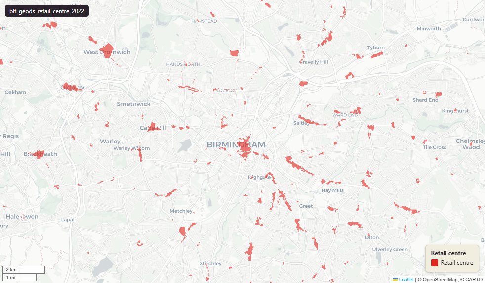

# GeoDS Retail Centre Boundaries, 2022

`blt_geods_retail_centre_2022`

<a href="http://localhost:7800/?layer=uk_baseline.blt_geods_retail_centre_2022" target="_blank" rel="noopener">Open in the Dashboard &#8599;</a> (start your local Dashboard first)

**SOURCE**

- Geographic Data Service (GeoDS, formerly Consumer Data Research Centre / CDRC), developed at UCL, University of Liverpool, University of Oxford and University of Edinburgh.
- Methodology: Macdonald, J.L., Dolega, L. & Singleton, A. (2022) "An open source delineation and hierarchical classification of UK retail agglomerations", Scientific Data 9: 541.

**DOCUMENTATION**

- GeoDS dataset page : https://data.geods.ac.uk/dataset/retail-centre-boundaries-and-open-indicators
- Methodology paper : https://www.nature.com/articles/s41597-022-01556-3
- Source code (GitHub): https://github.com/ESRC-CDRC/Retail-Centre-Boundaries

**DEFINITIONS**

- "The Retail Centre Boundaries are an openly available suite of data products representing the location, extent and function of retail agglomeration areas across the UK." (GeoDS dataset page)
- "Boundaries are delineated using openly available and geocoded retail-specific unit locations and land use. Self-contained mutually exclusive tracts of consistently-sized hexagon geometries are overlaid on retail clusters, with a network-based algorithmic fine-tuning based on absolute sizes and densities." (GeoDS dataset page)
- Hierarchical classification: 11 typology tiers — Regional Centre, Major Town Centre, Town Centre, Market Town, District Centre, Local Centre, Small Local Centre, Large Shopping Centre, Small Shopping Centre, Large Retail Park, Small Retail Park.

**SCOPE**

- United Kingdom (England, Wales, Scotland, Northern Ireland).
- 6,344 distinct retail centres represented across 12,681 polygon rows. The upstream geometry is multipolygon (per Macdonald et al methodology); the loader exploded each multipolygon centre into single-part Polygon rows. Most fragmented: RC_EW_1927 "City of London" with 38 parts.

**CRS**

- EPSG:27700 (British National Grid / BNG).

**LICENCE**

- Open Government Licence v3.0 (per GeoDS dataset page).

**DATA QUALITY CAVEATS**

- rc_id is NOT unique per row — 6,344 distinct centres are exploded across 12,681 rows.
- area_km2 is the whole-centre area (constant across all rows sharing an rc_id). area_ha is the area of THIS polygon part only.
- lad22cd / lad22nm are NULL for Scottish centres in this load (Scottish LAD codes use the 'S' prefix; the load's spatial join was restricted to English and Welsh LAD codes). Country / region_nm and the Scottish wd21cd (S-prefix) are populated correctly.

**ENRICHMENT**

- lad22cd, lad22nm : spatial intersect with ONS 2022 LAD boundaries. NULL for Scottish centres in this load (see caveats below).
- wd21cd, wd21nm : spatial intersect with ONS 2021 Ward boundaries (uses Scottish S-codes where applicable).
- area_ha : derived from geom at load (area in hectares, computed from the geometry at load). Per-part area.

**UPDATE REQUIRED**

- GeoDS released V3.0 of this dataset on 2026-04-15 with 6,423 retail centres (methodology refined since V1). This load is the V1 / 2022 release with 6,344 distinct centres across 12,681 polygon rows. Refresh planned.

**LOADED INTO uk_baseline**

- Loaded 2022.

## Columns

| Column | Type | Description / unit |
|---|---|---|
| `rc_id` | `character varying` | Source field "RC_ID"; retail centre identifier, prefixed by country block (e.g. "RC_EW_2423" for England/Wales, "RC_SC_347" for Scotland). NOT unique per row — see table comment; multiple polygon-part rows share the same rc_id. |
| `rc_name` | `character varying` | Source field "RC_Name"; composed display name "[place]; [LAD] ([region]; [country])". Place names drawn from Ordnance Survey Open Names. |
| `classification` | `character varying` | Source field "Classification"; one of 11 typology tiers (Regional Centre, Major Town Centre, Town Centre, Market Town, District Centre, Local Centre, Small Local Centre, Large Shopping Centre, Small Shopping Centre, Large Retail Park, Small Retail Park). |
| `country` | `character varying` | Source field "Country"; constituent UK country ("England", "Scotland", "Wales", or "Northern Ireland"). |
| `region_nm` | `character varying` | Source field "Region_NM"; ONS region name (English regions) or country name for non-English centres. |
| `h3_count` | `double precision` | Source field "H3_Count"; count of Uber H3 hexagon cells comprising the retail centre per the delineation methodology. |
| `retail_n` | `double precision` | Source field "Retail_N"; number of retail units located within the centre. May be 0 for some retail park aggregations. |
| `area_km2` | `double precision` | Source field "Area_km2"; whole-centre area (constant across all rows sharing an rc_id — i.e. across the polygon parts of one centre). Unit: "square kilometres". |
| `id_original` | `integer` | Source numeric identifier preserved at load (sequential from upstream). |
| `lad22nm` | `character varying` | Joined at load from spatial intersection with ONS 2022 LAD boundaries; LAD name. NULL for Scottish centres in this load — see table caveat. |
| `lad22cd` | `character varying` | Joined at load from spatial intersection with ONS 2022 LAD boundaries; LAD GSS code. NULL for Scottish centres in this load — see table caveat. |
| `wd21nm` | `character varying` | Joined at load from spatial intersection with ONS 2021 Ward boundaries; Ward name. |
| `wd21cd` | `character varying` | Joined at load from spatial intersection with ONS 2021 Ward boundaries; Ward GSS code (includes Scottish S-codes). |
| `geom` | `geometry(Polygon,27700)` | Source field "geometry"; Polygon in EPSG:27700 (British National Grid). |
| `area_ha` | `double precision` | Derived at load from ST_Area(geom)/10000 — area of THIS polygon part. Unit: "hectares". For whole-centre area use area_km2 (constant within an rc_id group). |
| `fid` | `bigint` |  |
