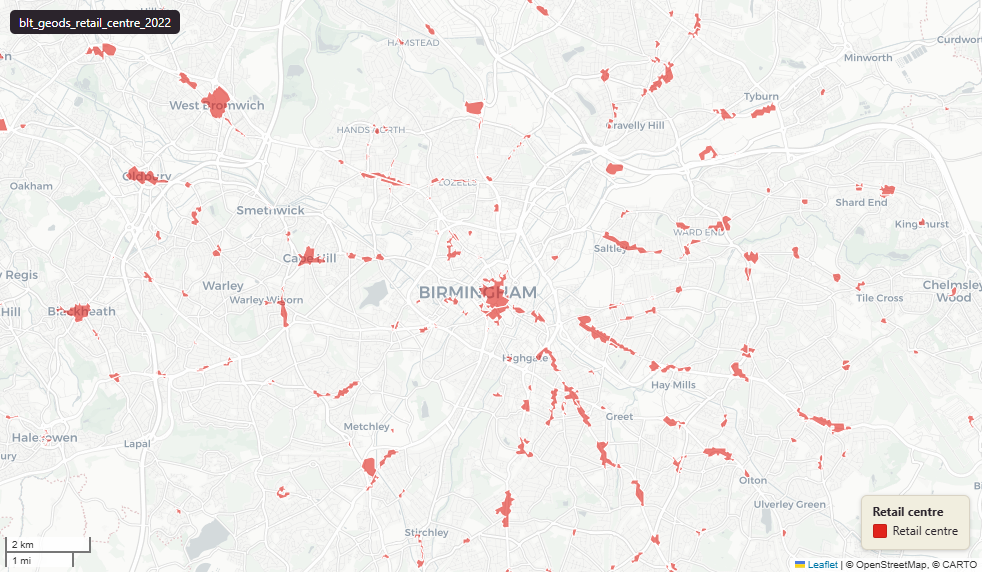

# GeoDS Retail Centre Boundaries, 2022

Retail Centre

`blt_geods_retail_centre_2022`

**SOURCE**

- Geographic Data Service (GeoDS, formerly Consumer Data Research Centre / CDRC), developed at UCL, University of Liverpool, University of Oxford and University of Edinburgh.
- Methodology: Macdonald, J.L., Dolega, L. & Singleton, A. (2022) "An open source delineation and hierarchical classification of UK retail agglomerations", Scientific Data 9: 541.

**DOCUMENTATION**

- GeoDS dataset page : https://data.geods.ac.uk/dataset/retail-centre-boundaries-and-open-indicators
- Methodology paper : https://www.nature.com/articles/s41597-022-01556-3
- Source code (GitHub): https://github.com/ESRC-CDRC/Retail-Centre-Boundaries

**DEFINITIONS**

- "The Retail Centre Boundaries are an openly available suite of data products representing the location, extent and function of retail agglomeration areas across the UK." (GeoDS dataset page)
- "Boundaries are delineated using openly available and geocoded retail-specific unit locations and land use. Self-contained mutually exclusive tracts of consistently-sized hexagon geometries are overlaid on retail clusters, with a network-based algorithmic fine-tuning based on absolute sizes and densities." (GeoDS dataset page)
- Hierarchical classification: 11 typology tiers — Regional Centre, Major Town Centre, Town Centre, Market Town, District Centre, Local Centre, Small Local Centre, Large Shopping Centre, Small Shopping Centre, Large Retail Park, Small Retail Park.

**SCOPE**

- United Kingdom (England, Wales, Scotland, Northern Ireland).
- 6,344 distinct retail centres represented across 12,681 polygon rows. The upstream geometry is multipolygon (per Macdonald et al methodology); the loader exploded each multipolygon centre into single-part Polygon rows. Most fragmented: RC_EW_1927 "City of London" with 38 parts.

**CRS**

- EPSG:27700 (British National Grid / BNG).

**LICENCE**

- Open Government Licence v3.0 (per GeoDS dataset page).

**DATA QUALITY CAVEATS**

- Geography keys are NULL on 840 of 19,538 rows, measured 28 July 2026: 172 fall inside an England or Wales district and could carry one, so their keys are a gap rather than an absence; 39 are residual fragments left by the MSOA split, each under 100 sqm or 10 m; 629 are in Scotland or Northern Ireland, outside the England and Wales lookup.
- County and Spatial Development Strategy columns are England and Wales only; rows elsewhere carry no county or SDS. Wales and the Isles of Scilly carry a county but no SDS. Rows with no Local Authority District code are NULL in all four columns.
- rc_id is NOT unique per row — 6,344 distinct centres are exploded across 12,681 rows.
- area_km2 is the whole-centre area (constant across all rows sharing an rc_id). area_ha is the area of THIS polygon part only.
- lad22cd / lad22nm are NULL for Scottish centres in this load (Scottish LAD codes use the 'S' prefix; the load's spatial join was restricted to English and Welsh LAD codes). Country / region_nm and the Scottish wd21cd (S-prefix) are populated correctly.

**ENRICHMENT**

- `sds_name` / `sds_group` — Spatial Development Strategy area and devolution status, a Prior + Partners categorisation over Ministry of Housing, Communities and Local Government (MHCLG) English devolution policy, joined at load on the row's Local Authority District 2025 code via uk.ref_lad25_ctyua25_sds_lu_jul2026.
- lad22cd, lad22nm : spatial intersect with ONS 2022 LAD boundaries. NULL for Scottish centres in this load (see caveats below).
- wd21cd, wd21nm : spatial intersect with ONS 2021 Ward boundaries (uses Scottish S-codes where applicable).
- area_ha : derived from geom at load (area in hectares, computed from the geometry at load). Per-part area.

**UPDATE REQUIRED**

- GeoDS released V3.0 of this dataset on 2026-04-15 with 6,423 retail centres (methodology refined since V1). This load is the V1 / 2022 release with 6,344 distinct centres across 12,681 polygon rows. Refresh planned.

**LOADED INTO uk_baseline**

- Loaded 2022.

MSOA SPLIT (added 30 June 2026)

- Geometry split to one row per (source feature x MSOA 2021). Each row carries that MSOA's msoa21cd / msoa21nm / msoa21hclnm and best-fit lad22 / lad25. The source feature's original primary key is preserved as `source_fid`; `gid` is a fresh surrogate primary key.
- Keep-everything (3 July 2026): geometry outside every MSOA — offshore, estuarine, or beyond the generalised coastline — is retained as rows with NULL geography columns (source_fid links the parts), so the layer holds the complete source geometry.

## Columns

| Column | Type | Description / unit |
|---|---|---|
| `rc_id` | `character varying` |  |
| `rc_name` | `character varying` |  |
| `classification` | `character varying` |  |
| `country` | `character varying` |  |
| `region_nm` | `character varying` |  |
| `h3_count` | `double precision` |  |
| `retail_n` | `double precision` |  |
| `area_km2` | `double precision` |  |
| `id_original` | `integer` |  |
| `wd21nm` | `character varying` |  |
| `wd21cd` | `character varying` |  |
| `area_ha` | `double precision` |  |
| `msoa21cd` | `character varying` | Middle Layer Super Output Area (MSOA) 2021 code of this piece. Open Government Licence v3.0. |
| `msoa21nm` | `character varying` | Official ONS MSOA 2021 name of this piece. Open Government Licence v3.0. |
| `msoa21hclnm` | `text` | House of Commons Library readable MSOA name of this piece. Open Parliament Licence. |
| `lad22cd` | `text` | Local Authority District 2022 code (2021 LAD geography, anchored to the MSOA 2021 name scoping), best-fit from this piece's msoa21cd. Open Government Licence v3.0. |
| `lad22nm` | `text` | Local Authority District 2022 name (2021 LAD geography), best-fit from this piece's msoa21cd. Open Government Licence v3.0. |
| `lad25cd` | `text` | Local Authority District 2025 code (current administering authority), best-fit from this piece's msoa21cd. Open Government Licence v3.0. |
| `lad25nm` | `text` | Local Authority District 2025 name (current administering authority), best-fit from this piece's msoa21cd. Open Government Licence v3.0. |
| `geom` | `geometry(MultiPolygon,27700)` |  |
| `source_fid` | `bigint` | Primary key of the source feature in the pre-split layer uk.blt_geods_retail_centre_2022__preswap_jun30 (non-unique here: a feature spanning N MSOAs has N rows). |
| `gid` | `bigint` |  |
| `ctyua25cd` | `text` | County or unitary authority code at 1 April 2025. Joined at load via uk.ref_lad25_ctyua25_sds_lu_jul2026 on the row's Local Authority District 2025 code. Open Government Licence v3.0. |
| `ctyua25nm` | `text` | County or unitary authority name at 1 April 2025. Joined at load via uk.ref_lad25_ctyua25_sds_lu_jul2026 on the row's Local Authority District 2025 code. Open Government Licence v3.0. |
| `sds_name` | `text` | Spatial Development Strategy (SDS) area, a Prior + Partners categorisation over Ministry of Housing, Communities and Local Government (MHCLG) English devolution policy. Joined at load via uk.ref_lad25_ctyua25_sds_lu_jul2026 on the row's Local Authority District 2025 code. Open Government Licence v3.0. |
| `sds_group` | `text` | Devolution status of the Spatial Development Strategy area: Existing Devolution Footprints, Devolution Priority Programme, Other Proposed Geographies or Remaining Areas. Joined at load via uk.ref_lad25_ctyua25_sds_lu_jul2026 on the row's Local Authority District 2025 code. Open Government Licence v3.0. |
