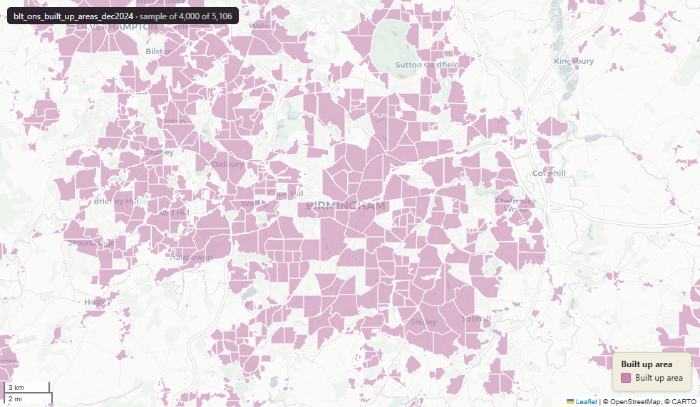

# ONS Built Up Areas (BUA), England & Wales extent, December 2024

Built Up Areas

`blt_ons_built_up_areas_dec2024`

**SOURCE**

- Office for National Statistics (ONS), Open Geography Portal. Underlying boundaries derived from Ordnance Survey (OS) Open Built Up Areas product.

**DOCUMENTATION**

- Dataset page : https://open-geography-portalx-ons.hub.arcgis.com/datasets/ons::built-up-areas-december-2024-boundaries-ew-bgg-v2
- ONS digital boundaries methods : https://www.ons.gov.uk/methodology/geography/geographicalproducts/digitalboundaries

**DEFINITIONS**

- "The built up area boundaries are generalised and created using an automated approach based on a 25m grid squares (BGG) and have been created from OS Open Built Up Areas." (data.gov.uk / ONS-OS background)

**SCOPE**

- England & Wales.
- 7,775 distinct Built Up Areas represented across 121,072 polygon rows. The upstream geometry is multipolygon; the loader exploded each multipolygon BUA into single-part Polygon rows (avg ~15.6 parts per BUA).

**CRS**

- EPSG:27700 (British National Grid / BNG).

**LICENCE**

- Open Government Licence v3.0.

**DATA QUALITY CAVEATS**

- bua24cd is NOT unique per row — 7,775 distinct BUAs are exploded across 121,072 rows.
- areahectar is the whole-BUA area (constant across all rows sharing a bua24cd). area_ha is the area of THIS polygon part only.

**ENRICHMENT**

- lad22cd, lad22nm : spatial intersect with ONS 2022 LAD boundaries.
- wd21cd, wd21nm : spatial intersect with ONS 2021 Ward boundaries.
- area_ha : derived from geom at load (area in hectares, computed from the geometry at load). Per-part area. For whole-BUA area use areahectar (constant within a bua24cd group).

**LOADED INTO uk_baseline**

- Loaded November 2024.

MSOA SPLIT (added 3 July 2026)

- Geometry split to one row per (source feature x MSOA 2021). Each row carries that MSOA's msoa21cd / msoa21nm / msoa21hclnm and best-fit lad22 / lad25. The source feature's original primary key is preserved as `source_fid`; `gid` is a fresh surrogate primary key. Features with no MSOA overlap (offshore or outside England & Wales) are kept whole with NULL geography columns.

## Columns

| Column | Type | Description / unit |
|---|---|---|
| `source_fid` | `bigint` | Primary key of the source feature in the pre-split layer uk.blt_ons_built_up_areas_dec2024__preswap_jul03 (non-unique here: a feature spanning N MSOAs has N rows). |
| `objectid` | `integer` |  |
| `gsscode` | `character varying(10)` |  |
| `bua24cd` | `character varying(10)` |  |
| `bua24nm` | `character varying(100)` |  |
| `bua24nmw` | `character varying(100)` |  |
| `geometry_a` | `double precision` |  |
| `areahectar` | `double precision` |  |
| `globalid` | `character varying(38)` |  |
| `id_original` | `integer` |  |
| `wd21nm` | `character varying` |  |
| `wd21cd` | `character varying` |  |
| `area_ha` | `double precision` |  |
| `fid` | `bigint` |  |
| `msoa21cd` | `character varying` | Middle Layer Super Output Area (MSOA) 2021 code of this piece. Open Government Licence v3.0. |
| `msoa21nm` | `character varying` | Official ONS MSOA 2021 name of this piece. Open Government Licence v3.0. |
| `msoa21hclnm` | `text` | House of Commons Library readable MSOA name of this piece. Open Parliament Licence. |
| `lad22cd` | `text` | Local Authority District 2022 code (2021 LAD geography, anchored to the MSOA 2021 name scoping), best-fit from this piece's msoa21cd. Open Government Licence v3.0. |
| `lad22nm` | `text` | Local Authority District 2022 name (2021 LAD geography), best-fit from this piece's msoa21cd. Open Government Licence v3.0. |
| `lad25cd` | `text` | Local Authority District 2025 code (current administering authority), best-fit from this piece's msoa21cd. Open Government Licence v3.0. |
| `lad25nm` | `text` | Local Authority District 2025 name (current administering authority), best-fit from this piece's msoa21cd. Open Government Licence v3.0. |
| `geom` | `geometry(MultiPolygon,27700)` |  |
| `gid` | `bigint` |  |
