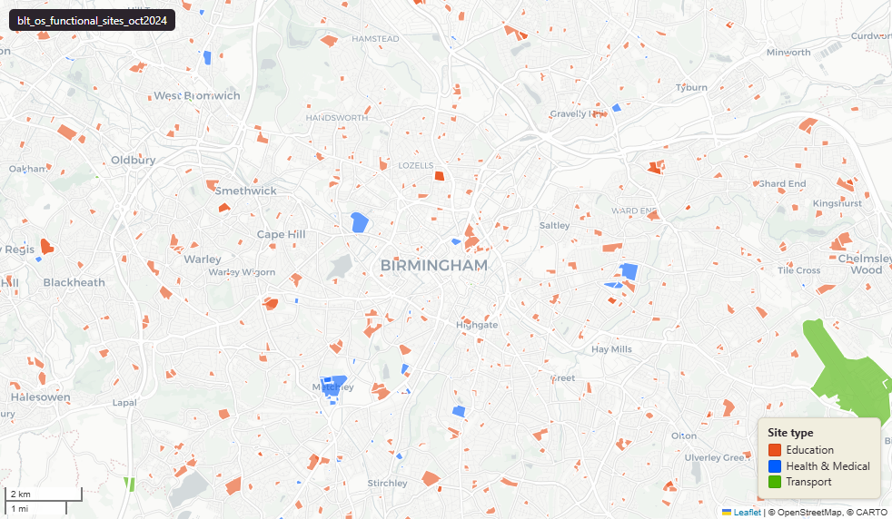

# OS OpenMap Local Functional Sites - polygon features for sites of functions or activities, October 2024

`blt_os_functional_sites_oct2024`

<a href="http://localhost:7800/?layer=uk_baseline.blt_os_functional_sites_oct2024" target="_blank" rel="noopener">Open in the Dashboard &#8599;</a> (start your local Dashboard first)

**SOURCE**

- Ordnance Survey (OS), Open Map Local product.

**DOCUMENTATION**

- Product page : https://osdatahub.os.uk/data/downloads/open/OpenMapLocal
- Product guide : https://www.ordnancesurvey.co.uk/documents/os-open-map-local-product-guide.pdf

**DEFINITIONS**

- FunctionalSite feature type: "A polygon feature that represents the area or extent of certain types of function or activity with appropriate attribution." (OS OpenMap Local Product Guide, Land Use / FunctionalSite)
- "Each site has a theme, classification and is named (where appropriate)." (OS OpenMap Local Product Guide, Functional Sites)
- Site themes (5): Air transport, Education, Medical care, Road transport, Water transport. (OS OpenMap Local Product Guide)
- "Only available in the vector product." (OS OpenMap Local Product Guide)

**SCOPE**

- Great Britain (England, Wales, Scotland).
- 37,618 distinct functional sites (by id_original) represented across 46,532 polygon rows (avg ratio ~1.24 - most sites are single polygons; a small fraction are multipolygon sites that have been exploded).

**CRS**

- EPSG:27700 (British National Grid / BNG).

**LICENCE**

- OS OpenData Licence (incorporates Open Government Licence v3.0; attribution "Contains OS data (c) Crown copyright and database right [year]" required).

**DATA QUALITY CAVEATS**

- id_original is NOT strictly unique per row - 37,618 distinct values across 46,532 rows. Multipolygon sites have been exploded at load.
- lad22cd / lad22nm are NULL for Scottish sites in this load.

**ENRICHMENT**

- lad22cd, lad22nm : spatial intersect with ONS 2022 LAD boundaries. NULL for Scottish sites in this load.
- wd21cd, wd21nm : spatial intersect with ONS 2021 Ward boundaries (Scottish S-codes populated where applicable).
- area_ha : derived from geom at load (area in hectares, computed from the geometry at load).

**LOADED INTO uk_baseline**

- Loaded October 2024.

## Columns

| Column | Type | Description / unit |
|---|---|---|
| `classification` | `character varying` | Source field "classification". "A description of the actual function of a site (that is, airfield, junior school, hospital and so on.) The valid values are defined in the SiteClassification code list. For sites with multiple functions, the values will be provided together and separated by a ','." (OS Product Guide). Length 90. |
| `distinctive_name` | `character varying` | Source field "distinctiveName". "The name of the site (for example, 'Brighton College'). Note this may be null if the captured value is a house number." (OS Product Guide). Length 120. |
| `feature_code` | `integer` | Source field "featureCode". "A unique feature code to facilitate styling." (OS Product Guide). |
| `site_theme` | `character varying` | Source field "siteTheme". "A description of the theme that a particular site falls under (that is, air transport, education, medical care and so on.). The valid values are defined in the SiteThemeType code list." (OS Product Guide). 5 valid values. |
| `id_original` | `character varying` | Source upstream OS identifier (UUID) preserved at load. NOT strictly unique per row - see caveats. |
| `lad22nm` | `character varying` | Joined at load from spatial intersection with ONS 2022 LAD boundaries; LAD name. NULL for Scottish sites. |
| `lad22cd` | `character varying` | Joined at load from spatial intersection with ONS 2022 LAD boundaries; LAD GSS code. NULL for Scottish sites. |
| `wd21nm` | `character varying` | Joined at load from spatial intersection with ONS 2021 Ward boundaries; Ward name. |
| `wd21cd` | `character varying` | Joined at load from spatial intersection with ONS 2021 Ward boundaries; Ward GSS code (includes Scottish S-codes). |
| `geom` | `geometry(Polygon,27700)` | Source field "geometry". "Polygon representing the extent of the functional site." (OS Product Guide). EPSG:27700. |
| `area_ha` | `double precision` | Derived at load from ST_Area(geom)/10000. Unit: "hectares". Stale if geometry edited later. |
| `fid` | `bigint` |  |
