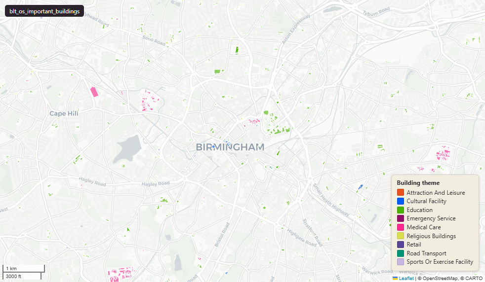

# OS OpenMap Local Important Buildings - generalised buildings of public importance

Important Buildings

`blt_os_important_buildings`

**SOURCE**

- Ordnance Survey (OS), Open Map Local product.

**DOCUMENTATION**

- Product page : https://osdatahub.os.uk/data/downloads/open/OpenMapLocal
- Product guide : https://www.ordnancesurvey.co.uk/documents/os-open-map-local-product-guide.pdf

**DEFINITIONS**

- "A generalised building that belongs to a FunctionalSite." (OS OpenMap Local Product Guide, Land Use / ImportantBuilding)
- Building themes (11): Attraction and Leisure, Air Transport, Cultural Facility, Education facility, Emergency Services, Medical Facility, Religious Building, Retail, Road Transport, Sports and Leisure Facility, Water Transport.

**SCOPE**

- Great Britain (England, Wales, Scotland).
- 238,089 distinct buildings by id; 238,730 rows total (641 id duplicates carried from upstream - see caveats).

**CRS**

- EPSG:27700 (British National Grid / BNG).

**LICENCE**

- OS OpenData Licence (incorporates Open Government Licence v3.0; attribution "Contains OS data (c) Crown copyright and database right [year]" required).

**DATA QUALITY CAVEATS**

- Geography keys are NULL on 20,687 of 238,730 rows, measured 28 July 2026: 25 fall inside an England or Wales district and could carry one, so their keys are a gap rather than an absence; 18 are residual fragments left by the MSOA split, each under 100 sqm or 10 m; 20,644 are in Scotland or Northern Ireland, outside the England and Wales lookup.
- County and Spatial Development Strategy columns are England and Wales only; rows elsewhere carry no county or SDS. Wales and the Isles of Scilly carry a county but no SDS. Rows with no Local Authority District code are NULL in all four columns.
- 641 id values appear more than once (238,089 distinct id across 238,730 rows). Cause not investigated; likely upstream artefacts of partial-update cycles.
- The OS Product Guide says BuildingTheme uses the "SiteThemeType code list", but the BuildingTheme code list contains 11 values while SiteTheme contains only 5 - the published code lists are different. Use the actual values observed in the column rather than the SiteTheme list.

**ENRICHMENT**

- `sds_name` / `sds_group` — Spatial Development Strategy area and devolution status, a Prior + Partners categorisation over Ministry of Housing, Communities and Local Government (MHCLG) English devolution policy, joined at load on the row's Local Authority District 2025 code via uk.ref_lad25_ctyua25_sds_lu_jul2026.
- `msoa21hclnm` — House of Commons Library readable MSOA name, assigned at load via the polygon's 2021 MSOA (representative interior point in uk_baseline.adm_ons_msoa_boundary_2021). Open Parliament Licence.
- lad22cd, lad22nm : spatial intersect with ONS 2022 LAD boundaries.
- wd21cd, wd21nm : spatial intersect with ONS 2021 Ward boundaries.
- area_ha : derived from geom at load (area in hectares, computed from the geometry at load).

## Columns

| Column | Type | Description / unit |
|---|---|---|
| `id` | `character varying` | Source field "id" (UUID); upstream OS identifier. 641 duplicates exist - see caveats. |
| `building_theme` | `character varying` | Source field "BuildingTheme". "A description of the theme that a particular site falls under (that is, air transport, education, medical care and so on.)." (OS Product Guide). 11 valid values (see table comment). |
| `classification` | `character varying` | Source field "classification". "A description of the actual function of a site (that is, airfield, junior school, hospital and so on.) The valid values are defined in the SiteClassification code list. For sites with multiple functions, the values will be provided together and separated by a ','." (OS Product Guide). Length 90. |
| `distinctive_name` | `character varying` | Source field "distinctiveName". "The name of the site (for example, 'Brighton College'). Note this may be null if the captured value is a house number." (OS Product Guide). Length 120. |
| `feature_code` | `bigint` | Source field "featureCode". "A unique feature code to facilitate styling." (OS Product Guide). |
| `fid_original` | `integer` | Source numeric identifier preserved at load. |
| `lad22nm` | `character varying` | Local Authority District 2022 name (2021 LAD geography), best-fit assigned from the feature's MSOA 2021 code. Joined at load from the ONS MSOA (2021) to LAD (2022) best-fit lookup on msoa21cd. Open Government Licence v3.0. |
| `lad22cd` | `character varying` | Local Authority District 2022 code (2021 LAD geography, anchored to the MSOA 2021 name scoping), best-fit assigned from the feature's MSOA 2021 code. Joined at load from the ONS MSOA (2021) to LAD (2022) best-fit lookup on msoa21cd. Open Government Licence v3.0. |
| `wd21nm` | `character varying` | Joined at load from spatial intersection with ONS 2021 Ward boundaries; Ward name. |
| `wd21cd` | `character varying` | Joined at load from spatial intersection with ONS 2021 Ward boundaries; Ward GSS code. |
| `geom` | `geometry(Polygon,27700)` | Source field "geometry". "Polygon representing the generalised important building." (OS Product Guide). EPSG:27700. |
| `area_ha` | `double precision` | Derived at load from ST_Area(geom)/10000. Unit: "hectares". Stale if geometry edited later. |
| `fid` | `bigint` |  |
| `msoa21cd` | `text` | Middle Layer Super Output Area (MSOA) 2021 code. Assigned at load from the polygon's representative interior point, located in uk_baseline.adm_ons_msoa_boundary_2021. Where a feature spans more than one MSOA this records the representative point's primary MSOA. Open Government Licence v3.0. |
| `msoa21nm` | `text` | Official ONS Middle Layer Super Output Area 2021 name. Assigned at load via the polygon's 2021 MSOA (representative interior point in uk_baseline.adm_ons_msoa_boundary_2021). Open Government Licence v3.0. |
| `msoa21hclnm` | `text` | House of Commons Library readable MSOA name. Assigned at load via the polygon's 2021 MSOA (representative interior point in uk_baseline.adm_ons_msoa_boundary_2021, which carries the House of Commons Library name). Open Parliament Licence. |
| `lad25cd` | `text` | Local Authority District 2025 code (current administering authority), best-fit assigned from the feature's MSOA 2021 code. Joined at load from the ONS MSOA (2021) to Ward (2025) to LAD (2025) best-fit lookup on msoa21cd. Open Government Licence v3.0. |
| `lad25nm` | `text` | Local Authority District 2025 name (current administering authority), best-fit assigned from the feature's MSOA 2021 code. Joined at load from the ONS MSOA (2021) to Ward (2025) to LAD (2025) best-fit lookup on msoa21cd. Open Government Licence v3.0. |
| `ctyua25cd` | `text` | County or unitary authority code at 1 April 2025. Joined at load via uk.ref_lad25_ctyua25_sds_lu_jul2026 on the row's Local Authority District 2025 code. Open Government Licence v3.0. |
| `ctyua25nm` | `text` | County or unitary authority name at 1 April 2025. Joined at load via uk.ref_lad25_ctyua25_sds_lu_jul2026 on the row's Local Authority District 2025 code. Open Government Licence v3.0. |
| `sds_name` | `text` | Spatial Development Strategy (SDS) area, a Prior + Partners categorisation over Ministry of Housing, Communities and Local Government (MHCLG) English devolution policy. Joined at load via uk.ref_lad25_ctyua25_sds_lu_jul2026 on the row's Local Authority District 2025 code. Open Government Licence v3.0. |
| `sds_group` | `text` | Devolution status of the Spatial Development Strategy area: Existing Devolution Footprints, Devolution Priority Programme, Other Proposed Geographies or Remaining Areas. Joined at load via uk.ref_lad25_ctyua25_sds_lu_jul2026 on the row's Local Authority District 2025 code. Open Government Licence v3.0. |
