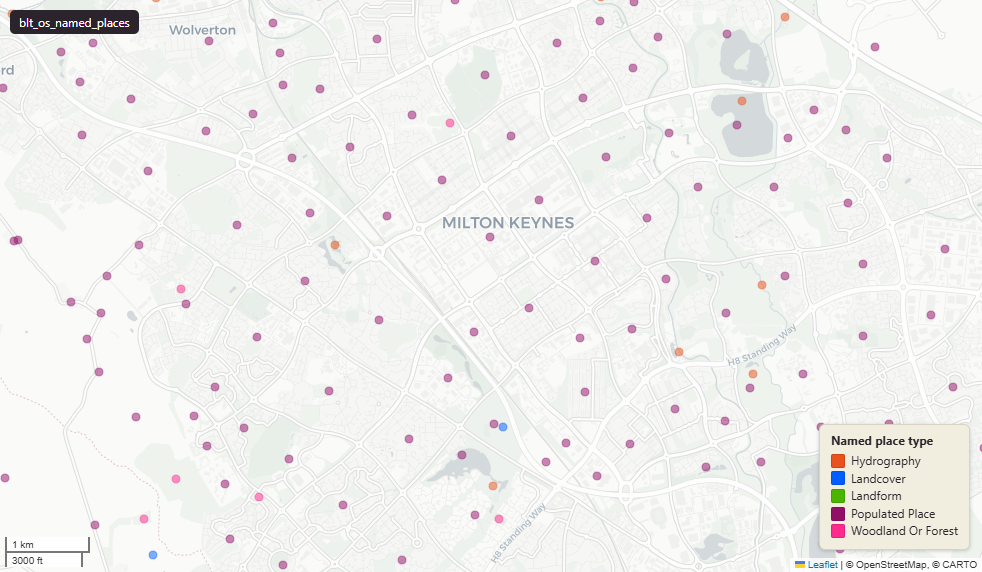

# OS OpenMap Local Named Places - point features carrying place-name labels

Named Places

`blt_os_named_places`

**SOURCE**

- Ordnance Survey (OS), Open Map Local product.

**DOCUMENTATION**

- Product page : https://osdatahub.os.uk/data/downloads/open/OpenMapLocal
- Product guide : https://www.ordnancesurvey.co.uk/documents/os-open-map-local-product-guide.pdf

**DEFINITIONS**

- "A representative point feature giving the general location of a settlement name or geographic place name, for the purposes of text placement." (OS OpenMap Local Product Guide, Land Use / NamedPlace)
- Classifications (5): Populated Place, Landform, Woodland or Forest, Hydrography, Landcover. (OS OpenMap Local Product Guide)

**SCOPE**

- Great Britain (England, Wales, Scotland).
- 476,602 named places (1:1, no row duplication).

**CRS**

- EPSG:27700 (British National Grid / BNG).

**LICENCE**

- OS OpenData Licence (incorporates Open Government Licence v3.0; attribution "Contains OS data (c) Crown copyright and database right [year]" required).

**ENRICHMENT**

- lad22cd, lad22nm : spatial intersect with ONS 2022 LAD boundaries.
- wd21cd, wd21nm : spatial intersect with ONS 2021 Ward boundaries.

**NOT IN THIS DATASET**

- ESRI Shapefile format does not natively support Welsh diacritics. The OS Product Guide documents alternative encodings (DISTNAME plain ASCII, HTMLNAME with numeric HTML entities). Our load preserves UTF-8 text, so distinctive_name should render Welsh characters correctly in PostGIS / QGIS.

## Columns

| Column | Type | Description / unit |
|---|---|---|
| `id` | `character varying` | Source field "id" (UUID); upstream OS identifier. Unique per row. |
| `classification` | `character varying` | Source field "classification". "The classification of the NamedPlace. The valid values are defined in the NamedPlaceClassification code list." (OS Product Guide). 5 valid values: Populated Place, Landform, Woodland or Forest, Hydrography, Landcover. |
| `distinctive_name` | `character varying` | Source field "distinctiveName". "The settlement name or geographic place name. When a place is dual named, the Welsh or Gaelic name is presented first, followed by a space, a forward slash, a space and then the English name." (OS Product Guide). Length 100. |
| `feature_code` | `bigint` | Source field "featureCode". "A unique feature code to facilitate styling." (OS Product Guide). |
| `font_height` | `character varying` | Source field "fontHeight". "A suggested text size to use for placing the distinctiveName as cartographic text. For most names the text size is proportional to the size of the area to which the name applies. For valleys the text size is based on the valley length and for hills/mountains, the text size is based on the height of the summit." (OS Product Guide). Values: Small, Medium, Large. |
| `text_orientation` | `bigint` | Source field "textOrientation". "Suggested text orientation (in degrees) to use for cartographic text placement of valley names, names of stretches of water and estuaries." (OS Product Guide). Unit: "degrees". |
| `fid_original` | `integer` | Source numeric identifier preserved at load. |
| `lad22nm` | `character varying` | Local Authority District 2022 name (2021 LAD geography). Assigned at load by point-in-polygon location against uk_baseline.adm_ons_lad_boundary_may2022. Open Government Licence v3.0. |
| `lad22cd` | `character varying` | Local Authority District 2022 code (2021 LAD geography, anchored to the MSOA 2021 name scoping). Assigned at load by point-in-polygon location against uk_baseline.adm_ons_lad_boundary_may2022. Open Government Licence v3.0. |
| `wd21nm` | `character varying` | Joined at load from spatial intersection with ONS 2021 Ward boundaries; Ward name. |
| `wd21cd` | `character varying` | Joined at load from spatial intersection with ONS 2021 Ward boundaries; Ward GSS code. |
| `geom` | `geometry(Point,27700)` | Source field "geometry". "Point representing the cartographic position of the named place." (OS Product Guide). EPSG:27700. |
| `fid` | `bigint` |  |
| `msoa21cd` | `text` | Middle Layer Super Output Area (MSOA) 2021 code. Assigned at load by point-in-polygon location against uk_baseline.adm_ons_msoa_boundary_2021. Open Government Licence v3.0. |
| `msoa21nm` | `text` | Official ONS Middle Layer Super Output Area 2021 name. Assigned at load via the point's 2021 MSOA (point-in-polygon against uk_baseline.adm_ons_msoa_boundary_2021). Open Government Licence v3.0. |
| `msoa21hclnm` | `text` | House of Commons Library readable MSOA name. Assigned at load via the point's 2021 MSOA (point-in-polygon against uk_baseline.adm_ons_msoa_boundary_2021, which carries the House of Commons Library name). Open Parliament Licence. |
| `lad25cd` | `text` | Local Authority District 2025 code (current administering authority). Assigned at load by point-in-polygon location against uk_baseline.adm_ons_lad_boundary_may2025. Open Government Licence v3.0. |
| `lad25nm` | `text` | Local Authority District 2025 name (current administering authority). Assigned at load by point-in-polygon location against uk_baseline.adm_ons_lad_boundary_may2025. Open Government Licence v3.0. |
