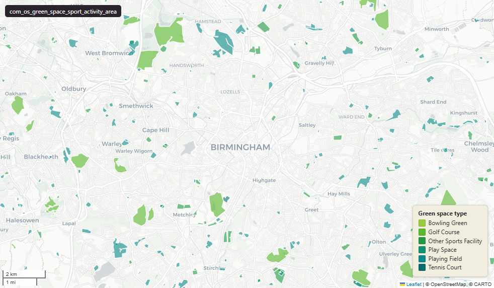

# OS Open Greenspace Sport and activity provision (polygon)

OS Open Greenspace sport activity

`com_os_green_space_sport_activity_area`

**SOURCE**

- Ordnance Survey (OS), Open Greenspace product (base geometry; dataset column records "OS Greenspace").
- Additional analytical columns (naturalness, accessible, angst, perc_manmade, greenspacetopology, habitat, designation, typologytitle, typologycode, attribute, vxcount, orig_area) appear to be added by an upstream pipeline not yet identified - exact derivation rules to be documented when known.

**DOCUMENTATION**

- OS Open Greenspace product page : https://docs.os.uk/os-downloads/products/land-and-terrain-portfolio/os-open-greenspace
- OS Open Greenspace download : https://osdatahub.os.uk/data/downloads/open/OpenGreenspace

**DEFINITIONS**

- "OS Open Greenspace depicts the location and extent of spaces, such as parks and sports facilities, which are likely to be accessible to the public." (OS Open Greenspace product page)

**SCOPE**

- England & Wales.
- 74,573 distinct sites (by id_original) represented across 87,983 polygon rows (avg ratio ~1.18 - most sites are single polygons; some are exploded multipolygons).

**CRS**

- EPSG:27700 (British National Grid / BNG).

**LICENCE**

- Open Government Licence v3.0 (per source OS Open Greenspace licence column value "OGL"; verify if upstream-derived analytical attributes carry an additional licence).

**DATA QUALITY CAVEATS**

- id_original is NOT strictly unique per row - 74,573 distinct values across 87,983 rows. Multipolygon sites have been exploded.
- Upstream derivation pipeline for the analytical attributes is not yet documented here; values should be cross-checked against the originating source before being used in published outputs.

MSOA SPLIT (added 3 July 2026)

- Geometry split to one row per (source feature x MSOA 2021). Each row carries that MSOA's msoa21cd / msoa21nm / msoa21hclnm and best-fit lad22 / lad25. The source feature's original primary key is preserved as `source_fid`; `gid` is a fresh surrogate primary key. Features with no MSOA overlap (offshore or outside England & Wales) are kept whole with NULL geography columns.

**ENRICHMENT**

- lad22cd, lad22nm : spatial intersect with ONS 2022 LAD boundaries.
- wd21cd, wd21nm : spatial intersect with ONS 2021 Ward boundaries.
- area_ha : derived from geom at load (area in hectares, computed from the geometry at load).

## Columns

| Column | Type | Description / unit |
|---|---|---|
| `source_fid` | `bigint` | Primary key of the source feature in the pre-split layer uk.com_os_green_space_sport_activity_area__preswap_jul03 (non-unique here: a feature spanning N MSOAs has N rows). |
| `objectid` | `bigint` |  |
| `dataset` | `character varying(255)` |  |
| `accessible` | `character varying(255)` |  |
| `angst` | `character varying(255)` |  |
| `naturalness` | `integer` |  |
| `typologytitle` | `character varying(255)` |  |
| `license` | `character varying(255)` |  |
| `greenspacetopology` | `integer` |  |
| `habitat` | `integer` |  |
| `designation` | `integer` |  |
| `attribute` | `character varying(8000)` |  |
| `typologycode` | `character varying(255)` |  |
| `orig_area` | `double precision` |  |
| `perc_manmade` | `double precision` |  |
| `vxcount` | `integer` |  |
| `shape_length` | `double precision` |  |
| `shape_area` | `double precision` |  |
| `id_original` | `integer` |  |
| `wd21nm` | `character varying` |  |
| `wd21cd` | `character varying` |  |
| `area_ha` | `double precision` |  |
| `msoa21cd` | `character varying` | Middle Layer Super Output Area (MSOA) 2021 code of this piece. Open Government Licence v3.0. |
| `msoa21nm` | `character varying` | Official ONS MSOA 2021 name of this piece. Open Government Licence v3.0. |
| `msoa21hclnm` | `text` | House of Commons Library readable MSOA name of this piece. Open Parliament Licence. |
| `lad22cd` | `text` | Local Authority District 2022 code (2021 LAD geography, anchored to the MSOA 2021 name scoping), best-fit from this piece's msoa21cd. Open Government Licence v3.0. |
| `lad22nm` | `text` | Local Authority District 2022 name (2021 LAD geography), best-fit from this piece's msoa21cd. Open Government Licence v3.0. |
| `lad25cd` | `text` | Local Authority District 2025 code (current administering authority), best-fit from this piece's msoa21cd. Open Government Licence v3.0. |
| `lad25nm` | `text` | Local Authority District 2025 name (current administering authority), best-fit from this piece's msoa21cd. Open Government Licence v3.0. |
| `geom` | `geometry(MultiPolygon,27700)` |  |
| `gid` | `bigint` |  |
