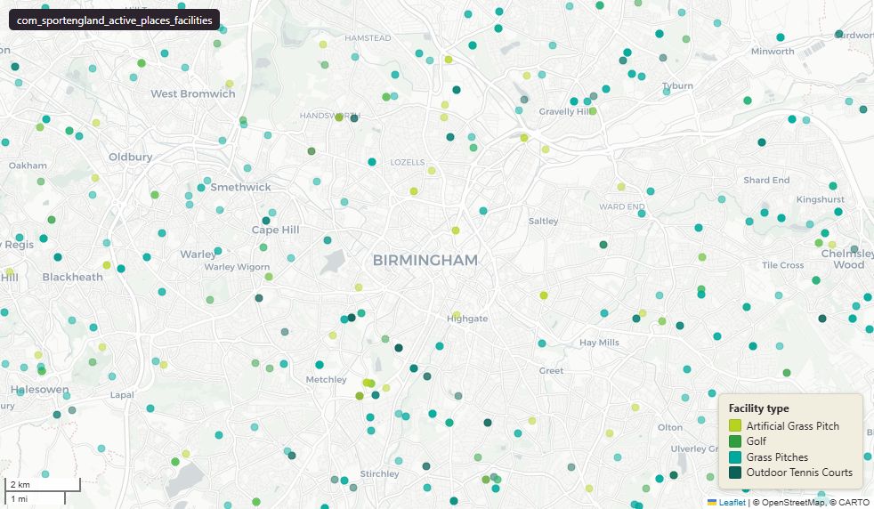

# Sport England Active Places - point features for individual sports facilities

Open Greenspace sport activity

`com_sportengland_active_places_facilities`

**SOURCE**

- Sport England, Active Places product (national sports-facility database for England).

**DOCUMENTATION**

- Open data home : https://activeplaces.github.io/
- Active Places Power : https://www.activeplacespower.com/
- data.gov.uk listing : https://www.data.gov.uk/dataset/c39c69e5-5c80-4dad-a1d5-e9023a25f3da/active-places

**DEFINITIONS**

- "Sport facility data for England maintained by Sport England on behalf of the sport sector." (activeplaces.github.io)
- "The Active Places database contains information on around 41,000 sports sites nationwide, with details on 115,000 sports facilities." (Sport England Active Places Power summary)

**SCOPE**

- England.
- 44,114 facilities (1:1 with id_original - no row duplication).

**CRS**

- EPSG:27700 (British National Grid / BNG). Reprojected at load from upstream WGS84 lat/long.

**LICENCE**

- Creative Commons Attribution v4.0 (CC-BY 4.0). Attribution required: "Contains Data (c) Sport England".

**ENRICHMENT**

- lad22cd, lad22nm : spatial intersect with ONS 2022 LAD boundaries (in addition to source local_authority_code / _name).
- wd21cd, wd21nm : spatial intersect with ONS 2021 Ward boundaries.

**NOT IN THIS DATASET**

- Sports facilities outside England (Scotland, Wales, Northern Ireland) are out of Sport England's remit and not in this product.

## Columns

| Column | Type | Description / unit |
|---|---|---|
| `objectid` | `bigint` | Source ArcGIS surrogate from upstream. |
| `site_name` | `character varying(254)` | Source field "SiteName"; name of the sports site (e.g. "GREAT FIELDS PARK"). Length 254. |
| `post_code` | `character varying(254)` | Source field "PostCode"; UK postcode of the site. |
| `ownership` | `character varying(254)` | Source field "Ownership"; ownership category (e.g. "Local Authority", "Commercial"). |
| `management` | `character varying(254)` | Source field "Management"; management category (e.g. "Local Authority (in house)", "Sport Club"). |
| `facility_type` | `character varying(255)` | Source field "FacilityType"; type of sports facility (e.g. "Outdoor Tennis Courts", "Grass Pitches"). |
| `access_group` | `character varying(255)` | Source field "AccessGroup"; top-level access category (e.g. "Public Access"). |
| `access_type` | `character varying(255)` | Source field "AccessType"; detailed access type (e.g. "Free Public Access", "Sports Club / Community Association"). |
| `lsoa_code` | `character varying(255)` | Source field "LSOA_Code"; ONS LSOA GSS code where the facility falls (edition per upstream). |
| `msoa_code` | `character varying(255)` | Source field "MSOA_Code"; ONS MSOA GSS code where the facility falls. |
| `local_authority_code` | `character varying(255)` | Source field "LocalAuthorityCode"; ONS LAD GSS code (upstream-supplied; edition may differ from our enrichment lad22cd). |
| `local_authority_name` | `character varying(255)` | Source field "LocalAuthorityName"; LAD name as recorded upstream. |
| `county_code` | `character varying(255)` | Source field "CountyCode"; upstream county/region code (999999999 used as sentinel for Greater London Authority). |
| `county_name` | `character varying(255)` | Source field "CountyName"; upstream county/region name. |
| `site_id` | `integer` | Source field "SiteID"; Sport England's internal site identifier. |
| `id_original` | `integer` | Source identifier preserved at load (matches objectid in samples). Unique per row. |
| `lad22nm` | `character varying` | Joined at load from spatial intersection with ONS 2022 LAD boundaries; LAD name. |
| `lad22cd` | `character varying` | Joined at load from spatial intersection with ONS 2022 LAD boundaries; LAD GSS code. |
| `wd21nm` | `character varying` | Joined at load from spatial intersection with ONS 2021 Ward boundaries; Ward name. |
| `wd21cd` | `character varying` | Joined at load from spatial intersection with ONS 2021 Ward boundaries; Ward GSS code. |
| `geom` | `geometry(Point,27700)` | Source field "geometry"; Point in EPSG:27700 (British National Grid). |
| `fid` | `bigint` |  |
