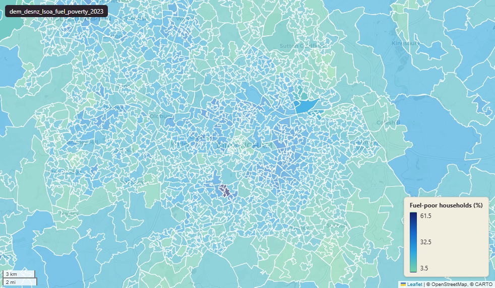

# Department for Energy Security and Net Zero (DESNZ) sub-regional fuel poverty estimates at LSOA (England), 2023

Fuel Poverty

`dem_desnz_lsoa_fuel_poverty_2023`

**SOURCE**

- Department for Energy Security and Net Zero (DESNZ), formerly the Department for Business, Energy & Industrial Strategy (BEIS); department split April 2023.
- Modelled from the English Housing Survey (EHS) and aggregated to LSOA21 grain.

**DOCUMENTATION**

- Statistical release : https://www.gov.uk/government/statistics/sub-regional-fuel-poverty-2023-2021-data
- Methodology : https://www.gov.uk/government/publications/fuel-poverty-sub-regional-methodology-and-documentation/sub-regional-fuel-poverty-statistics-methodology
- data.gov.uk catalogue : https://www.data.gov.uk/dataset/f3009590-2bc9-40d9-8dc3-571e6fddae45/fuel-poverty-in-england-sub-regional

**DEFINITIONS**

- Estimated percentage of households in fuel poverty in each LSOA.
- LILEE: Low Income Low Energy Efficiency. A household is classified as "fuel-poor" when the property is rated EPC band D or below and income after housing and fuel costs falls below the official poverty line.

**SCOPE**

- England only.
- 33,755 rows at LSOA 2021 grain.

**CRS**

- EPSG:27700 (British National Grid / BNG). Geometry joined at load from the LSOA21 boundary set.

**LICENCE**

- Open Government Licence v3.0.

**DATA QUALITY CAVEATS**

- Fuel poverty estimates at LSOA have very small sample sizes; focus on general trends and area comparison, not on identifying trends over time within an LSOA or comparing LSOAs with similar fuel poverty levels.

**ENRICHMENT**

- `msoa21hclnm` — House of Commons Library readable MSOA name, joined at load on msoa21cd from House of Commons Library MSOA Names v2.3 (13 February 2026). Open Parliament Licence.
- msoa21cd, msoa21nm : joined from ONS LSOA -> MSOA lookup.
- lad22cd, lad22nm : joined from ONS LSOA -> LAD lookup.
- wd21cd, wd21nm : joined from ONS LSOA -> Ward lookup.
- geom, area_ha : geometry from LSOA21 boundary; area_ha derived from geom at load.

## Columns

| Column | Type | Description / unit |
|---|---|---|
| `id` | `bigint` |  |
| `lsoa21cd` | `text` | Source field "LSOA21CD"; ONS GSS 9-character LSOA code (e.g. "E01000001"). |
| `lsoa21nm` | `text` | Source field "LSOA21NM"; human-readable LSOA name. |
| `msoa21cd` | `text` | Joined at load from ONS LSOA->MSOA lookup; 2021 MSOA GSS code. |
| `msoa21nm` | `text` | Joined at load from ONS LSOA->MSOA lookup; 2021 MSOA name. |
| `lad22cd` | `text` | Joined at load from ONS LSOA->LAD lookup; 2022 LAD GSS code. |
| `lad22nm` | `text` | Joined at load from ONS LSOA->LAD lookup; 2022 LAD name. |
| `wd21cd` | `text` | Joined at load from ONS LSOA->Ward lookup; 2021 Ward GSS code. |
| `wd21nm` | `text` | Joined at load from ONS LSOA->Ward lookup; 2021 Ward name. |
| `region` | `text` | Source field "Region"; ONS region name (English regions). |
| `total_households` | `double precision` | Source field; total number of households in the LSOA. |
| `fuel_poor_households_count` | `double precision` | Source field; modelled count of households in fuel poverty (LILEE measure). |
| `fuel_poor_households_perc` | `double precision` | Source field; modelled share of households in fuel poverty. Unit: "per cent (0-100)". |
| `geom` | `geometry(MultiPolygon,27700)` | Joined at load from LSOA21 boundary set; MultiPolygon in EPSG:27700. |
| `area_ha` | `double precision` | Derived at load from ST_Area(geom)/10000. Unit: "hectares". |
| `fid` | `bigint` |  |
| `msoa21hclnm` | `text` | House of Commons Library readable MSOA name. Source field `msoa21hclnm` from House of Commons Library MSOA Names v2.3 (13 February 2026), joined at load on msoa21cd. Open Parliament Licence. |
