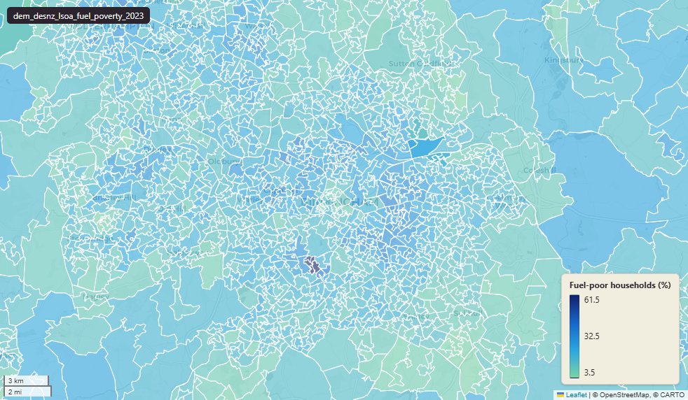

# Department for Energy Security and Net Zero (DESNZ) sub-regional fuel poverty estimates at LSOA (England), 2023

Fuel Poverty 2023

`dem_desnz_lsoa_fuel_poverty_2023`

**SOURCE**

- Department for Energy Security and Net Zero (DESNZ), formerly the Department for Business, Energy & Industrial Strategy (BEIS); department split April 2023.
- Modelled from the English Housing Survey (EHS) and aggregated to Lower layer Super Output Areas 2021.

**DOCUMENTATION**

- Statistical release : https://www.gov.uk/government/statistics/sub-regional-fuel-poverty-2023-2021-data
- Methodology : https://www.gov.uk/government/publications/fuel-poverty-sub-regional-methodology-and-documentation/sub-regional-fuel-poverty-statistics-methodology
- data.gov.uk catalogue : https://www.data.gov.uk/dataset/f3009590-2bc9-40d9-8dc3-571e6fddae45/fuel-poverty-in-england-sub-regional

**DEFINITIONS**

- Estimated percentage of households in fuel poverty in each LSOA.
- LILEE (Low Income Low Energy Efficiency). A household is fuel poor if: 1. their home has a Fuel Poverty Energy Efficiency Rating of band D or below, and 2. after modelled energy and housing costs, their residual income is below the poverty line.

**SCOPE**

- England only.
- 33,755 rows at LSOA 2021 level.

**CRS**

- EPSG:27700 (British National Grid / BNG). Geometry joined at load from the LSOA21 boundary set.

**LICENCE**

- Open Government Licence v3.0.

**DATA QUALITY CAVEATS**

- County and Spatial Development Strategy columns are England and Wales only; rows elsewhere carry no county or SDS. Wales and the Isles of Scilly carry a county but no SDS. Rows with no Local Authority District code are NULL in all four columns.
- Fuel poverty estimates at LSOA have very small sample sizes; focus on general trends and area comparison, not on identifying trends over time within an LSOA.

**ENRICHMENT**

- `sds_name` / `sds_group` — Spatial Development Strategy area and devolution status, a Prior + Partners categorisation over Ministry of Housing, Communities and Local Government (MHCLG) English devolution policy, joined at load on the row's Local Authority District 2025 code via uk.ref_lad25_ctyua25_sds_lu_jul2026.
- `msoa21hclnm` — House of Commons Library readable MSOA name, joined at load on msoa21cd from House of Commons Library MSOA Names v2.3 (13 February 2026). Open Parliament Licence.
- msoa21cd, msoa21nm : joined from ONS LSOA -> MSOA lookup.
- lad22cd, lad22nm : joined from ONS LSOA -> LAD lookup.
- wd21cd, wd21nm : joined from ONS LSOA -> Ward lookup.
- geom, area_ha : geometry from LSOA21 boundary; area_ha derived from geom at load.

## Columns

| Column | Type | Description / unit |
|---|---|---|
| `id` | `bigint` |  |
| `lsoa21cd` | `text` | Source field "LSOA21CD"; ONS GSS 9-character LSOA code (e.g. "E01000001"). |
| `lsoa21nm` | `text` | Source field "LSOA21NM"; human-readable LSOA name. |
| `msoa21cd` | `text` | Joined at load from ONS LSOA->MSOA lookup; 2021 MSOA GSS code. |
| `msoa21nm` | `text` | Joined at load from ONS LSOA->MSOA lookup; 2021 MSOA name. |
| `lad22cd` | `text` | Local Authority District 2022 code, best-fit assigned from the feature's Middle Layer Super Output Area (MSOA) 2021 code. The 2022 reference is the 2021 LAD geography that the MSOA 2021 names are scoped to. Joined at load from the ONS MSOA (2021) to LAD (2022) best-fit lookup on msoa21cd. Open Government Licence v3.0. |
| `lad22nm` | `text` | Local Authority District 2022 name, best-fit assigned from the feature's MSOA 2021 code (the 2021 LAD geography matching the MSOA 2021 name scoping). Joined at load from the ONS MSOA (2021) to LAD (2022) best-fit lookup on msoa21cd. Open Government Licence v3.0. |
| `wd21cd` | `text` | Joined at load from ONS LSOA->Ward lookup; 2021 Ward GSS code. |
| `wd21nm` | `text` | Joined at load from ONS LSOA->Ward lookup; 2021 Ward name. |
| `region` | `text` | Source field "Region"; ONS region name (English regions). |
| `total_households` | `double precision` | Source field; total number of households in the LSOA. |
| `fuel_poor_households_count` | `double precision` | Source field; modelled count of households in fuel poverty (LILEE measure). |
| `fuel_poor_households_perc` | `double precision` | Source field; modelled share of households in fuel poverty. Unit: "per cent (0-100)". |
| `geom` | `geometry(MultiPolygon,27700)` | Joined at load from LSOA21 boundary set; MultiPolygon in EPSG:27700. |
| `area_ha` | `double precision` | Derived at load from ST_Area(geom)/10000. Unit: "hectares". |
| `fid` | `bigint` |  |
| `msoa21hclnm` | `text` | House of Commons Library readable MSOA name. Source field `msoa21hclnm` from House of Commons Library MSOA Names v2.3 (13 February 2026), joined at load on msoa21cd. Open Parliament Licence. |
| `lad25cd` | `text` | Local Authority District 2025 code (current administering authority), best-fit assigned from the feature's MSOA 2021 code. Joined at load from the ONS MSOA (2021) to Ward (2025) to LAD (2025) best-fit lookup on msoa21cd. Open Government Licence v3.0. |
| `lad25nm` | `text` | Local Authority District 2025 name (current administering authority), best-fit assigned from the feature's MSOA 2021 code. Joined at load from the ONS MSOA (2021) to Ward (2025) to LAD (2025) best-fit lookup on msoa21cd. Open Government Licence v3.0. |
| `ctyua25cd` | `text` | County or unitary authority code at 1 April 2025. Joined at load via uk.ref_lad25_ctyua25_sds_lu_jul2026 on the row's Local Authority District 2025 code. Open Government Licence v3.0. |
| `ctyua25nm` | `text` | County or unitary authority name at 1 April 2025. Joined at load via uk.ref_lad25_ctyua25_sds_lu_jul2026 on the row's Local Authority District 2025 code. Open Government Licence v3.0. |
| `sds_name` | `text` | Spatial Development Strategy (SDS) area, a Prior + Partners categorisation over Ministry of Housing, Communities and Local Government (MHCLG) English devolution policy. Joined at load via uk.ref_lad25_ctyua25_sds_lu_jul2026 on the row's Local Authority District 2025 code. Open Government Licence v3.0. |
| `sds_group` | `text` | Devolution status of the Spatial Development Strategy area: Existing Devolution Footprints, Devolution Priority Programme, Other Proposed Geographies or Remaining Areas. Joined at load via uk.ref_lad25_ctyua25_sds_lu_jul2026 on the row's Local Authority District 2025 code. Open Government Licence v3.0. |
