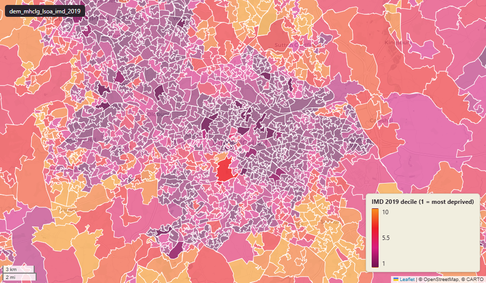

# MHCLG Index of Multiple Deprivation (IMD) 2019 at LSOA 2011, England

`dem_mhclg_lsoa_imd_2019`

<a href="http://localhost:7800/?layer=uk_baseline.dem_mhclg_lsoa_imd_2019" target="_blank" rel="noopener">Open in the Dashboard &#8599;</a> (start your local Dashboard first)

**SOURCE**

- Ministry of Housing, Communities and Local Government (MHCLG), English Indices of Deprivation 2019. Statistical release 26 September 2019. Score / rank / decile columns, sub-domain columns, supplementary index columns (IDACI, IDAOPI), and historical 2010 / 2015 rank columns derive directly from MHCLG's File 1 ("Index of Multiple Deprivation") and File 5 ("Scores for the Indices of Deprivation").
- Several non-MHCLG columns (ONS Mid-2022 population denominators; total_students / age-band counts; data_source / data_resolution / data_time_period / data_web_link fixed-string annotations; rank-change and rank-trend columns) were added during an earlier Prior + Partners loading pass. Original load author, date, and methodology no longer recorded. Provenance for those columns is documented in their individual column comments.

**DOCUMENTATION**

- IoD 2019 landing page : https://www.gov.uk/government/statistics/english-indices-of-deprivation-2019
- Statistical Release (PDF) : https://assets.publishing.service.gov.uk/government/uploads/system/uploads/attachment_data/file/835115/IoD2019_Statistical_Release.pdf
- Technical Report (PDF) : https://assets.publishing.service.gov.uk/media/5d8b387740f0b609909b5908/IoD2019_Technical_Report.pdf
- Frequently Asked Questions (PDF) : https://assets.publishing.service.gov.uk/media/5dfb3d7ce5274a3432700cf3/IoD2019_FAQ_v4.pdf
- Mapping resources : https://www.gov.uk/guidance/english-indices-of-deprivation-2019-mapping-resources

**DEFINITIONS**

- "The Index of Multiple Deprivation (IMD) is the most widely used of the deprivation indices. [It] measures relative deprivation in small areas in England called lower-layer super output areas." (gov.uk IoD 2019 landing page)
- "It is a relative measure of deprivation; the neighbourhoods on which the IMD is built, lower layer super output areas (LSOAs), are ranked from 1 (most deprived) to 32,844 (least deprived)." (IoD 2019 FAQ)
- "Deciles are calculated by ranking the 32,844 small areas in England, from most deprived to least deprived, and dividing them into 10 equal groups. LSOAs in decile 1 fall within the most deprived 10% of LSOAs nationally and LSOAs in decile 10 fall within the least deprived 10% of LSOAs nationally." (IoD 2019 FAQ)
- "The Index of Deprivation 2019 was produced using the same approach, structure and methodology as the Index of Deprivation 2015 and previous releases, and keeping a consistent methodology does allow relative rankings between iterations to be compared over time." (gov.uk IoD 2019 landing page)

**SCOPE**

- LSOA 2011 boundary coverage: England + Wales (34,753 distinct lsoa11cd). IMD score / rank / decile columns are populated for English LSOAs only — 1,940 rows for Welsh LSOAs (lsoa11cd starting "W") carry NULL IMD values, because IMD is an England-only index. The Welsh equivalent is the Welsh Index of Multiple Deprivation, published separately by the Welsh Government and not in this table.

**CRS**

- EPSG:27700 (OSGB36 / British National Grid).

**LICENCE**

- Open Government Licence v3.0.

**DATA QUALITY CAVEATS**

- Multipolygon explosion: 35,796 geometry rows for 34,753 distinct LSOAs (3% over-count).

## Columns

| Column | Type | Description / unit |
|---|---|---|
| `lsoa11cd` | `text` | Source field "LSOA11CD"; ONS GSS 9-character LSOA code. |
| `lsoa11nm` | `text` | Source field "LSOA11NM"; human-readable LSOA name. |
| `geom` | `geometry(MultiPolygon,27700)` | MultiPolygon in EPSG:27700. LSOA 2011 boundary geometry joined at load. |
| `lsoa21cd` | `text` | Joined at load from ONS LSOA11->LSOA21 lookup; 2021 LSOA GSS code. |
| `lsoa21nm` | `text` | Joined at load from ONS LSOA11->LSOA21 lookup; 2021 LSOA name. |
| `lad22cd` | `text` | Joined at load from ONS LSOA->LAD lookup; 2022 LAD GSS code. |
| `lad22nm` | `text` | Joined at load from ONS LSOA->LAD lookup; 2022 LAD name. |
| `rgn22cd` | `text` | Joined at load from ONS LSOA->Region lookup; 2022 Region GSS code. |
| `rgn22nm` | `text` | Joined at load from ONS LSOA->Region lookup; 2022 Region name. |
| `data_source` | `text` | Added during an earlier Prior + Partners loading pass. Fixed-string annotation; same value every row. Value: "Ministry of Housing, Communities & Local Government". Informational, not a per-row attribute. |
| `data_resolution` | `text` | Added during an earlier Prior + Partners loading pass. Fixed-string annotation; same value every row. Value: "LSOA 2011". |
| `data_time_period` | `text` | Added during an earlier Prior + Partners loading pass. Fixed-string annotation; same value every row. Value: "2010-2019". |
| `data_web_link` | `text` | Added during an earlier Prior + Partners loading pass. Fixed-string annotation; same value every row. Value: the IoD 2019 gov.uk landing page URL. |
| `area_ha` | `double precision` | Area in hectares, computed at load from the geometry. Unit: hectares. Stale if geometry is later edited. |
| `lad19cd` | `text` | Joined at load from ONS LSOA->LAD lookup; 2019 LAD GSS code. |
| `lad19nm` | `text` | Joined at load from ONS LSOA->LAD lookup; 2019 LAD name. |
| `index_of_multiple_deprivation_score` | `double precision` | Source field; Index of Multiple Deprivation (IMD) — composite score. Unit: "domain score (relative composite; higher = more deprived)". |
| `index_of_multiple_deprivation_rank` | `double precision` | Source field; Index of Multiple Deprivation (IMD) — composite rank among 32,844 English LSOAs (1 = most deprived). |
| `index_of_multiple_deprivation_decile` | `double precision` | Source field; Index of Multiple Deprivation (IMD) — composite decile among 32,844 English LSOAs (1 = most deprived 10%, 10 = least deprived 10%). |
| `income_score` | `double precision` | Source field; Income Deprivation domain score. Unit: "rate (proportion of relevant population, 0 to 1)". |
| `income_rank` | `double precision` | Source field; Income Deprivation domain rank among 32,844 English LSOAs (1 = most deprived). |
| `income_decile` | `double precision` | Source field; Income Deprivation domain decile among 32,844 English LSOAs (1 = most deprived 10%, 10 = least deprived 10%). |
| `employment_score` | `double precision` | Source field; Employment Deprivation domain score. Unit: "rate (proportion of relevant population, 0 to 1)". |
| `employment_rank` | `double precision` | Source field; Employment Deprivation domain rank among 32,844 English LSOAs (1 = most deprived). |
| `employment_decile` | `double precision` | Source field; Employment Deprivation domain decile among 32,844 English LSOAs (1 = most deprived 10%, 10 = least deprived 10%). |
| `education_skills_and_training_score` | `double precision` | Source field; Education, Skills and Training Deprivation domain score. Unit: "domain score (relative composite; higher = more deprived)". |
| `education_skills_and_training_rank` | `double precision` | Source field; Education, Skills and Training Deprivation domain rank among 32,844 English LSOAs (1 = most deprived). |
| `education_skills_and_training_decile` | `double precision` | Source field; Education, Skills and Training Deprivation domain decile among 32,844 English LSOAs (1 = most deprived 10%, 10 = least deprived 10%). |
| `health_deprivation_and_disability_score` | `double precision` | Source field; Health Deprivation and Disability domain score. Unit: "domain score (relative composite; higher = more deprived)". |
| `health_deprivation_and_disability_rank` | `double precision` | Source field; Health Deprivation and Disability domain rank among 32,844 English LSOAs (1 = most deprived). |
| `health_deprivation_and_disability_decile` | `double precision` | Source field; Health Deprivation and Disability domain decile among 32,844 English LSOAs (1 = most deprived 10%, 10 = least deprived 10%). |
| `crime_score` | `double precision` | Source field; Crime domain score. Unit: "domain score (relative composite; higher = more deprived)". |
| `crime_rank` | `double precision` | Source field; Crime domain rank among 32,844 English LSOAs (1 = most deprived). |
| `crime_decile` | `double precision` | Source field; Crime domain decile among 32,844 English LSOAs (1 = most deprived 10%, 10 = least deprived 10%). |
| `barriers_to_housing_and_services_score` | `double precision` | Source field; Barriers to Housing and Services domain score. Unit: "domain score (relative composite; higher = more deprived)". |
| `barriers_to_housing_and_services_rank` | `double precision` | Source field; Barriers to Housing and Services domain rank among 32,844 English LSOAs (1 = most deprived). |
| `barriers_to_housing_and_services_decile` | `double precision` | Source field; Barriers to Housing and Services domain decile among 32,844 English LSOAs (1 = most deprived 10%, 10 = least deprived 10%). |
| `living_environment_score` | `double precision` | Source field; Living Environment Deprivation domain score. Unit: "domain score (relative composite; higher = more deprived)". |
| `living_environment_rank` | `double precision` | Source field; Living Environment Deprivation domain rank among 32,844 English LSOAs (1 = most deprived). |
| `living_environment_decile` | `double precision` | Source field; Living Environment Deprivation domain decile among 32,844 English LSOAs (1 = most deprived 10%, 10 = least deprived 10%). |
| `income_deprivation_affecting_children_index_score` | `double precision` | Source field; Income Deprivation Affecting Children Index (IDACI) score. Unit: "rate (proportion of relevant population, 0 to 1)". |
| `income_deprivation_affecting_children_index_rank` | `double precision` | Source field; Income Deprivation Affecting Children Index (IDACI) rank among 32,844 English LSOAs (1 = most deprived). |
| `income_deprivation_affecting_children_index_decile` | `double precision` | Source field; Income Deprivation Affecting Children Index (IDACI) decile among 32,844 English LSOAs (1 = most deprived 10%, 10 = least deprived 10%). |
| `income_deprivation_affecting_older_people_score` | `double precision` | Source field; Income Deprivation Affecting Older People Index (IDAOPI) score. Unit: "rate (proportion of relevant population, 0 to 1)". |
| `income_deprivation_affecting_older_people_rank` | `double precision` | Source field; Income Deprivation Affecting Older People Index (IDAOPI) rank among 32,844 English LSOAs (1 = most deprived). |
| `income_deprivation_affecting_older_people_decile` | `double precision` | Source field; Income Deprivation Affecting Older People Index (IDAOPI) decile among 32,844 English LSOAs (1 = most deprived 10%, 10 = least deprived 10%). |
| `children_and_young_people_sub_domain_score` | `double precision` | Source field; Children and Young People sub-domain (within Education, Skills and Training) score. Unit: "domain score (relative composite; higher = more deprived)". |
| `children_and_young_people_sub_domain_rank` | `double precision` | Source field; Children and Young People sub-domain (within Education, Skills and Training) rank among 32,844 English LSOAs (1 = most deprived). |
| `children_and_young_people_sub_domain_decile` | `double precision` | Source field; Children and Young People sub-domain (within Education, Skills and Training) decile among 32,844 English LSOAs (1 = most deprived 10%, 10 = least deprived 10%). |
| `adult_skills_sub_domain_score` | `double precision` | Source field; Adult Skills sub-domain (within Education, Skills and Training) score. Unit: "domain score (relative composite; higher = more deprived)". |
| `adult_skills_sub_domain_rank` | `double precision` | Source field; Adult Skills sub-domain (within Education, Skills and Training) rank among 32,844 English LSOAs (1 = most deprived). |
| `adult_skills_sub_domain_decile` | `double precision` | Source field; Adult Skills sub-domain (within Education, Skills and Training) decile among 32,844 English LSOAs (1 = most deprived 10%, 10 = least deprived 10%). |
| `geographical_barriers_sub_domain_score` | `double precision` | Source field; Geographical Barriers sub-domain (within Barriers to Housing and Services) score. Unit: "domain score (relative composite; higher = more deprived)". |
| `geographical_barriers_sub_domain_rank` | `double precision` | Source field; Geographical Barriers sub-domain (within Barriers to Housing and Services) rank among 32,844 English LSOAs (1 = most deprived). |
| `geographical_barriers_sub_domain_decile` | `double precision` | Source field; Geographical Barriers sub-domain (within Barriers to Housing and Services) decile among 32,844 English LSOAs (1 = most deprived 10%, 10 = least deprived 10%). |
| `wider_barriers_sub_domain_score` | `double precision` | Source field; Wider Barriers sub-domain (within Barriers to Housing and Services) score. Unit: "domain score (relative composite; higher = more deprived)". |
| `wider_barriers_sub_domain_rank` | `double precision` | Source field; Wider Barriers sub-domain (within Barriers to Housing and Services) rank among 32,844 English LSOAs (1 = most deprived). |
| `wider_barriers_sub_domain_decile` | `double precision` | Source field; Wider Barriers sub-domain (within Barriers to Housing and Services) decile among 32,844 English LSOAs (1 = most deprived 10%, 10 = least deprived 10%). |
| `indoors_sub_domain_score` | `double precision` | Source field; Indoors sub-domain (within Living Environment) score. Unit: "domain score (relative composite; higher = more deprived)". |
| `indoors_sub_domain_rank` | `double precision` | Source field; Indoors sub-domain (within Living Environment) rank among 32,844 English LSOAs (1 = most deprived). |
| `indoors_sub_domain_decile` | `double precision` | Source field; Indoors sub-domain (within Living Environment) decile among 32,844 English LSOAs (1 = most deprived 10%, 10 = least deprived 10%). |
| `outdoors_sub_domain_score` | `double precision` | Source field; Outdoors sub-domain (within Living Environment) score. Unit: "domain score (relative composite; higher = more deprived)". |
| `outdoors_sub_domain_rank` | `double precision` | Source field; Outdoors sub-domain (within Living Environment) rank among 32,844 English LSOAs (1 = most deprived). |
| `outdoors_sub_domain_decile` | `double precision` | Source field; Outdoors sub-domain (within Living Environment) decile among 32,844 English LSOAs (1 = most deprived 10%, 10 = least deprived 10%). |
| `index_of_multiple_deprivation_rank_2010` | `double precision` | Source field; Index of Multiple Deprivation (IMD) rank at the IoD 2010, among 32,482 English LSOAs at that edition (1 = most deprived). |
| `index_of_multiple_deprivation_rank_2015` | `double precision` | Source field; Index of Multiple Deprivation (IMD) — composite rank at the IoD 2015, among 32,844 English LSOAs (1 = most deprived). |
| `income_rank_2015` | `double precision` | Source field; Income Deprivation domain rank at the IoD 2015, among 32,844 English LSOAs (1 = most deprived). |
| `employment_rank_2015` | `double precision` | Source field; Employment Deprivation domain rank at the IoD 2015, among 32,844 English LSOAs (1 = most deprived). |
| `education_skills_and_training_rank_2015` | `double precision` | Source field; Education, Skills and Training Deprivation domain rank at the IoD 2015, among 32,844 English LSOAs (1 = most deprived). |
| `health_deprivation_and_disability_rank_2015` | `double precision` | Source field; Health Deprivation and Disability domain rank at the IoD 2015, among 32,844 English LSOAs (1 = most deprived). |
| `crime_rank_2015` | `double precision` | Source field; Crime domain rank at the IoD 2015, among 32,844 English LSOAs (1 = most deprived). |
| `barriers_to_housing_and_services_rank_2015` | `double precision` | Source field; Barriers to Housing and Services domain rank at the IoD 2015, among 32,844 English LSOAs (1 = most deprived). |
| `living_environment_rank_2015` | `double precision` | Source field; Living Environment Deprivation domain rank at the IoD 2015, among 32,844 English LSOAs (1 = most deprived). |
| `income_deprivation_affecting_children_index_rank_2015` | `double precision` | Source field; Income Deprivation Affecting Children Index (IDACI) rank at the IoD 2015, among 32,844 English LSOAs (1 = most deprived). |
| `income_deprivation_affecting_older_people_rank_2015` | `double precision` | Source field; Income Deprivation Affecting Older People Index (IDAOPI) rank at the IoD 2015, among 32,844 English LSOAs (1 = most deprived). |
| `children_and_young_people_sub_domain_rank_2015` | `double precision` | Source field; Children and Young People sub-domain (within Education, Skills and Training) rank at the IoD 2015, among 32,844 English LSOAs (1 = most deprived). |
| `adult_skills_sub_domain_rank_2015` | `double precision` | Source field; Adult Skills sub-domain (within Education, Skills and Training) rank at the IoD 2015, among 32,844 English LSOAs (1 = most deprived). |
| `geographical_barriers_sub_domain_rank_2015` | `double precision` | Source field; Geographical Barriers sub-domain (within Barriers to Housing and Services) rank at the IoD 2015, among 32,844 English LSOAs (1 = most deprived). |
| `wider_barriers_sub_domain_rank_2015` | `double precision` | Source field; Wider Barriers sub-domain (within Barriers to Housing and Services) rank at the IoD 2015, among 32,844 English LSOAs (1 = most deprived). |
| `indoors_sub_domain_rank_2015` | `double precision` | Source field; Indoors sub-domain (within Living Environment) rank at the IoD 2015, among 32,844 English LSOAs (1 = most deprived). |
| `outdoors_sub_domain_rank_2015` | `double precision` | Source field; Outdoors sub-domain (within Living Environment) rank at the IoD 2015, among 32,844 English LSOAs (1 = most deprived). |
| `imd_rank_change_2010_2015` | `double precision` | Derived during an earlier Prior + Partners loading pass; Index of Multiple Deprivation (IMD) rank change between the 2010 → 2015 IoD editions. Sign convention not recorded by the original load. Use with care. |
| `imd_rank_change_2015_2019` | `double precision` | Derived during an earlier Prior + Partners loading pass; Index of Multiple Deprivation (IMD) rank change between the 2015 → 2019 IoD editions. Sign convention not recorded by the original load. Use with care. |
| `imd_rank_trend_2010_2019` | `text` | Categorical rank-direction label derived during an earlier Prior + Partners loading pass for the Index of Multiple Deprivation (IMD) 2010 → 2019. Threshold rule not recorded. Distinct values observed in this column (captured 2026-05-27): "Consistently improved", "Consistently worsened", "Improved then worsened", "No clear trend", "Worsened then improved". |
| `income_rank_change_2015_2019` | `double precision` | Derived during an earlier Prior + Partners loading pass; Income Deprivation domain rank change between the 2015 → 2019 IoD editions. Sign convention not recorded by the original load. Use with care. |
| `employment_rank_change_2015_2019` | `double precision` | Derived during an earlier Prior + Partners loading pass; Employment Deprivation domain rank change between the 2015 → 2019 IoD editions. Sign convention not recorded by the original load. Use with care. |
| `education_rank_change_2015_2019` | `double precision` | Derived during an earlier Prior + Partners loading pass; Education, Skills and Training Deprivation domain rank change between the 2015 → 2019 IoD editions. Sign convention not recorded by the original load. Use with care. |
| `health_rank_change_2015_2019` | `double precision` | Derived during an earlier Prior + Partners loading pass; Health Deprivation and Disability domain rank change between the 2015 → 2019 IoD editions. Sign convention not recorded by the original load. Use with care. |
| `crime_rank_change_2015_2019` | `double precision` | Derived during an earlier Prior + Partners loading pass; Crime domain rank change between the 2015 → 2019 IoD editions. Sign convention not recorded by the original load. Use with care. |
| `barriers_to_housing_rank_change_2015_2019` | `double precision` | Derived during an earlier Prior + Partners loading pass; Barriers to Housing and Services domain rank change between the 2015 → 2019 IoD editions. Sign convention not recorded by the original load. Use with care. |
| `living_environment_rank_change_2015_2019` | `double precision` | Derived during an earlier Prior + Partners loading pass; Living Environment Deprivation domain rank change between the 2015 → 2019 IoD editions. Sign convention not recorded by the original load. Use with care. |
| `income_affecting_children_rank_change_2015_2019` | `double precision` | Derived during an earlier Prior + Partners loading pass; Income Deprivation Affecting Children Index (IDACI) rank change between the 2015 → 2019 IoD editions. Sign convention not recorded by the original load. Use with care. |
| `income_affecting_elderly_rank_change_2015_2019` | `double precision` | Derived during an earlier Prior + Partners loading pass; Income Deprivation Affecting Older People Index (IDAOPI) rank change between the 2015 → 2019 IoD editions. Sign convention not recorded by the original load. Use with care. |
| `children_and_young_people_rank_change_2015_2019` | `double precision` | Derived during an earlier Prior + Partners loading pass; Children and Young People sub-domain rank change between the 2015 → 2019 IoD editions. Sign convention not recorded by the original load. Use with care. |
| `adult_skills_rank_change_2015_2019` | `double precision` | Derived during an earlier Prior + Partners loading pass; Adult Skills sub-domain rank change between the 2015 → 2019 IoD editions. Sign convention not recorded by the original load. Use with care. |
| `geographical_barriers_rank_change_2015_2019` | `double precision` | Derived during an earlier Prior + Partners loading pass; Geographical Barriers sub-domain rank change between the 2015 → 2019 IoD editions. Sign convention not recorded by the original load. Use with care. |
| `wider_barriers_rank_change_2015_2019` | `double precision` | Derived during an earlier Prior + Partners loading pass; Wider Barriers sub-domain rank change between the 2015 → 2019 IoD editions. Sign convention not recorded by the original load. Use with care. |
| `indoors_rank_change_2015_2019` | `double precision` | Derived during an earlier Prior + Partners loading pass; Indoors sub-domain rank change between the 2015 → 2019 IoD editions. Sign convention not recorded by the original load. Use with care. |
| `outdoors_rank_change_2015_2019` | `double precision` | Derived during an earlier Prior + Partners loading pass; Outdoors sub-domain rank change between the 2015 → 2019 IoD editions. Sign convention not recorded by the original load. Use with care. |
| `income_rank_trend_2015_2019` | `text` | Categorical rank-direction label derived during an earlier Prior + Partners loading pass for the Income Deprivation domain 2015 → 2019. Threshold rule not recorded. Distinct values observed in this column (captured 2026-05-27): "Improved", "No change", "Worsened". |
| `employment_rank_trend_2015_2019` | `text` | Categorical rank-direction label derived during an earlier Prior + Partners loading pass for the Employment Deprivation domain 2015 → 2019. Threshold rule not recorded. Distinct values observed in this column (captured 2026-05-27): "Improved", "No change", "Worsened". |
| `education_rank_trend_2015_2019` | `text` | Categorical rank-direction label derived during an earlier Prior + Partners loading pass for the Education, Skills and Training Deprivation domain 2015 → 2019. Threshold rule not recorded. Distinct values observed in this column (captured 2026-05-27): "Improved", "No change", "Worsened". |
| `health_rank_trend_2015_2019` | `text` | Categorical rank-direction label derived during an earlier Prior + Partners loading pass for the Health Deprivation and Disability domain 2015 → 2019. Threshold rule not recorded. Distinct values observed in this column (captured 2026-05-27): "Improved", "No change", "Worsened". |
| `crime_rank_trend_2015_2019` | `text` | Categorical rank-direction label derived during an earlier Prior + Partners loading pass for the Crime domain 2015 → 2019. Threshold rule not recorded. Distinct values observed in this column (captured 2026-05-27): "Improved", "No change", "Worsened". |
| `barriers_to_housing_rank_trend_2015_2019` | `text` | Categorical rank-direction label derived during an earlier Prior + Partners loading pass for the Barriers to Housing and Services domain 2015 → 2019. Threshold rule not recorded. Distinct values observed in this column (captured 2026-05-27): "Improved", "No change", "Worsened". |
| `living_environment_rank_trend_2015_2019` | `text` | Categorical rank-direction label derived during an earlier Prior + Partners loading pass for the Living Environment Deprivation domain 2015 → 2019. Threshold rule not recorded. Distinct values observed in this column (captured 2026-05-27): "Improved", "No change", "Worsened". |
| `income_affecting_children_rank_trend_2015_2019` | `text` | Categorical rank-direction label derived during an earlier Prior + Partners loading pass for the Income Deprivation Affecting Children Index (IDACI) 2015 → 2019. Threshold rule not recorded. Distinct values observed in this column (captured 2026-05-27): "Improved", "No change", "Worsened". |
| `income_affecting_elderly_rank_trend_2015_2019` | `text` | Categorical rank-direction label derived during an earlier Prior + Partners loading pass for the Income Deprivation Affecting Older People Index (IDAOPI) 2015 → 2019. Threshold rule not recorded. Distinct values observed in this column (captured 2026-05-27): "Improved", "No change", "Worsened". |
| `children_and_young_people_rank_trend_2015_2019` | `text` | Categorical rank-direction label derived during an earlier Prior + Partners loading pass for the Children and Young People sub-domain 2015 → 2019. Threshold rule not recorded. Distinct values observed in this column (captured 2026-05-27): "Improved", "No change", "Worsened". |
| `adult_skills_rank_trend_2015_2019` | `text` | Categorical rank-direction label derived during an earlier Prior + Partners loading pass for the Adult Skills sub-domain 2015 → 2019. Threshold rule not recorded. Distinct values observed in this column (captured 2026-05-27): "No change". |
| `geographical_barriers_rank_trend_2015_2019` | `text` | Categorical rank-direction label derived during an earlier Prior + Partners loading pass for the Geographical Barriers sub-domain 2015 → 2019. Threshold rule not recorded. Distinct values observed in this column (captured 2026-05-27): "Improved", "No change", "Worsened". |
| `wider_barriers_rank_trend_2015_2019` | `text` | Categorical rank-direction label derived during an earlier Prior + Partners loading pass for the Wider Barriers sub-domain 2015 → 2019. Threshold rule not recorded. Distinct values observed in this column (captured 2026-05-27): "Improved", "No change", "Worsened". |
| `indoors_rank_trend_2015_2019` | `text` | Categorical rank-direction label derived during an earlier Prior + Partners loading pass for the Indoors sub-domain 2015 → 2019. Threshold rule not recorded. Distinct values observed in this column (captured 2026-05-27): "Improved", "No change", "Worsened". |
| `outdoors_rank_trend_2015_2019` | `text` | Categorical rank-direction label derived during an earlier Prior + Partners loading pass for the Outdoors sub-domain 2015 → 2019. Threshold rule not recorded. Distinct values observed in this column (captured 2026-05-27): "Improved", "No change", "Worsened". |
| `total_population_2022` | `double precision` | Added during an earlier Prior + Partners loading pass. Joined from ONS Mid-2022 Population Estimates by LSOA. Unit: "persons". |
| `dependent_children_aged_0_15_2022` | `double precision` | Added during an earlier Prior + Partners loading pass. Joined from ONS Mid-2022 Population Estimates by LSOA. Unit: "persons aged 0-15". |
| `older_population_aged_65_and_over_2022` | `double precision` | Added during an earlier Prior + Partners loading pass. Joined from ONS Mid-2022 Population Estimates by LSOA. Unit: "persons aged 65 and over". |
| `working_population_16_64_2022` | `double precision` | Added during an earlier Prior + Partners loading pass. Joined from ONS Mid-2022 Population Estimates by LSOA. Unit: "persons aged 16-64". |
| `total_students` | `double precision` | Added during an earlier Prior + Partners loading pass. Source dataset and age-band definitions not recorded; the column appears to be an ONS Census 2021 student / age-band count but this has not been verified against the publisher. Unit: "persons" (presumed). Use with care. |
| `age_4_under_count` | `double precision` | Added during an earlier Prior + Partners loading pass. Source dataset and age-band definitions not recorded; the column appears to be an ONS Census 2021 student / age-band count but this has not been verified against the publisher. Unit: "persons" (presumed). Use with care. |
| `age_5_15_count` | `double precision` | Added during an earlier Prior + Partners loading pass. Source dataset and age-band definitions not recorded; the column appears to be an ONS Census 2021 student / age-band count but this has not been verified against the publisher. Unit: "persons" (presumed). Use with care. |
| `age_16_17_count` | `double precision` | Added during an earlier Prior + Partners loading pass. Source dataset and age-band definitions not recorded; the column appears to be an ONS Census 2021 student / age-band count but this has not been verified against the publisher. Unit: "persons" (presumed). Use with care. |
| `age_18_20_count` | `double precision` | Added during an earlier Prior + Partners loading pass. Source dataset and age-band definitions not recorded; the column appears to be an ONS Census 2021 student / age-band count but this has not been verified against the publisher. Unit: "persons" (presumed). Use with care. |
| `age_21_24_count` | `double precision` | Added during an earlier Prior + Partners loading pass. Source dataset and age-band definitions not recorded; the column appears to be an ONS Census 2021 student / age-band count but this has not been verified against the publisher. Unit: "persons" (presumed). Use with care. |
| `age_25_29_count` | `double precision` | Added during an earlier Prior + Partners loading pass. Source dataset and age-band definitions not recorded; the column appears to be an ONS Census 2021 student / age-band count but this has not been verified against the publisher. Unit: "persons" (presumed). Use with care. |
| `age_30_over_count` | `double precision` | Added during an earlier Prior + Partners loading pass. Source dataset and age-band definitions not recorded; the column appears to be an ONS Census 2021 student / age-band count but this has not been verified against the publisher. Unit: "persons" (presumed). Use with care. |
| `age_18_and_above_count` | `double precision` | Added during an earlier Prior + Partners loading pass. Source dataset and age-band definitions not recorded; the column appears to be an ONS Census 2021 student / age-band count but this has not been verified against the publisher. Unit: "persons" (presumed). Use with care. |
| `wd22cd` | `character varying` | Joined at load from ONS LSOA->Ward lookup; 2022 Ward GSS code. |
| `wd22nm` | `character varying` | Joined at load from ONS LSOA->Ward lookup; 2022 Ward name. |
| `fid` | `bigint` |  |
