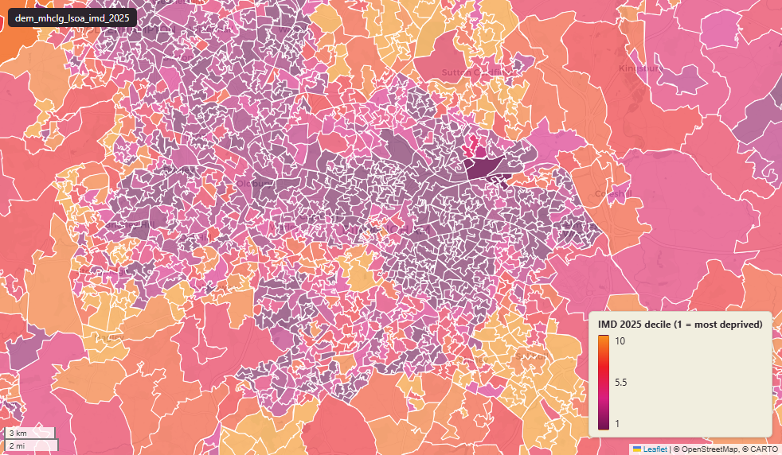

# MHCLG Index of Multiple Deprivation (IMD) 2025 at LSOA 2021, England

IMD 2025

`dem_mhclg_lsoa_imd_2025`

**SOURCE**

- Ministry of Housing, Communities and Local Government (MHCLG). Includes score / rank / decile columns for the IMD, its seven domains and six sub-domains, and the two supplementary income indices (IDACI, IDAOPI).
- Population denominator columns derive from Office for National Statistics (ONS) Mid-2022 Population Estimates by LSOA.

**DOCUMENTATION**

- IoD 2025 landing page : https://www.gov.uk/government/statistics/english-indices-of-deprivation-2025
- Statistical Release : https://www.gov.uk/government/statistics/english-indices-of-deprivation-2025/english-indices-of-deprivation-2025-statistical-release
- Technical Report (PDF) : https://assets.publishing.service.gov.uk/media/68ff59c80f801e57b5bef907/ID_2025_Technical_Report.pdf

**DEFINITIONS**

- The Index of Multiple Deprivation (IMD) measures relative deprivation across small areas in England (Lower Layer Super Output Area, LSOA).
- LSOAs are ranked from 1 (most deprived) to 33,755 (least deprived) and divided into ten equal deciles (decile 1 = most deprived 10%, decile 10 = least deprived 10%).

**SCOPE**

- IMD values are populated for England only in LSOA 2021.

**CRS**

- EPSG:27700 (OSGB36 / British National Grid).

**LICENCE**

- Open Government Licence v3.0.

**DATA QUALITY CAVEATS**

- Not directly comparable to IMD 2019 (dem_mhclg_lsoa_imd_2019) — MHCLG used new datasets, new and modified indicators, and the LSOA 2021 boundary (rather than LSOA 2011). Cross-year analyses should treat 2025 as a fresh baseline.

**ENRICHMENT**

- `msoa21hclnm` — House of Commons Library readable MSOA name, joined at load on lsoa21cd via the ONS 2021 output-area hierarchy (uk_baseline.adm_ons_msoa_boundary_2021). Open Parliament Licence.

**LOADED INTO uk_baseline**

- Loaded by PNC, November 2025.

## Columns

| Column | Type | Description / unit |
|---|---|---|
| `lsoa21cd` | `text` | Source field "LSOA21CD"; ONS GSS 9-character LSOA code. |
| `lsoa21nm` | `text` | Source field "LSOA21NM"; human-readable LSOA name. |
| `lad24cd` | `text` | Source field "LAD24CD"; ONS GSS 9-character LAD code. |
| `lad24nm` | `text` | Source field "LAD24NM"; human-readable LAD name. |
| `imd_score` | `numeric` | Source field; Index of Multiple Deprivation (IMD) — composite score. Unit: "domain score (relative composite; higher = more deprived)". |
| `imd_rank` | `integer` | Source field; Index of Multiple Deprivation (IMD) — composite rank among 33,755 English LSOAs (1 = most deprived). |
| `imd_decile` | `integer` | Source field; Index of Multiple Deprivation (IMD) — composite decile among 33,755 English LSOAs (1 = most deprived 10%, 10 = least deprived 10%). |
| `income_score_rate` | `numeric` | Source field; Income Deprivation domain rate. Proportion of relevant LSOA population in deprivation. Unit: "rate (proportion, 0 to 1)". |
| `income_rank` | `integer` | Source field; Income Deprivation domain rank among 33,755 English LSOAs (1 = most deprived). |
| `income_decile` | `integer` | Source field; Income Deprivation domain decile among 33,755 English LSOAs (1 = most deprived 10%, 10 = least deprived 10%). |
| `employment_score_rate` | `numeric` | Source field; Employment Deprivation domain rate. Proportion of relevant LSOA population in deprivation. Unit: "rate (proportion, 0 to 1)". |
| `employment_rank` | `integer` | Source field; Employment Deprivation domain rank among 33,755 English LSOAs (1 = most deprived). |
| `employment_decile` | `integer` | Source field; Employment Deprivation domain decile among 33,755 English LSOAs (1 = most deprived 10%, 10 = least deprived 10%). |
| `education_skills_training_score` | `numeric` | Source field; Education, Skills and Training Deprivation domain score. Unit: "domain score (relative composite; higher = more deprived)". |
| `education_skills_training_rank` | `integer` | Source field; Education, Skills and Training Deprivation domain rank among 33,755 English LSOAs (1 = most deprived). |
| `education_skills_training_decile` | `integer` | Source field; Education, Skills and Training Deprivation domain decile among 33,755 English LSOAs (1 = most deprived 10%, 10 = least deprived 10%). |
| `health_score` | `numeric` | Source field; Health and Disability Deprivation domain score. Unit: "domain score (relative composite; higher = more deprived)". |
| `health_rank` | `integer` | Source field; Health and Disability Deprivation domain rank among 33,755 English LSOAs (1 = most deprived). |
| `health_decile` | `integer` | Source field; Health and Disability Deprivation domain decile among 33,755 English LSOAs (1 = most deprived 10%, 10 = least deprived 10%). |
| `crime_score` | `numeric` | Source field; Crime domain score. Unit: "domain score (relative composite; higher = more deprived)". |
| `crime_rank` | `integer` | Source field; Crime domain rank among 33,755 English LSOAs (1 = most deprived). |
| `crime_decile` | `integer` | Source field; Crime domain decile among 33,755 English LSOAs (1 = most deprived 10%, 10 = least deprived 10%). |
| `barriers_housing_services_score` | `numeric` | Source field; Barriers to Housing and Services domain score. Unit: "domain score (relative composite; higher = more deprived)". |
| `barriers_housing_services_rank` | `integer` | Source field; Barriers to Housing and Services domain rank among 33,755 English LSOAs (1 = most deprived). |
| `barriers_housing_services_decile` | `integer` | Source field; Barriers to Housing and Services domain decile among 33,755 English LSOAs (1 = most deprived 10%, 10 = least deprived 10%). |
| `living_environment_score` | `numeric` | Source field; Living Environment Deprivation domain score. Unit: "domain score (relative composite; higher = more deprived)". |
| `living_environment_rank` | `integer` | Source field; Living Environment Deprivation domain rank among 33,755 English LSOAs (1 = most deprived). |
| `living_environment_decile` | `integer` | Source field; Living Environment Deprivation domain decile among 33,755 English LSOAs (1 = most deprived 10%, 10 = least deprived 10%). |
| `idaci_score_rate` | `numeric` | Source field; Income Deprivation Affecting Children Index (IDACI) rate. Proportion of relevant LSOA population in deprivation. Unit: "rate (proportion, 0 to 1)". |
| `idaci_rank` | `integer` | Source field; Income Deprivation Affecting Children Index (IDACI) rank among 33,755 English LSOAs (1 = most deprived). |
| `idaci_decile` | `integer` | Source field; Income Deprivation Affecting Children Index (IDACI) decile among 33,755 English LSOAs (1 = most deprived 10%, 10 = least deprived 10%). |
| `idaopi_score_rate` | `numeric` | Source field; Income Deprivation Affecting Older People Index (IDAOPI) rate. Proportion of relevant LSOA population in deprivation. Unit: "rate (proportion, 0 to 1)". |
| `idaopi_rank` | `integer` | Source field; Income Deprivation Affecting Older People Index (IDAOPI) rank among 33,755 English LSOAs (1 = most deprived). |
| `idaopi_decile` | `integer` | Source field; Income Deprivation Affecting Older People Index (IDAOPI) decile among 33,755 English LSOAs (1 = most deprived 10%, 10 = least deprived 10%). |
| `children_young_people_score` | `numeric` | Source field; Children and Young People sub-domain (within Education, Skills and Training) score. Unit: "domain score (relative composite; higher = more deprived)". |
| `children_young_people_rank` | `integer` | Source field; Children and Young People sub-domain (within Education, Skills and Training) rank among 33,755 English LSOAs (1 = most deprived). |
| `children_young_people_decile` | `integer` | Source field; Children and Young People sub-domain (within Education, Skills and Training) decile among 33,755 English LSOAs (1 = most deprived 10%, 10 = least deprived 10%). |
| `adult_skills_score` | `numeric` | Source field; Adult Skills sub-domain (within Education, Skills and Training) score. Unit: "domain score (relative composite; higher = more deprived)". |
| `adult_skills_rank` | `integer` | Source field; Adult Skills sub-domain (within Education, Skills and Training) rank among 33,755 English LSOAs (1 = most deprived). |
| `adult_skills_decile` | `integer` | Source field; Adult Skills sub-domain (within Education, Skills and Training) decile among 33,755 English LSOAs (1 = most deprived 10%, 10 = least deprived 10%). |
| `geographical_barriers_score` | `numeric` | Source field; Geographical Barriers sub-domain (within Barriers to Housing and Services) score. Unit: "domain score (relative composite; higher = more deprived)". |
| `geographical_barriers_rank` | `integer` | Source field; Geographical Barriers sub-domain (within Barriers to Housing and Services) rank among 33,755 English LSOAs (1 = most deprived). |
| `geographical_barriers_decile` | `integer` | Source field; Geographical Barriers sub-domain (within Barriers to Housing and Services) decile among 33,755 English LSOAs (1 = most deprived 10%, 10 = least deprived 10%). |
| `wider_barriers_score` | `numeric` | Source field; Wider Barriers sub-domain (within Barriers to Housing and Services) score. Unit: "domain score (relative composite; higher = more deprived)". |
| `wider_barriers_rank` | `integer` | Source field; Wider Barriers sub-domain (within Barriers to Housing and Services) rank among 33,755 English LSOAs (1 = most deprived). |
| `wider_barriers_decile` | `integer` | Source field; Wider Barriers sub-domain (within Barriers to Housing and Services) decile among 33,755 English LSOAs (1 = most deprived 10%, 10 = least deprived 10%). |
| `indoors_score` | `numeric` | Source field; Indoors sub-domain (within Living Environment) score. Unit: "domain score (relative composite; higher = more deprived)". |
| `indoors_rank` | `integer` | Source field; Indoors sub-domain (within Living Environment) rank among 33,755 English LSOAs (1 = most deprived). |
| `indoors_decile` | `integer` | Source field; Indoors sub-domain (within Living Environment) decile among 33,755 English LSOAs (1 = most deprived 10%, 10 = least deprived 10%). |
| `outdoors_score` | `numeric` | Source field; Outdoors sub-domain (within Living Environment) score. Unit: "domain score (relative composite; higher = more deprived)". |
| `outdoors_rank` | `integer` | Source field; Outdoors sub-domain (within Living Environment) rank among 33,755 English LSOAs (1 = most deprived). |
| `outdoors_decile` | `integer` | Source field; Outdoors sub-domain (within Living Environment) decile among 33,755 English LSOAs (1 = most deprived 10%, 10 = least deprived 10%). |
| `total_population_mid_2022` | `integer` | Joined at load from ONS Mid-2022 Population Estimates by LSOA. Unit: "persons". |
| `dependent_children_aged_015_mid_2022` | `integer` | Joined at load from ONS Mid-2022 Population Estimates by LSOA. Unit: "persons aged 0-15" (IDACI denominator). |
| `older_population_aged_60_and_over_mid_2022` | `integer` | Joined at load from ONS Mid-2022 Population Estimates by LSOA. Unit: "persons aged 60 and over" (IDAOPI denominator). |
| `working_age_population_18_66_mid_2022` | `integer` | Joined at load from ONS Mid-2022 Population Estimates by LSOA. Unit: "persons aged 18-66" (Employment domain denominator). |
| `geom` | `geometry(MultiPolygon,27700)` | MultiPolygon in EPSG:27700. LSOA 2021 boundary geometry joined at load. |
| `fid` | `integer` |  |
| `msoa21cd` | `text` | Middle Layer Super Output Area (MSOA) 2021 code of the row's Lower Layer Super Output Area (LSOA); LSOAs nest wholly within MSOAs. Joined at load on lsoa21cd via uk_baseline.adm_ons_lsoa_boundary_2021, then uk_baseline.adm_ons_msoa_boundary_2021. Open Government Licence v3.0. |
| `msoa21nm` | `text` | Official Office for National Statistics MSOA 2021 name of the row's Lower Layer Super Output Area (LSOA); LSOAs nest wholly within MSOAs. Joined at load on lsoa21cd via uk_baseline.adm_ons_lsoa_boundary_2021, then uk_baseline.adm_ons_msoa_boundary_2021. Open Government Licence v3.0. |
| `msoa21hclnm` | `text` | House of Commons Library readable MSOA name of the row's Lower Layer Super Output Area (LSOA); LSOAs nest wholly within MSOAs. Joined at load on lsoa21cd via uk_baseline.adm_ons_lsoa_boundary_2021, then uk_baseline.adm_ons_msoa_boundary_2021, which carries the House of Commons Library name. Open Parliament Licence. |
| `lad22cd` | `text` | Local Authority District 2022 code (2021 LAD geography, anchored to the MSOA 2021 name scoping), best-fit assigned from the row's Lower Layer Super Output Area (LSOA); LSOAs nest wholly within MSOAs. Joined at load on lsoa21cd via uk_baseline.adm_ons_lsoa_boundary_2021, then uk_baseline.adm_ons_msoa_boundary_2021. Open Government Licence v3.0. |
| `lad22nm` | `text` | Local Authority District 2022 name (2021 LAD geography), best-fit assigned from the row's Lower Layer Super Output Area (LSOA); LSOAs nest wholly within MSOAs. Joined at load on lsoa21cd via uk_baseline.adm_ons_lsoa_boundary_2021, then uk_baseline.adm_ons_msoa_boundary_2021. Open Government Licence v3.0. |
| `lad25cd` | `text` | Local Authority District 2025 code (current administering authority), best-fit assigned from the row's Lower Layer Super Output Area (LSOA); LSOAs nest wholly within MSOAs. Joined at load on lsoa21cd via uk_baseline.adm_ons_lsoa_boundary_2021, then uk_baseline.adm_ons_msoa_boundary_2021. Open Government Licence v3.0. |
| `lad25nm` | `text` | Local Authority District 2025 name (current administering authority), best-fit assigned from the row's Lower Layer Super Output Area (LSOA); LSOAs nest wholly within MSOAs. Joined at load on lsoa21cd via uk_baseline.adm_ons_lsoa_boundary_2021, then uk_baseline.adm_ons_msoa_boundary_2021. Open Government Licence v3.0. |
