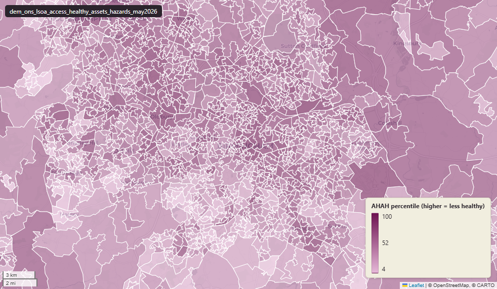

# ONS Access to Healthy Assets and Hazards (AHAH) composite index, May 2026

Access to Healthy Assets and Hazards (AHAH)

`dem_ons_lsoa_access_healthy_assets_hazards_may2026`

**SOURCE**

- Geographic Data Service (GeoDS), part of Smart Data Research UK, hosted by UCL, University of Liverpool, University of Oxford, and University of Edinburgh.
- Composite index built from inputs published by NHS Digital, NHS Scotland, NHS Organisation Data Service, Spatial Hub Scotland, DEFRA Pollution Climate Mapping, Sentinel-2 (via Google Earth Engine), OS Open Greenspace, OS Open Rivers, OpenStreetMap, the Local Data Company, and the ONS Postcode Directory.

**DOCUMENTATION**

- GeoDS AHAH dataset page : https://data.geods.ac.uk/dataset/access-to-healthy-assets-hazards-ahah
- Previous versions       : https://data.geods.ac.uk/dataset/access-to-healthy-assets-hazards-ahah-previous-versions
- Source code             : https://github.com/GeographicDataService/AHAH_V5
- Technical methodology   : ahah_v5_technical_methodology.pdf (loaded locally)
- Citation                : Daras K, Green MA, Davies A, Barr B, Singleton A (2019). Open data on health-related neighbourhood features in Great Britain. Scientific Data 6, 107. https://doi.org/10.1038/s41597-019-0114-6

**DEFINITIONS**

- AHAH is a multi-dimensional index measuring how 'healthy' a neighbourhood is, based on accessibility to health-promoting and health-damaging features of the built environment.
- Four domains: Retail environment (e.g. fast food, gambling outlets), Health services (e.g. GP surgeries, pharmacies, A&E), Physical environment (greenspace, blue space), and Air quality (NO2, PM10, SO2).

**SCOPE**

- Great Britain. 43,064 areas: LSOA 2021 codes (E01, W01) for England + Wales and Data Zone 2022 codes (S01*) for Scotland.
- Natural key: `lsoa21cd`. Geometry: small-area polygon from the GeoDS parquet geofile.

**CRS**

- EPSG:27700 (OSGB 1936 / British National Grid).

**LICENCE**

- UK Open Government Licence (OGL) v3.

**DATA QUALITY CAVEATS**

- Higher AHAH score / rank = less healthy environment.
- `rgn22cd` / `rgn22nm` are empty for Welsh and Scottish rows. Regions are an England-only geography.

**ENRICHMENT**

- `msoa21hclnm` — House of Commons Library readable MSOA name, joined at load on msoa21cd from House of Commons Library MSOA Names v2.3 (13 February 2026). Open Parliament Licence.
- Geography codes/names joined from uk_baseline.adm_ons_lsoa_boundary_2021 by `lsoa21cd`: lsoa21nm, msoa21cd, msoa21nm, wd22cd, wd22nm, lad22cd, lad22nm, rgn22cd, rgn22nm. NULL for Scottish rows.

**NOT IN THIS DATASET**

- Northern Ireland not included (publisher decision).
- Time-series — only the current cross-section is published; historical AHAH versions are separate datasets.

**LOADED INTO uk_baseline**

- Loaded by PNC, 28 May 2026.

## Columns

| Column | Type | Description / unit |
|---|---|---|
| `fid` | `integer` |  |
| `lsoa21cd` | `character varying` | Source field `lsoa21cd`. "Lower Super Output Area Code (2011) / Data Zones (Scotland)" (variable dictionary). Carries LSOA 2021 codes for England + Wales (E01*, W01*) and Data Zone 2022 codes for Scotland (S01*) per the publisher's convention. The literal text "(2011)" in the publisher's variable dictionary is a documentation error — codes are LSOA 2021. |
| `lsoa_dz_sdz_21_22` | `character varying` | Source field `LSOA_DZ_SDZ_21_22`. [UNDOCUMENTED] — present in the parquet geofile but absent from the publisher's variable dictionary. Carried forward by source name only; likely a geography-type tag. |
| `gp` | `double precision` | Source field `GP`. Unit: "Drive-time to nearest GP Practice (minutes)" (variable dictionary). |
| `bluespace` | `double precision` | Source field `bluespace`. Unit: "Drive-time to nearest Bluespace (minutes)" (variable dictionary). |
| `dentist` | `double precision` | Source field `dentist`. Unit: "Drive-time to nearest Dentist (minutes)" (variable dictionary). |
| `fast_food` | `double precision` | Source field `fast_food`. Unit: "Drive-time to nearest Fast Food Outlet (minutes)" (variable dictionary). |
| `gambling` | `double precision` | Source field `gambling`. Unit: "Drive-time to nearest Gambling Outlet (minutes)" (variable dictionary). |
| `greenspace_active` | `double precision` | Source field `greenspace_active`. Unit: "Drive-time to nearest Greenspace (minutes)" (variable dictionary). |
| `hospital` | `double precision` | Source field `hospital`. Unit: "Drive-time to nearest Hospital with A&E (minutes)" (variable dictionary). |
| `leisure` | `double precision` | Source field `leisure`. Unit: "Drive-time to nearest Leisure Centre (minutes)" (variable dictionary). |
| `pharmacy` | `double precision` | Source field `pharmacy`. Unit: "Drive-time to nearest Pharmacy (minutes)" (variable dictionary). |
| `pub_bar` | `double precision` | Source field `pub_bar`. Unit: "Drive-time to nearest Pubs/Bars/Nightclubs (minutes)" (variable dictionary). |
| `tobacco` | `double precision` | Source field `tobacco`. Unit: "Drive-time to nearest Vape Store / Tobacconists (minutes)" (variable dictionary). |
| `no2` | `double precision` | Source field `NO2`. Unit: "Annual mean Nitrogen Dioxide (ugm3)" (variable dictionary). |
| `pm10` | `double precision` | Source field `PM10`. Unit: "Annual mean Particulate Matter (ugm3)" (variable dictionary). |
| `so2` | `double precision` | Source field `SO2`. Unit: "Annual mean Sulphur Dioxide (ugm3)" (variable dictionary). |
| `greenspace` | `double precision` | Source field `greenspace`. Unit: "Median NDVI value indicating Passive Green Space" (variable dictionary). |
| `gp_rnk` | `bigint` | Source field `GP_rnk`; rank of the `gp` indicator across all 43,064 areas. Unit: "Index Ranked" (variable dictionary). |
| `dentist_rnk` | `bigint` | Source field `dentist_rnk`; rank of the `dentist` indicator across all 43,064 areas. Unit: "Index Ranked" (variable dictionary). |
| `pharmacy_rnk` | `bigint` | Source field `pharmacy_rnk`; rank of the `pharmacy` indicator across all 43,064 areas. Unit: "Index Ranked" (variable dictionary). |
| `hospital_rnk` | `bigint` | Source field `hospital_rnk`; rank of the `hospital` indicator across all 43,064 areas. Unit: "Index Ranked" (variable dictionary). |
| `leisure_rnk` | `bigint` | Source field `leisure_rnk`; rank of the `leisure` indicator across all 43,064 areas. Unit: "Index Ranked" (variable dictionary). |
| `greenspace_active_rnk` | `bigint` | Source field `greenspace_active_rnk`; rank of the `greenspace_active` indicator across all 43,064 areas. Unit: "Index Ranked" (variable dictionary). |
| `greenspace_rnk` | `bigint` | Source field `greenspace_rnk`; rank of the `greenspace` indicator across all 43,064 areas. Unit: "Index Ranked" (variable dictionary). |
| `bluespace_rnk` | `bigint` | Source field `bluespace_rnk`; rank of the `bluespace` indicator across all 43,064 areas. Unit: "Index Ranked" (variable dictionary). |
| `no2_rnk` | `bigint` | Source field `NO2_rnk`; rank of the `no2` indicator across all 43,064 areas. Unit: "Index Ranked" (variable dictionary). |
| `pm10_rnk` | `bigint` | Source field `PM10_rnk`; rank of the `pm10` indicator across all 43,064 areas. Unit: "Index Ranked" (variable dictionary). |
| `so2_rnk` | `bigint` | Source field `SO2_rnk`; rank of the `so2` indicator across all 43,064 areas. Unit: "Index Ranked" (variable dictionary). |
| `fast_food_rnk` | `bigint` | Source field `fast_food_rnk`; rank of the `fast_food` indicator across all 43,064 areas. Unit: "Index Ranked" (variable dictionary). |
| `gambling_rnk` | `bigint` | Source field `gambling_rnk`; rank of the `gambling` indicator across all 43,064 areas. Unit: "Index Ranked" (variable dictionary). |
| `pub_bar_rnk` | `bigint` | Source field `pub_bar_rnk`; rank of the `pub_bar` indicator across all 43,064 areas. Unit: "Index Ranked" (variable dictionary). |
| `tobacco_rnk` | `bigint` | Source field `tobacco_rnk`; rank of the `tobacco` indicator across all 43,064 areas. Unit: "Index Ranked" (variable dictionary). |
| `gp_pct` | `bigint` | Source field `GP_pct`; percentile of the `gp` indicator. Unit: "percentiles" (variable dictionary). |
| `dentist_pct` | `bigint` | Source field `dentist_pct`; percentile of the `dentist` indicator. Unit: "percentiles" (variable dictionary). |
| `pharmacy_pct` | `bigint` | Source field `pharmacy_pct`; percentile of the `pharmacy` indicator. Unit: "percentiles" (variable dictionary). |
| `hospital_pct` | `bigint` | Source field `hospital_pct`; percentile of the `hospital` indicator. Unit: "percentiles" (variable dictionary). |
| `leisure_pct` | `bigint` | Source field `leisure_pct`; percentile of the `leisure` indicator. Unit: "percentiles" (variable dictionary). |
| `greenspace_pct` | `bigint` | Source field `greenspace_pct`; percentile of the `greenspace` indicator. Unit: "percentiles" (variable dictionary). |
| `greenspace_active_pct` | `bigint` | Source field `greenspace_active_pct`; percentile of the `greenspace_active` indicator. Unit: "percentiles" (variable dictionary). |
| `bluespace_pct` | `bigint` | Source field `bluespace_pct`; percentile of the `bluespace` indicator. Unit: "percentiles" (variable dictionary). |
| `no2_pct` | `bigint` | Source field `NO2_pct`; percentile of the `no2` indicator. Unit: "percentiles" (variable dictionary). |
| `pm10_pct` | `bigint` | Source field `PM10_pct`; percentile of the `pm10` indicator. Unit: "percentiles" (variable dictionary). |
| `so2_pct` | `bigint` | Source field `SO2_pct`; percentile of the `so2` indicator. Unit: "percentiles" (variable dictionary). |
| `fast_food_pct` | `bigint` | Source field `fast_food_pct`; percentile of the `fast_food` indicator. Unit: "percentiles" (variable dictionary). |
| `gambling_pct` | `bigint` | Source field `gambling_pct`; percentile of the `gambling` indicator. Unit: "percentiles" (variable dictionary). |
| `pub_bar_pct` | `bigint` | Source field `pub_bar_pct`; percentile of the `pub_bar` indicator. Unit: "percentiles" (variable dictionary). |
| `tobacco_pct` | `bigint` | Source field `tobacco_pct`; percentile of the `tobacco` indicator. Unit: "percentiles" (variable dictionary). |
| `domain_h` | `double precision` | Source field `domain_h`. Unit: "Health Domain Score" (variable dictionary). |
| `domain_g` | `double precision` | Source field `domain_g`. Unit: "Green/Bluespace Domain Score" (variable dictionary). |
| `domain_e` | `double precision` | Source field `domain_e`. Unit: "Air Quality Domain Score" (variable dictionary). |
| `domain_r` | `double precision` | Source field `domain_r`. Unit: "Retail Domain Score" (variable dictionary). |
| `domain_h_rnk` | `bigint` | Source field `domain_h_rnk`; rank of the `domain_h` domain score across all 43,064 areas. Unit: "Index Ranked" (variable dictionary). |
| `domain_h_pct` | `bigint` | Source field `domain_h_pct`; percentile of the `domain_h` domain score. Unit: "percentiles" (variable dictionary). |
| `domain_g_rnk` | `bigint` | Source field `domain_g_rnk`; rank of the `domain_g` domain score across all 43,064 areas. Unit: "Index Ranked" (variable dictionary). |
| `domain_g_pct` | `bigint` | Source field `domain_g_pct`; percentile of the `domain_g` domain score. Unit: "percentiles" (variable dictionary). |
| `domain_e_rnk` | `bigint` | Source field `domain_e_rnk`; rank of the `domain_e` domain score across all 43,064 areas. Unit: "Index Ranked" (variable dictionary). |
| `domain_e_pct` | `bigint` | Source field `domain_e_pct`; percentile of the `domain_e` domain score. Unit: "percentiles" (variable dictionary). |
| `domain_r_rnk` | `bigint` | Source field `domain_r_rnk`; rank of the `domain_r` domain score across all 43,064 areas. Unit: "Index Ranked" (variable dictionary). |
| `domain_r_pct` | `bigint` | Source field `domain_r_pct`; percentile of the `domain_r` domain score. Unit: "percentiles" (variable dictionary). |
| `ahah` | `double precision` | Source field `ahah`. Unit: "Access to Healthy Assets and Hazards Index Score" (variable dictionary). |
| `ahah_rnk` | `bigint` | Source field `ahah_rnk`. Unit: "AHAH Index Ranked" (variable dictionary). |
| `ahah_pct` | `bigint` | Source field `ahah_pct`. Unit: "AHAH Index percentiles" (variable dictionary). |
| `lsoa21nm` | `character varying` | Joined at load from uk_baseline.adm_ons_lsoa_boundary_2021 by `lsoa21cd`; LSOA 2021 name. NULL for Scottish Data Zone rows. |
| `msoa21cd` | `character varying` | Joined at load from uk_baseline.adm_ons_lsoa_boundary_2021 by `lsoa21cd`; Middle Super Output Area 2021 code. NULL for Scottish Data Zone rows. |
| `msoa21nm` | `character varying` | Joined at load from uk_baseline.adm_ons_lsoa_boundary_2021 by `lsoa21cd`; Middle Super Output Area 2021 name. NULL for Scottish Data Zone rows. |
| `msoa11cd` | `character varying(9)` | Spatially joined at load from uk_baseline.adm_ons_msoa_boundary_2011, matching each area's representative point to the containing MSOA 2011 polygon; Middle Super Output Area 2011 code. NULL for Scottish Data Zone rows. |
| `msoa11nm` | `character varying(32)` | Spatially joined at load from uk_baseline.adm_ons_msoa_boundary_2011, matching each area's representative point to the containing MSOA 2011 polygon; Middle Super Output Area 2011 name. NULL for Scottish Data Zone rows. |
| `wd22cd` | `character varying` | Joined at load from uk_baseline.adm_ons_lsoa_boundary_2021 by `lsoa21cd`; Ward 2022 code. NULL for Scottish Data Zone rows. |
| `wd22nm` | `character varying` | Joined at load from uk_baseline.adm_ons_lsoa_boundary_2021 by `lsoa21cd`; Ward 2022 name. NULL for Scottish Data Zone rows. |
| `lad22cd` | `character varying` | Joined at load from uk_baseline.adm_ons_lsoa_boundary_2021 by `lsoa21cd`; Local Authority District 2022 code. NULL for Scottish Data Zone rows. |
| `lad22nm` | `character varying` | Joined at load from uk_baseline.adm_ons_lsoa_boundary_2021 by `lsoa21cd`; Local Authority District 2022 name. NULL for Scottish Data Zone rows. |
| `rgn22cd` | `character varying` | Joined at load from uk_baseline.adm_ons_lsoa_boundary_2021 by `lsoa21cd`; ONS Region 2022 code (England only — NULL for Wales and Scotland). |
| `rgn22nm` | `character varying` | Joined at load from uk_baseline.adm_ons_lsoa_boundary_2021 by `lsoa21cd`; ONS Region 2022 name (England only — NULL for Wales and Scotland). |
| `area_ha` | `double precision` | Area in hectares, computed at load from the geometry. Goes stale if geometry is subsequently edited. |
| `geom` | `geometry(MultiPolygon,27700)` | Polygon geometry from GeoDS parquet geofile ahah_v5_geo_1.parquet. |
| `msoa21hclnm` | `text` | House of Commons Library readable MSOA name. Source field `msoa21hclnm` from House of Commons Library MSOA Names v2.3 (13 February 2026), joined at load on msoa21cd. Open Parliament Licence. |
