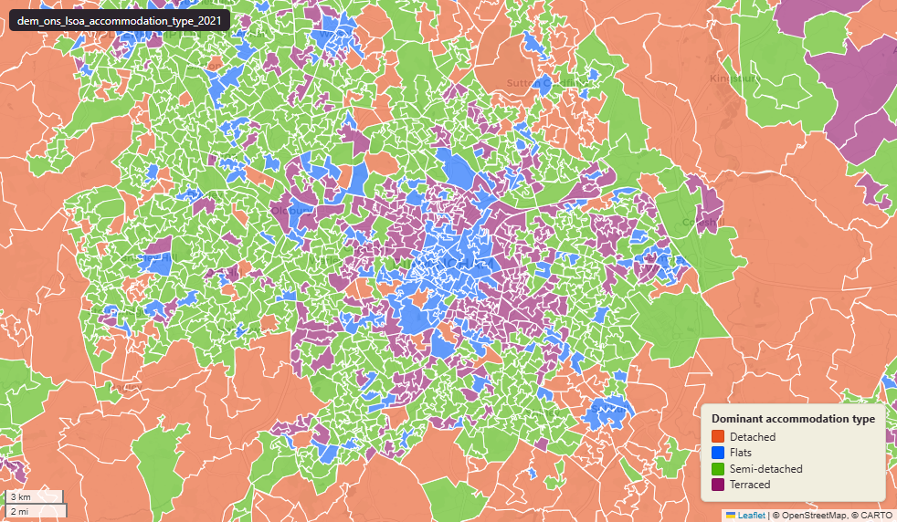

# ONS Census 2021 households-by-accommodation-type at Lower-layer Super Output Area (LSOA) 2021

Accommodation Type

`dem_ons_lsoa_accommodation_type_2021`

**SOURCE**

- Office for National Statistics (ONS), Census 2021, England and Wales. Table TS044 "Accommodation type". Reference date 21 March 2021. Loaded via an earlier Prior + Partners pass; original load pathway not recorded.

**DOCUMENTATION**

- ONS dataset (TS044) : https://www.ons.gov.uk/datasets/TS044/editions/2021/versions/1
- ONS Census 2021 landing page : https://www.ons.gov.uk/census/2021
- NOMIS bulk download : https://www.nomisweb.co.uk/sources/census_2021

**DEFINITIONS**

- "Classification of households by accommodation type." (ONS TS044 dataset description)
- Census 2021 categorises accommodation type as: detached; semi-detached; terraced; in a purpose-built block of flats or tenement; part of a converted or shared house, including bedsits; part of another converted building; in a commercial building; caravan or other mobile or temporary structure.
- "Census Day was 21 March 2021. The information collected in the census reflects the population of England and Wales on that day." (ONS Census 2021 landing page)

**SCOPE**

- England and Wales. LSOA 2021 boundary; 35,672 distinct lsoa21cd (no multipolygon explosion).
- Base population: households.

**CRS**

- EPSG:27700 (OSGB 1936 / British National Grid).

**LICENCE**

- Open Government Licence v3.0.

**DATA QUALITY CAVEATS**

- Column name spelling drift inherited from the earlier load: `dominant_accomodation_type_group` (typo: "accomodation" should be "accommodation").
- Column names `in_commercial building_count` / `_perc` contain a SPACE — use double-quoted identifiers in SQL.
- Two `fid` columns: uppercase `FID` (Esri export legacy) and lowercase `fid` (PostgreSQL surrogate). Both are pure surrogates; use either as a row key but not in joins.

**LOADED INTO uk_baseline**

- Data: Census Day 21 March 2021 (ONS TS044 publication 2022-2023).

## Columns

| Column | Type | Description / unit |
|---|---|---|
| `FID` | `bigint` |  |
| `lsoa21cd` | `text` | Source field "LSOA21CD"; ONS GSS 9-character LSOA 2021 code. |
| `lsoa21nm` | `text` | Source field "LSOA21NM"; human-readable LSOA 2021 name. |
| `geom` | `geometry(MultiPolygon,27700)` | MultiPolygon in EPSG:27700. Boundary geometry joined at load. |
| `msoa21cd` | `text` | Joined at load from ONS LSOA->MSOA lookup; 2021 MSOA GSS code. |
| `msoa21nm` | `text` | Joined at load from ONS LSOA->MSOA lookup; 2021 MSOA name. |
| `lad22cd` | `text` | Joined at load from ONS LSOA->LAD lookup; 2022 LAD GSS code. |
| `lad22nm` | `text` | Joined at load from ONS LSOA->LAD lookup; 2022 LAD name. |
| `rgn22cd` | `text` | Joined at load from ONS LSOA->Region lookup; 2022 Region GSS code. |
| `rgn22nm` | `text` | Joined at load from ONS LSOA->Region lookup; 2022 Region name. |
| `data_source` | `text` | Added during an earlier Prior + Partners loading pass. Fixed-string annotation; same value every row. |
| `data_resolution` | `text` | Added during an earlier Prior + Partners loading pass. Fixed-string annotation; same value every row. |
| `data_time_period` | `timestamp without time zone` | Added during an earlier Prior + Partners loading pass. Fixed annotation; same value every row. |
| `data_web_link` | `text` | Added during an earlier Prior + Partners loading pass. Fixed annotation; URL to the ONS dataset page. |
| `area_ha` | `double precision` | Area in hectares, computed at load from the geometry. Unit: hectares. Stale if geometry is later edited. |
| `detached_count` | `bigint` | Source field; count of "detached" in LSOA households. |
| `semi_detached_count` | `bigint` | Source field; count of "semi detached" in LSOA households. |
| `terraced_count` | `bigint` | Source field; count of "terraced" in LSOA households. |
| `in_a_purpose_built_block_of_flats_or_tenement_count` | `bigint` | Source field; count of "in a purpose built block of flats or tenement" in LSOA households. |
| `part_of_a_converted_or_shared_house_including_bedsits_count` | `bigint` | Source field; count of "part of a converted or shared house including bedsits" in LSOA households. |
| `part_of_another_converted_building_count` | `bigint` | Source field; count of "part of another converted building" in LSOA households. |
| `in_commercial building_count` | `bigint` | Source field; count of households in a commercial building. Column name has a space (use double-quoted identifier in SQL). |
| `caravan_or_other_mobile_or_temporary_structure_count` | `bigint` | Source field; count of "caravan or other mobile or temporary structure" in LSOA households. |
| `detached_perc` | `double precision` | Source field; percentage of "detached" in LSOA households. Unit: "percent (0 to 100)". |
| `semi_detached_perc` | `double precision` | Source field; percentage of "semi detached" in LSOA households. Unit: "percent (0 to 100)". |
| `terraced_perc` | `double precision` | Source field; percentage of "terraced" in LSOA households. Unit: "percent (0 to 100)". |
| `in_a_purpose_built_block_of_flats_or_tenement_perc` | `double precision` | Source field; percentage of "in a purpose built block of flats or tenement" in LSOA households. Unit: "percent (0 to 100)". |
| `part_of_a_converted_or_shared_house_including_bedsits_perc` | `double precision` | Source field; percentage of "part of a converted or shared house including bedsits" in LSOA households. Unit: "percent (0 to 100)". |
| `part_of_another_converted_building_perc` | `double precision` | Source field; percentage of "part of another converted building" in LSOA households. Unit: "percent (0 to 100)". |
| `in_commercial building_perc` | `double precision` | Source field; percentage of households in a commercial building. Unit: "percent (0 to 100)". Column name has a space. |
| `caravan_or_other_mobile_or_temporary_structure_perc` | `double precision` | Source field; percentage of "caravan or other mobile or temporary structure" in LSOA households. Unit: "percent (0 to 100)". |
| `dominant_accomodation_type_group` | `text` | Derived during an earlier Prior + Partners loading pass; label of the modal accommodation type for the LSOA. Note: column name preserves the upstream misspelling "accomodation" (should be "accommodation"). |
| `wd22cd` | `character varying` | Joined at load from ONS LSOA->Ward lookup; 2022 Ward GSS code. |
| `wd22nm` | `character varying` | Joined at load from ONS LSOA->Ward lookup; 2022 Ward name. |
| `fid` | `bigint` |  |
