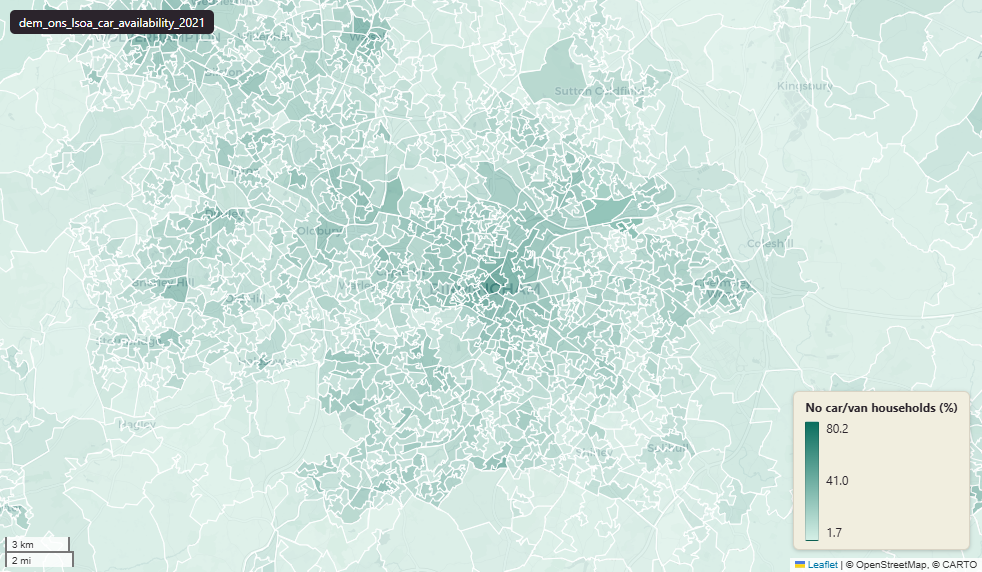

# ONS Census 2021 car or van availability at Lower-layer Super Output Area (LSOA) 2021

Car Availability

`dem_ons_lsoa_car_availability_2021`

**SOURCE**

- Office for National Statistics (ONS), Census 2021, England and Wales.

**DOCUMENTATION**

- ONS dataset (TS045) : https://www.ons.gov.uk/datasets/TS045/editions/2021/versions/1
- ONS Census 2021 landing page : https://www.ons.gov.uk/census/2021

**DEFINITIONS**

"The number of cars or vans that are owned, or available for use, by one or more members of a household." (ONS Census 2021 Car or van availability variable)

Includes:

- company cars and vans that are available for private use
- pick-ups, campers and motor homes

Excludes:

- motorbikes or scooters
- minibuses

**SCOPE**

- England and Wales.
- Base population: households.

**CRS**

- EPSG:27700 (OSGB 1936 / British National Grid).

**LICENCE**

- Open Government Licence v3.0.

**DATA QUALITY CAVEATS**

- "Does not apply" means the response refers to households whose head was visiting or who otherwise fell outside the response frame.

**ENRICHMENT**

- `msoa21hclnm` — House of Commons Library readable MSOA name, joined at load on msoa21cd from House of Commons Library MSOA Names v2.3 (13 February 2026). Open Parliament Licence.

**LOADED INTO uk_baseline**

- Data: Census Day 21 March 2021 (ONS TS045 publication 2022).

## Columns

| Column | Type | Description / unit |
|---|---|---|
| `id` | `bigint` | Source identifier preserved at load; row identifier. |
| `lsoa21cd` | `text` | Source field "LSOA21CD"; ONS GSS 9-character LSOA 2021 code. |
| `lsoa21nm` | `text` | Source field "LSOA21NM"; human-readable LSOA 2021 name. |
| `msoa21cd` | `text` | Joined at load from ONS LSOA->MSOA lookup; 2021 MSOA GSS code. |
| `msoa21nm` | `text` | Joined at load from ONS LSOA->MSOA lookup; 2021 MSOA name. |
| `lad22cd` | `text` | Joined at load from ONS LSOA->LAD lookup; 2022 LAD GSS code. |
| `lad22nm` | `text` | Joined at load from ONS LSOA->LAD lookup; 2022 LAD name. |
| `wd21cd` | `text` | Joined at load from ONS LSOA->Ward lookup; 2021 Ward GSS code. |
| `wd21nm` | `text` | Joined at load from ONS LSOA->Ward lookup; 2021 Ward name. |
| `1 or more cars or vans in household` | `bigint` | Source field; count of households with 1 or more cars or vans in household. |
| `Does not apply` | `bigint` | Source field; count of households where the question does not apply. |
| `No cars or vans in household` | `bigint` | Source field; count of households with no cars or vans in household. |
| `1 or more cars or vans in household _perc` | `double precision` | Source field; percentage of households with 1 or more cars or vans in household. Unit: "percent (0 to 100)". Note: column name has a trailing space before _perc. |
| `Does not apply _perc` | `double precision` | Source field; percentage of households where the question does not apply. Unit: "percent (0 to 100)". |
| `No cars or vans in household _perc` | `double precision` | Source field; percentage of households with no cars or vans in household. Unit: "percent (0 to 100)". |
| `geom` | `geometry(MultiPolygon,27700)` | MultiPolygon in EPSG:27700. Boundary geometry joined at load. |
| `wd22cd` | `character varying` | Joined at load from ONS LSOA->Ward lookup; 2022 Ward GSS code. |
| `wd22nm` | `character varying` | Joined at load from ONS LSOA->Ward lookup; 2022 Ward name. |
| `fid` | `bigint` |  |
| `msoa21hclnm` | `text` | House of Commons Library readable MSOA name. Source field `msoa21hclnm` from House of Commons Library MSOA Names v2.3 (13 February 2026), joined at load on msoa21cd. Open Parliament Licence. |
