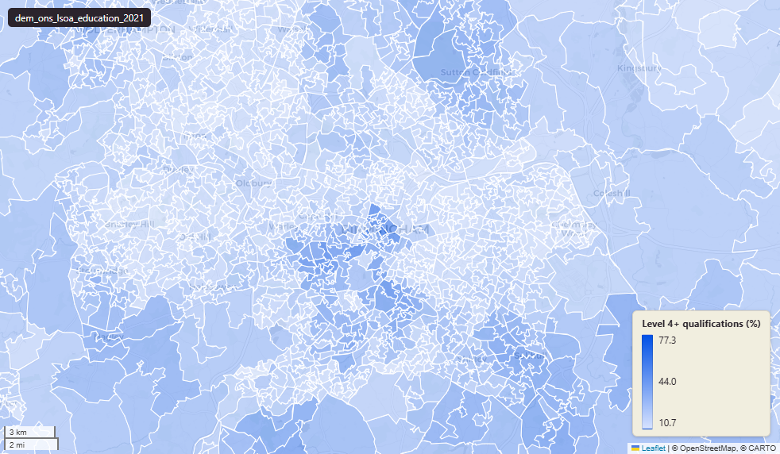

# ONS Census 2021 highest level of qualification at Lower-layer Super Output Area (LSOA) 2021

Census 2021 Education - highest level of qualification

`dem_ons_lsoa_education_2021`

**SOURCE**

- Office for National Statistics (ONS), Census 2021, England and Wales.

**DOCUMENTATION**

- ONS dataset (TS067) : https://www.ons.gov.uk/datasets/TS067/editions/2021/versions/2
- ONS Census 2021 landing page : https://www.ons.gov.uk/census/2021

**DEFINITIONS**

- "The highest level of qualification of usual residents aged 16 years and over. Levels are categorised based on the formal qualifications gained." (ONS Census 2021 Highest level of qualification variable)

Level definitions (ONS):

- No qualifications
- Level 1: 1 to 4 GCSEs grade A* to C or 9 to 4 / Entry Level / Foundation Diploma
- Level 2: 5 or more GCSEs grade A* to C or 9 to 4 / O Level passes / Intermediate apprenticeship
- Apprenticeship
- Level 3: 2 or more A Levels / NVQ Level 3 / Advanced apprenticeship
- Level 4 or above: degree (BA, BSc), higher degree (MA, PhD, PGCE), NVQ Level 4 to 5, HNC, HND, RSA Higher Diploma, BTEC Higher level, professional qualifications
- Other: vocational or work-related qualifications, foreign qualifications not stated

**SCOPE**

- England and Wales.
- Base population: usual residents aged 16 years and over.

**CRS**

- EPSG:27700 (OSGB 1936 / British National Grid).

**LICENCE**

- Open Government Licence v3.0.

**DATA QUALITY CAVEATS**

- Base population is age 16+, NOT all residents. To convert to all-residents %, divide by total_population (from a separate table) not by the same-row total.

**ENRICHMENT**

- `msoa21hclnm` — House of Commons Library readable MSOA name, joined at load on msoa21cd from House of Commons Library MSOA Names v2.3 (13 February 2026). Open Parliament Licence.

**LOADED INTO uk_baseline**

- Data: Census Day 21 March 2021.

## Columns

| Column | Type | Description / unit |
|---|---|---|
| `FID` | `bigint` |  |
| `lsoa21cd` | `text` | Source field "LSOA21CD"; ONS GSS 9-character LSOA 2021 code. |
| `lsoa21nm` | `text` | Source field "LSOA21NM"; human-readable LSOA 2021 name. |
| `geom` | `geometry(MultiPolygon,27700)` | MultiPolygon in EPSG:27700. Boundary geometry joined at load. |
| `msoa21cd` | `text` | Joined at load from ONS LSOA->MSOA lookup; 2021 MSOA GSS code. |
| `msoa21nm` | `text` | Joined at load from ONS LSOA->MSOA lookup; 2021 MSOA name. |
| `lad22cd` | `text` | Local Authority District 2022 code, best-fit assigned from the feature's Middle Layer Super Output Area (MSOA) 2021 code. The 2022 reference is the 2021 LAD geography that the MSOA 2021 names are scoped to. Joined at load from the ONS MSOA (2021) to LAD (2022) best-fit lookup on msoa21cd. Open Government Licence v3.0. |
| `lad22nm` | `text` | Local Authority District 2022 name, best-fit assigned from the feature's MSOA 2021 code (the 2021 LAD geography matching the MSOA 2021 name scoping). Joined at load from the ONS MSOA (2021) to LAD (2022) best-fit lookup on msoa21cd. Open Government Licence v3.0. |
| `rgn22cd` | `text` | Joined at load from ONS LSOA->Region lookup; 2022 Region GSS code. |
| `rgn22nm` | `text` | Joined at load from ONS LSOA->Region lookup; 2022 Region name. |
| `data_source` | `text` | Added during an earlier Prior + Partners loading pass. Fixed-string annotation; same value every row. |
| `data_resolution` | `text` | Added during an earlier Prior + Partners loading pass. Fixed-string annotation; same value every row. |
| `data_time_period` | `timestamp without time zone` | Added during an earlier Prior + Partners loading pass. Fixed annotation; same value every row. |
| `data_web_link` | `text` | Added during an earlier Prior + Partners loading pass. Fixed annotation; URL to the ONS dataset page. |
| `area_ha` | `double precision` | Area in hectares, computed at load from the geometry. Unit: hectares. Stale if geometry is later edited. |
| `no_qualifications_count` | `bigint` | Source field; count of "no qualifications" in LSOA usual residents aged 16+. |
| `level_1_and_entry_level_qualifications_count` | `bigint` | Source field; count of "level 1 and entry level qualifications" in LSOA usual residents aged 16+. |
| `level_2_qualifications_count` | `bigint` | Source field; count of "level 2 qualifications" in LSOA usual residents aged 16+. |
| `apprenticeship_count` | `bigint` | Source field; count of "apprenticeship" in LSOA usual residents aged 16+. |
| `level_3_qualifications_count` | `bigint` | Source field; count of "level 3 qualifications" in LSOA usual residents aged 16+. |
| `level_4_qualifications_or_above_count` | `bigint` | Source field; count of "level 4 qualifications or above" in LSOA usual residents aged 16+. |
| `other_qualifications_count` | `bigint` | Source field; count of "other qualifications" in LSOA usual residents aged 16+. |
| `total_edu_pop_count` | `bigint` | Source field; count of "total edu pop" in LSOA usual residents aged 16+. |
| `no_qualifications_perc` | `double precision` | Source field; percentage of "no qualifications" in LSOA usual residents aged 16+. Unit: "percent (0 to 100)". |
| `level_1_and_entry_level_qualifications_perc` | `double precision` | Source field; percentage of "level 1 and entry level qualifications" in LSOA usual residents aged 16+. Unit: "percent (0 to 100)". |
| `level_2_qualifications_perc` | `double precision` | Source field; percentage of "level 2 qualifications" in LSOA usual residents aged 16+. Unit: "percent (0 to 100)". |
| `apprenticeship_perc` | `double precision` | Source field; percentage of "apprenticeship" in LSOA usual residents aged 16+. Unit: "percent (0 to 100)". |
| `level_3_qualifications_perc` | `double precision` | Source field; percentage of "level 3 qualifications" in LSOA usual residents aged 16+. Unit: "percent (0 to 100)". |
| `level_4_qualifications_or_above_perc` | `double precision` | Source field; percentage of "level 4 qualifications or above" in LSOA usual residents aged 16+. Unit: "percent (0 to 100)". |
| `other_qualifications_perc` | `double precision` | Source field; percentage of "other qualifications" in LSOA usual residents aged 16+. Unit: "percent (0 to 100)". |
| `no_qualifications_female_count` | `bigint` | Source field; count of "no qualifications female" in LSOA usual residents aged 16+. |
| `level_1_and_entry_level_qualifications_female_count` | `bigint` | Source field; count of "level 1 and entry level qualifications female" in LSOA usual residents aged 16+. |
| `level_2_qualifications_female_count` | `bigint` | Source field; count of "level 2 qualifications female" in LSOA usual residents aged 16+. |
| `apprenticeship_female_count` | `bigint` | Source field; count of "apprenticeship female" in LSOA usual residents aged 16+. |
| `level_3_qualifications_female_count` | `bigint` | Source field; count of "level 3 qualifications female" in LSOA usual residents aged 16+. |
| `level_4_qualifications_or_above_female_count` | `bigint` | Source field; count of "level 4 qualifications or above female" in LSOA usual residents aged 16+. |
| `other_qualifications_female_count` | `bigint` | Source field; count of "other qualifications female" in LSOA usual residents aged 16+. |
| `total_female_edu_pop_count` | `bigint` | Source field; count of "total female edu pop" in LSOA usual residents aged 16+. |
| `no_qualifications_female_perc` | `double precision` | Source field; percentage of "no qualifications female" in LSOA usual residents aged 16+. Unit: "percent (0 to 100)". |
| `level_1_and_entry_level_qualifications_female_perc` | `double precision` | Source field; percentage of "level 1 and entry level qualifications female" in LSOA usual residents aged 16+. Unit: "percent (0 to 100)". |
| `level_2_qualifications_female_perc` | `double precision` | Source field; percentage of "level 2 qualifications female" in LSOA usual residents aged 16+. Unit: "percent (0 to 100)". |
| `apprenticeship_female_perc` | `double precision` | Source field; percentage of "apprenticeship female" in LSOA usual residents aged 16+. Unit: "percent (0 to 100)". |
| `level_3_qualifications_female_perc` | `double precision` | Source field; percentage of "level 3 qualifications female" in LSOA usual residents aged 16+. Unit: "percent (0 to 100)". |
| `level_4_qualifications_or_above_female_perc` | `double precision` | Source field; percentage of "level 4 qualifications or above female" in LSOA usual residents aged 16+. Unit: "percent (0 to 100)". |
| `other_qualifications_female_perc` | `double precision` | Source field; percentage of "other qualifications female" in LSOA usual residents aged 16+. Unit: "percent (0 to 100)". |
| `no_qualifications_male_count` | `bigint` | Source field; count of "no qualifications male" in LSOA usual residents aged 16+. |
| `level_1_and_entry_level_qualifications_male_count` | `bigint` | Source field; count of "level 1 and entry level qualifications male" in LSOA usual residents aged 16+. |
| `level_2_qualifications_male_count` | `bigint` | Source field; count of "level 2 qualifications male" in LSOA usual residents aged 16+. |
| `apprenticeship_male_count` | `bigint` | Source field; count of "apprenticeship male" in LSOA usual residents aged 16+. |
| `level_3_qualifications_male_count` | `bigint` | Source field; count of "level 3 qualifications male" in LSOA usual residents aged 16+. |
| `level_4_qualifications_or_above_male_count` | `bigint` | Source field; count of "level 4 qualifications or above male" in LSOA usual residents aged 16+. |
| `other_qualifications_male_count` | `bigint` | Source field; count of "other qualifications male" in LSOA usual residents aged 16+. |
| `total_male_edu_pop_count` | `bigint` | Source field; count of "total male edu pop" in LSOA usual residents aged 16+. |
| `no_qualifications_male_perc` | `double precision` | Source field; percentage of "no qualifications male" in LSOA usual residents aged 16+. Unit: "percent (0 to 100)". |
| `level_1_and_entry_level_qualifications_male_perc` | `double precision` | Source field; percentage of "level 1 and entry level qualifications male" in LSOA usual residents aged 16+. Unit: "percent (0 to 100)". |
| `level_2_qualifications_male_perc` | `double precision` | Source field; percentage of "level 2 qualifications male" in LSOA usual residents aged 16+. Unit: "percent (0 to 100)". |
| `apprenticeship_male_perc` | `double precision` | Source field; percentage of "apprenticeship male" in LSOA usual residents aged 16+. Unit: "percent (0 to 100)". |
| `level_3_qualifications_male_perc` | `double precision` | Source field; percentage of "level 3 qualifications male" in LSOA usual residents aged 16+. Unit: "percent (0 to 100)". |
| `level_4_qualifications_or_above_male_perc` | `double precision` | Source field; percentage of "level 4 qualifications or above male" in LSOA usual residents aged 16+. Unit: "percent (0 to 100)". |
| `other_qualifications_male_perc` | `double precision` | Source field; percentage of "other qualifications male" in LSOA usual residents aged 16+. Unit: "percent (0 to 100)". |
| `dominant_education_group` | `text` | Derived during an earlier Prior + Partners loading pass; label of the modal category for this LSOA. |
| `dominant_education_group_female` | `text` | Added during an earlier Prior + Partners loading pass. Label of the modal highest-qualification category among female usual residents aged 16+ in the LSOA. |
| `dominant_education_group_male` | `text` | Added during an earlier Prior + Partners loading pass. Label of the modal highest-qualification category among male usual residents aged 16+ in the LSOA. |
| `wd22cd` | `character varying` | Joined at load from ONS LSOA->Ward lookup; 2022 Ward GSS code. |
| `wd22nm` | `character varying` | Joined at load from ONS LSOA->Ward lookup; 2022 Ward name. |
| `fid` | `bigint` |  |
| `msoa21hclnm` | `text` | House of Commons Library readable MSOA name. Source field `msoa21hclnm` from House of Commons Library MSOA Names v2.3 (13 February 2026), joined at load on msoa21cd. Open Parliament Licence. |
| `lad25cd` | `text` | Local Authority District 2025 code (current administering authority), best-fit assigned from the feature's MSOA 2021 code. Joined at load from the ONS MSOA (2021) to Ward (2025) to LAD (2025) best-fit lookup on msoa21cd. Open Government Licence v3.0. |
| `lad25nm` | `text` | Local Authority District 2025 name (current administering authority), best-fit assigned from the feature's MSOA 2021 code. Joined at load from the ONS MSOA (2021) to Ward (2025) to LAD (2025) best-fit lookup on msoa21cd. Open Government Licence v3.0. |
