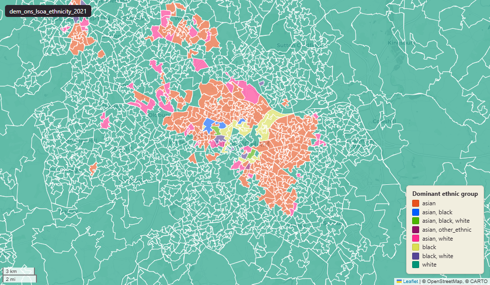

# ONS Census 2021 ethnic group at Lower-layer Super Output Area (LSOA) 2021

`dem_ons_lsoa_ethnicity_2021`

<a href="http://localhost:7800/?layer=uk_baseline.dem_ons_lsoa_ethnicity_2021" target="_blank" rel="noopener">Open in the Dashboard &#8599;</a> (start your local Dashboard first)

**SOURCE**

- Office for National Statistics (ONS), Census 2021, England and Wales. Table TS021 "Ethnic group". Reference date 21 March 2021. Loaded via an earlier Prior + Partners pass.

**DOCUMENTATION**

- ONS dataset (TS021) : https://www.ons.gov.uk/datasets/TS021/editions/2021/versions/1
- ONS Census 2021 landing page : https://www.ons.gov.uk/census/2021

**DEFINITIONS**

- "The ethnic group that a person feels they belong to. This could be based on their culture, family background, identity or physical appearance. Respondents could choose one option from the tick-box list, or write in their ethnicity." (ONS Census 2021 Ethnic group variable)
- 19 detailed categories grouped into 5 high-level categories: "Asian, Asian British or Asian Welsh"; "Black, Black British, Black Welsh, Caribbean or African"; "Mixed or Multiple ethnic groups"; "White"; "Other ethnic group".

**SCOPE**

- England and Wales. LSOA 2021 boundary; 35,672 distinct lsoa21cd.
- Base population: all usual residents.

**CRS**

- EPSG:27700. Open Government Licence v3.0.

**LOADED INTO uk_baseline**

- Data: Census Day 21 March 2021.

## Columns

| Column | Type | Description / unit |
|---|---|---|
| `FID` | `bigint` |  |
| `lsoa21cd` | `text` | Source field "LSOA21CD"; ONS GSS 9-character LSOA 2021 code. |
| `lsoa21nm` | `text` | Source field "LSOA21NM"; human-readable LSOA 2021 name. |
| `geom` | `geometry(MultiPolygon,27700)` | MultiPolygon in EPSG:27700. Boundary geometry joined at load. |
| `msoa21cd` | `text` | Joined at load from ONS LSOA->MSOA lookup; 2021 MSOA GSS code. |
| `msoa21nm` | `text` | Joined at load from ONS LSOA->MSOA lookup; 2021 MSOA name. |
| `lad22cd` | `text` | Joined at load from ONS LSOA->LAD lookup; 2022 LAD GSS code. |
| `lad22nm` | `text` | Joined at load from ONS LSOA->LAD lookup; 2022 LAD name. |
| `rgn22cd` | `text` | Joined at load from ONS LSOA->Region lookup; 2022 Region GSS code. |
| `rgn22nm` | `text` | Joined at load from ONS LSOA->Region lookup; 2022 Region name. |
| `data_source` | `text` | Added during an earlier Prior + Partners loading pass. Fixed-string annotation; same value every row. |
| `data_resolution` | `text` | Added during an earlier Prior + Partners loading pass. Fixed-string annotation; same value every row. |
| `data_time_period` | `timestamp without time zone` | Added during an earlier Prior + Partners loading pass. Fixed annotation; same value every row. |
| `data_web_link` | `text` | Added during an earlier Prior + Partners loading pass. Fixed annotation; URL to the ONS dataset page. |
| `area_ha` | `double precision` | Area in hectares, computed at load from the geometry. Unit: hectares. Stale if geometry is later edited. |
| `asian_count` | `bigint` | Source field; count of "asian" in LSOA usual residents. |
| `black_count` | `bigint` | Source field; count of "black" in LSOA usual residents. |
| `mixed_or_multiple_count` | `bigint` | Source field; count of "mixed or multiple" in LSOA usual residents. |
| `other_ethnic_count` | `bigint` | Source field; count of "other ethnic" in LSOA usual residents. |
| `white_count` | `bigint` | Source field; count of "white" in LSOA usual residents. |
| `asian_perc` | `double precision` | Source field; percentage of "asian" in LSOA usual residents. Unit: "percent (0 to 100)". |
| `black_perc` | `double precision` | Source field; percentage of "black" in LSOA usual residents. Unit: "percent (0 to 100)". |
| `mixed_or_multiple_perc` | `double precision` | Source field; percentage of "mixed or multiple" in LSOA usual residents. Unit: "percent (0 to 100)". |
| `other_ethnic_perc` | `double precision` | Source field; percentage of "other ethnic" in LSOA usual residents. Unit: "percent (0 to 100)". |
| `white_perc` | `double precision` | Source field; percentage of "white" in LSOA usual residents. Unit: "percent (0 to 100)". |
| `asian_bangladeshi_count` | `bigint` | Source field; count of "asian bangladeshi" in LSOA usual residents. |
| `asian_chinese_count` | `bigint` | Source field; count of "asian chinese" in LSOA usual residents. |
| `asian_indian_count` | `bigint` | Source field; count of "asian indian" in LSOA usual residents. |
| `asian_other_count` | `bigint` | Source field; count of "asian other" in LSOA usual residents. |
| `asian_pakistani_count` | `bigint` | Source field; count of "asian pakistani" in LSOA usual residents. |
| `black_african_count` | `bigint` | Source field; count of "black african" in LSOA usual residents. |
| `black_caribbean_count` | `bigint` | Source field; count of "black caribbean" in LSOA usual residents. |
| `black_other_count` | `bigint` | Source field; count of "black other" in LSOA usual residents. |
| `mixed_or_multiple_other_count` | `bigint` | Source field; count of "mixed or multiple other" in LSOA usual residents. |
| `mixed_or_multiple_white_and_asian_count` | `bigint` | Source field; count of "mixed or multiple white and asian" in LSOA usual residents. |
| `mixed_or_multiple_white_and_black_african_count` | `bigint` | Source field; count of "mixed or multiple white and black african" in LSOA usual residents. |
| `mixed_or_multiple_white_and_black_caribbean_count` | `bigint` | Source field; count of "mixed or multiple white and black caribbean" in LSOA usual residents. |
| `other_other_count` | `bigint` | Source field; count of "other other" in LSOA usual residents. |
| `other_arab_count` | `bigint` | Source field; count of "other arab" in LSOA usual residents. |
| `white_british_count` | `bigint` | Source field; count of "white british" in LSOA usual residents. |
| `white_gypsy_or_irish_count` | `bigint` | Source field; count of "white gypsy or irish" in LSOA usual residents. |
| `white_irish_count` | `bigint` | Source field; count of "white irish" in LSOA usual residents. |
| `white_other_count` | `bigint` | Source field; count of "white other" in LSOA usual residents. |
| `white_roma_count` | `bigint` | Source field; count of "white roma" in LSOA usual residents. |
| `total_ethnicity_pop` | `bigint` | Source field; base denominator for the percentages in this layer. |
| `asian_bangladeshi_perc` | `double precision` | Source field; percentage of "asian bangladeshi" in LSOA usual residents. Unit: "percent (0 to 100)". |
| `asian_chinese_perc` | `double precision` | Source field; percentage of "asian chinese" in LSOA usual residents. Unit: "percent (0 to 100)". |
| `asian_indian_perc` | `double precision` | Source field; percentage of "asian indian" in LSOA usual residents. Unit: "percent (0 to 100)". |
| `asian_other_perc` | `double precision` | Source field; percentage of "asian other" in LSOA usual residents. Unit: "percent (0 to 100)". |
| `asian_pakistani_perc` | `double precision` | Source field; percentage of "asian pakistani" in LSOA usual residents. Unit: "percent (0 to 100)". |
| `black_african_perc` | `double precision` | Source field; percentage of "black african" in LSOA usual residents. Unit: "percent (0 to 100)". |
| `black_caribbean_perc` | `double precision` | Source field; percentage of "black caribbean" in LSOA usual residents. Unit: "percent (0 to 100)". |
| `black_other_perc` | `double precision` | Source field; percentage of "black other" in LSOA usual residents. Unit: "percent (0 to 100)". |
| `mixed_or_multiple_other_perc` | `double precision` | Source field; percentage of "mixed or multiple other" in LSOA usual residents. Unit: "percent (0 to 100)". |
| `mixed_or_multiple_white_and_asian_perc` | `double precision` | Source field; percentage of "mixed or multiple white and asian" in LSOA usual residents. Unit: "percent (0 to 100)". |
| `mixed_or_multiple_white_and_black_african_perc` | `double precision` | Source field; percentage of "mixed or multiple white and black african" in LSOA usual residents. Unit: "percent (0 to 100)". |
| `mixed_or_multiple_white_and_black_caribbean_perc` | `double precision` | Source field; percentage of "mixed or multiple white and black caribbean" in LSOA usual residents. Unit: "percent (0 to 100)". |
| `other_other_perc` | `double precision` | Source field; percentage of "other other" in LSOA usual residents. Unit: "percent (0 to 100)". |
| `other_arab_perc` | `double precision` | Source field; percentage of "other arab" in LSOA usual residents. Unit: "percent (0 to 100)". |
| `white_british_perc` | `double precision` | Source field; percentage of "white british" in LSOA usual residents. Unit: "percent (0 to 100)". |
| `white_gypsy_or_irish_perc` | `double precision` | Source field; percentage of "white gypsy or irish" in LSOA usual residents. Unit: "percent (0 to 100)". |
| `white_irish_perc` | `double precision` | Source field; percentage of "white irish" in LSOA usual residents. Unit: "percent (0 to 100)". |
| `white_other_perc` | `double precision` | Source field; percentage of "white other" in LSOA usual residents. Unit: "percent (0 to 100)". |
| `white_roma_perc` | `double precision` | Source field; percentage of "white roma" in LSOA usual residents. Unit: "percent (0 to 100)". |
| `dominant_ethnic_group` | `text` | Derived during an earlier Prior + Partners loading pass; label of the modal category for this LSOA. |
| `dominant_detailed_ethnic_group` | `text` | Derived during an earlier Prior + Partners loading pass; label of the modal category for this LSOA. |
| `wd22cd` | `character varying` | Joined at load from ONS LSOA->Ward lookup; 2022 Ward GSS code. |
| `wd22nm` | `character varying` | Joined at load from ONS LSOA->Ward lookup; 2022 Ward name. |
| `fid` | `bigint` |  |
