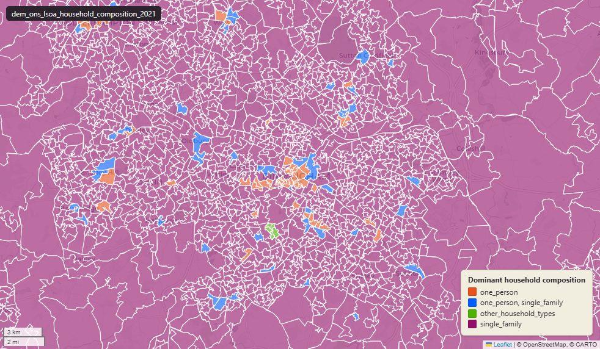

# ONS Census 2021 household composition at Lower-layer Super Output Area (LSOA) 2021

Census 2021 Household Composition

`dem_ons_lsoa_household_composition_2021`

**SOURCE**

- Office for National Statistics (ONS), Census 2021, England and Wales.

**DOCUMENTATION**

- ONS dataset (TS003) : https://www.ons.gov.uk/datasets/TS003/editions/2021/versions/4
- ONS Census 2021 landing page : https://www.ons.gov.uk/census/2021

**DEFINITIONS**

- "Classifies households according to the relationships between the household members." (ONS Census 2021 Household composition variable)
- Dependent children definition: aged 0-15, or aged 16-18 in full-time education and living with parent(s).

A household containing at least one married couple is classified as a married couple household:

- with or without dependent children
- regardless of the presence of any other person
- except where that other person is part of another couple

**SCOPE**

- England and Wales.
- Base population: households.

**CRS**

- EPSG:27700. Open Government Licence v3.0.

**ENRICHMENT**

- `msoa21hclnm` — House of Commons Library readable MSOA name, joined at load on msoa21cd from House of Commons Library MSOA Names v2.3 (13 February 2026). Open Parliament Licence.

**LOADED INTO uk_baseline**

- Data: Census Day 21 March 2021.

## Columns

| Column | Type | Description / unit |
|---|---|---|
| `FID` | `bigint` |  |
| `lsoa21cd` | `text` | Source field "LSOA21CD"; ONS GSS 9-character LSOA 2021 code. |
| `lsoa21nm` | `text` | Source field "LSOA21NM"; human-readable LSOA 2021 name. |
| `geom` | `geometry(MultiPolygon,27700)` | MultiPolygon in EPSG:27700. Boundary geometry joined at load. |
| `msoa21cd` | `text` | Joined at load from ONS LSOA->MSOA lookup; 2021 MSOA GSS code. |
| `msoa21nm` | `text` | Joined at load from ONS LSOA->MSOA lookup; 2021 MSOA name. |
| `lad22cd` | `text` | Local Authority District 2022 code, best-fit assigned from the feature's Middle Layer Super Output Area (MSOA) 2021 code. The 2022 reference is the 2021 LAD geography that the MSOA 2021 names are scoped to. Joined at load from the ONS MSOA (2021) to LAD (2022) best-fit lookup on msoa21cd. Open Government Licence v3.0. |
| `lad22nm` | `text` | Local Authority District 2022 name, best-fit assigned from the feature's MSOA 2021 code (the 2021 LAD geography matching the MSOA 2021 name scoping). Joined at load from the ONS MSOA (2021) to LAD (2022) best-fit lookup on msoa21cd. Open Government Licence v3.0. |
| `rgn22cd` | `text` | Joined at load from ONS LSOA->Region lookup; 2022 Region GSS code. |
| `rgn22nm` | `text` | Joined at load from ONS LSOA->Region lookup; 2022 Region name. |
| `data_source` | `text` | Added during an earlier Prior + Partners loading pass. Fixed-string annotation; same value every row. |
| `data_resolution` | `text` | Added during an earlier Prior + Partners loading pass. Fixed-string annotation; same value every row. |
| `data_time_period` | `timestamp without time zone` | Added during an earlier Prior + Partners loading pass. Fixed annotation; same value every row. |
| `data_web_link` | `text` | Added during an earlier Prior + Partners loading pass. Fixed annotation; URL to the ONS dataset page. |
| `area_ha` | `double precision` | Area in hectares, computed at load from the geometry. Unit: hectares. Stale if geometry is later edited. |
| `one_person_count` | `bigint` | Source field; count of "one person" in LSOA households. |
| `single_family_count` | `bigint` | Source field; count of "single family" in LSOA households. |
| `other_household_types_count` | `bigint` | Source field; count of "other household types" in LSOA households. |
| `one_person_perc` | `double precision` | Source field; percentage of "one person" in LSOA households. Unit: "percent (0 to 100)". |
| `single_family_perc` | `double precision` | Source field; percentage of "single family" in LSOA households. Unit: "percent (0 to 100)". |
| `other_household_types_perc` | `double precision` | Source field; percentage of "other household types" in LSOA households. Unit: "percent (0 to 100)". |
| `one_person_aged_66_years_and_over_count` | `bigint` | Source field; count of "one person aged 66 years and over" in LSOA households. |
| `one_person_other_count` | `bigint` | Source field; count of "one person other" in LSOA households. |
| `single_family_all_aged_66_years_and_over_count` | `bigint` | Source field; count of "single family all aged 66 years and over" in LSOA households. |
| `single_family_married_or_civil_partnership_count` | `bigint` | Source field; count of "single family married or civil partnership" in LSOA households. |
| `single_family_married_or_civil_partnership_no_children_count` | `bigint` | Source field; count of "single family married or civil partnership no children" in LSOA households. |
| `single_family_married_or_civil_partnership_dependant_children_c` | `bigint` | Source field; count of single-family households with a married or civil partnership couple and dependent children. Column name truncated at 63 characters (PostgreSQL identifier limit) — original suffix would be "_count". |
| `single_family_married_or_civil_partnership_nondep_children_coun` | `bigint` | Source field; count of single-family households with a married or civil partnership couple and non-dependent children only. Column name truncated at 63 characters — original suffix would be "_count". |
| `single_family_cohabiting_count` | `bigint` | Source field; count of "single family cohabiting" in LSOA households. |
| `single_family_cohabiting_no_children_count` | `bigint` | Source field; count of "single family cohabiting no children" in LSOA households. |
| `single_family_cohabiting_dependant_children_count` | `bigint` | Source field; count of "single family cohabiting dependant children" in LSOA households. |
| `single_family_cohabiting_nondep_children_count` | `bigint` | Source field; count of "single family cohabiting nondep children" in LSOA households. |
| `single_family_lone_parent_count` | `bigint` | Source field; count of "single family lone parent" in LSOA households. |
| `single_family_lone_parent_dependant_children_count` | `bigint` | Source field; count of "single family lone parent dependant children" in LSOA households. |
| `single_family_lone_parent_nondep_children_count` | `bigint` | Source field; count of "single family lone parent nondep children" in LSOA households. |
| `single_family_other_count` | `bigint` | Source field; count of "single family other" in LSOA households. |
| `other_types_dependant_children_count` | `bigint` | Source field; count of "other types dependant children" in LSOA households. |
| `other_types_all_ft_students_and_all_aged_66_years_over_count` | `bigint` | Source field; count of "other types all ft students and all aged 66 years over" in LSOA households. |
| `one_person_aged_66_years_and_over_perc` | `double precision` | Source field; percentage of "one person aged 66 years and over" in LSOA households. Unit: "percent (0 to 100)". |
| `one_person_other_perc` | `double precision` | Source field; percentage of "one person other" in LSOA households. Unit: "percent (0 to 100)". |
| `single_family_all_aged_66_years_and_over_perc` | `double precision` | Source field; percentage of "single family all aged 66 years and over" in LSOA households. Unit: "percent (0 to 100)". |
| `single_family_married_or_civil_partnership_perc` | `double precision` | Source field; percentage of "single family married or civil partnership" in LSOA households. Unit: "percent (0 to 100)". |
| `single_family_married_or_civil_partnership_no_children_perc` | `double precision` | Source field; percentage of "single family married or civil partnership no children" in LSOA households. Unit: "percent (0 to 100)". |
| `single_family_married_or_civil_partnership_dependant_children_p` | `double precision` | Source field; percentage of single-family households with a married or civil partnership couple and dependent children. Unit: "percent (0 to 100)". Column name truncated at 63 characters — original suffix would be "_perc". |
| `single_family_married_or_civil_partnership_nondep_children_perc` | `double precision` | Source field; percentage of "single family married or civil partnership nondep children" in LSOA households. Unit: "percent (0 to 100)". |
| `single_family_cohabiting_perc` | `double precision` | Source field; percentage of "single family cohabiting" in LSOA households. Unit: "percent (0 to 100)". |
| `single_family_cohabiting_no_children_perc` | `double precision` | Source field; percentage of "single family cohabiting no children" in LSOA households. Unit: "percent (0 to 100)". |
| `single_family_cohabiting_dependant_children_perc` | `double precision` | Source field; percentage of "single family cohabiting dependant children" in LSOA households. Unit: "percent (0 to 100)". |
| `single_family_cohabiting_nondep_children_perc` | `double precision` | Source field; percentage of "single family cohabiting nondep children" in LSOA households. Unit: "percent (0 to 100)". |
| `single_family_lone_parent_perc` | `double precision` | Source field; percentage of "single family lone parent" in LSOA households. Unit: "percent (0 to 100)". |
| `single_family_lone_parent_dependant_children_perc` | `double precision` | Source field; percentage of "single family lone parent dependant children" in LSOA households. Unit: "percent (0 to 100)". |
| `single_family_lone_parent_nondep_children_perc` | `double precision` | Source field; percentage of "single family lone parent nondep children" in LSOA households. Unit: "percent (0 to 100)". |
| `single_family_other_perc` | `double precision` | Source field; percentage of "single family other" in LSOA households. Unit: "percent (0 to 100)". |
| `other_types_dependant_children_perc` | `double precision` | Source field; percentage of "other types dependant children" in LSOA households. Unit: "percent (0 to 100)". |
| `other_types_all_ft_students_and_all_aged_66_years_over_perc` | `double precision` | Source field; percentage of "other types all ft students and all aged 66 years over" in LSOA households. Unit: "percent (0 to 100)". |
| `households_with_dependant_children_count` | `bigint` | Source field; count of "households with dependant children" in LSOA households. |
| `households_with_nondep_children_count` | `bigint` | Source field; count of "households with nondep children" in LSOA households. |
| `households_with_no_children_count` | `bigint` | Source field; count of "households with no children" in LSOA households. |
| `households_with_dependant_children_perc` | `double precision` | Source field; percentage of "households with dependant children" in LSOA households. Unit: "percent (0 to 100)". |
| `households_with_nondep_children_perc` | `double precision` | Source field; percentage of "households with nondep children" in LSOA households. Unit: "percent (0 to 100)". |
| `households_with_no_children_perc` | `double precision` | Source field; percentage of "households with no children" in LSOA households. Unit: "percent (0 to 100)". |
| `dominant_household_composition_group` | `text` | Derived during an earlier Prior + Partners loading pass; label of the modal category for this LSOA. |
| `dominant_detailed_household_composition_group` | `text` | Derived during an earlier Prior + Partners loading pass; label of the modal category for this LSOA. |
| `dominant_households_by_children_group` | `text` | Derived during an earlier Prior + Partners loading pass; label of the modal category for this LSOA. |
| `wd22cd` | `character varying` | Joined at load from ONS LSOA->Ward lookup; 2022 Ward GSS code. |
| `wd22nm` | `character varying` | Joined at load from ONS LSOA->Ward lookup; 2022 Ward name. |
| `fid` | `bigint` |  |
| `msoa21hclnm` | `text` | House of Commons Library readable MSOA name. Source field `msoa21hclnm` from House of Commons Library MSOA Names v2.3 (13 February 2026), joined at load on msoa21cd. Open Parliament Licence. |
| `lad25cd` | `text` | Local Authority District 2025 code (current administering authority), best-fit assigned from the feature's MSOA 2021 code. Joined at load from the ONS MSOA (2021) to Ward (2025) to LAD (2025) best-fit lookup on msoa21cd. Open Government Licence v3.0. |
| `lad25nm` | `text` | Local Authority District 2025 name (current administering authority), best-fit assigned from the feature's MSOA 2021 code. Joined at load from the ONS MSOA (2021) to Ward (2025) to LAD (2025) best-fit lookup on msoa21cd. Open Government Licence v3.0. |
