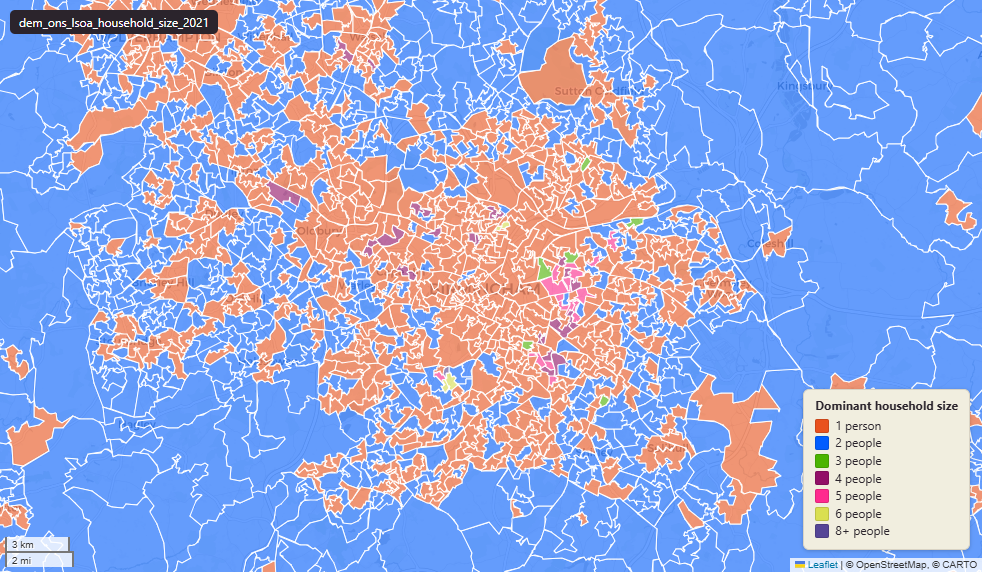

# ONS Census 2021 household size at Lower-layer Super Output Area (LSOA) 2021

Census 2021 Household Size

`dem_ons_lsoa_household_size_2021`

**SOURCE**

- Office for National Statistics (ONS), Census 2021, England and Wales.

**DOCUMENTATION**

- ONS dataset (TS017) : https://www.ons.gov.uk/datasets/TS017/editions/2021/versions/3
- ONS Census 2021 landing page : https://www.ons.gov.uk/census/2021

**DEFINITIONS**

- "The number of people in the household, including children." (ONS Census 2021 Household size variable)
- A household is defined as: "One person living alone, or a group of people (not necessarily related) living at the same address who share cooking facilities and share a living room, sitting room or dining area."

**SCOPE**

- England and Wales.
- Base population: households.

**CRS**

- EPSG:27700. Open Government Licence v3.0.

**DATA QUALITY CAVEATS**

- Column names are digit-led: `"0_people_in_household_count"`, `"2_people_in_household_count"`,.. `"8_or_more_people_in_household_count"`. Use double-quoted identifiers in SQL.
- One column has a SPACE: `"1 person in household_count"` / `"_perc"`. Double-quote.
- "0 people in household" is unusual but appears in the data; treat as a residual / edge category.

**ENRICHMENT**

- `msoa21hclnm` — House of Commons Library readable MSOA name, joined at load on msoa21cd from House of Commons Library MSOA Names v2.3 (13 February 2026). Open Parliament Licence.

**LOADED INTO uk_baseline**

- Data: Census Day 21 March 2021.

## Columns

| Column | Type | Description / unit |
|---|---|---|
| `FID` | `bigint` |  |
| `lsoa21cd` | `text` | Source field "LSOA21CD"; ONS GSS 9-character LSOA 2021 code. |
| `lsoa21nm` | `text` | Source field "LSOA21NM"; human-readable LSOA 2021 name. |
| `geom` | `geometry(MultiPolygon,27700)` | MultiPolygon in EPSG:27700. Boundary geometry joined at load. |
| `msoa21cd` | `text` | Joined at load from ONS LSOA->MSOA lookup; 2021 MSOA GSS code. |
| `msoa21nm` | `text` | Joined at load from ONS LSOA->MSOA lookup; 2021 MSOA name. |
| `lad22cd` | `text` | Joined at load from ONS LSOA->LAD lookup; 2022 LAD GSS code. |
| `lad22nm` | `text` | Joined at load from ONS LSOA->LAD lookup; 2022 LAD name. |
| `rgn22cd` | `text` | Joined at load from ONS LSOA->Region lookup; 2022 Region GSS code. |
| `rgn22nm` | `text` | Joined at load from ONS LSOA->Region lookup; 2022 Region name. |
| `data_source` | `text` | Added during an earlier Prior + Partners loading pass. Fixed-string annotation; same value every row. |
| `data_resolution` | `text` | Added during an earlier Prior + Partners loading pass. Fixed-string annotation; same value every row. |
| `data_time_period` | `timestamp without time zone` | Added during an earlier Prior + Partners loading pass. Fixed annotation; same value every row. |
| `data_web_link` | `text` | Added during an earlier Prior + Partners loading pass. Fixed annotation; URL to the ONS dataset page. |
| `area_ha` | `double precision` | Area in hectares, computed at load from the geometry. Unit: hectares. Stale if geometry is later edited. |
| `0_people_in_household_count` | `bigint` | Source field; count of "0 people in household" in LSOA households. |
| `1 person in household_count` | `bigint` | Source field; count of "1 person in household" in LSOA households. |
| `2_people_in_household_count` | `bigint` | Source field; count of "2 people in household" in LSOA households. |
| `3_people_in_household_count` | `bigint` | Source field; count of "3 people in household" in LSOA households. |
| `4_people_in_household_count` | `bigint` | Source field; count of "4 people in household" in LSOA households. |
| `5_people_in_household_count` | `bigint` | Source field; count of "5 people in household" in LSOA households. |
| `6_people_in_household_count` | `bigint` | Source field; count of "6 people in household" in LSOA households. |
| `7_people_in_household_count` | `bigint` | Source field; count of "7 people in household" in LSOA households. |
| `8_or_more_people_in_household_count` | `bigint` | Source field; count of "8 or more people in household" in LSOA households. |
| `0_people_in_household_perc` | `double precision` | Source field; percentage of "0 people in household" in LSOA households. Unit: "percent (0 to 100)". |
| `1 person in household_perc` | `double precision` | Source field; percentage of "1 person in household" in LSOA households. Unit: "percent (0 to 100)". |
| `2_people_in_household_perc` | `double precision` | Source field; percentage of "2 people in household" in LSOA households. Unit: "percent (0 to 100)". |
| `3_people_in_household_perc` | `double precision` | Source field; percentage of "3 people in household" in LSOA households. Unit: "percent (0 to 100)". |
| `4_people_in_household_perc` | `double precision` | Source field; percentage of "4 people in household" in LSOA households. Unit: "percent (0 to 100)". |
| `5_people_in_household_perc` | `double precision` | Source field; percentage of "5 people in household" in LSOA households. Unit: "percent (0 to 100)". |
| `6_people_in_household_perc` | `double precision` | Source field; percentage of "6 people in household" in LSOA households. Unit: "percent (0 to 100)". |
| `7_people_in_household_perc` | `double precision` | Source field; percentage of "7 people in household" in LSOA households. Unit: "percent (0 to 100)". |
| `8_or_more_people_in_household_perc` | `double precision` | Source field; percentage of "8 or more people in household" in LSOA households. Unit: "percent (0 to 100)". |
| `dominant_household_size_group` | `text` | Derived during an earlier Prior + Partners loading pass; label of the modal category for this LSOA. |
| `wd22cd` | `character varying` | Joined at load from ONS LSOA->Ward lookup; 2022 Ward GSS code. |
| `wd22nm` | `character varying` | Joined at load from ONS LSOA->Ward lookup; 2022 Ward name. |
| `fid` | `bigint` |  |
| `msoa21hclnm` | `text` | House of Commons Library readable MSOA name. Source field `msoa21hclnm` from House of Commons Library MSOA Names v2.3 (13 February 2026), joined at load on msoa21cd. Open Parliament Licence. |
