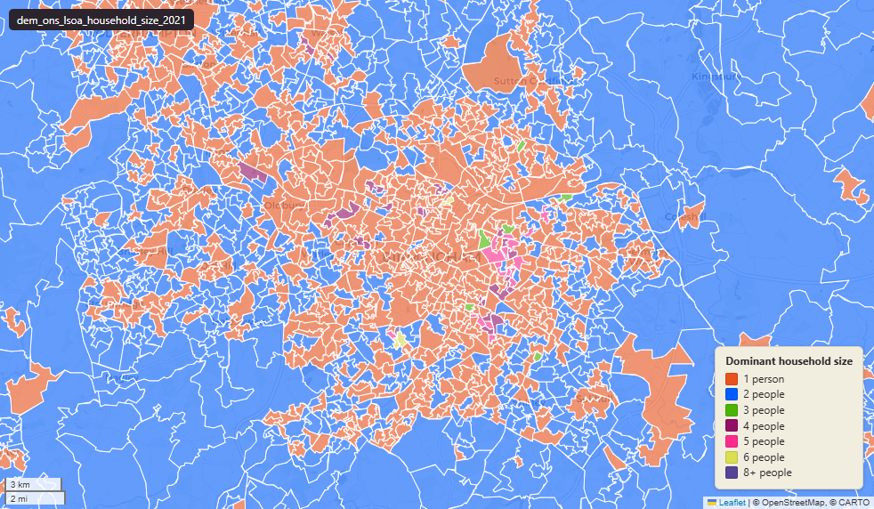

# ONS Census 2021 household size at Lower-layer Super Output Area (LSOA) 2021

Census 2021 Household Size

`dem_ons_lsoa_household_size_2021`

**SOURCE**

- Office for National Statistics (ONS), Census 2021, England and Wales.

**DOCUMENTATION**

- ONS dataset (TS017) : https://www.ons.gov.uk/datasets/TS017/editions/2021/versions/3
- ONS Census 2021 landing page : https://www.ons.gov.uk/census/2021

**DEFINITIONS**

- "The number of people in the household, including children", where a household is defined as "One person living alone, or a group of people (not necessarily related) living at the same address who share cooking facilities and share a living room, sitting room or dining area". (ONS Census 2021 Household size variable)

**SCOPE**

- England and Wales.
- Base population: households.

**CRS**

- EPSG:27700. Open Government Licence v3.0.

**DATA QUALITY CAVEATS**

- County and Spatial Development Strategy columns are England and Wales only; rows elsewhere carry no county or SDS. Wales and the Isles of Scilly carry a county but no SDS. Rows with no Local Authority District code are NULL in all four columns.

**ENRICHMENT**

- `sds_name` / `sds_group` — Spatial Development Strategy area and devolution status, a Prior + Partners categorisation over Ministry of Housing, Communities and Local Government (MHCLG) English devolution policy, joined at load on the row's Local Authority District 2025 code via uk.ref_lad25_ctyua25_sds_lu_jul2026.
- `msoa21hclnm` — House of Commons Library readable MSOA name, joined at load on msoa21cd from House of Commons Library MSOA Names v2.3 (13 February 2026). Open Parliament Licence.

**LOADED INTO uk_baseline**

- Data: Census Day 21 March 2021.

## Columns

| Column | Type | Description / unit |
|---|---|---|
| `FID` | `bigint` |  |
| `lsoa21cd` | `text` | Source field "LSOA21CD"; ONS GSS 9-character LSOA 2021 code. |
| `lsoa21nm` | `text` | Source field "LSOA21NM"; human-readable LSOA 2021 name. |
| `geom` | `geometry(MultiPolygon,27700)` | MultiPolygon in EPSG:27700. Boundary geometry joined at load. |
| `msoa21cd` | `text` | Joined at load from ONS LSOA->MSOA lookup; 2021 MSOA GSS code. |
| `msoa21nm` | `text` | Joined at load from ONS LSOA->MSOA lookup; 2021 MSOA name. |
| `lad22cd` | `text` | Local Authority District 2022 code, best-fit assigned from the feature's Middle Layer Super Output Area (MSOA) 2021 code. The 2022 reference is the 2021 LAD geography that the MSOA 2021 names are scoped to. Joined at load from the ONS MSOA (2021) to LAD (2022) best-fit lookup on msoa21cd. Open Government Licence v3.0. |
| `lad22nm` | `text` | Local Authority District 2022 name, best-fit assigned from the feature's MSOA 2021 code (the 2021 LAD geography matching the MSOA 2021 name scoping). Joined at load from the ONS MSOA (2021) to LAD (2022) best-fit lookup on msoa21cd. Open Government Licence v3.0. |
| `rgn22cd` | `text` | Joined at load from ONS LSOA->Region lookup; 2022 Region GSS code. |
| `rgn22nm` | `text` | Joined at load from ONS LSOA->Region lookup; 2022 Region name. |
| `data_source` | `text` | Added during an earlier Prior + Partners loading pass. Fixed-string annotation; same value every row. |
| `data_resolution` | `text` | Added during an earlier Prior + Partners loading pass. Fixed-string annotation; same value every row. |
| `data_time_period` | `timestamp without time zone` | Added during an earlier Prior + Partners loading pass. Fixed annotation; same value every row. |
| `data_web_link` | `text` | Added during an earlier Prior + Partners loading pass. Fixed annotation; URL to the ONS dataset page. |
| `area_ha` | `double precision` | Area in hectares, computed at load from the geometry. Unit: hectares. Stale if geometry is later edited. |
| `0_people_in_household_count` | `bigint` | Source field; count of "0 people in household" in LSOA households. |
| `1 person in household_count` | `bigint` | Source field; count of "1 person in household" in LSOA households. |
| `2_people_in_household_count` | `bigint` | Source field; count of "2 people in household" in LSOA households. |
| `3_people_in_household_count` | `bigint` | Source field; count of "3 people in household" in LSOA households. |
| `4_people_in_household_count` | `bigint` | Source field; count of "4 people in household" in LSOA households. |
| `5_people_in_household_count` | `bigint` | Source field; count of "5 people in household" in LSOA households. |
| `6_people_in_household_count` | `bigint` | Source field; count of "6 people in household" in LSOA households. |
| `7_people_in_household_count` | `bigint` | Source field; count of "7 people in household" in LSOA households. |
| `8_or_more_people_in_household_count` | `bigint` | Source field; count of "8 or more people in household" in LSOA households. |
| `0_people_in_household_perc` | `double precision` | Source field; percentage of "0 people in household" in LSOA households. Unit: "percent (0 to 100)". |
| `1 person in household_perc` | `double precision` | Source field; percentage of "1 person in household" in LSOA households. Unit: "percent (0 to 100)". |
| `2_people_in_household_perc` | `double precision` | Source field; percentage of "2 people in household" in LSOA households. Unit: "percent (0 to 100)". |
| `3_people_in_household_perc` | `double precision` | Source field; percentage of "3 people in household" in LSOA households. Unit: "percent (0 to 100)". |
| `4_people_in_household_perc` | `double precision` | Source field; percentage of "4 people in household" in LSOA households. Unit: "percent (0 to 100)". |
| `5_people_in_household_perc` | `double precision` | Source field; percentage of "5 people in household" in LSOA households. Unit: "percent (0 to 100)". |
| `6_people_in_household_perc` | `double precision` | Source field; percentage of "6 people in household" in LSOA households. Unit: "percent (0 to 100)". |
| `7_people_in_household_perc` | `double precision` | Source field; percentage of "7 people in household" in LSOA households. Unit: "percent (0 to 100)". |
| `8_or_more_people_in_household_perc` | `double precision` | Source field; percentage of "8 or more people in household" in LSOA households. Unit: "percent (0 to 100)". |
| `dominant_household_size_group` | `text` | Derived during an earlier Prior + Partners loading pass; label of the modal category for this LSOA. |
| `wd22cd` | `character varying` | Joined at load from ONS LSOA->Ward lookup; 2022 Ward GSS code. |
| `wd22nm` | `character varying` | Joined at load from ONS LSOA->Ward lookup; 2022 Ward name. |
| `fid` | `bigint` |  |
| `msoa21hclnm` | `text` | House of Commons Library readable MSOA name. Source field `msoa21hclnm` from House of Commons Library MSOA Names v2.3 (13 February 2026), joined at load on msoa21cd. Open Parliament Licence. |
| `lad25cd` | `text` | Local Authority District 2025 code (current administering authority), best-fit assigned from the feature's MSOA 2021 code. Joined at load from the ONS MSOA (2021) to Ward (2025) to LAD (2025) best-fit lookup on msoa21cd. Open Government Licence v3.0. |
| `lad25nm` | `text` | Local Authority District 2025 name (current administering authority), best-fit assigned from the feature's MSOA 2021 code. Joined at load from the ONS MSOA (2021) to Ward (2025) to LAD (2025) best-fit lookup on msoa21cd. Open Government Licence v3.0. |
| `ctyua25cd` | `text` | County or unitary authority code at 1 April 2025. Joined at load via uk.ref_lad25_ctyua25_sds_lu_jul2026 on the row's Local Authority District 2025 code. Open Government Licence v3.0. |
| `ctyua25nm` | `text` | County or unitary authority name at 1 April 2025. Joined at load via uk.ref_lad25_ctyua25_sds_lu_jul2026 on the row's Local Authority District 2025 code. Open Government Licence v3.0. |
| `sds_name` | `text` | Spatial Development Strategy (SDS) area, a Prior + Partners categorisation over Ministry of Housing, Communities and Local Government (MHCLG) English devolution policy. Joined at load via uk.ref_lad25_ctyua25_sds_lu_jul2026 on the row's Local Authority District 2025 code. Open Government Licence v3.0. |
| `sds_group` | `text` | Devolution status of the Spatial Development Strategy area: Existing Devolution Footprints, Devolution Priority Programme, Other Proposed Geographies or Remaining Areas. Joined at load via uk.ref_lad25_ctyua25_sds_lu_jul2026 on the row's Local Authority District 2025 code. Open Government Licence v3.0. |
