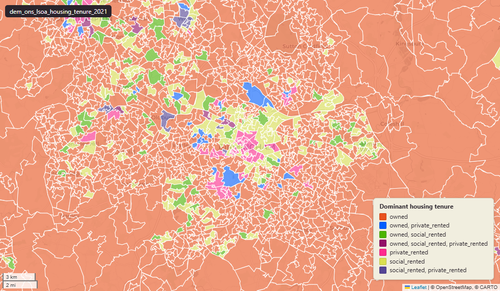

# ONS Census 2021 housing tenure at Lower-layer Super Output Area (LSOA) 2021

Census 2021 Housing Tenure

`dem_ons_lsoa_housing_tenure_2021`

**SOURCE**

- Office for National Statistics (ONS), Census 2021, England and Wales.

**DOCUMENTATION**

- ONS dataset (TS054) : https://www.ons.gov.uk/datasets/TS054/editions/2021/versions/1
- ONS Census 2021 landing page : https://www.ons.gov.uk/census/2021

**DEFINITIONS**

- "Whether a household owns or rents the accommodation that it occupies." (ONS Census 2021 Tenure of household variable)

Categories:

- "Owned" (owned outright or with a mortgage / loan)
- "Shared ownership" (part owns, part rents)
- "Social rented" (rented from council or housing association)
- "Private rented" (rented from private landlord or letting agency, or other)
- "Lives rent free"

**SCOPE**

- England and Wales.
- Base population: households.

**CRS**

- EPSG:27700. Open Government Licence v3.0.

**ENRICHMENT**

- `msoa21hclnm` — House of Commons Library readable MSOA name, joined at load on msoa21cd from House of Commons Library MSOA Names v2.3 (13 February 2026). Open Parliament Licence.

**LOADED INTO uk_baseline**

- Data: Census Day 21 March 2021.

## Columns

| Column | Type | Description / unit |
|---|---|---|
| `FID` | `bigint` |  |
| `lsoa21cd` | `text` | Source field "LSOA21CD"; ONS GSS 9-character LSOA 2021 code. |
| `lsoa21nm` | `text` | Source field "LSOA21NM"; human-readable LSOA 2021 name. |
| `geom` | `geometry(MultiPolygon,27700)` | MultiPolygon in EPSG:27700. Boundary geometry joined at load. |
| `msoa21cd` | `text` | Joined at load from ONS LSOA->MSOA lookup; 2021 MSOA GSS code. |
| `msoa21nm` | `text` | Joined at load from ONS LSOA->MSOA lookup; 2021 MSOA name. |
| `lad22cd` | `text` | Joined at load from ONS LSOA->LAD lookup; 2022 LAD GSS code. |
| `lad22nm` | `text` | Joined at load from ONS LSOA->LAD lookup; 2022 LAD name. |
| `rgn22cd` | `text` | Joined at load from ONS LSOA->Region lookup; 2022 Region GSS code. |
| `rgn22nm` | `text` | Joined at load from ONS LSOA->Region lookup; 2022 Region name. |
| `data_source` | `text` | Added during an earlier Prior + Partners loading pass. Fixed-string annotation; same value every row. |
| `data_resolution` | `text` | Added during an earlier Prior + Partners loading pass. Fixed-string annotation; same value every row. |
| `data_time_period` | `timestamp without time zone` | Added during an earlier Prior + Partners loading pass. Fixed annotation; same value every row. |
| `data_web_link` | `text` | Added during an earlier Prior + Partners loading pass. Fixed annotation; URL to the ONS dataset page. |
| `area_ha` | `double precision` | Area in hectares, computed at load from the geometry. Unit: hectares. Stale if geometry is later edited. |
| `owned_count` | `bigint` | Source field; count of "owned" in LSOA households. |
| `shared_ownership_count` | `bigint` | Source field; count of "shared ownership" in LSOA households. |
| `social_rented_count` | `bigint` | Source field; count of "social rented" in LSOA households. |
| `private_rented_count` | `bigint` | Source field; count of "private rented" in LSOA households. |
| `lives_rent_free_count` | `bigint` | Source field; count of "lives rent free" in LSOA households. |
| `owned_perc` | `double precision` | Source field; percentage of "owned" in LSOA households. Unit: "percent (0 to 100)". |
| `shared_ownership_perc` | `double precision` | Source field; percentage of "shared ownership" in LSOA households. Unit: "percent (0 to 100)". |
| `social_rented_perc` | `double precision` | Source field; percentage of "social rented" in LSOA households. Unit: "percent (0 to 100)". |
| `private_rented_perc` | `double precision` | Source field; percentage of "private rented" in LSOA households. Unit: "percent (0 to 100)". |
| `lives_rent_free_perc` | `double precision` | Source field; percentage of "lives rent free" in LSOA households. Unit: "percent (0 to 100)". |
| `dominant_housing_tenure_group` | `text` | Derived during an earlier Prior + Partners loading pass; label of the modal category for this LSOA. |
| `wd22cd` | `character varying` | Joined at load from ONS LSOA->Ward lookup; 2022 Ward GSS code. |
| `wd22nm` | `character varying` | Joined at load from ONS LSOA->Ward lookup; 2022 Ward name. |
| `fid` | `bigint` |  |
| `msoa21hclnm` | `text` | House of Commons Library readable MSOA name. Source field `msoa21hclnm` from House of Commons Library MSOA Names v2.3 (13 February 2026), joined at load on msoa21cd. Open Parliament Licence. |
