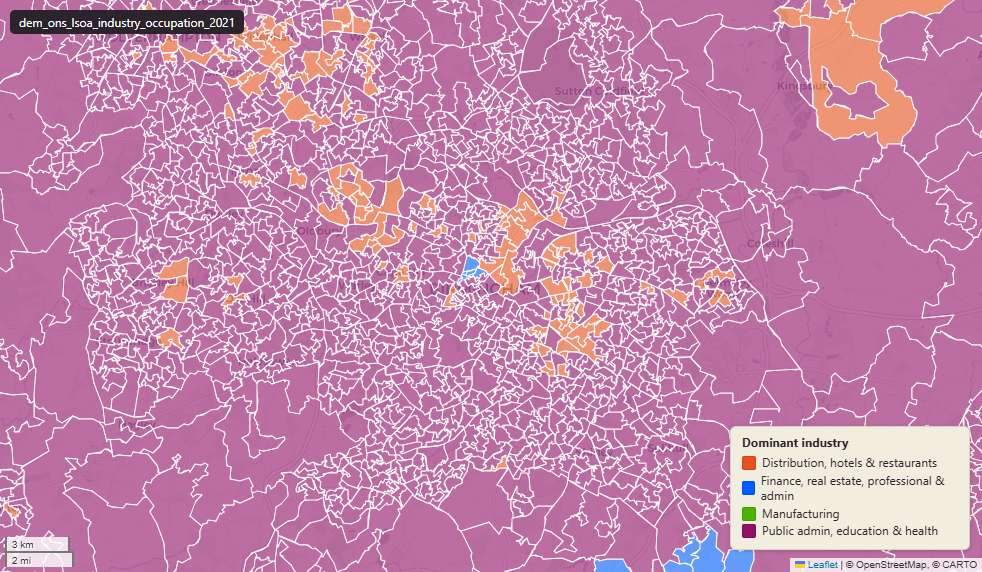

# ONS Census 2021 industry and occupation at Lower-layer Super Output Area (LSOA) 2021

`dem_ons_lsoa_industry_occupation_2021`

<a href="http://localhost:7800/?layer=uk_baseline.dem_ons_lsoa_industry_occupation_2021" target="_blank" rel="noopener">Open in the Dashboard &#8599;</a> (start your local Dashboard first)

**SOURCE**

- Office for National Statistics (ONS), Census 2021, England and Wales. Source tables TS060 "Industry (current)" + TS062 "Standard Occupational Classification 2020 (SOC 2020)" — combined into one layer by the earlier load. Reference date 21 March 2021. Loaded via an earlier Prior + Partners pass.

**DOCUMENTATION**

- ONS dataset (TS060, Industry) : https://www.ons.gov.uk/datasets/TS060/editions/2021/versions/1
- ONS dataset (TS063, Occupation) : https://www.ons.gov.uk/datasets/TS063/editions/2021/versions/1
- SIC 2007 classification : https://onsdigital.github.io/dp-classification-tools/standard-industrial-classification/ONS_SIC_hierarchy_view.html
- SOC 2020 classification : https://onsdigital.github.io/dp-classification-tools/standard-occupational-classification/ONS_SOC_hierarchy_view.html

**DEFINITIONS**

- "Industry: The industry in which a person aged 16 years and over works refers to the type of economic activity of their employer or business. Coded using the UK Standard Industrial Classification (SIC) 2007." (ONS Census 2021 Industry variable)
- "Occupation: The occupation of a person aged 16 years and over describes the type of work they do. Coded using the UK Standard Occupational Classification (SOC) 2020." (ONS Census 2021 Occupation variable)

**SCOPE**

- England and Wales. LSOA 2021 boundary; 35,672 distinct lsoa21cd.
- Base population: usual residents aged 16+ in employment the week before Census Day.

**CRS**

- EPSG:27700. Open Government Licence v3.0.

**LOADED INTO uk_baseline**

- Data: Census Day 21 March 2021.

## Columns

| Column | Type | Description / unit |
|---|---|---|
| `FID` | `bigint` |  |
| `lsoa21cd` | `text` | Source field "LSOA21CD"; ONS GSS 9-character LSOA 2021 code. |
| `lsoa21nm` | `text` | Source field "LSOA21NM"; human-readable LSOA 2021 name. |
| `geom` | `geometry(MultiPolygon,27700)` | MultiPolygon in EPSG:27700. Boundary geometry joined at load. |
| `msoa21cd` | `text` | Joined at load from ONS LSOA->MSOA lookup; 2021 MSOA GSS code. |
| `msoa21nm` | `text` | Joined at load from ONS LSOA->MSOA lookup; 2021 MSOA name. |
| `lad22cd` | `text` | Joined at load from ONS LSOA->LAD lookup; 2022 LAD GSS code. |
| `lad22nm` | `text` | Joined at load from ONS LSOA->LAD lookup; 2022 LAD name. |
| `rgn22cd` | `text` | Joined at load from ONS LSOA->Region lookup; 2022 Region GSS code. |
| `rgn22nm` | `text` | Joined at load from ONS LSOA->Region lookup; 2022 Region name. |
| `data_source` | `text` | Added during an earlier Prior + Partners loading pass. Fixed-string annotation; same value every row. |
| `data_resolution` | `text` | Added during an earlier Prior + Partners loading pass. Fixed-string annotation; same value every row. |
| `data_time_period` | `timestamp without time zone` | Added during an earlier Prior + Partners loading pass. Fixed annotation; same value every row. |
| `data_web_link` | `text` | Added during an earlier Prior + Partners loading pass. Fixed annotation; URL to the ONS dataset page. |
| `area_ha` | `double precision` | Area in hectares, computed at load from the geometry. Unit: hectares. Stale if geometry is later edited. |
| `agriculture_energy_and_water_count` | `bigint` | Source field; count of "agriculture energy and water" in LSOA usual residents aged 16+ in employment. |
| `manufacturinge_count` | `bigint` | Source field; count of "manufacturinge" in LSOA usual residents aged 16+ in employment. |
| `construction_count` | `bigint` | Source field; count of "construction" in LSOA usual residents aged 16+ in employment. |
| `distribution_hotels_and_restaurants_count` | `bigint` | Source field; count of "distribution hotels and restaurants" in LSOA usual residents aged 16+ in employment. |
| `transport_and_communication_count` | `bigint` | Source field; count of "transport and communication" in LSOA usual residents aged 16+ in employment. |
| `finance_realestate_prof_admin_activity_count` | `bigint` | Source field; count of "finance realestate prof admin activity" in LSOA usual residents aged 16+ in employment. |
| `public_administration_education_health_count` | `bigint` | Source field; count of "public administration education health" in LSOA usual residents aged 16+ in employment. |
| `other_industries_count` | `bigint` | Source field; count of "other industries" in LSOA usual residents aged 16+ in employment. |
| `total_industry_pop_count` | `bigint` | Source field; count of "total industry pop" in LSOA usual residents aged 16+ in employment. |
| `agriculture_energy_and_water_perc` | `double precision` | Source field; percentage of "agriculture energy and water" in LSOA usual residents aged 16+ in employment. Unit: "percent (0 to 100)". |
| `manufacturinge_perc` | `double precision` | Source field; percentage of "manufacturinge" in LSOA usual residents aged 16+ in employment. Unit: "percent (0 to 100)". |
| `construction_perc` | `double precision` | Source field; percentage of "construction" in LSOA usual residents aged 16+ in employment. Unit: "percent (0 to 100)". |
| `distribution_hotels_and_restaurants_perc` | `double precision` | Source field; percentage of "distribution hotels and restaurants" in LSOA usual residents aged 16+ in employment. Unit: "percent (0 to 100)". |
| `transport_and_communication_perc` | `double precision` | Source field; percentage of "transport and communication" in LSOA usual residents aged 16+ in employment. Unit: "percent (0 to 100)". |
| `finance_realestate_prof_admin_activity_perc` | `double precision` | Source field; percentage of "finance realestate prof admin activity" in LSOA usual residents aged 16+ in employment. Unit: "percent (0 to 100)". |
| `public_administration_education_health_perc` | `double precision` | Source field; percentage of "public administration education health" in LSOA usual residents aged 16+ in employment. Unit: "percent (0 to 100)". |
| `other_industries_perc` | `double precision` | Source field; percentage of "other industries" in LSOA usual residents aged 16+ in employment. Unit: "percent (0 to 100)". |
| `agriculture_energy_and_water_female_count` | `bigint` | Source field; count of "agriculture energy and water female" in LSOA usual residents aged 16+ in employment. |
| `manufacturinge_female_count` | `bigint` | Source field; count of "manufacturinge female" in LSOA usual residents aged 16+ in employment. |
| `construction_female_count` | `bigint` | Source field; count of "construction female" in LSOA usual residents aged 16+ in employment. |
| `distribution_hotels_and_restaurants_female_count` | `bigint` | Source field; count of "distribution hotels and restaurants female" in LSOA usual residents aged 16+ in employment. |
| `transport_and_communication_female_count` | `bigint` | Source field; count of "transport and communication female" in LSOA usual residents aged 16+ in employment. |
| `finance_realestate_prof_admin_activity_female_count` | `bigint` | Source field; count of "finance realestate prof admin activity female" in LSOA usual residents aged 16+ in employment. |
| `public_administration_education_health_female_count` | `bigint` | Source field; count of "public administration education health female" in LSOA usual residents aged 16+ in employment. |
| `other_industries_female_count` | `bigint` | Source field; count of "other industries female" in LSOA usual residents aged 16+ in employment. |
| `total_female_industry_pop_count` | `bigint` | Source field; count of "total female industry pop" in LSOA usual residents aged 16+ in employment. |
| `agriculture_energy_and_water_female_perc` | `double precision` | Source field; percentage of "agriculture energy and water female" in LSOA usual residents aged 16+ in employment. Unit: "percent (0 to 100)". |
| `manufacturinge_female_perc` | `double precision` | Source field; percentage of "manufacturinge female" in LSOA usual residents aged 16+ in employment. Unit: "percent (0 to 100)". |
| `construction_female_perc` | `double precision` | Source field; percentage of "construction female" in LSOA usual residents aged 16+ in employment. Unit: "percent (0 to 100)". |
| `distribution_hotels_and_restaurants_female_perc` | `double precision` | Source field; percentage of "distribution hotels and restaurants female" in LSOA usual residents aged 16+ in employment. Unit: "percent (0 to 100)". |
| `transport_and_communication_female_perc` | `double precision` | Source field; percentage of "transport and communication female" in LSOA usual residents aged 16+ in employment. Unit: "percent (0 to 100)". |
| `finance_realestate_prof_admin_activity_female_perc` | `double precision` | Source field; percentage of "finance realestate prof admin activity female" in LSOA usual residents aged 16+ in employment. Unit: "percent (0 to 100)". |
| `public_administration_education_health_female_perc` | `double precision` | Source field; percentage of "public administration education health female" in LSOA usual residents aged 16+ in employment. Unit: "percent (0 to 100)". |
| `other_industries_female_perc` | `double precision` | Source field; percentage of "other industries female" in LSOA usual residents aged 16+ in employment. Unit: "percent (0 to 100)". |
| `agriculture_energy_and_water_male_count` | `bigint` | Source field; count of "agriculture energy and water male" in LSOA usual residents aged 16+ in employment. |
| `manufacturinge_male_count` | `bigint` | Source field; count of "manufacturinge male" in LSOA usual residents aged 16+ in employment. |
| `construction_male_count` | `bigint` | Source field; count of "construction male" in LSOA usual residents aged 16+ in employment. |
| `distribution_hotels_and_restaurants_male_count` | `bigint` | Source field; count of "distribution hotels and restaurants male" in LSOA usual residents aged 16+ in employment. |
| `transport_and_communication_male_count` | `bigint` | Source field; count of "transport and communication male" in LSOA usual residents aged 16+ in employment. |
| `finance_realestate_prof_admin_activity_male_count` | `bigint` | Source field; count of "finance realestate prof admin activity male" in LSOA usual residents aged 16+ in employment. |
| `public_administration_education_health_male_count` | `bigint` | Source field; count of "public administration education health male" in LSOA usual residents aged 16+ in employment. |
| `other_industries_male_count` | `bigint` | Source field; count of "other industries male" in LSOA usual residents aged 16+ in employment. |
| `total_male_industry_pop_count` | `bigint` | Source field; count of "total male industry pop" in LSOA usual residents aged 16+ in employment. |
| `agriculture_energy_and_water_male_perc` | `double precision` | Source field; percentage of "agriculture energy and water male" in LSOA usual residents aged 16+ in employment. Unit: "percent (0 to 100)". |
| `manufacturinge_male_perc` | `double precision` | Source field; percentage of "manufacturinge male" in LSOA usual residents aged 16+ in employment. Unit: "percent (0 to 100)". |
| `construction_male_perc` | `double precision` | Source field; percentage of "construction male" in LSOA usual residents aged 16+ in employment. Unit: "percent (0 to 100)". |
| `distribution_hotels_and_restaurants_male_perc` | `double precision` | Source field; percentage of "distribution hotels and restaurants male" in LSOA usual residents aged 16+ in employment. Unit: "percent (0 to 100)". |
| `transport_and_communication_male_perc` | `double precision` | Source field; percentage of "transport and communication male" in LSOA usual residents aged 16+ in employment. Unit: "percent (0 to 100)". |
| `finance_realestate_prof_admin_activity_male_perc` | `double precision` | Source field; percentage of "finance realestate prof admin activity male" in LSOA usual residents aged 16+ in employment. Unit: "percent (0 to 100)". |
| `public_administration_education_health_male_perc` | `double precision` | Source field; percentage of "public administration education health male" in LSOA usual residents aged 16+ in employment. Unit: "percent (0 to 100)". |
| `other_industries_male_perc` | `double precision` | Source field; percentage of "other industries male" in LSOA usual residents aged 16+ in employment. Unit: "percent (0 to 100)". |
| `dominant_industry_group` | `text` | Derived during an earlier Prior + Partners loading pass; label of the modal category for this LSOA. |
| `dominant_industry_group_female` | `text` | Added during an earlier Prior + Partners loading pass. Label of the modal industry group among female usual residents aged 16+ in employment in the LSOA. |
| `dominant_industry_group_male` | `text` | Added during an earlier Prior + Partners loading pass. Label of the modal industry group among male usual residents aged 16+ in employment in the LSOA. |
| `wd22cd` | `character varying` | Joined at load from ONS LSOA->Ward lookup; 2022 Ward GSS code. |
| `wd22nm` | `character varying` | Joined at load from ONS LSOA->Ward lookup; 2022 Ward name. |
| `fid` | `bigint` |  |
