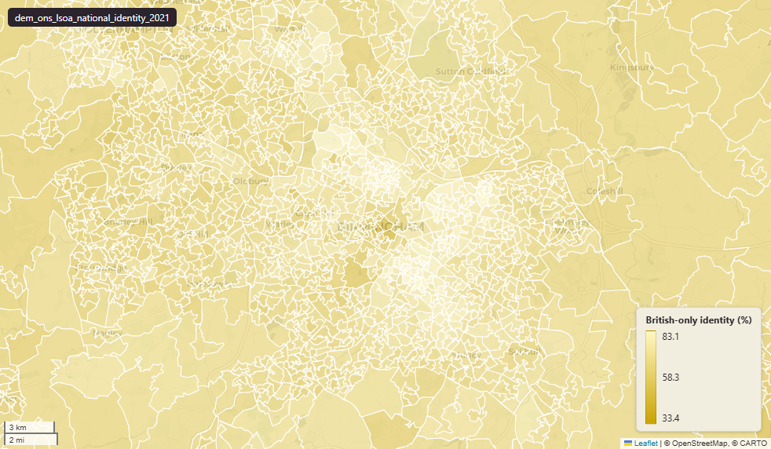

# ONS Census 2021 national identity at Lower-layer Super Output Area (LSOA) 2021

Census 2021 National Identity

`dem_ons_lsoa_national_identity_2021`

**SOURCE**

- Office for National Statistics (ONS), Census 2021, England and Wales.

**DOCUMENTATION**

- ONS dataset (TS027) : https://www.ons.gov.uk/datasets/TS027/editions/2021/versions/1
- ONS National identity variable : https://www.ons.gov.uk/census/census2021dictionary/variablesbytopic/ethnicgroupnationalidentitylanguageandreligionvariablescensus2021/nationalidentity
- ONS Census 2021 landing page : https://www.ons.gov.uk/census/2021

**DEFINITIONS**

- "The country or countries where a person feels they belong or think of as home. It is not dependent on a person's ethnic group or citizenship. National identity is self-defined. Respondents could select more than one option." (ONS Census 2021 National identity variable)

**SCOPE**

- England and Wales.
- Base population: all usual residents.

**CRS**

- EPSG:27700. Open Government Licence v3.0.

**DATA QUALITY CAVEATS**

- Respondents could select more than one national identity. Counts of combined identities (e.g. "British and English") and counts of individual identities are NOT mutually exclusive — sum-across-categories will exceed total population.

**ENRICHMENT**

- `msoa21hclnm` — House of Commons Library readable MSOA name, joined at load on msoa21cd from House of Commons Library MSOA Names v2.3 (13 February 2026). Open Parliament Licence.

**LOADED INTO uk_baseline**

- Data: Census Day 21 March 2021.

## Columns

| Column | Type | Description / unit |
|---|---|---|
| `FID` | `bigint` |  |
| `lsoa21cd` | `text` | Source field "LSOA21CD"; ONS GSS 9-character LSOA 2021 code. |
| `lsoa21nm` | `text` | Source field "LSOA21NM"; human-readable LSOA 2021 name. |
| `geom` | `geometry(MultiPolygon,27700)` | MultiPolygon in EPSG:27700. Boundary geometry joined at load. |
| `msoa21cd` | `text` | Joined at load from ONS LSOA->MSOA lookup; 2021 MSOA GSS code. |
| `msoa21nm` | `text` | Joined at load from ONS LSOA->MSOA lookup; 2021 MSOA name. |
| `lad22cd` | `text` | Joined at load from ONS LSOA->LAD lookup; 2022 LAD GSS code. |
| `lad22nm` | `text` | Joined at load from ONS LSOA->LAD lookup; 2022 LAD name. |
| `rgn22cd` | `text` | Joined at load from ONS LSOA->Region lookup; 2022 Region GSS code. |
| `rgn22nm` | `text` | Joined at load from ONS LSOA->Region lookup; 2022 Region name. |
| `data_source` | `text` | Added during an earlier Prior + Partners loading pass. Fixed-string annotation; same value every row. |
| `data_resolution` | `text` | Added during an earlier Prior + Partners loading pass. Fixed-string annotation; same value every row. |
| `data_time_period` | `timestamp without time zone` | Added during an earlier Prior + Partners loading pass. Fixed annotation; same value every row. |
| `data_web_link` | `text` | Added during an earlier Prior + Partners loading pass. Fixed annotation; URL to the ONS dataset page. |
| `area_ha` | `double precision` | Area in hectares, computed at load from the geometry. Unit: hectares. Stale if geometry is later edited. |
| `any_other_combination_of_only_uk_identities_count` | `bigint` | Source field; count of "any other combination of only uk identities" in LSOA usual residents. |
| `british_only_identity_count` | `bigint` | Source field; count of "british only identity" in LSOA usual residents. |
| `cornish_and_british_only_identity_count` | `bigint` | Source field; count of "cornish and british only identity" in LSOA usual residents. |
| `cornish_only_identity_count` | `bigint` | Source field; count of "cornish only identity" in LSOA usual residents. |
| `english_and_british_only_identity_count` | `bigint` | Source field; count of "english and british only identity" in LSOA usual residents. |
| `english_only_identity_count` | `bigint` | Source field; count of "english only identity" in LSOA usual residents. |
| `irish_and_at_least_one_uk_identity_count` | `bigint` | Source field; count of "irish and at least one uk identity" in LSOA usual residents. |
| `irish_only_identity_count` | `bigint` | Source field; count of "irish only identity" in LSOA usual residents. |
| `northern_irish_and_british_only_identity_count` | `bigint` | Source field; count of "northern irish and british only identity" in LSOA usual residents. |
| `northern_irish_only_identity_count` | `bigint` | Source field; count of "northern irish only identity" in LSOA usual residents. |
| `other_identity_and_at_least_one_uk_identity_count` | `bigint` | Source field; count of "other identity and at least one uk identity" in LSOA usual residents. |
| `other_identity_only_count` | `bigint` | Source field; count of "other identity only" in LSOA usual residents. |
| `scottish_and_british_only_identity_count` | `bigint` | Source field; count of "scottish and british only identity" in LSOA usual residents. |
| `scottish_only_identity_count` | `bigint` | Source field; count of "scottish only identity" in LSOA usual residents. |
| `welsh_and_british_only_identity_count` | `bigint` | Source field; count of "welsh and british only identity" in LSOA usual residents. |
| `welsh_only_identity_count` | `bigint` | Source field; count of "welsh only identity" in LSOA usual residents. |
| `total_nat_identity_pop` | `bigint` | Source field; base denominator for the percentages in this layer. |
| `any_other_combination_of_only_uk_identities_perc` | `double precision` | Source field; percentage of "any other combination of only uk identities" in LSOA usual residents. Unit: "percent (0 to 100)". |
| `british_only_identity_perc` | `double precision` | Source field; percentage of "british only identity" in LSOA usual residents. Unit: "percent (0 to 100)". |
| `cornish_and_british_only_identity_perc` | `double precision` | Source field; percentage of "cornish and british only identity" in LSOA usual residents. Unit: "percent (0 to 100)". |
| `cornish_only_identity_perc` | `double precision` | Source field; percentage of "cornish only identity" in LSOA usual residents. Unit: "percent (0 to 100)". |
| `english_and_british_only_identity_perc` | `double precision` | Source field; percentage of "english and british only identity" in LSOA usual residents. Unit: "percent (0 to 100)". |
| `english_only_identity_perc` | `double precision` | Source field; percentage of "english only identity" in LSOA usual residents. Unit: "percent (0 to 100)". |
| `irish_and_at_least_one_uk_identity_perc` | `double precision` | Source field; percentage of "irish and at least one uk identity" in LSOA usual residents. Unit: "percent (0 to 100)". |
| `irish_only_identity_perc` | `double precision` | Source field; percentage of "irish only identity" in LSOA usual residents. Unit: "percent (0 to 100)". |
| `northern_irish_and_british_only_identity_perc` | `double precision` | Source field; percentage of "northern irish and british only identity" in LSOA usual residents. Unit: "percent (0 to 100)". |
| `northern_irish_only_identity_perc` | `double precision` | Source field; percentage of "northern irish only identity" in LSOA usual residents. Unit: "percent (0 to 100)". |
| `other_identity_and_at_least_one_uk_identity_perc` | `double precision` | Source field; percentage of "other identity and at least one uk identity" in LSOA usual residents. Unit: "percent (0 to 100)". |
| `other_identity_only_perc` | `double precision` | Source field; percentage of "other identity only" in LSOA usual residents. Unit: "percent (0 to 100)". |
| `scottish_and_british_only_identity_perc` | `double precision` | Source field; percentage of "scottish and british only identity" in LSOA usual residents. Unit: "percent (0 to 100)". |
| `scottish_only_identity_perc` | `double precision` | Source field; percentage of "scottish only identity" in LSOA usual residents. Unit: "percent (0 to 100)". |
| `welsh_and_british_only_identity_perc` | `double precision` | Source field; percentage of "welsh and british only identity" in LSOA usual residents. Unit: "percent (0 to 100)". |
| `welsh_only_identity_perc` | `double precision` | Source field; percentage of "welsh only identity" in LSOA usual residents. Unit: "percent (0 to 100)". |
| `dominant_national_identity_group` | `text` | Derived during an earlier Prior + Partners loading pass; label of the modal category for this LSOA. |
| `wd22cd` | `character varying` | Joined at load from ONS LSOA->Ward lookup; 2022 Ward GSS code. |
| `wd22nm` | `character varying` | Joined at load from ONS LSOA->Ward lookup; 2022 Ward name. |
| `fid` | `bigint` |  |
| `msoa21hclnm` | `text` | House of Commons Library readable MSOA name. Source field `msoa21hclnm` from House of Commons Library MSOA Names v2.3 (13 February 2026), joined at load on msoa21cd. Open Parliament Licence. |
