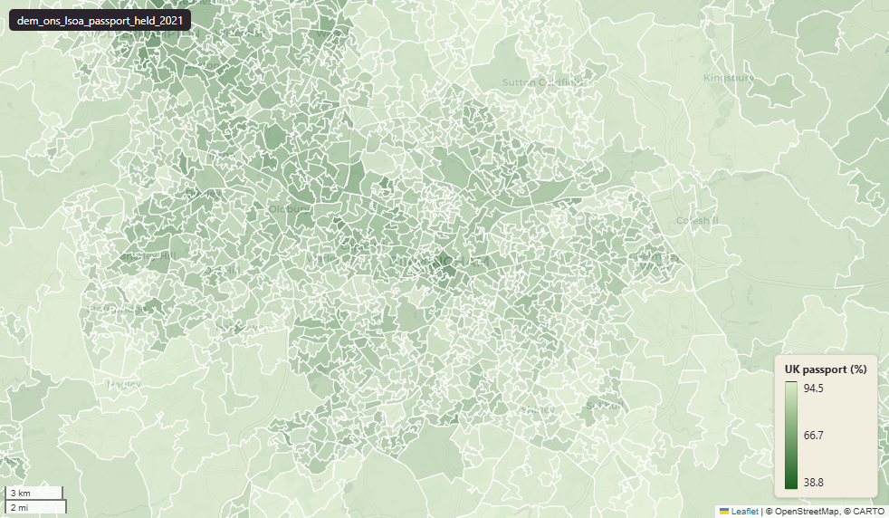

# ONS Census 2021 passport(s) held at Lower-layer Super Output Area (LSOA) 2021

Passport Held

`dem_ons_lsoa_passport_held_2021`

**SOURCE**

- Office for National Statistics (ONS), Census 2021, England and Wales. Tables TS013 "Passports held" and TS005 (summary version). Reference date 21 March 2021. Loaded via an earlier Prior + Partners pass.

**DOCUMENTATION**

- ONS dataset (TS013) : https://www.ons.gov.uk/datasets/TS013/editions/2021/versions/3
- ONS Census 2021 landing page : https://www.ons.gov.uk/census/2021

**DEFINITIONS**

- "Passports held identifies whether a person holds a current valid passport and, if so, the country or countries that issued the passport(s)." (ONS Census 2021 Passports held variable)
- Categories: "United Kingdom passport"; "Republic of Ireland passport"; "Other passport" (broken into EU countries; Europe (non-EU); Africa; Middle East and Asia; The Americas and the Caribbean; Antarctica and Oceania; British Overseas Territories); "No passport".

**SCOPE**

- England and Wales.
- Base population: all usual residents.

**CRS**

- EPSG:27700. Open Government Licence v3.0.

**DATA QUALITY CAVEATS**

- Respondents can hold multiple passports — single-passport and multi-passport columns are not mutually exclusive. Sum-across-categories can exceed total population in areas with many dual-nationals.

**ENRICHMENT**

- `msoa21hclnm` — House of Commons Library readable MSOA name, joined at load on msoa21cd from House of Commons Library MSOA Names v2.3 (13 February 2026). Open Parliament Licence.

**LOADED INTO uk_baseline**

- Data: Census Day 21 March 2021.

## Columns

| Column | Type | Description / unit |
|---|---|---|
| `FID` | `bigint` |  |
| `lsoa21cd` | `text` | Source field "LSOA21CD"; ONS GSS 9-character LSOA 2021 code. |
| `lsoa21nm` | `text` | Source field "LSOA21NM"; human-readable LSOA 2021 name. |
| `geom` | `geometry(MultiPolygon,27700)` | MultiPolygon in EPSG:27700. Boundary geometry joined at load. |
| `msoa21cd` | `text` | Joined at load from ONS LSOA->MSOA lookup; 2021 MSOA GSS code. |
| `msoa21nm` | `text` | Joined at load from ONS LSOA->MSOA lookup; 2021 MSOA name. |
| `lad22cd` | `text` | Joined at load from ONS LSOA->LAD lookup; 2022 LAD GSS code. |
| `lad22nm` | `text` | Joined at load from ONS LSOA->LAD lookup; 2022 LAD name. |
| `rgn22cd` | `text` | Joined at load from ONS LSOA->Region lookup; 2022 Region GSS code. |
| `rgn22nm` | `text` | Joined at load from ONS LSOA->Region lookup; 2022 Region name. |
| `data_source` | `text` | Added during an earlier Prior + Partners loading pass. Fixed-string annotation; same value every row. |
| `data_resolution` | `text` | Added during an earlier Prior + Partners loading pass. Fixed-string annotation; same value every row. |
| `data_time_period` | `timestamp without time zone` | Added during an earlier Prior + Partners loading pass. Fixed annotation; same value every row. |
| `data_web_link` | `text` | Added during an earlier Prior + Partners loading pass. Fixed annotation; URL to the ONS dataset page. |
| `area_ha` | `double precision` | Area in hectares, computed at load from the geometry. Unit: hectares. Stale if geometry is later edited. |
| `united_kingdom_count` | `bigint` | Source field; count of "united kingdom" in LSOA usual residents. |
| `british_overseas_territories_count` | `bigint` | Source field; count of "british overseas territories" in LSOA usual residents. |
| `eu_europe_count` | `bigint` | Source field; count of "eu europe" in LSOA usual residents. |
| `rest_of_europe_count` | `bigint` | Source field; count of "rest of europe" in LSOA usual residents. |
| `african_count` | `bigint` | Source field; count of "african" in LSOA usual residents. |
| `asia_count` | `bigint` | Source field; count of "asia" in LSOA usual residents. |
| `americas_and_caribbean_count` | `bigint` | Source field; count of "americas and caribbean" in LSOA usual residents. |
| `antartica_oceania_and_australasia_count` | `bigint` | Source field; count of "antartica oceania and australasia" in LSOA usual residents. |
| `middle_east_count` | `bigint` | Source field; count of "middle east" in LSOA usual residents. |
| `no passport_count` | `bigint` | Source field; count of "no passport" in LSOA usual residents. |
| `ireland_count` | `bigint` | Source field; count of "ireland" in LSOA usual residents. |
| `france_count` | `bigint` | Source field; count of "france" in LSOA usual residents. |
| `germany_count` | `bigint` | Source field; count of "germany" in LSOA usual residents. |
| `italy_count` | `bigint` | Source field; count of "italy" in LSOA usual residents. |
| `lithuania_count` | `bigint` | Source field; count of "lithuania" in LSOA usual residents. |
| `poland_count` | `bigint` | Source field; count of "poland" in LSOA usual residents. |
| `portugal_count` | `bigint` | Source field; count of "portugal" in LSOA usual residents. |
| `romania_count` | `bigint` | Source field; count of "romania" in LSOA usual residents. |
| `spain_count` | `bigint` | Source field; count of "spain" in LSOA usual residents. |
| `europe_other_count` | `bigint` | Source field; count of "europe other" in LSOA usual residents. |
| `turkey_count` | `bigint` | Source field; count of "turkey" in LSOA usual residents. |
| `rest_of_europe_other_count` | `bigint` | Source field; count of "rest of europe other" in LSOA usual residents. |
| `africa_central_and_western_count` | `bigint` | Source field; count of "africa central and western" in LSOA usual residents. |
| `africa_north_count` | `bigint` | Source field; count of "africa north" in LSOA usual residents. |
| `africa_south_and_eastern_count` | `bigint` | Source field; count of "africa south and eastern" in LSOA usual residents. |
| `central_asia_count` | `bigint` | Source field; count of "central asia" in LSOA usual residents. |
| `eastern_asia_count` | `bigint` | Source field; count of "eastern asia" in LSOA usual residents. |
| `south_east_asia_count` | `bigint` | Source field; count of "south east asia" in LSOA usual residents. |
| `southern_asia_count` | `bigint` | Source field; count of "southern asia" in LSOA usual residents. |
| `central_and_south_america_count` | `bigint` | Source field; count of "central and south america" in LSOA usual residents. |
| `north_american_and_caribbean_count` | `bigint` | Source field; count of "north american and caribbean" in LSOA usual residents. |
| `total_passport_pop` | `bigint` | Source field; base denominator for the percentages in this layer. |
| `united_kingdom_perc` | `double precision` | Source field; percentage of "united kingdom" in LSOA usual residents. Unit: "percent (0 to 100)". |
| `british_overseas_territories_perc` | `double precision` | Source field; percentage of "british overseas territories" in LSOA usual residents. Unit: "percent (0 to 100)". |
| `eu_europe_perc` | `double precision` | Source field; percentage of "eu europe" in LSOA usual residents. Unit: "percent (0 to 100)". |
| `rest_of_europe_perc` | `double precision` | Source field; percentage of "rest of europe" in LSOA usual residents. Unit: "percent (0 to 100)". |
| `african_perc` | `double precision` | Source field; percentage of "african" in LSOA usual residents. Unit: "percent (0 to 100)". |
| `asia_perc` | `double precision` | Source field; percentage of "asia" in LSOA usual residents. Unit: "percent (0 to 100)". |
| `americas_and_caribbean_perc` | `double precision` | Source field; percentage of "americas and caribbean" in LSOA usual residents. Unit: "percent (0 to 100)". |
| `antartica_oceania_and_australasia_perc` | `double precision` | Source field; percentage of "antartica oceania and australasia" in LSOA usual residents. Unit: "percent (0 to 100)". |
| `middle_east_perc` | `double precision` | Source field; percentage of "middle east" in LSOA usual residents. Unit: "percent (0 to 100)". |
| `no passport_perc` | `double precision` | Source field; percentage of "no passport" in LSOA usual residents. Unit: "percent (0 to 100)". |
| `ireland_perc` | `double precision` | Source field; percentage of "ireland" in LSOA usual residents. Unit: "percent (0 to 100)". |
| `france_perc` | `double precision` | Source field; percentage of "france" in LSOA usual residents. Unit: "percent (0 to 100)". |
| `germany_perc` | `double precision` | Source field; percentage of "germany" in LSOA usual residents. Unit: "percent (0 to 100)". |
| `italy_perc` | `double precision` | Source field; percentage of "italy" in LSOA usual residents. Unit: "percent (0 to 100)". |
| `lithuania_perc` | `double precision` | Source field; percentage of "lithuania" in LSOA usual residents. Unit: "percent (0 to 100)". |
| `poland_perc` | `double precision` | Source field; percentage of "poland" in LSOA usual residents. Unit: "percent (0 to 100)". |
| `portugal_perc` | `double precision` | Source field; percentage of "portugal" in LSOA usual residents. Unit: "percent (0 to 100)". |
| `romania_perc` | `double precision` | Source field; percentage of "romania" in LSOA usual residents. Unit: "percent (0 to 100)". |
| `spain_perc` | `double precision` | Source field; percentage of "spain" in LSOA usual residents. Unit: "percent (0 to 100)". |
| `europe_other_perc` | `double precision` | Source field; percentage of "europe other" in LSOA usual residents. Unit: "percent (0 to 100)". |
| `turkey_perc` | `double precision` | Source field; percentage of "turkey" in LSOA usual residents. Unit: "percent (0 to 100)". |
| `rest_of_europe_other_perc` | `double precision` | Source field; percentage of "rest of europe other" in LSOA usual residents. Unit: "percent (0 to 100)". |
| `africa_central_and_western_perc` | `double precision` | Source field; percentage of "africa central and western" in LSOA usual residents. Unit: "percent (0 to 100)". |
| `africa_north_perc` | `double precision` | Source field; percentage of "africa north" in LSOA usual residents. Unit: "percent (0 to 100)". |
| `africa_south_and_eastern_perc` | `double precision` | Source field; percentage of "africa south and eastern" in LSOA usual residents. Unit: "percent (0 to 100)". |
| `central_asia_perc` | `double precision` | Source field; percentage of "central asia" in LSOA usual residents. Unit: "percent (0 to 100)". |
| `eastern_asia_perc` | `double precision` | Source field; percentage of "eastern asia" in LSOA usual residents. Unit: "percent (0 to 100)". |
| `south_east_asia_perc` | `double precision` | Source field; percentage of "south east asia" in LSOA usual residents. Unit: "percent (0 to 100)". |
| `southern_asia_perc` | `double precision` | Source field; percentage of "southern asia" in LSOA usual residents. Unit: "percent (0 to 100)". |
| `central_and_south_america_perc` | `double precision` | Source field; percentage of "central and south america" in LSOA usual residents. Unit: "percent (0 to 100)". |
| `north_american_and_caribbean_perc` | `double precision` | Source field; percentage of "north american and caribbean" in LSOA usual residents. Unit: "percent (0 to 100)". |
| `dominant_passport_held` | `text` | Added during an earlier Prior + Partners loading pass. Label of the modal high-level passport-held category for the LSOA (UK / Republic of Ireland / Other / No passport). |
| `dominant_detailed_passport_held` | `text` | Added during an earlier Prior + Partners loading pass. Label of the modal detailed passport-held category for the LSOA. |
| `wd22cd` | `character varying` | Joined at load from ONS LSOA->Ward lookup; 2022 Ward GSS code. |
| `wd22nm` | `character varying` | Joined at load from ONS LSOA->Ward lookup; 2022 Ward name. |
| `fid` | `bigint` |  |
| `msoa21hclnm` | `text` | House of Commons Library readable MSOA name. Source field `msoa21hclnm` from House of Commons Library MSOA Names v2.3 (13 February 2026), joined at load on msoa21cd. Open Parliament Licence. |
