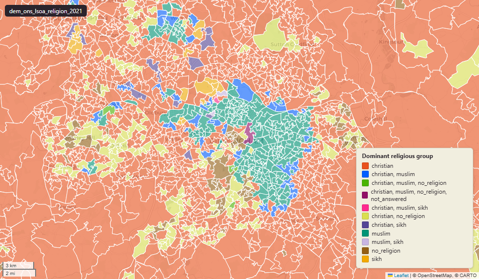

# ONS Census 2021 religion at Lower-layer Super Output Area (LSOA) 2021

Religion

`dem_ons_lsoa_religion_2021`

**SOURCE**

- Office for National Statistics (ONS), Census 2021, England and Wales.

**DOCUMENTATION**

- ONS dataset (TS030) : https://www.ons.gov.uk/datasets/TS030/editions/2021/versions/1
- ONS Census 2021 landing page : https://www.ons.gov.uk/census/2021

**DEFINITIONS**

- "The religion people connect or identify with (their religious affiliation), whether or not they practise or have belief in it. The question on religion in the census is voluntary; people could choose not to answer." (ONS Census 2021 Religion variable)
- Tick-box categories: "No religion"; "Christian"; "Buddhist"; "Hindu"; "Jewish"; "Muslim"; "Sikh"; "Other religion". Plus "Not answered" (the question is voluntary).

**SCOPE**

- England and Wales.
- Base population: all usual residents.

**CRS**

- EPSG:27700. Open Government Licence v3.0.

**DATA QUALITY CAVEATS**

- Column `dominant_relegious_group` misspells "religious" as "relegious" — preserved from the earlier P+P load.
- "Not answered" is not the same as "No religion" — the religion question is voluntary; "Not answered" counts those who chose not to respond.

**ENRICHMENT**

- `msoa21hclnm` — House of Commons Library readable MSOA name, joined at load on msoa21cd from House of Commons Library MSOA Names v2.3 (13 February 2026). Open Parliament Licence.

**LOADED INTO uk_baseline**

- Data: Census Day 21 March 2021.

## Columns

| Column | Type | Description / unit |
|---|---|---|
| `FID` | `bigint` |  |
| `lsoa21cd` | `text` | Source field "LSOA21CD"; ONS GSS 9-character LSOA 2021 code. |
| `lsoa21nm` | `text` | Source field "LSOA21NM"; human-readable LSOA 2021 name. |
| `geom` | `geometry(MultiPolygon,27700)` | MultiPolygon in EPSG:27700. Boundary geometry joined at load. |
| `msoa21cd` | `text` | Joined at load from ONS LSOA->MSOA lookup; 2021 MSOA GSS code. |
| `msoa21nm` | `text` | Joined at load from ONS LSOA->MSOA lookup; 2021 MSOA name. |
| `lad22cd` | `text` | Joined at load from ONS LSOA->LAD lookup; 2022 LAD GSS code. |
| `lad22nm` | `text` | Joined at load from ONS LSOA->LAD lookup; 2022 LAD name. |
| `rgn22cd` | `text` | Joined at load from ONS LSOA->Region lookup; 2022 Region GSS code. |
| `rgn22nm` | `text` | Joined at load from ONS LSOA->Region lookup; 2022 Region name. |
| `data_source` | `text` | Added during an earlier Prior + Partners loading pass. Fixed-string annotation; same value every row. |
| `data_resolution` | `text` | Added during an earlier Prior + Partners loading pass. Fixed-string annotation; same value every row. |
| `data_time_period` | `timestamp without time zone` | Added during an earlier Prior + Partners loading pass. Fixed annotation; same value every row. |
| `data_web_link` | `text` | Added during an earlier Prior + Partners loading pass. Fixed annotation; URL to the ONS dataset page. |
| `area_ha` | `double precision` | Area in hectares, computed at load from the geometry. Unit: hectares. Stale if geometry is later edited. |
| `buddhist_count` | `bigint` | Source field; count of "buddhist" in LSOA usual residents. |
| `christian_count` | `bigint` | Source field; count of "christian" in LSOA usual residents. |
| `hindu_count` | `bigint` | Source field; count of "hindu" in LSOA usual residents. |
| `jewish_count` | `bigint` | Source field; count of "jewish" in LSOA usual residents. |
| `muslim_count` | `bigint` | Source field; count of "muslim" in LSOA usual residents. |
| `no_religion_count` | `bigint` | Source field; count of "no religion" in LSOA usual residents. |
| `not_answered_count` | `bigint` | Source field; count of "not answered" in LSOA usual residents. |
| `other_religion_count` | `bigint` | Source field; count of "other religion" in LSOA usual residents. |
| `sikh_count` | `bigint` | Source field; count of "sikh" in LSOA usual residents. |
| `total_religion_pop` | `bigint` | Source field; base denominator for the percentages in this layer. |
| `buddhist_perc` | `double precision` | Source field; percentage of "buddhist" in LSOA usual residents. Unit: "percent (0 to 100)". |
| `christian_perc` | `double precision` | Source field; percentage of "christian" in LSOA usual residents. Unit: "percent (0 to 100)". |
| `hindu_perc` | `double precision` | Source field; percentage of "hindu" in LSOA usual residents. Unit: "percent (0 to 100)". |
| `jewish_perc` | `double precision` | Source field; percentage of "jewish" in LSOA usual residents. Unit: "percent (0 to 100)". |
| `muslim_perc` | `double precision` | Source field; percentage of "muslim" in LSOA usual residents. Unit: "percent (0 to 100)". |
| `no_religion_perc` | `double precision` | Source field; percentage of "no religion" in LSOA usual residents. Unit: "percent (0 to 100)". |
| `not_answered_perc` | `double precision` | Source field; percentage of "not answered" in LSOA usual residents. Unit: "percent (0 to 100)". |
| `other_religion_perc` | `double precision` | Source field; percentage of "other religion" in LSOA usual residents. Unit: "percent (0 to 100)". |
| `sikh_perc` | `double precision` | Source field; percentage of "sikh" in LSOA usual residents. Unit: "percent (0 to 100)". |
| `dominant_relegious_group` | `text` | Derived during an earlier Prior + Partners loading pass; label of the modal religious affiliation for the LSOA. Note: column name preserves the upstream misspelling "relegious" (should be "religious"). |
| `wd22cd` | `character varying` | Joined at load from ONS LSOA->Ward lookup; 2022 Ward GSS code. |
| `wd22nm` | `character varying` | Joined at load from ONS LSOA->Ward lookup; 2022 Ward name. |
| `fid` | `bigint` |  |
| `msoa21hclnm` | `text` | House of Commons Library readable MSOA name. Source field `msoa21hclnm` from House of Commons Library MSOA Names v2.3 (13 February 2026), joined at load on msoa21cd. Open Parliament Licence. |
