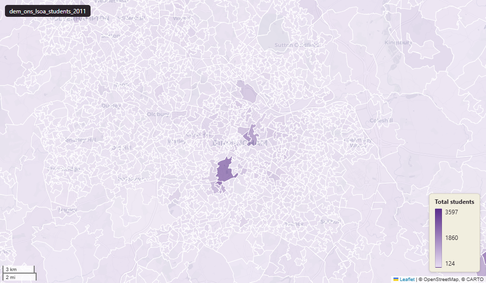

# ONS Census 2011 schoolchildren and full-time students at Lower-layer Super Output Area (LSOA) 2011

Students

`dem_ons_lsoa_students_2011`

**SOURCE**

- Office for National Statistics (ONS), Census 2011, England and Wales. Primary source: table KS501UK "Qualifications and students" augmented with student-related cross-tabs. Reference date 27 March 2011. Loaded via an earlier Prior + Partners pass; exact source combination not recorded.

**DOCUMENTATION**

- NOMIS Census 2011 KS501UK : https://www.nomisweb.co.uk/census/2011/ks501uk
- ONS Census 2011 landing page : https://www.ons.gov.uk/census/2011census

**DEFINITIONS**

- "A student is a person who is in full-time education either at school or in higher or further education." (Scotland's Census schoolchild / student indicator definition — same definition used by ONS for E&W Census 2011)
- "Schoolchildren and full-time students aged 16 and over were classified as economically active or inactive based on whether they were also in some form of employment in the week before Census Day." (ONS Census 2011 economic activity guidance)

**SCOPE**

- England and Wales. LSOA 2011 boundary; 34,753 distinct lsoa11cd.
- Base population: schoolchildren and full-time students at home address; subset breakdowns by age and economic activity.

**CRS**

- EPSG:27700 (OSGB 1936 / British National Grid).

**LICENCE**

- Open Government Licence v3.0.

**DATA QUALITY CAVEATS**

- This is Census 2011 data — superseded by Census 2021 (`dem_ons_lsoa_students_2021`). Use the 2021 layer for current analysis; this layer for historic comparison.
- Census 2011 counted higher-education students at their term-time address (same convention as 2021). University-town LSOAs show inflated student counts in term time.

**LOADED INTO uk_baseline**

- Data: Census Day 27 March 2011.

## Columns

| Column | Type | Description / unit |
|---|---|---|
| `lsoa11cd` | `text` | Source field "LSOA11CD"; ONS GSS 9-character LSOA 2011 code. |
| `lsoa11nm` | `text` | Source field "LSOA11NM"; human-readable LSOA 2011 name. |
| `geom` | `geometry(MultiPolygon,27700)` | MultiPolygon in EPSG:27700. Boundary geometry joined at load. |
| `lsoa21cd` | `text` | Source field "LSOA21CD"; ONS GSS 9-character LSOA 2021 code. |
| `lsoa21nm` | `text` | Source field "LSOA21NM"; human-readable LSOA 2021 name. |
| `lad22cd` | `text` | Joined at load from ONS LSOA->LAD lookup; 2022 LAD GSS code. |
| `lad22nm` | `text` | Joined at load from ONS LSOA->LAD lookup; 2022 LAD name. |
| `rgn22cd` | `text` | Joined at load from ONS LSOA->Region lookup; 2022 Region GSS code. |
| `rgn22nm` | `text` | Joined at load from ONS LSOA->Region lookup; 2022 Region name. |
| `data_source` | `text` | Added during an earlier Prior + Partners loading pass. Fixed-string annotation; same value every row. |
| `data_resolution` | `text` | Added during an earlier Prior + Partners loading pass. Fixed-string annotation; same value every row. |
| `data_time_period` | `timestamp without time zone` | Added during an earlier Prior + Partners loading pass. Fixed annotation; same value every row. |
| `data_web_link` | `text` | Added during an earlier Prior + Partners loading pass. Fixed annotation; URL to the ONS dataset page. |
| `area_ha` | `double precision` | Area in hectares, computed at load from the geometry. Unit: hectares. Stale if geometry is later edited. |
| `total_students_count` | `bigint` | Source field; total schoolchildren and full-time students in the LSOA at Census 2011. |
| `total_students_age_4_15_count` | `bigint` | Source field; count of "total students age 4 15" students in the LSOA at Census 2011. |
| `total_students_age_16_17_count` | `bigint` | Source field; count of "total students age 16 17" students in the LSOA at Census 2011. |
| `total_students_age_18_19_count` | `bigint` | Source field; count of "total students age 18 19" students in the LSOA at Census 2011. |
| `total_students_age_20_24_count` | `bigint` | Source field; count of "total students age 20 24" students in the LSOA at Census 2011. |
| `total_students_age_25_above_count` | `bigint` | Source field; count of "total students age 25 above" students in the LSOA at Census 2011. |
| `total_students_age_4_15_perc` | `double precision` | Source field; percentage of "total students age 4 15" students in the LSOA. Unit: "percent (0 to 100)". |
| `total_students_age_16_17_perc` | `double precision` | Source field; percentage of "total students age 16 17" students in the LSOA. Unit: "percent (0 to 100)". |
| `total_students_age_18_19_perc` | `double precision` | Source field; percentage of "total students age 18 19" students in the LSOA. Unit: "percent (0 to 100)". |
| `total_students_age_20_24_perc` | `double precision` | Source field; percentage of "total students age 20 24" students in the LSOA. Unit: "percent (0 to 100)". |
| `total_students_age_25_above_perc` | `double precision` | Source field; percentage of "total students age 25 above" students in the LSOA. Unit: "percent (0 to 100)". |
| `living_with_parents_count` | `bigint` | Source field; count of "living with parents" students in the LSOA at Census 2011. |
| `living_in_communal_establishment_uni_count` | `bigint` | Source field; count of "living in communal establishment uni" students in the LSOA at Census 2011. |
| `living_in_communal_establishment_other_count` | `bigint` | Source field; count of "living in communal establishment other" students in the LSOA at Census 2011. |
| `living_in_all_student_household_count` | `bigint` | Source field; count of "living in all student household" students in the LSOA at Census 2011. |
| `living_alone_count` | `bigint` | Source field; count of "living alone" students in the LSOA at Census 2011. |
| `living_in_other_household_count` | `bigint` | Source field; count of "living in other household" students in the LSOA at Census 2011. |
| `living_with_parents_perc` | `double precision` | Source field; percentage of "living with parents" students in the LSOA. Unit: "percent (0 to 100)". |
| `living_in_communal_establishment_uni_perc` | `double precision` | Source field; percentage of "living in communal establishment uni" students in the LSOA. Unit: "percent (0 to 100)". |
| `living_in_communal_establishment_other_perc` | `double precision` | Source field; percentage of "living in communal establishment other" students in the LSOA. Unit: "percent (0 to 100)". |
| `living_in_all_student_household_perc` | `double precision` | Source field; percentage of "living in all student household" students in the LSOA. Unit: "percent (0 to 100)". |
| `living_alone_perc` | `double precision` | Source field; percentage of "living alone" students in the LSOA. Unit: "percent (0 to 100)". |
| `living_in_other_household_perc` | `double precision` | Source field; percentage of "living in other household" students in the LSOA. Unit: "percent (0 to 100)". |
| `living_with_parents_age_4_15_count` | `bigint` | Source field; count of "living with parents age 4 15" students in the LSOA at Census 2011. |
| `living_in_communal_establishment_uni_age_4_15_count` | `bigint` | Source field; count of "living in communal establishment uni age 4 15" students in the LSOA at Census 2011. |
| `living_in_communal_establishment_other_age_4_15_count` | `bigint` | Source field; count of "living in communal establishment other age 4 15" students in the LSOA at Census 2011. |
| `living_in_all_student_household_age_4_15_count` | `bigint` | Source field; count of "living in all student household age 4 15" students in the LSOA at Census 2011. |
| `living_alone_age_4_15_count` | `bigint` | Source field; count of "living alone age 4 15" students in the LSOA at Census 2011. |
| `living_in_other_household_age_4_15_count` | `bigint` | Source field; count of "living in other household age 4 15" students in the LSOA at Census 2011. |
| `living_with_parents_age_4_15_perc` | `double precision` | Source field; percentage of "living with parents age 4 15" students in the LSOA. Unit: "percent (0 to 100)". |
| `living_in_communal_establishment_uni_age_4_15_perc` | `double precision` | Source field; percentage of "living in communal establishment uni age 4 15" students in the LSOA. Unit: "percent (0 to 100)". |
| `living_in_communal_establishment_other_age_4_15_perc` | `double precision` | Source field; percentage of "living in communal establishment other age 4 15" students in the LSOA. Unit: "percent (0 to 100)". |
| `living_in_all_student_household_age_4_15_perc` | `double precision` | Source field; percentage of "living in all student household age 4 15" students in the LSOA. Unit: "percent (0 to 100)". |
| `living_alone_age_4_15_perc` | `double precision` | Source field; percentage of "living alone age 4 15" students in the LSOA. Unit: "percent (0 to 100)". |
| `living_in_other_household_age_4_15_perc` | `double precision` | Source field; percentage of "living in other household age 4 15" students in the LSOA. Unit: "percent (0 to 100)". |
| `living_with_parents_age_16_17_count` | `bigint` | Source field; count of "living with parents age 16 17" students in the LSOA at Census 2011. |
| `living_in_communal_establishment_uni_age_16_17_count` | `bigint` | Source field; count of "living in communal establishment uni age 16 17" students in the LSOA at Census 2011. |
| `living_in_communal_establishment_other_age_16_17_count` | `bigint` | Source field; count of "living in communal establishment other age 16 17" students in the LSOA at Census 2011. |
| `living_in_all_student_household_age_16_17_count` | `bigint` | Source field; count of "living in all student household age 16 17" students in the LSOA at Census 2011. |
| `living_alone_age_16_17_count` | `bigint` | Source field; count of "living alone age 16 17" students in the LSOA at Census 2011. |
| `living_in_other_household_age_16_17_count` | `bigint` | Source field; count of "living in other household age 16 17" students in the LSOA at Census 2011. |
| `living_with_parents_age_16_17_perc` | `double precision` | Source field; percentage of "living with parents age 16 17" students in the LSOA. Unit: "percent (0 to 100)". |
| `living_in_communal_establishment_uni_age_16_17_perc` | `double precision` | Source field; percentage of "living in communal establishment uni age 16 17" students in the LSOA. Unit: "percent (0 to 100)". |
| `living_in_communal_establishment_other_age_16_17_perc` | `double precision` | Source field; percentage of "living in communal establishment other age 16 17" students in the LSOA. Unit: "percent (0 to 100)". |
| `living_in_all_student_household_age_16_17_perc` | `double precision` | Source field; percentage of "living in all student household age 16 17" students in the LSOA. Unit: "percent (0 to 100)". |
| `living_alone_age_16_17_perc` | `double precision` | Source field; percentage of "living alone age 16 17" students in the LSOA. Unit: "percent (0 to 100)". |
| `living_in_other_household_age_16_17_perc` | `double precision` | Source field; percentage of "living in other household age 16 17" students in the LSOA. Unit: "percent (0 to 100)". |
| `living_with_parents_age_18_19_count` | `bigint` | Source field; count of "living with parents age 18 19" students in the LSOA at Census 2011. |
| `living_in_communal_establishment_uni_age_18_19_count` | `bigint` | Source field; count of "living in communal establishment uni age 18 19" students in the LSOA at Census 2011. |
| `living_in_communal_establishment_other_age_18_19_count` | `bigint` | Source field; count of "living in communal establishment other age 18 19" students in the LSOA at Census 2011. |
| `living_in_all_student_household_age_18_19_count` | `bigint` | Source field; count of "living in all student household age 18 19" students in the LSOA at Census 2011. |
| `living_alone_age_18_19_count` | `bigint` | Source field; count of "living alone age 18 19" students in the LSOA at Census 2011. |
| `living_in_other_household_age_18_19_count` | `bigint` | Source field; count of "living in other household age 18 19" students in the LSOA at Census 2011. |
| `living_with_parents_age_18_19_perc` | `double precision` | Source field; percentage of "living with parents age 18 19" students in the LSOA. Unit: "percent (0 to 100)". |
| `living_in_communal_establishment_uni_age_18_19_perc` | `double precision` | Source field; percentage of "living in communal establishment uni age 18 19" students in the LSOA. Unit: "percent (0 to 100)". |
| `living_in_communal_establishment_other_age_18_19_perc` | `double precision` | Source field; percentage of "living in communal establishment other age 18 19" students in the LSOA. Unit: "percent (0 to 100)". |
| `living_in_all_student_household_age_18_19_perc` | `double precision` | Source field; percentage of "living in all student household age 18 19" students in the LSOA. Unit: "percent (0 to 100)". |
| `living_alone_age_18_19_perc` | `double precision` | Source field; percentage of "living alone age 18 19" students in the LSOA. Unit: "percent (0 to 100)". |
| `living_in_other_household_age_18_19_perc` | `double precision` | Source field; percentage of "living in other household age 18 19" students in the LSOA. Unit: "percent (0 to 100)". |
| `living_with_parents_age_20_24_count` | `bigint` | Source field; count of "living with parents age 20 24" students in the LSOA at Census 2011. |
| `living_in_communal_establishment_uni_age_20_24_count` | `bigint` | Source field; count of "living in communal establishment uni age 20 24" students in the LSOA at Census 2011. |
| `living_in_communal_establishment_other_age_20_24_count` | `bigint` | Source field; count of "living in communal establishment other age 20 24" students in the LSOA at Census 2011. |
| `living_in_all_student_household_age_20_24_count` | `bigint` | Source field; count of "living in all student household age 20 24" students in the LSOA at Census 2011. |
| `living_alone_age_20_24_count` | `bigint` | Source field; count of "living alone age 20 24" students in the LSOA at Census 2011. |
| `living_in_other_household_age_20_24_count` | `bigint` | Source field; count of "living in other household age 20 24" students in the LSOA at Census 2011. |
| `living_with_parents_age_20_24_perc` | `double precision` | Source field; percentage of "living with parents age 20 24" students in the LSOA. Unit: "percent (0 to 100)". |
| `living_in_communal_establishment_uni_age_20_24_perc` | `double precision` | Source field; percentage of "living in communal establishment uni age 20 24" students in the LSOA. Unit: "percent (0 to 100)". |
| `living_in_communal_establishment_other_age_20_24_perc` | `double precision` | Source field; percentage of "living in communal establishment other age 20 24" students in the LSOA. Unit: "percent (0 to 100)". |
| `living_in_all_student_household_age_20_24_perc` | `double precision` | Source field; percentage of "living in all student household age 20 24" students in the LSOA. Unit: "percent (0 to 100)". |
| `living_alone_age_20_24_perc` | `double precision` | Source field; percentage of "living alone age 20 24" students in the LSOA. Unit: "percent (0 to 100)". |
| `living_in_other_household_age_20_24_perc` | `double precision` | Source field; percentage of "living in other household age 20 24" students in the LSOA. Unit: "percent (0 to 100)". |
| `living_with_parents_age_25_above_count` | `bigint` | Source field; count of "living with parents age 25 above" students in the LSOA at Census 2011. |
| `living_in_communal_establishment_uni_age_25_above_count` | `bigint` | Source field; count of "living in communal establishment uni age 25 above" students in the LSOA at Census 2011. |
| `living_in_communal_establishment_other_age_25_above_count` | `bigint` | Source field; count of "living in communal establishment other age 25 above" students in the LSOA at Census 2011. |
| `living_in_all_student_household_age_25_above_count` | `bigint` | Source field; count of "living in all student household age 25 above" students in the LSOA at Census 2011. |
| `living_alone_age_25_above_count` | `bigint` | Source field; count of "living alone age 25 above" students in the LSOA at Census 2011. |
| `living_in_other_household_age_25_above_count` | `bigint` | Source field; count of "living in other household age 25 above" students in the LSOA at Census 2011. |
| `living_with_parents_age_25_above_perc` | `double precision` | Source field; percentage of "living with parents age 25 above" students in the LSOA. Unit: "percent (0 to 100)". |
| `living_in_communal_establishment_uni_age_25_above_perc` | `double precision` | Source field; percentage of "living in communal establishment uni age 25 above" students in the LSOA. Unit: "percent (0 to 100)". |
| `living_in_communal_establishment_other_age_25_above_perc` | `double precision` | Source field; percentage of "living in communal establishment other age 25 above" students in the LSOA. Unit: "percent (0 to 100)". |
| `living_in_all_student_household_age_25_above_perc` | `double precision` | Source field; percentage of "living in all student household age 25 above" students in the LSOA. Unit: "percent (0 to 100)". |
| `living_alone_age_25_above_perc` | `double precision` | Source field; percentage of "living alone age 25 above" students in the LSOA. Unit: "percent (0 to 100)". |
| `living_in_other_household_age_25_above_perc` | `double precision` | Source field; percentage of "living in other household age 25 above" students in the LSOA. Unit: "percent (0 to 100)". |
| `total_students_2021_count` | `double precision` | Source field; total schoolchildren and full-time students in the LSOA at Census 2021. Added by P+P load for cross-year comparison. |
| `change_instudent_population_10_yr` | `double precision` | Derived during P+P load; change in total student count from Census 2011 to Census 2021. Calculation rule not recorded. |
| `wd22cd` | `character varying` | Joined at load from ONS LSOA->Ward lookup; 2022 Ward GSS code. |
| `wd22nm` | `character varying` | Joined at load from ONS LSOA->Ward lookup; 2022 Ward name. |
| `fid` | `bigint` |  |
