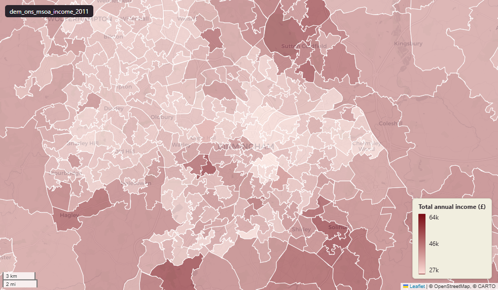

# ONS small area model-based income estimates at Middle-layer Super Output Area (MSOA) 2011

Income 2011

`dem_ons_msoa_income_2011`

**SOURCE**

- Office for National Statistics (ONS), "Small Area Income Estimates for Middle layer Super Output Areas, England and Wales".

**DOCUMENTATION**

- ONS Small Area Income landing : https://www.ons.gov.uk/peoplepopulationandcommunity/personalandhouseholdfinances/incomeandwealth/bulletins/smallareamodelbasedincomeestimates
- ONS methodology : https://www.ons.gov.uk/peoplepopulationandcommunity/personalandhouseholdfinances/incomeandwealth/methodologies/estimatingdistributionsofhouseholdincomeformiddlelayersuperoutputareasin2011usingsmallareaestimationmethods

**DEFINITIONS**

- "Net weekly household income adjusted for household size and composition (equivalised), after housing costs." (ONS Small Area Income methodology)
- "Equivalised income represents the income level of every individual in the household. Equivalisation considers the household size and composition, and acknowledges that, for example, two people do not need double the income of one person to have the same living standards." (ONS Small Area Income bulletin)
- These are MODEL-BASED estimates, not survey-direct measurements. ONS combined administrative tax records with the Family Resources Survey using small-area estimation methods to produce MSOA-level estimates.

**SCOPE**

- England and Wales. MSOA 2011 boundary.
- Reference period: financial year 2011/12.

**CRS**

- EPSG:27700 (OSGB 1936 / British National Grid).

**LICENCE**

- Open Government Licence v3.0.

**DATA QUALITY CAVEATS**

- County and Spatial Development Strategy columns are England and Wales only; rows elsewhere carry no county or SDS. Wales and the Isles of Scilly carry a county but no SDS. Rows with no Local Authority District code are NULL in all four columns.
- This table is published on 2011 MSOA boundaries and its values are 2011-vintage; `msoa21hclnm` is a readable label for the corresponding 2021 MSOA and does not re-aggregate any value onto 2021 geography. For MSOAs unchanged in 2021 the name is exact. For the small number of 2011 MSOAs that were split, the column lists every successor name separated by a semicolon, so those rows carry more than one name and cannot be joined to a single msoa21cd. No 2021 geography codes are recorded on this table.
- "The modelling process tends to shrink estimates towards the average level, so the true distribution of MSOA average incomes will have more extreme high and low values than the estimated values." (ONS methodology page)

**ENRICHMENT**

- `sds_name` / `sds_group` — Spatial Development Strategy area and devolution status, a Prior + Partners categorisation over Ministry of Housing, Communities and Local Government (MHCLG) English devolution policy, joined at load on the row's Local Authority District 2025 code via uk.ref_lad25_ctyua25_sds_lu_jul2026.
- `msoa21hclnm` — House of Commons Library readable MSOA name for the 2021 MSOA corresponding to this row's 2011 MSOA, joined at load via uk.ref_msoa11_msoa21_name_lu. Open Parliament Licence.

**LOADED INTO uk_baseline**

- Data: 2011/12 (ONS publication 2014/2015).

## Columns

| Column | Type | Description / unit |
|---|---|---|
| `msoa11cd` | `text` | Joined at load from ONS LSOA->MSOA 2011 lookup; 2011 MSOA GSS code. |
| `msoa11nm` | `text` | Joined at load from ONS LSOA->MSOA 2011 lookup; 2011 MSOA name. |
| `geom` | `geometry(MultiPolygon,27700)` | MultiPolygon in EPSG:27700. Boundary geometry joined at load. |
| `lad22cd` | `text` | Joined at load from ONS LSOA->LAD lookup; 2022 LAD GSS code. |
| `lad22nm` | `text` | Joined at load from ONS LSOA->LAD lookup; 2022 LAD name. |
| `rgn22cd` | `text` | Joined at load from ONS LSOA->Region lookup; 2022 Region GSS code. |
| `rgn22nm` | `text` | Joined at load from ONS LSOA->Region lookup; 2022 Region name. |
| `data_source` | `text` | Added during an earlier Prior + Partners loading pass. Fixed-string annotation; same value every row. |
| `data_resolution` | `text` | Added during an earlier Prior + Partners loading pass. Fixed-string annotation; same value every row. |
| `data_time_period` | `text` | Added during an earlier Prior + Partners loading pass. Fixed annotation; same value every row. |
| `data_web_link` | `text` | Added during an earlier Prior + Partners loading pass. Fixed annotation; URL to the ONS dataset page. |
| `area_ha` | `double precision` | Area in hectares, computed at load from the geometry. Unit: hectares. Stale if geometry is later edited. |
| `total_annual_income` | `bigint` | Source field; modelled total annual household income for the MSOA. Unit: "GBP per year". Reference period 2011/12. Model-based estimate — see DATA QUALITY CAVEATS. |
| `net_annual_income` | `bigint` | Source field; modelled net annual household income (after direct taxes and benefits). Unit: "GBP per year". Reference period 2011/12. |
| `net_annual_income_before_housing_costs` | `bigint` | Source field; modelled net annual household income before housing costs. Unit: "GBP per year". Reference period 2011/12. |
| `net_annual_income_after_housing_costs` | `bigint` | Source field; modelled net annual household income after housing costs. Unit: "GBP per year". Reference period 2011/12. |
| `wd22cd` | `character varying` | Joined at load from ONS LSOA->Ward lookup; 2022 Ward GSS code. |
| `wd22nm` | `character varying` | Joined at load from ONS LSOA->Ward lookup; 2022 Ward name. |
| `fid` | `bigint` |  |
| `msoa21hclnm` | `text` | House of Commons Library readable MSOA name for the 2021 MSOA corresponding to this row's 2011 MSOA, joined at load on the 2011 code via uk.ref_msoa11_msoa21_name_lu. Where the MSOA is unchanged in 2021 (the great majority) the name is exact. Where a 2011 MSOA was split into several 2021 MSOAs this records all successor names, separated by a semicolon. Where a 2011 MSOA was merged into a larger 2021 MSOA, or its code was reissued, it records that single successor name. Open Parliament Licence. |
| `lad25cd` | `text` | Local Authority District 2025 code (current administering authority). Traced via uk.ref_lad25_ctyua25_sds_lu_jul2026 from the row's Local Authority District 2022 code. Open Government Licence v3.0. |
| `lad25nm` | `text` | Local Authority District 2025 name (current administering authority). Traced via uk.ref_lad25_ctyua25_sds_lu_jul2026 from the row's Local Authority District 2022 code. Open Government Licence v3.0. |
| `ctyua25cd` | `text` | County or unitary authority code at 1 April 2025. Joined at load via uk.ref_lad25_ctyua25_sds_lu_jul2026 on the row's Local Authority District 2025 code. Open Government Licence v3.0. |
| `ctyua25nm` | `text` | County or unitary authority name at 1 April 2025. Joined at load via uk.ref_lad25_ctyua25_sds_lu_jul2026 on the row's Local Authority District 2025 code. Open Government Licence v3.0. |
| `sds_name` | `text` | Spatial Development Strategy (SDS) area, a Prior + Partners categorisation over Ministry of Housing, Communities and Local Government (MHCLG) English devolution policy. Joined at load via uk.ref_lad25_ctyua25_sds_lu_jul2026 on the row's Local Authority District 2025 code. Open Government Licence v3.0. |
| `sds_group` | `text` | Devolution status of the Spatial Development Strategy area: Existing Devolution Footprints, Devolution Priority Programme, Other Proposed Geographies or Remaining Areas. Joined at load via uk.ref_lad25_ctyua25_sds_lu_jul2026 on the row's Local Authority District 2025 code. Open Government Licence v3.0. |
