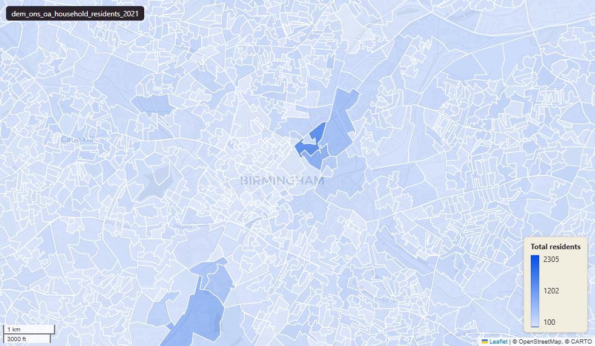

# ONS Census 2021 usual residents at Output Area (OA) 2021

Census 2021 Residents Households

`dem_ons_oa_household_residents_2021`

**SOURCE**

- Office for National Statistics (ONS), Census 2021, England and Wales.

**DOCUMENTATION**

- ONS dataset (TS001 at OA level) : https://www.ons.gov.uk/datasets/TS001/editions/2021/versions/3
- ONS Census 2021 landing page : https://www.ons.gov.uk/census/2021

**DEFINITIONS**

- "A usual resident is anyone who, on Census Day, was in the UK and had stayed or intended to stay in the UK for a period of 12 months or more, or had a permanent UK address and was outside the UK and intended to be outside the UK for less than 12 months." (ONS Census 2021 Demography variables)
- "The number of usual residents living in households or in communal establishments." (ONS Census 2021 Resident type variable)

**SCOPE**

- England and Wales. Output Area 2021 boundary; 188,880 OAs.
- Base population: all usual residents.

**CRS**

- EPSG:27700 (OSGB 1936 / British National Grid).

**LICENCE**

- Open Government Licence v3.0.

**DATA QUALITY CAVEATS**

- Output Area is the lowest published Census geography.

**ENRICHMENT**

- `msoa21hclnm` — House of Commons Library readable MSOA name, joined at load on oa21cd via the ONS 2021 output-area hierarchy (uk_baseline.adm_ons_msoa_boundary_2021). Open Parliament Licence.

**LOADED INTO uk_baseline**

- Data: Census Day 21 March 2021.

## Columns

| Column | Type | Description / unit |
|---|---|---|
| `fid` | `integer` |  |
| `oa21cd` | `text` | Source field "OA21CD"; ONS GSS 9-character Output Area 2021 code. |
| `total_residents` | `integer` | Source field; count of all usual residents in the Output Area on Census Day. Unit: "persons". |
| `residents_in_household` | `integer` | Source field; count of usual residents living in households (excludes communal establishments). Unit: "persons". |
| `residents_in_communal` | `integer` | Source field; count of usual residents living in communal establishments (e.g. care home, prison, hostel). Unit: "persons". |
| `geom` | `geometry(MultiPolygon,27700)` | MultiPolygon in EPSG:27700. Boundary geometry joined at load. |
| `msoa21cd` | `text` | Middle Layer Super Output Area (MSOA) 2021 code of the row's Output Area (OA); OAs nest wholly within LSOAs within MSOAs. Joined at load on oa21cd via uk_baseline.adm_ons_oa_boundaries_dec2021 and uk_baseline.adm_ons_lsoa_boundary_2021, then uk_baseline.adm_ons_msoa_boundary_2021. Open Government Licence v3.0. |
| `msoa21nm` | `text` | Official Office for National Statistics MSOA 2021 name of the row's Output Area (OA); OAs nest wholly within LSOAs within MSOAs. Joined at load on oa21cd via uk_baseline.adm_ons_oa_boundaries_dec2021 and uk_baseline.adm_ons_lsoa_boundary_2021, then uk_baseline.adm_ons_msoa_boundary_2021. Open Government Licence v3.0. |
| `msoa21hclnm` | `text` | House of Commons Library readable MSOA name of the row's Output Area (OA); OAs nest wholly within LSOAs within MSOAs. Joined at load on oa21cd via uk_baseline.adm_ons_oa_boundaries_dec2021 and uk_baseline.adm_ons_lsoa_boundary_2021, then uk_baseline.adm_ons_msoa_boundary_2021, which carries the House of Commons Library name. Open Parliament Licence. |
| `lad22cd` | `text` | Local Authority District 2022 code (2021 LAD geography, anchored to the MSOA 2021 name scoping), best-fit assigned from the row's Output Area (OA); OAs nest wholly within LSOAs within MSOAs. Joined at load on oa21cd via uk_baseline.adm_ons_oa_boundaries_dec2021 and uk_baseline.adm_ons_lsoa_boundary_2021, then uk_baseline.adm_ons_msoa_boundary_2021. Open Government Licence v3.0. |
| `lad22nm` | `text` | Local Authority District 2022 name (2021 LAD geography), best-fit assigned from the row's Output Area (OA); OAs nest wholly within LSOAs within MSOAs. Joined at load on oa21cd via uk_baseline.adm_ons_oa_boundaries_dec2021 and uk_baseline.adm_ons_lsoa_boundary_2021, then uk_baseline.adm_ons_msoa_boundary_2021. Open Government Licence v3.0. |
| `lad25cd` | `text` | Local Authority District 2025 code (current administering authority), best-fit assigned from the row's Output Area (OA); OAs nest wholly within LSOAs within MSOAs. Joined at load on oa21cd via uk_baseline.adm_ons_oa_boundaries_dec2021 and uk_baseline.adm_ons_lsoa_boundary_2021, then uk_baseline.adm_ons_msoa_boundary_2021. Open Government Licence v3.0. |
| `lad25nm` | `text` | Local Authority District 2025 name (current administering authority), best-fit assigned from the row's Output Area (OA); OAs nest wholly within LSOAs within MSOAs. Joined at load on oa21cd via uk_baseline.adm_ons_oa_boundaries_dec2021 and uk_baseline.adm_ons_lsoa_boundary_2021, then uk_baseline.adm_ons_msoa_boundary_2021. Open Government Licence v3.0. |
