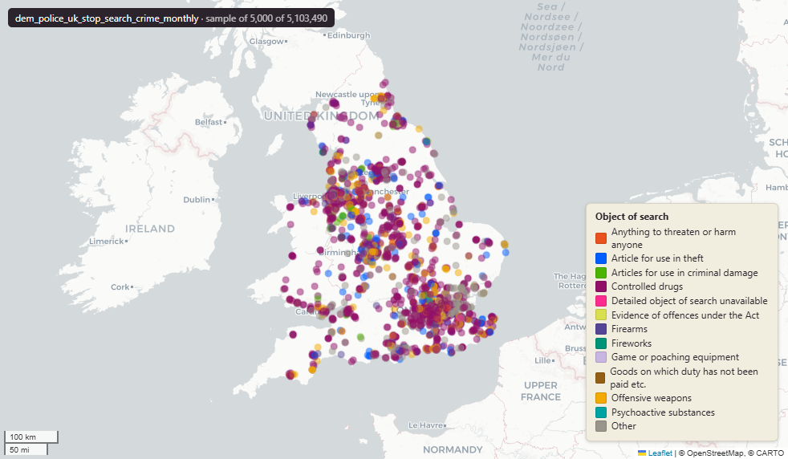

# data.police.uk stop-and-search events, monthly archives

`dem_police_uk_stop_search_crime_monthly`

<a href="http://localhost:7800/?layer=uk_baseline.dem_police_uk_stop_search_crime_monthly" target="_blank" rel="noopener">Open in the Dashboard &#8599;</a> (start your local Dashboard first)

**SOURCE**

- Data published by data.police.uk (Home Office). 43 territorial police forces in England and Wales contribute CSV files. No Crime ID in the source - this table is an independent entity, cannot be joined to dem_police_uk_street_crime_monthly.

**DOCUMENTATION**

- Archive index : https://data.police.uk/data/archive/
- Data definitions : https://data.police.uk/about/

**DEFINITIONS**

- Search types: typically "Person search" or "Vehicle search".
- Stop-and-search events are recorded per Police and Criminal Evidence Act (PACE) Code A and related legislation; the legislation column carries the specific authority cited.

**SCOPE**

- Police forces in England and Wales (plus British Transport Police for the rail network).
- Rolling 36-month window - months falling out of the window freeze at their last-published state.

**CRS**

- EPSG:27700 (British National Grid / BNG). Reprojected at load from EPSG:4326 lat/lon supplied in the source CSV.

**LICENCE**

- Open Government Licence v3.0.

**DATA QUALITY CAVEATS**

- No upstream Crime ID - rows cannot be linked to dem_police_uk_street_crime_monthly.
- 100% row-stable across archive releases (verified by internal archive-comparison checks)
- no case progression to worry about, unlike the street table.
- Some rows have NULL geom where the source CSV had blank lat/lon.

**ENRICHMENT**

- force : parsed from CSV filename slug (source CSV has no force column).
- record_month : derived from search_ts (YYYY-MM truncation).
- geom : reprojected from lat/lon at load.

**NOT IN THIS DATASET**

- Northern Ireland (PSNI) and Scotland (Police Scotland) do not publish via data.police.uk archives.

**LOADED INTO uk_baseline**

- Loaded by PNC, Monthly. Idempotent on source_file.

## Columns

| Column | Type | Description / unit |
|---|---|---|
| `gid` | `bigint` |  |
| `search_type` | `text` | Source field "Type"; "Person search" or "Vehicle search". |
| `search_ts` | `timestamp with time zone` | Full ISO timestamp from the Date column (kept; not truncated to day). |
| `record_month` | `text` | YYYY-MM derived from search_ts. |
| `part_of_op` | `boolean` | Source field "Part of a policing operation"; boolean. |
| `policing_op` | `text` | Source field "Policing operation"; free-text name of the operation, where applicable. |
| `longitude` | `double precision` | Source field "Longitude"; Unit: "degrees" (EPSG:4326). |
| `latitude` | `double precision` | Source field "Latitude"; Unit: "degrees" (EPSG:4326). |
| `gender` | `text` | Source field "Gender"; gender of the searched subject as recorded by the officer. |
| `age_range` | `text` | Source field "Age range"; banded age (e.g. "10-17", "18-24", "25-34", "over 34"). |
| `self_ethnicity` | `text` | Source field "Self-defined ethnicity"; ethnicity as stated by the subject. |
| `officer_ethnicity` | `text` | Source field "Officer-defined ethnicity"; ethnicity as observed by the officer. |
| `legislation` | `text` | Source field "Legislation"; statutory authority cited for the search (e.g. PACE 1984 s.1). |
| `object_of_search` | `text` | Source field "Object of search"; what officers were looking for (e.g. "Stolen goods", "Controlled drugs"). |
| `outcome` | `text` | Source field "Outcome"; result of the search (e.g. "Arrest", "Nothing found - no further action"). |
| `outcome_linked` | `boolean` | Source field "Outcome linked to object of search"; boolean. |
| `outer_removal` | `boolean` | Source field "Removal of more than just outer clothing"; boolean indicating strip-search. |
| `geom` | `geometry(Point,27700)` | Reprojected from EPSG:4326 (longitude, latitude) at load time. |
| `force` | `text` | Police force slug parsed from CSV filename. Source CSV has no force column. |
| `source_file` | `text` | CSV filename this row came from. Used as the idempotency key by the loader. |
| `load_ts` | `date` | Date this row was loaded into PostGIS (CURRENT_DATE default). |
