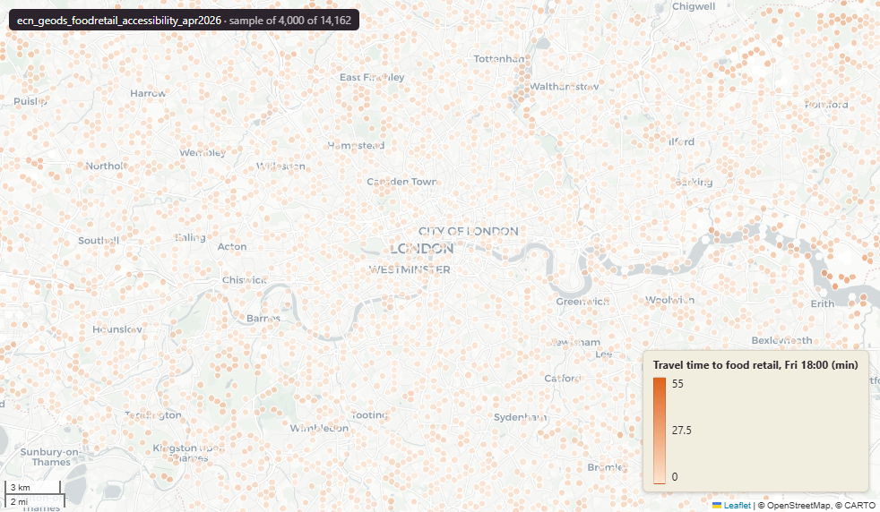

# GeoDS London Nighttime Access to Food Retail Options, April 2026

Foodretail_accessibility

`ecn_geods_foodretail_accessibility_apr2026`

**SOURCE**

- Geographic Data Service (GeoDS), Smart Data Research UK (SDR UK): University College London (UCL), University of Liverpool, University of Oxford, University of Edinburgh.
- Dataset created 2026-01-28; last updated by publisher 2026-04-15.
- Underlying analysis: Iliev, M., Cheshire, J., & Law, S. (2026). "Revealing the geography of food (in)accessibility for nighttime workers in the Greater London Area." Urban Studies, 0(0).

**DOCUMENTATION**

- Catalogue page : https://data.geods.ac.uk/dataset/london-nighttime-access-to-food-retail-options
- Source files : hex_foodretail_accessibility.gpkg, hex_food_variable_dictionary.csv, hex_food_data_summary.csv, food_travel_time_allhex.csv

**DEFINITIONS**

- Hex_ID: "Unique cell ID of bespoke BT hexagonal grid" (hex_food_variable_dictionary.csv)
- travel_time_xxxx_yy: "Travel-time to the closest open food retail outlet on day xxxx (Friday or Saturday) at yy (hour of the day)" (hex_food_variable_dictionary.csv)
- Retail outlets in scope: Supermarkets, Grocers, Greengrocers & Fruitsellers, Convenience Stores. 8,337 outlets analysed. (catalogue page)
- General Transit Feed Specification (GTFS) schedules used: 1-2 March 2024. Multimodal routing combines walking, waiting and transfer times. (catalogue page)

**SCOPE**

- Greater London Authority (GLA) area; outlet capture extends to outlets within 2,000 metres of the GLA boundary.
- 15,041 hexagonal cells, 350-metre spacing.
- Temporal coverage: Friday 06:00 to Saturday 06:00, snapshot week of 2024-03-01 to 2024-03-02.

**CRS**

- EPSG:27700 (OSGB36 / British National Grid). Native CRS as published; no reprojection at load.

**LICENCE**

- UK Open Government Licence (OGL) v3.0.

**DATA QUALITY CAVEATS**

- Travel-time UNIT is INFERRED as minutes. The publisher's hex_food_variable_dictionary.csv does NOT state a unit. The inference is based on the routing description on the catalogue page, the 0-60 value range, and the temporal granularity. Confirm with publisher before any unit-sensitive downstream use.
- NULL share per hourly snapshot is 2.5%-3.9% (peaking saturday_01-03). Publisher documentation does not specify whether NULL = "no outlet reachable inside the analysis cap" or "missing from analysis".
- Values appear capped at 60. Whether this is the analytical horizon or the maximum observed travel time is not documented.
- Hex_ID is stored as double precision but the publisher's data summary reports type=integer. Values are well within int4 range.

**LOADED INTO uk_baseline**

- Data published: 2026-04-15
- Imported: 2026-05-28 by PNC

MSOA SPLIT (added 3 July 2026)

- Geometry split to one row per (source feature x MSOA 2021). Each row carries that MSOA's msoa21cd / msoa21nm / msoa21hclnm and best-fit lad22 / lad25. The source feature's original primary key is preserved as `source_fid`; `gid` is a fresh surrogate primary key. Features with no MSOA overlap (offshore or outside England & Wales) are kept whole with NULL geography columns.

## Columns

| Column | Type | Description / unit |
|---|---|---|
| `source_fid` | `bigint` | Primary key of the source feature in the pre-split layer uk.ecn_geods_foodretail_accessibility_apr2026__preswap_jul03 (non-unique here: a feature spanning N MSOAs has N rows). |
| `hex_id` | `double precision` |  |
| `travel_time_friday_06` | `double precision` |  |
| `travel_time_friday_09` | `double precision` |  |
| `travel_time_friday_12` | `double precision` |  |
| `travel_time_friday_15` | `double precision` |  |
| `travel_time_friday_18` | `double precision` |  |
| `travel_time_friday_19` | `double precision` |  |
| `travel_time_friday_20` | `double precision` |  |
| `travel_time_friday_21` | `double precision` |  |
| `travel_time_friday_22` | `double precision` |  |
| `travel_time_friday_23` | `double precision` |  |
| `travel_time_saturday_00` | `double precision` |  |
| `travel_time_saturday_01` | `double precision` |  |
| `travel_time_saturday_02` | `double precision` |  |
| `travel_time_saturday_03` | `double precision` |  |
| `travel_time_saturday_04` | `double precision` |  |
| `travel_time_saturday_05` | `double precision` |  |
| `msoa21cd` | `character varying` | Middle Layer Super Output Area (MSOA) 2021 code of this piece. Open Government Licence v3.0. |
| `msoa21nm` | `character varying` | Official ONS MSOA 2021 name of this piece. Open Government Licence v3.0. |
| `msoa21hclnm` | `text` | House of Commons Library readable MSOA name of this piece. Open Parliament Licence. |
| `lad22cd` | `text` | Local Authority District 2022 code (2021 LAD geography, anchored to the MSOA 2021 name scoping), best-fit from this piece's msoa21cd. Open Government Licence v3.0. |
| `lad22nm` | `text` | Local Authority District 2022 name (2021 LAD geography), best-fit from this piece's msoa21cd. Open Government Licence v3.0. |
| `lad25cd` | `text` | Local Authority District 2025 code (current administering authority), best-fit from this piece's msoa21cd. Open Government Licence v3.0. |
| `lad25nm` | `text` | Local Authority District 2025 name (current administering authority), best-fit from this piece's msoa21cd. Open Government Licence v3.0. |
| `geom` | `geometry(MultiPolygon,27700)` |  |
| `gid` | `bigint` |  |
