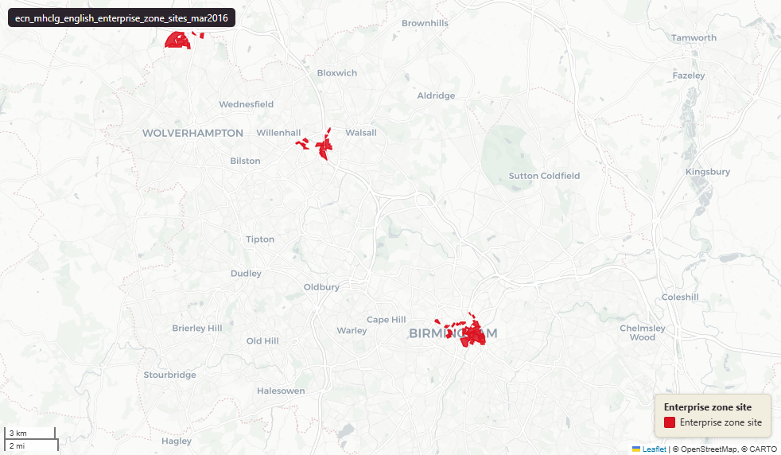

# MHCLG English Enterprise Zone site boundaries, March 2016

English Enterprise Zone Sites

`ecn_mhclg_english_enterprise_zone_sites_mar2016`

**SOURCE**

- Ministry of Housing, Communities and Local Government (MHCLG), distributed via data.gov.uk dataset "English Enterprise Zone Sites" (publication 17 March 2016).

**DOCUMENTATION**

- Dataset landing page : https://www.data.gov.uk/dataset/9244b0fe-23ce-4d1c-895b-5716b441c4df/english-enterprise-zone-sites
- Enterprise Zones programme : https://www.gov.uk/guidance/enterprise-zones

**DEFINITIONS**

- "Enterprise Zones are designated areas aimed at stimulating economic growth by offering incentives to businesses to establish or expand their operations within them." (gov.uk "Enterprise Zones" guidance)
- Programme context: zones announced March 2011 and rolled out from 2012 onwards; the March 2016 dataset captures the position at that point with 48 zones operational.

**SCOPE**

- England. 535 polygon site features across 48 Enterprise Zones as of 17 March 2016.

**CRS**

- EPSG:27700 (OSGB 1936 / British National Grid).

**LICENCE**

- Ordnance Survey Public Sector End User Licence - INSPIRE (per the data.gov.uk dataset metadata). Not standard Open Government Licence v3.0; check downstream re-use terms against the OS Public Sector / INSPIRE licence wording.

**DATA QUALITY CAVEATS**

- Geometry is MultiPolygonZ (carries Z coordinates inherited from the source shapefile). Z values are not analytically meaningful for these polygons; treat as 0 for any height-related use.
- This is a 2016 snapshot. The Enterprise Zones programme has since been extended (further zones added in 2016-2017) and some zones have wound down. Does not represent the current position.
- `date_start` is stored as text (varchar(20)), not a typed date.

**UPDATE REQUIRED**

- This dataset is a 2016 release of an ongoing programme. The current Enterprise Zones position is published via gov.uk and the Cities and Local Growth Unit. If a current-edition layer is needed, refresh from the latest publication.

**LOADED INTO uk_baseline**

- Loaded by PNC, March 2026.

## Columns

| Column | Type | Description / unit |
|---|---|---|
| `id` | `integer` | Source field "id"; row identifier preserved at load. |
| `geom` | `geometry(MultiPolygonZ,27700)` | MultiPolygonZ in EPSG:27700. Z values inherited from source shapefile; not analytically meaningful. |
| `ez` | `character varying(50)` | Source field "EZ"; Enterprise Zone name. |
| `shape_leng` | `double precision` | Source field "Shape_Length"; legacy ArcGIS shape perimeter. Unit: "metres" (EPSG:27700 perimeter). |
| `shape_area` | `double precision` | Source field "Shape_Area"; legacy ArcGIS shape area. Unit: "square metres" (EPSG:27700 area). |
| `brd` | `character varying(5)` | Source field "BRD"; "Yes" / "No" flag - site qualifies for the Business Rates Discount (BRD) incentive. |
| `brr` | `character varying(5)` | Source field "BRR"; "Yes" / "No" flag - site qualifies for the Business Rates Retention (BRR) arrangement. |
| `eca` | `character varying(5)` | Source field "ECA"; "Yes" / "No" flag - site qualifies for Enhanced Capital Allowances (ECA). |
| `ldo` | `character varying(5)` | Source field "LDO"; "Yes" / "No" flag - site is covered by a Local Development Order (LDO). |
| `ez_website` | `character varying(75)` | Source field "EZ_Website"; URL of the Enterprise Zone's lead website. |
| `sectors` | `character varying(150)` | Source field "Sectors"; comma-separated list of priority sectors for the site (e.g. "Advanced Manufacturing/Engineering"). |
| `subez` | `character varying(50)` | Source field "SubEZ"; sub-Enterprise Zone identifier where the EZ is sub-divided. |
| `date_start` | `character varying(20)` | Source field "Date_Start"; date the Enterprise Zone designation became active. Stored as varchar(20) - not a typed date. |
| `ons_ez_cod` | `character varying(10)` | Source field "ONS_EZ_Cod"; ONS-issued Enterprise Zone identifier code. |
| `poly_name` | `character varying(75)` | Source field "Poly_Name"; polygon site name within the Enterprise Zone. |
| `desig_site` | `character varying(75)` | Source field "Desig_Site"; designated site descriptor. |
