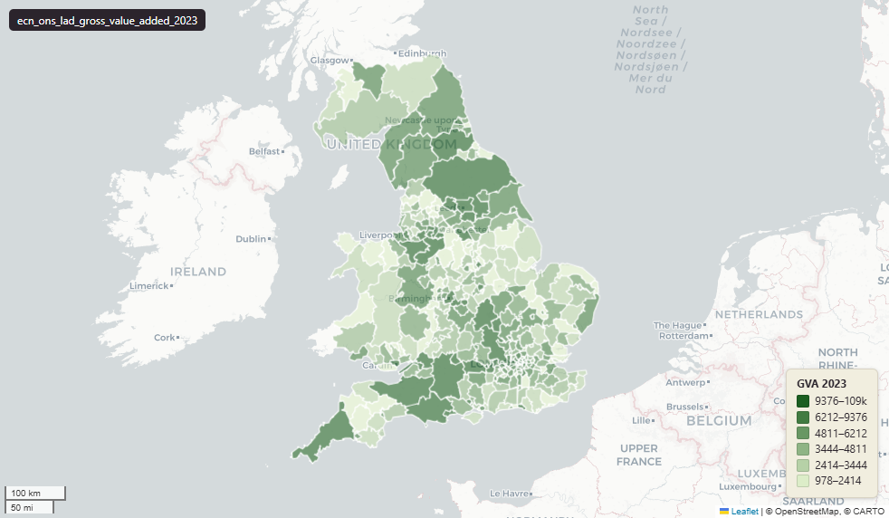

# ONS Gross value added (GVA) at local authority district (LAD), 1998-2023, UK extent, May 2024 LAD boundary

`ecn_ons_lad_gross_value_added_2023`

<a href="http://localhost:7800/?layer=uk_baseline.ecn_ons_lad_gross_value_added_2023" target="_blank" rel="noopener">Open in the Dashboard &#8599;</a> (start your local Dashboard first)

**SOURCE**

- Office for National Statistics (ONS), Regional Accounts.

**DOCUMENTATION**

- Dataset landing page : https://www.ons.gov.uk/economy/grossvalueaddedgva/datasets/uksmallareagvaestimates
- Source file : uksmallareagvaestimates1998to2023.xlsx (publication 22 Sep 2025)

**DEFINITIONS**

- "These data are annual subnational gross value added (GVA) disaggregated to lower levels of geography..The statistics are produced for lower layer super output areas (LSOA) in England and Wales, data zones (DZ) in Scotland, and super output areas (SOA) in Northern Ireland." (ONS landing page, Information sheet)
- "The data are in current prices..We have not produced chained volume measures with price inflation removed because they are innately non-additive and therefore cannot be used as building blocks to create larger geographic areas." (ONS Information sheet)
- "The apportionment process..means that the data presented here will sum to the total for each local authority and above." (ONS Information sheet)

**SCOPE**

- United Kingdom (England, Wales, Scotland, Northern Ireland).
- 361 LADs (May 2024).

**CRS**

- EPSG:27700 (British National Grid / BNG).

**LICENCE**

- Open Government Licence v3.0.

**DERIVED FROM**

- Sum of gva_YYYY grouped by the source XLSX "LAD code" column, taken across all LSOAs (England + Wales), Data Zones (Scotland) and SOAs (Northern Ireland).
- No spatial inference, no external lookup. The LAD code is the publisher's own assignment for each small area as part of the ONS apportionment process.
- Verified at load: per-year sum of staging equals sum of source to 0.000000 pounds million across all 26 years.

**LOADED INTO uk_baseline**

- Loaded by PNC, May 2026.

## Columns

| Column | Type | Description / unit |
|---|---|---|
| `fid` | `integer` |  |
| `lad24cd` | `character varying(9)` | Source field "LAD code" (May 2024 LAD boundary); joins to uk_baseline.adm_ons_lad_boundary_may2024.lad24cd. |
| `lad24nm` | `character varying(60)` | Source field "LAD name". |
| `itl1_code` | `character varying(3)` | Source field "ITL code"; International Territorial Level 1 region (e.g. "TLC"). |
| `itl1_name` | `character varying(40)` | Source field "ITL name"; ITL1 region human-readable name. |
| `nation` | `character varying(20)` | Derived at load from source sheet: Table 1 -> "England", Table 2 -> "Wales", Table 3 -> "Scotland", Table 4 -> "Northern Ireland". |
| `n_small_areas` | `integer` | Audit field: count of small areas (LSOAs in E+W / Data Zones in Scotland / SOAs in NI) aggregated into this LAD. |
| `gva_1998` | `double precision` | Source field "1998"; SUM of small-area values within the LAD. Unit: "pounds million" (current prices). |
| `gva_1999` | `double precision` | Source field "1999"; SUM of small-area values within the LAD. Unit: "pounds million" (current prices). |
| `gva_2000` | `double precision` | Source field "2000"; SUM of small-area values within the LAD. Unit: "pounds million" (current prices). |
| `gva_2001` | `double precision` | Source field "2001"; SUM of small-area values within the LAD. Unit: "pounds million" (current prices). |
| `gva_2002` | `double precision` | Source field "2002"; SUM of small-area values within the LAD. Unit: "pounds million" (current prices). |
| `gva_2003` | `double precision` | Source field "2003"; SUM of small-area values within the LAD. Unit: "pounds million" (current prices). |
| `gva_2004` | `double precision` | Source field "2004"; SUM of small-area values within the LAD. Unit: "pounds million" (current prices). |
| `gva_2005` | `double precision` | Source field "2005"; SUM of small-area values within the LAD. Unit: "pounds million" (current prices). |
| `gva_2006` | `double precision` | Source field "2006"; SUM of small-area values within the LAD. Unit: "pounds million" (current prices). |
| `gva_2007` | `double precision` | Source field "2007"; SUM of small-area values within the LAD. Unit: "pounds million" (current prices). |
| `gva_2008` | `double precision` | Source field "2008"; SUM of small-area values within the LAD. Unit: "pounds million" (current prices). |
| `gva_2009` | `double precision` | Source field "2009"; SUM of small-area values within the LAD. Unit: "pounds million" (current prices). |
| `gva_2010` | `double precision` | Source field "2010"; SUM of small-area values within the LAD. Unit: "pounds million" (current prices). |
| `gva_2011` | `double precision` | Source field "2011"; SUM of small-area values within the LAD. Unit: "pounds million" (current prices). |
| `gva_2012` | `double precision` | Source field "2012"; SUM of small-area values within the LAD. Unit: "pounds million" (current prices). |
| `gva_2013` | `double precision` | Source field "2013"; SUM of small-area values within the LAD. Unit: "pounds million" (current prices). |
| `gva_2014` | `double precision` | Source field "2014"; SUM of small-area values within the LAD. Unit: "pounds million" (current prices). |
| `gva_2015` | `double precision` | Source field "2015"; SUM of small-area values within the LAD. Unit: "pounds million" (current prices). |
| `gva_2016` | `double precision` | Source field "2016"; SUM of small-area values within the LAD. Unit: "pounds million" (current prices). |
| `gva_2017` | `double precision` | Source field "2017"; SUM of small-area values within the LAD. Unit: "pounds million" (current prices). |
| `gva_2018` | `double precision` | Source field "2018"; SUM of small-area values within the LAD. Unit: "pounds million" (current prices). |
| `gva_2019` | `double precision` | Source field "2019"; SUM of small-area values within the LAD. Unit: "pounds million" (current prices). |
| `gva_2020` | `double precision` | Source field "2020"; SUM of small-area values within the LAD. Unit: "pounds million" (current prices). |
| `gva_2021` | `double precision` | Source field "2021"; SUM of small-area values within the LAD. Unit: "pounds million" (current prices). |
| `gva_2022` | `double precision` | Source field "2022"; SUM of small-area values within the LAD. Unit: "pounds million" (current prices). |
| `gva_2023` | `double precision` | Source field "2023"; SUM of small-area values within the LAD. Unit: "pounds million" (current prices). |
| `geom` | `geometry(MultiPolygon,27700)` | Joined at load from uk_baseline.adm_ons_lad_boundary_may2024.geom on lad24cd; MultiPolygon, EPSG:27700. |
