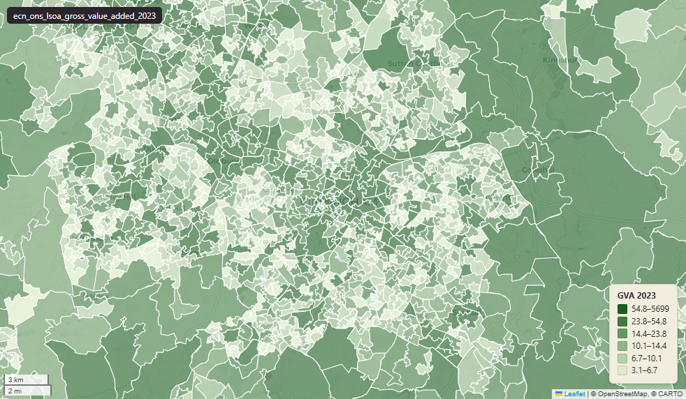

# ONS Gross value added (GVA) at lower layer super output area (LSOA), 1998-2023, England & Wales extent, LSOA 2011 boundary

Gross value added (GVA) - LSOA

`ecn_ons_lsoa_gross_value_added_2023`

**SOURCE**

- Office for National Statistics (ONS), Regional Accounts.

**DOCUMENTATION**

- Dataset landing page : https://www.ons.gov.uk/economy/grossvalueaddedgva/datasets/uksmallareagvaestimates
- Source file : uksmallareagvaestimates1998to2023.xlsx (publication 22 Sep 2025)

**DEFINITIONS**

- "These data are annual subnational gross value added (GVA) disaggregated to lower layer super output areas (LSOA) in England and Wales, data zones (DZ) in Scotland, and super output areas (SOA) in Northern Ireland." (ONS)
- "The lower layer super output areas (LSOA) in England and Wales, data zones (DZ) in Scotland, and super output areas (SOA) in Northern Ireland are all based on 2011 census geography codes." (ONS)
- "The data are in current prices. We have not produced chained volume measures with price inflation removed because they are innately non-additive and therefore cannot be used as building blocks to create larger geographic areas." (ONS)

**SCOPE**

- England & Wales (Table 1 + Table 2 of the source XLSX).
- 34,753 LSOA 2011 rows.
- Scotland Data Zones (6,976) and NI SOAs (890) are published by ONS but not loaded into this table because no matching adm_ons_dz_* / adm_ons_soa_* boundary tables exist in uk_baseline. They are aggregated upward into uk_baseline.ecn_ons_lad_gross_value_added_2023 (UK-wide).

**CRS**

- EPSG:27700 (British National Grid / BNG).

**LICENCE**

- Open Government Licence v3.0.

**DATA QUALITY CAVEATS**

- Published on 2011 LSOA boundaries. Each row's msoa21cd, msoa21nm, msoa21hclnm and lad22/lad25 codes are best-fit onto 2021 geography — the 2021 MSOA the row's 2011 LSOA overlaps most by area (uk.ref_lsoa11_msoa21_bestfit_lu). LSOAs that straddle a 2011-to-2021 boundary change are assigned to their largest-overlap MSOA, so for those a small share of the LSOA area lies outside the assigned MSOA.
- For LAD level dataset, please refer to Gross value added (GVA) - LAD.

**ENRICHMENT**

- `msoa21hclnm` — House of Commons Library readable MSOA name, best-fit assigned at load from the row's 2011 LSOA by largest-area-overlap 2021 MSOA (uk.ref_lsoa11_msoa21_bestfit_lu). Open Parliament Licence.

**LOADED INTO uk_baseline**

- Loaded by PNC, May 2026.

## Columns

| Column | Type | Description / unit |
|---|---|---|
| `fid` | `integer` |  |
| `lsoa11cd` | `character varying(20)` | Source field "LSOA code"; ONS 2011 LSOA code (e.g. "E01000001"). Joins to uk_baseline.adm_ons_lsoa_boundary_2011.lsoa11cd. |
| `lsoa11nm` | `character varying(255)` | Source field "LSOA name". |
| `msoa11cd` | `character varying(20)` | Parent MSOA code (ONS 2011); attached at original load from the ONS LSOA->MSOA lookup, not present as a column in the small-area XLSX. |
| `lad_code` | `character varying(20)` | Source field "LAD code" at original load (circa-2020). STALE: does not match adm_ons_lad_boundary_may2024. See DATA QUALITY CAVEATS in table comment. |
| `lad_name` | `character varying(255)` | LAD name at original load (circa-2020). |
| `itl_code` | `character varying(20)` | Source field "ITL code" at original load. |
| `itl_name` | `character varying(255)` | Source field "ITL name" at original load. |
| `gva_1998` | `double precision` | Source field "1998". Unit: "pounds million" (current prices). |
| `gva_1999` | `double precision` | Source field "1999". Unit: "pounds million" (current prices). |
| `gva_2000` | `double precision` | Source field "2000". Unit: "pounds million" (current prices). |
| `gva_2001` | `double precision` | Source field "2001". Unit: "pounds million" (current prices). |
| `gva_2002` | `double precision` | Source field "2002". Unit: "pounds million" (current prices). |
| `gva_2003` | `double precision` | Source field "2003". Unit: "pounds million" (current prices). |
| `gva_2004` | `double precision` | Source field "2004". Unit: "pounds million" (current prices). |
| `gva_2005` | `double precision` | Source field "2005". Unit: "pounds million" (current prices). |
| `gva_2006` | `double precision` | Source field "2006". Unit: "pounds million" (current prices). |
| `gva_2007` | `double precision` | Source field "2007". Unit: "pounds million" (current prices). |
| `gva_2008` | `double precision` | Source field "2008". Unit: "pounds million" (current prices). |
| `gva_2009` | `double precision` | Source field "2009". Unit: "pounds million" (current prices). |
| `gva_2010` | `double precision` | Source field "2010". Unit: "pounds million" (current prices). |
| `gva_2011` | `double precision` | Source field "2011". Unit: "pounds million" (current prices). |
| `gva_2012` | `double precision` | Source field "2012". Unit: "pounds million" (current prices). |
| `gva_2013` | `double precision` | Source field "2013". Unit: "pounds million" (current prices). |
| `gva_2014` | `double precision` | Source field "2014". Unit: "pounds million" (current prices). |
| `gva_2015` | `double precision` | Source field "2015". Unit: "pounds million" (current prices). |
| `gva_2016` | `double precision` | Source field "2016". Unit: "pounds million" (current prices). |
| `gva_2017` | `double precision` | Source field "2017". Unit: "pounds million" (current prices). |
| `gva_2018` | `double precision` | Source field "2018". Unit: "pounds million" (current prices). |
| `gva_2019` | `double precision` | Source field "2019". Unit: "pounds million" (current prices). |
| `gva_2020` | `double precision` | Source field "2020". Unit: "pounds million" (current prices). |
| `gva_2021` | `double precision` | Source field "2021". Unit: "pounds million" (current prices). |
| `gva_2022` | `double precision` | Source field "2022". Unit: "pounds million" (current prices). |
| `gva_2023` | `double precision` | Source field "2023". Unit: "pounds million" (current prices). |
| `geom` | `geometry(MultiPolygon,27700)` | Joined at load from uk_baseline.adm_ons_lsoa_boundary_2011.geom on lsoa11cd; MultiPolygon, EPSG:27700. |
| `msoa21cd` | `text` | Middle Layer Super Output Area (MSOA) 2021 code, best-fit assigned from this row's Lower Layer Super Output Area (LSOA) 2011 by largest area overlap with the 2021 MSOA boundaries, joined at load on lsoa11cd via uk.ref_lsoa11_msoa21_bestfit_lu. Open Government Licence v3.0. |
| `msoa21nm` | `text` | Official Office for National Statistics MSOA 2021 name, best-fit assigned from this row's Lower Layer Super Output Area (LSOA) 2011 by largest area overlap with the 2021 MSOA boundaries, joined at load on lsoa11cd via uk.ref_lsoa11_msoa21_bestfit_lu. Open Government Licence v3.0. |
| `msoa21hclnm` | `text` | House of Commons Library readable MSOA name, best-fit assigned from this row's Lower Layer Super Output Area (LSOA) 2011 by largest area overlap with the 2021 MSOA boundaries, joined at load on lsoa11cd via uk.ref_lsoa11_msoa21_bestfit_lu. Open Parliament Licence. |
| `lad22cd` | `text` | Local Authority District 2022 code (2021 LAD geography, anchored to the MSOA 2021 name scoping), best-fit assigned from this row's Lower Layer Super Output Area (LSOA) 2011 by largest area overlap with the 2021 MSOA boundaries, joined at load on lsoa11cd via uk.ref_lsoa11_msoa21_bestfit_lu, then that MSOA's 2022 district. Open Government Licence v3.0. |
| `lad22nm` | `text` | Local Authority District 2022 name (2021 LAD geography), best-fit assigned from this row's Lower Layer Super Output Area (LSOA) 2011 by largest area overlap with the 2021 MSOA boundaries, joined at load on lsoa11cd via uk.ref_lsoa11_msoa21_bestfit_lu, then that MSOA's 2022 district. Open Government Licence v3.0. |
| `lad25cd` | `text` | Local Authority District 2025 code (current administering authority), best-fit assigned from this row's Lower Layer Super Output Area (LSOA) 2011 by largest area overlap with the 2021 MSOA boundaries, joined at load on lsoa11cd via uk.ref_lsoa11_msoa21_bestfit_lu, then that MSOA's 2025 district. Open Government Licence v3.0. |
| `lad25nm` | `text` | Local Authority District 2025 name (current administering authority), best-fit assigned from this row's Lower Layer Super Output Area (LSOA) 2011 by largest area overlap with the 2021 MSOA boundaries, joined at load on lsoa11cd via uk.ref_lsoa11_msoa21_bestfit_lu, then that MSOA's 2025 district. Open Government Licence v3.0. |
