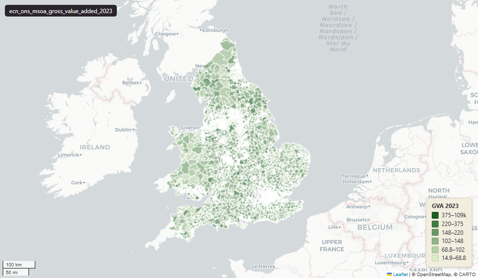

# ONS Gross value added (GVA) at middle layer super output area (MSOA), 1998-2023, England & Wales extent, MSOA 2011 boundary

`ecn_ons_msoa_gross_value_added_2023`

<a href="http://localhost:7800/?layer=uk_baseline.ecn_ons_msoa_gross_value_added_2023" target="_blank" rel="noopener">Open in the Dashboard &#8599;</a> (start your local Dashboard first)

**SOURCE**

- Office for National Statistics (ONS), Regional Accounts. ONS publishes GVA at small-area grain (LSOA in E+W, DZ in Scotland, SOA in NI) only; there is no MSOA-grain GVA series from the publisher. This table is therefore a derivation.

**DOCUMENTATION**

- Dataset landing page : https://www.ons.gov.uk/economy/grossvalueaddedgva/datasets/uksmallareagvaestimates
- Upstream source file : uksmallareagvaestimates1998to2023.xlsx (publication 22 Sep 2025)

**DEFINITIONS**

- "These data are annual subnational gross value added (GVA) disaggregated to lower levels of geography..The statistics are produced for lower layer super output areas (LSOA) in England and Wales, data zones (DZ) in Scotland, and super output areas (SOA) in Northern Ireland." (ONS Information sheet)

**SCOPE**

- England & Wales.
- 7,201 MSOA 2011 rows.

**CRS**

- EPSG:27700 (British National Grid / BNG).

**LICENCE**

- Open Government Licence v3.0.

**DATA QUALITY CAVEATS**

- The lad20cd, lad20nm columns carry the LAD edition current at the original load (circa-2020) and no longer align with adm_ons_lad_boundary_may2024. For current-edition LAD aggregates, use uk_baseline.ecn_ons_lad_gross_value_added_2023.

**DERIVED FROM**

- Sum of gva_YYYY grouped by msoa11cd, taken from uk_baseline.ecn_ons_lsoa_gross_value_added_2023.
- Verified 2026-05-27: per-MSOA, per-year output reproduces the original table to zero delta across all 26 years.

**LOADED INTO uk_baseline**

- Loaded by PNC, May 2026.

## Columns

| Column | Type | Description / unit |
|---|---|---|
| `fid` | `integer` |  |
| `msoa11cd` | `character varying(20)` | ONS 2011 MSOA code (e.g. "E02000001"). Aggregation key. Joins to uk_baseline.adm_ons_msoa_boundary_2011.msoa11cd. |
| `msoa11nm` | `character varying(255)` | ONS 2011 MSOA human-readable name. |
| `lad20cd` | `character varying(20)` | LAD code at original load (circa-2020). STALE: does not match adm_ons_lad_boundary_may2024. |
| `lad20nm` | `character varying(255)` | LAD name at original load (circa-2020). |
| `gva_1998` | `double precision` | Derived: sum of gva_1998 across the constituent LSOAs from uk_baseline.ecn_ons_lsoa_gross_value_added_2023. Unit: "pounds million" (current prices). |
| `gva_1999` | `double precision` | Derived: sum of gva_1999 across the constituent LSOAs from uk_baseline.ecn_ons_lsoa_gross_value_added_2023. Unit: "pounds million" (current prices). |
| `gva_2000` | `double precision` | Derived: sum of gva_2000 across the constituent LSOAs from uk_baseline.ecn_ons_lsoa_gross_value_added_2023. Unit: "pounds million" (current prices). |
| `gva_2001` | `double precision` | Derived: sum of gva_2001 across the constituent LSOAs from uk_baseline.ecn_ons_lsoa_gross_value_added_2023. Unit: "pounds million" (current prices). |
| `gva_2002` | `double precision` | Derived: sum of gva_2002 across the constituent LSOAs from uk_baseline.ecn_ons_lsoa_gross_value_added_2023. Unit: "pounds million" (current prices). |
| `gva_2003` | `double precision` | Derived: sum of gva_2003 across the constituent LSOAs from uk_baseline.ecn_ons_lsoa_gross_value_added_2023. Unit: "pounds million" (current prices). |
| `gva_2004` | `double precision` | Derived: sum of gva_2004 across the constituent LSOAs from uk_baseline.ecn_ons_lsoa_gross_value_added_2023. Unit: "pounds million" (current prices). |
| `gva_2005` | `double precision` | Derived: sum of gva_2005 across the constituent LSOAs from uk_baseline.ecn_ons_lsoa_gross_value_added_2023. Unit: "pounds million" (current prices). |
| `gva_2006` | `double precision` | Derived: sum of gva_2006 across the constituent LSOAs from uk_baseline.ecn_ons_lsoa_gross_value_added_2023. Unit: "pounds million" (current prices). |
| `gva_2007` | `double precision` | Derived: sum of gva_2007 across the constituent LSOAs from uk_baseline.ecn_ons_lsoa_gross_value_added_2023. Unit: "pounds million" (current prices). |
| `gva_2008` | `double precision` | Derived: sum of gva_2008 across the constituent LSOAs from uk_baseline.ecn_ons_lsoa_gross_value_added_2023. Unit: "pounds million" (current prices). |
| `gva_2009` | `double precision` | Derived: sum of gva_2009 across the constituent LSOAs from uk_baseline.ecn_ons_lsoa_gross_value_added_2023. Unit: "pounds million" (current prices). |
| `gva_2010` | `double precision` | Derived: sum of gva_2010 across the constituent LSOAs from uk_baseline.ecn_ons_lsoa_gross_value_added_2023. Unit: "pounds million" (current prices). |
| `gva_2011` | `double precision` | Derived: sum of gva_2011 across the constituent LSOAs from uk_baseline.ecn_ons_lsoa_gross_value_added_2023. Unit: "pounds million" (current prices). |
| `gva_2012` | `double precision` | Derived: sum of gva_2012 across the constituent LSOAs from uk_baseline.ecn_ons_lsoa_gross_value_added_2023. Unit: "pounds million" (current prices). |
| `gva_2013` | `double precision` | Derived: sum of gva_2013 across the constituent LSOAs from uk_baseline.ecn_ons_lsoa_gross_value_added_2023. Unit: "pounds million" (current prices). |
| `gva_2014` | `double precision` | Derived: sum of gva_2014 across the constituent LSOAs from uk_baseline.ecn_ons_lsoa_gross_value_added_2023. Unit: "pounds million" (current prices). |
| `gva_2015` | `double precision` | Derived: sum of gva_2015 across the constituent LSOAs from uk_baseline.ecn_ons_lsoa_gross_value_added_2023. Unit: "pounds million" (current prices). |
| `gva_2016` | `double precision` | Derived: sum of gva_2016 across the constituent LSOAs from uk_baseline.ecn_ons_lsoa_gross_value_added_2023. Unit: "pounds million" (current prices). |
| `gva_2017` | `double precision` | Derived: sum of gva_2017 across the constituent LSOAs from uk_baseline.ecn_ons_lsoa_gross_value_added_2023. Unit: "pounds million" (current prices). |
| `gva_2018` | `double precision` | Derived: sum of gva_2018 across the constituent LSOAs from uk_baseline.ecn_ons_lsoa_gross_value_added_2023. Unit: "pounds million" (current prices). |
| `gva_2019` | `double precision` | Derived: sum of gva_2019 across the constituent LSOAs from uk_baseline.ecn_ons_lsoa_gross_value_added_2023. Unit: "pounds million" (current prices). |
| `gva_2020` | `double precision` | Derived: sum of gva_2020 across the constituent LSOAs from uk_baseline.ecn_ons_lsoa_gross_value_added_2023. Unit: "pounds million" (current prices). |
| `gva_2021` | `double precision` | Derived: sum of gva_2021 across the constituent LSOAs from uk_baseline.ecn_ons_lsoa_gross_value_added_2023. Unit: "pounds million" (current prices). |
| `gva_2022` | `double precision` | Derived: sum of gva_2022 across the constituent LSOAs from uk_baseline.ecn_ons_lsoa_gross_value_added_2023. Unit: "pounds million" (current prices). |
| `gva_2023` | `double precision` | Derived: sum of gva_2023 across the constituent LSOAs from uk_baseline.ecn_ons_lsoa_gross_value_added_2023. Unit: "pounds million" (current prices). |
| `geom` | `geometry(MultiPolygon,27700)` | Joined at load from uk_baseline.adm_ons_msoa_boundary_2011.geom on msoa11cd; MultiPolygon, EPSG:27700. |
