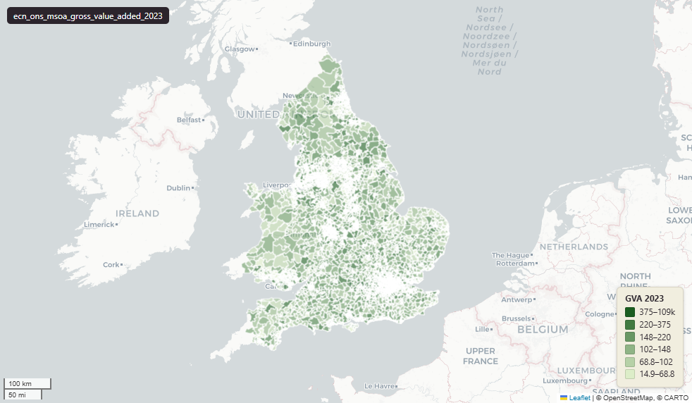

# ONS Gross value added (GVA) at middle layer super output area (MSOA), 1998-2023, England & Wales extent, MSOA 2011 boundary

Gross value added (GVA) - MSOA

`ecn_ons_msoa_gross_value_added_2023`

**SOURCE**

- Office for National Statistics (ONS), Regional Accounts. ONS publishes GVA at small-area level (LSOA in E+W, DZ in Scotland, SOA in NI) only; there is no MSOA-level GVA series from the publisher. This table is therefore a derivation.

**DOCUMENTATION**

- Dataset landing page : https://www.ons.gov.uk/economy/grossvalueaddedgva/datasets/uksmallareagvaestimates
- Upstream source file : uksmallareagvaestimates1998to2023.xlsx (publication 22 Sep 2025)

**DEFINITIONS**

- "These data are annual subnational gross value added (GVA) disaggregated to lower layer super output areas (LSOA) in England and Wales, data zones (DZ) in Scotland, and super output areas (SOA) in Northern Ireland." (ONS)

**SCOPE**

- England & Wales.
- 7,201 MSOA 2011 rows.

**CRS**

- EPSG:27700 (British National Grid / BNG).

**LICENCE**

- Open Government Licence v3.0.

**DATA QUALITY CAVEATS**

- County and Spatial Development Strategy columns are England and Wales only; rows elsewhere carry no county or SDS. Wales and the Isles of Scilly carry a county but no SDS. Rows with no Local Authority District code are NULL in all four columns.
- This table is published on 2011 MSOA boundaries and its values are 2011-vintage; `msoa21hclnm` is a readable label for the corresponding 2021 MSOA and does not re-aggregate any value onto 2021 geography. For MSOAs unchanged in 2021 the name is exact. For the small number of 2011 MSOAs that were split, the column lists every successor name separated by a semicolon, so those rows carry more than one name and cannot be joined to a single msoa21cd. No 2021 geography codes are recorded on this table.
- For LAD level dataset, please refer to Gross value added (GVA) - LAD.

**ENRICHMENT**

- `sds_name` / `sds_group` — Spatial Development Strategy area and devolution status, a Prior + Partners categorisation over Ministry of Housing, Communities and Local Government (MHCLG) English devolution policy, joined at load on the row's Local Authority District 2025 code via uk.ref_lad25_ctyua25_sds_lu_jul2026.
- `msoa21hclnm` — House of Commons Library readable MSOA name for the 2021 MSOA corresponding to this row's 2011 MSOA, joined at load via uk.ref_msoa11_msoa21_name_lu. Open Parliament Licence.

**DERIVED FROM**

- Sum of gva_YYYY grouped by MSOA, taken from uk_baseline.ecn_ons_lsoa_gross_value_added_2023.

**LOADED INTO uk_baseline**

- Loaded by PNC, May 2026.

## Columns

| Column | Type | Description / unit |
|---|---|---|
| `fid` | `integer` |  |
| `msoa11cd` | `character varying(20)` | ONS 2011 MSOA code (e.g. "E02000001"). Aggregation key. Joins to uk_baseline.adm_ons_msoa_boundary_2011.msoa11cd. |
| `msoa11nm` | `character varying(255)` | ONS 2011 MSOA human-readable name. |
| `lad20cd` | `character varying(20)` | LAD code at original load (circa-2020). STALE: does not match adm_ons_lad_boundary_may2024. |
| `lad20nm` | `character varying(255)` | LAD name at original load (circa-2020). |
| `gva_1998` | `double precision` | Derived: sum of gva_1998 across the constituent LSOAs from uk_baseline.ecn_ons_lsoa_gross_value_added_2023. Unit: "pounds million" (current prices). |
| `gva_1999` | `double precision` | Derived: sum of gva_1999 across the constituent LSOAs from uk_baseline.ecn_ons_lsoa_gross_value_added_2023. Unit: "pounds million" (current prices). |
| `gva_2000` | `double precision` | Derived: sum of gva_2000 across the constituent LSOAs from uk_baseline.ecn_ons_lsoa_gross_value_added_2023. Unit: "pounds million" (current prices). |
| `gva_2001` | `double precision` | Derived: sum of gva_2001 across the constituent LSOAs from uk_baseline.ecn_ons_lsoa_gross_value_added_2023. Unit: "pounds million" (current prices). |
| `gva_2002` | `double precision` | Derived: sum of gva_2002 across the constituent LSOAs from uk_baseline.ecn_ons_lsoa_gross_value_added_2023. Unit: "pounds million" (current prices). |
| `gva_2003` | `double precision` | Derived: sum of gva_2003 across the constituent LSOAs from uk_baseline.ecn_ons_lsoa_gross_value_added_2023. Unit: "pounds million" (current prices). |
| `gva_2004` | `double precision` | Derived: sum of gva_2004 across the constituent LSOAs from uk_baseline.ecn_ons_lsoa_gross_value_added_2023. Unit: "pounds million" (current prices). |
| `gva_2005` | `double precision` | Derived: sum of gva_2005 across the constituent LSOAs from uk_baseline.ecn_ons_lsoa_gross_value_added_2023. Unit: "pounds million" (current prices). |
| `gva_2006` | `double precision` | Derived: sum of gva_2006 across the constituent LSOAs from uk_baseline.ecn_ons_lsoa_gross_value_added_2023. Unit: "pounds million" (current prices). |
| `gva_2007` | `double precision` | Derived: sum of gva_2007 across the constituent LSOAs from uk_baseline.ecn_ons_lsoa_gross_value_added_2023. Unit: "pounds million" (current prices). |
| `gva_2008` | `double precision` | Derived: sum of gva_2008 across the constituent LSOAs from uk_baseline.ecn_ons_lsoa_gross_value_added_2023. Unit: "pounds million" (current prices). |
| `gva_2009` | `double precision` | Derived: sum of gva_2009 across the constituent LSOAs from uk_baseline.ecn_ons_lsoa_gross_value_added_2023. Unit: "pounds million" (current prices). |
| `gva_2010` | `double precision` | Derived: sum of gva_2010 across the constituent LSOAs from uk_baseline.ecn_ons_lsoa_gross_value_added_2023. Unit: "pounds million" (current prices). |
| `gva_2011` | `double precision` | Derived: sum of gva_2011 across the constituent LSOAs from uk_baseline.ecn_ons_lsoa_gross_value_added_2023. Unit: "pounds million" (current prices). |
| `gva_2012` | `double precision` | Derived: sum of gva_2012 across the constituent LSOAs from uk_baseline.ecn_ons_lsoa_gross_value_added_2023. Unit: "pounds million" (current prices). |
| `gva_2013` | `double precision` | Derived: sum of gva_2013 across the constituent LSOAs from uk_baseline.ecn_ons_lsoa_gross_value_added_2023. Unit: "pounds million" (current prices). |
| `gva_2014` | `double precision` | Derived: sum of gva_2014 across the constituent LSOAs from uk_baseline.ecn_ons_lsoa_gross_value_added_2023. Unit: "pounds million" (current prices). |
| `gva_2015` | `double precision` | Derived: sum of gva_2015 across the constituent LSOAs from uk_baseline.ecn_ons_lsoa_gross_value_added_2023. Unit: "pounds million" (current prices). |
| `gva_2016` | `double precision` | Derived: sum of gva_2016 across the constituent LSOAs from uk_baseline.ecn_ons_lsoa_gross_value_added_2023. Unit: "pounds million" (current prices). |
| `gva_2017` | `double precision` | Derived: sum of gva_2017 across the constituent LSOAs from uk_baseline.ecn_ons_lsoa_gross_value_added_2023. Unit: "pounds million" (current prices). |
| `gva_2018` | `double precision` | Derived: sum of gva_2018 across the constituent LSOAs from uk_baseline.ecn_ons_lsoa_gross_value_added_2023. Unit: "pounds million" (current prices). |
| `gva_2019` | `double precision` | Derived: sum of gva_2019 across the constituent LSOAs from uk_baseline.ecn_ons_lsoa_gross_value_added_2023. Unit: "pounds million" (current prices). |
| `gva_2020` | `double precision` | Derived: sum of gva_2020 across the constituent LSOAs from uk_baseline.ecn_ons_lsoa_gross_value_added_2023. Unit: "pounds million" (current prices). |
| `gva_2021` | `double precision` | Derived: sum of gva_2021 across the constituent LSOAs from uk_baseline.ecn_ons_lsoa_gross_value_added_2023. Unit: "pounds million" (current prices). |
| `gva_2022` | `double precision` | Derived: sum of gva_2022 across the constituent LSOAs from uk_baseline.ecn_ons_lsoa_gross_value_added_2023. Unit: "pounds million" (current prices). |
| `gva_2023` | `double precision` | Derived: sum of gva_2023 across the constituent LSOAs from uk_baseline.ecn_ons_lsoa_gross_value_added_2023. Unit: "pounds million" (current prices). |
| `geom` | `geometry(MultiPolygon,27700)` | Joined at load from uk_baseline.adm_ons_msoa_boundary_2011.geom on msoa11cd; MultiPolygon, EPSG:27700. |
| `msoa21hclnm` | `text` | House of Commons Library readable MSOA name for the 2021 MSOA corresponding to this row's 2011 MSOA, joined at load on the 2011 code via uk.ref_msoa11_msoa21_name_lu. Where the MSOA is unchanged in 2021 (the great majority) the name is exact. Where a 2011 MSOA was split into several 2021 MSOAs this records all successor names, separated by a semicolon. Where a 2011 MSOA was merged into a larger 2021 MSOA, or its code was reissued, it records that single successor name. Open Parliament Licence. |
| `lad25cd` | `text` | Local Authority District 2025 code (current administering authority). Traced via uk.ref_lad25_ctyua25_sds_lu_jul2026 from the row's Local Authority District 2020 code, with the seven pre-2021 Northamptonshire districts mapped to North and West Northamptonshire. Open Government Licence v3.0. |
| `lad25nm` | `text` | Local Authority District 2025 name (current administering authority). Traced via uk.ref_lad25_ctyua25_sds_lu_jul2026 from the row's Local Authority District 2020 code, with the seven pre-2021 Northamptonshire districts mapped to North and West Northamptonshire. Open Government Licence v3.0. |
| `ctyua25cd` | `text` | County or unitary authority code at 1 April 2025. Joined at load via uk.ref_lad25_ctyua25_sds_lu_jul2026 on the row's Local Authority District 2025 code. Open Government Licence v3.0. |
| `ctyua25nm` | `text` | County or unitary authority name at 1 April 2025. Joined at load via uk.ref_lad25_ctyua25_sds_lu_jul2026 on the row's Local Authority District 2025 code. Open Government Licence v3.0. |
| `sds_name` | `text` | Spatial Development Strategy (SDS) area, a Prior + Partners categorisation over Ministry of Housing, Communities and Local Government (MHCLG) English devolution policy. Joined at load via uk.ref_lad25_ctyua25_sds_lu_jul2026 on the row's Local Authority District 2025 code. Open Government Licence v3.0. |
| `sds_group` | `text` | Devolution status of the Spatial Development Strategy area: Existing Devolution Footprints, Devolution Priority Programme, Other Proposed Geographies or Remaining Areas. Joined at load via uk.ref_lad25_ctyua25_sds_lu_jul2026 on the row's Local Authority District 2025 code. Open Government Licence v3.0. |
