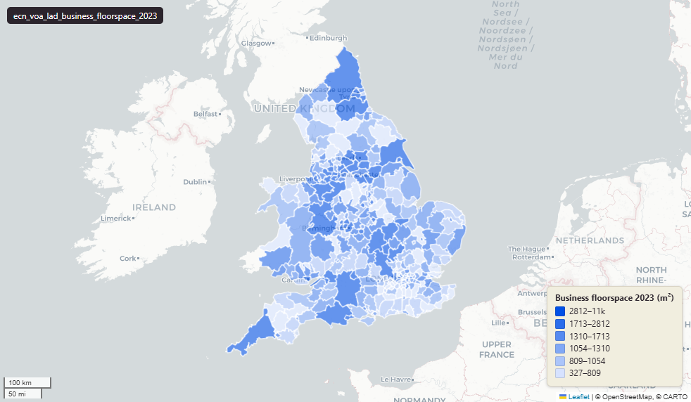

# Valuation Office Agency (VOA) Business Floorspace at Local Authority District (LAD), 2023

VOA Business Floorspace - LAD

`ecn_voa_lad_business_floorspace_2023`

**SOURCE**

- Valuation Office Agency (VOA) Non-Domestic Rating (NDR), gov.uk publication 2023-11.

**DOCUMENTATION**

- Dataset page : https://www.gov.uk/government/statistics/non-domestic-rating-stock-of-properties-including-business-floorspace-2023
- Background information : https://www.gov.uk/government/statistics/non-domestic-rating-stock-of-properties-including-business-floorspace-2023/non-domestic-rating-stock-of-properties-including-business-floorspace-background-information

**DEFINITIONS**

- Floorspace: "Floorspace is defined as the internal area in metres squared used to calculate a property's rateable value. In most instances, this will not include communal areas such as kitchens and facilities such as toilets." (gov.uk background-information page)
- Rateable Value (RV): "The RV of a property is broadly the value at which a property might be expected to be let for one year." (gov.uk background-information page)
- Rating list mapping: "those for 2001-2005 are based on the 2000 rating list; 2006-2010 are based on the 2005 rating list; 2011-2017 are based on the 2010 rating list and 2018-2023 are based on the 2017 rating list." (gov.uk background-information page)

**SCOPE**

- Local Authority District (LAD) May 2022 boundaries, England and Wales. 331 rows (E: 309; W: 22). Source CSV rows filtered to geography = 'LAUA'.

**CRS**

- EPSG:27700 (British National Grid).

**LICENCE**

- Open Government Licence v3.0 (OGL). © Crown copyright. https://www.nationalarchives.gov.uk/doc/open-government-licence/version/3/

**DATA QUALITY CAVEATS**

- County and Spatial Development Strategy columns are England and Wales only; rows elsewhere carry no county or SDS. Wales and the Isles of Scilly carry a county but no SDS. Rows with no Local Authority District code are NULL in all four columns.

**ENRICHMENT**

- `sds_name` / `sds_group` — Spatial Development Strategy area and devolution status, a Prior + Partners categorisation over Ministry of Housing, Communities and Local Government (MHCLG) English devolution policy, joined at load on the row's Local Authority District 2025 code via uk.ref_lad25_ctyua25_sds_lu_jul2026.

**LOADED INTO uk_baseline**

- Loaded by PNC, May 2026.

## Columns

| Column | Type | Description / unit |
|---|---|---|
| `fid` | `integer` |  |
| `lad22cd` | `character varying(20)` | Source field `ons_code` |
| `lad22nm` | `character varying(255)` | Source field `ons_name` |
| `floorspace_all_2001` | `integer` | Unit: "total floorspace (thousand metres squared)" |
| `floorspace_retail_2001` | `integer` | Unit: "total floorspace (thousand metres squared)" |
| `floorspace_office_2001` | `integer` | Unit: "total floorspace (thousand metres squared)" |
| `floorspace_industrial_2001` | `integer` | Unit: "total floorspace (thousand metres squared)" |
| `floorspace_other_2001` | `integer` | Unit: "total floorspace (thousand metres squared)" |
| `rateable_value_all_2001` | `integer` | Unit: "rateable value per metre squared (£ per metre squared of floorspace)" |
| `rateable_value_retail_2001` | `integer` | Unit: "rateable value per metre squared (£ per metre squared of floorspace)" |
| `rateable_value_office_2001` | `integer` | Unit: "rateable value per metre squared (£ per metre squared of floorspace)" |
| `rateable_value_industrial_2001` | `integer` | Unit: "rateable value per metre squared (£ per metre squared of floorspace)" |
| `rateable_value_other_2001` | `integer` | Unit: "rateable value per metre squared (£ per metre squared of floorspace)" |
| `floorspace_all_2002` | `integer` | Unit: "total floorspace (thousand metres squared)" |
| `floorspace_retail_2002` | `integer` | Unit: "total floorspace (thousand metres squared)" |
| `floorspace_office_2002` | `integer` | Unit: "total floorspace (thousand metres squared)" |
| `floorspace_industrial_2002` | `integer` | Unit: "total floorspace (thousand metres squared)" |
| `floorspace_other_2002` | `integer` | Unit: "total floorspace (thousand metres squared)" |
| `rateable_value_all_2002` | `integer` | Unit: "rateable value per metre squared (£ per metre squared of floorspace)" |
| `rateable_value_retail_2002` | `integer` | Unit: "rateable value per metre squared (£ per metre squared of floorspace)" |
| `rateable_value_office_2002` | `integer` | Unit: "rateable value per metre squared (£ per metre squared of floorspace)" |
| `rateable_value_industrial_2002` | `integer` | Unit: "rateable value per metre squared (£ per metre squared of floorspace)" |
| `rateable_value_other_2002` | `integer` | Unit: "rateable value per metre squared (£ per metre squared of floorspace)" |
| `floorspace_all_2003` | `integer` | Unit: "total floorspace (thousand metres squared)" |
| `floorspace_retail_2003` | `integer` | Unit: "total floorspace (thousand metres squared)" |
| `floorspace_office_2003` | `integer` | Unit: "total floorspace (thousand metres squared)" |
| `floorspace_industrial_2003` | `integer` | Unit: "total floorspace (thousand metres squared)" |
| `floorspace_other_2003` | `integer` | Unit: "total floorspace (thousand metres squared)" |
| `rateable_value_all_2003` | `integer` | Unit: "rateable value per metre squared (£ per metre squared of floorspace)" |
| `rateable_value_retail_2003` | `integer` | Unit: "rateable value per metre squared (£ per metre squared of floorspace)" |
| `rateable_value_office_2003` | `integer` | Unit: "rateable value per metre squared (£ per metre squared of floorspace)" |
| `rateable_value_industrial_2003` | `integer` | Unit: "rateable value per metre squared (£ per metre squared of floorspace)" |
| `rateable_value_other_2003` | `integer` | Unit: "rateable value per metre squared (£ per metre squared of floorspace)" |
| `floorspace_all_2004` | `integer` | Unit: "total floorspace (thousand metres squared)" |
| `floorspace_retail_2004` | `integer` | Unit: "total floorspace (thousand metres squared)" |
| `floorspace_office_2004` | `integer` | Unit: "total floorspace (thousand metres squared)" |
| `floorspace_industrial_2004` | `integer` | Unit: "total floorspace (thousand metres squared)" |
| `floorspace_other_2004` | `integer` | Unit: "total floorspace (thousand metres squared)" |
| `rateable_value_all_2004` | `integer` | Unit: "rateable value per metre squared (£ per metre squared of floorspace)" |
| `rateable_value_retail_2004` | `integer` | Unit: "rateable value per metre squared (£ per metre squared of floorspace)" |
| `rateable_value_office_2004` | `integer` | Unit: "rateable value per metre squared (£ per metre squared of floorspace)" |
| `rateable_value_industrial_2004` | `integer` | Unit: "rateable value per metre squared (£ per metre squared of floorspace)" |
| `rateable_value_other_2004` | `integer` | Unit: "rateable value per metre squared (£ per metre squared of floorspace)" |
| `floorspace_all_2005` | `integer` | Unit: "total floorspace (thousand metres squared)" |
| `floorspace_retail_2005` | `integer` | Unit: "total floorspace (thousand metres squared)" |
| `floorspace_office_2005` | `integer` | Unit: "total floorspace (thousand metres squared)" |
| `floorspace_industrial_2005` | `integer` | Unit: "total floorspace (thousand metres squared)" |
| `floorspace_other_2005` | `integer` | Unit: "total floorspace (thousand metres squared)" |
| `rateable_value_all_2005` | `integer` | Unit: "rateable value per metre squared (£ per metre squared of floorspace)" |
| `rateable_value_retail_2005` | `integer` | Unit: "rateable value per metre squared (£ per metre squared of floorspace)" |
| `rateable_value_office_2005` | `integer` | Unit: "rateable value per metre squared (£ per metre squared of floorspace)" |
| `rateable_value_industrial_2005` | `integer` | Unit: "rateable value per metre squared (£ per metre squared of floorspace)" |
| `rateable_value_other_2005` | `integer` | Unit: "rateable value per metre squared (£ per metre squared of floorspace)" |
| `floorspace_all_2006` | `integer` | Unit: "total floorspace (thousand metres squared)" |
| `floorspace_retail_2006` | `integer` | Unit: "total floorspace (thousand metres squared)" |
| `floorspace_office_2006` | `integer` | Unit: "total floorspace (thousand metres squared)" |
| `floorspace_industrial_2006` | `integer` | Unit: "total floorspace (thousand metres squared)" |
| `floorspace_other_2006` | `integer` | Unit: "total floorspace (thousand metres squared)" |
| `rateable_value_all_2006` | `integer` | Unit: "rateable value per metre squared (£ per metre squared of floorspace)" |
| `rateable_value_retail_2006` | `integer` | Unit: "rateable value per metre squared (£ per metre squared of floorspace)" |
| `rateable_value_office_2006` | `integer` | Unit: "rateable value per metre squared (£ per metre squared of floorspace)" |
| `rateable_value_industrial_2006` | `integer` | Unit: "rateable value per metre squared (£ per metre squared of floorspace)" |
| `rateable_value_other_2006` | `integer` | Unit: "rateable value per metre squared (£ per metre squared of floorspace)" |
| `floorspace_all_2007` | `integer` | Unit: "total floorspace (thousand metres squared)" |
| `floorspace_retail_2007` | `integer` | Unit: "total floorspace (thousand metres squared)" |
| `floorspace_office_2007` | `integer` | Unit: "total floorspace (thousand metres squared)" |
| `floorspace_industrial_2007` | `integer` | Unit: "total floorspace (thousand metres squared)" |
| `floorspace_other_2007` | `integer` | Unit: "total floorspace (thousand metres squared)" |
| `rateable_value_all_2007` | `integer` | Unit: "rateable value per metre squared (£ per metre squared of floorspace)" |
| `rateable_value_retail_2007` | `integer` | Unit: "rateable value per metre squared (£ per metre squared of floorspace)" |
| `rateable_value_office_2007` | `integer` | Unit: "rateable value per metre squared (£ per metre squared of floorspace)" |
| `rateable_value_industrial_2007` | `integer` | Unit: "rateable value per metre squared (£ per metre squared of floorspace)" |
| `rateable_value_other_2007` | `integer` | Unit: "rateable value per metre squared (£ per metre squared of floorspace)" |
| `floorspace_all_2008` | `integer` | Unit: "total floorspace (thousand metres squared)" |
| `floorspace_retail_2008` | `integer` | Unit: "total floorspace (thousand metres squared)" |
| `floorspace_office_2008` | `integer` | Unit: "total floorspace (thousand metres squared)" |
| `floorspace_industrial_2008` | `integer` | Unit: "total floorspace (thousand metres squared)" |
| `floorspace_other_2008` | `integer` | Unit: "total floorspace (thousand metres squared)" |
| `rateable_value_all_2008` | `integer` | Unit: "rateable value per metre squared (£ per metre squared of floorspace)" |
| `rateable_value_retail_2008` | `integer` | Unit: "rateable value per metre squared (£ per metre squared of floorspace)" |
| `rateable_value_office_2008` | `integer` | Unit: "rateable value per metre squared (£ per metre squared of floorspace)" |
| `rateable_value_industrial_2008` | `integer` | Unit: "rateable value per metre squared (£ per metre squared of floorspace)" |
| `rateable_value_other_2008` | `integer` | Unit: "rateable value per metre squared (£ per metre squared of floorspace)" |
| `floorspace_all_2009` | `integer` | Unit: "total floorspace (thousand metres squared)" |
| `floorspace_retail_2009` | `integer` | Unit: "total floorspace (thousand metres squared)" |
| `floorspace_office_2009` | `integer` | Unit: "total floorspace (thousand metres squared)" |
| `floorspace_industrial_2009` | `integer` | Unit: "total floorspace (thousand metres squared)" |
| `floorspace_other_2009` | `integer` | Unit: "total floorspace (thousand metres squared)" |
| `rateable_value_all_2009` | `integer` | Unit: "rateable value per metre squared (£ per metre squared of floorspace)" |
| `rateable_value_retail_2009` | `integer` | Unit: "rateable value per metre squared (£ per metre squared of floorspace)" |
| `rateable_value_office_2009` | `integer` | Unit: "rateable value per metre squared (£ per metre squared of floorspace)" |
| `rateable_value_industrial_2009` | `integer` | Unit: "rateable value per metre squared (£ per metre squared of floorspace)" |
| `rateable_value_other_2009` | `integer` | Unit: "rateable value per metre squared (£ per metre squared of floorspace)" |
| `floorspace_all_2010` | `integer` | Unit: "total floorspace (thousand metres squared)" |
| `floorspace_retail_2010` | `integer` | Unit: "total floorspace (thousand metres squared)" |
| `floorspace_office_2010` | `integer` | Unit: "total floorspace (thousand metres squared)" |
| `floorspace_industrial_2010` | `integer` | Unit: "total floorspace (thousand metres squared)" |
| `floorspace_other_2010` | `integer` | Unit: "total floorspace (thousand metres squared)" |
| `rateable_value_all_2010` | `integer` | Unit: "rateable value per metre squared (£ per metre squared of floorspace)" |
| `rateable_value_retail_2010` | `integer` | Unit: "rateable value per metre squared (£ per metre squared of floorspace)" |
| `rateable_value_office_2010` | `integer` | Unit: "rateable value per metre squared (£ per metre squared of floorspace)" |
| `rateable_value_industrial_2010` | `integer` | Unit: "rateable value per metre squared (£ per metre squared of floorspace)" |
| `rateable_value_other_2010` | `integer` | Unit: "rateable value per metre squared (£ per metre squared of floorspace)" |
| `floorspace_all_2011` | `integer` | Unit: "total floorspace (thousand metres squared)" |
| `floorspace_retail_2011` | `integer` | Unit: "total floorspace (thousand metres squared)" |
| `floorspace_office_2011` | `integer` | Unit: "total floorspace (thousand metres squared)" |
| `floorspace_industrial_2011` | `integer` | Unit: "total floorspace (thousand metres squared)" |
| `floorspace_other_2011` | `integer` | Unit: "total floorspace (thousand metres squared)" |
| `rateable_value_all_2011` | `integer` | Unit: "rateable value per metre squared (£ per metre squared of floorspace)" |
| `rateable_value_retail_2011` | `integer` | Unit: "rateable value per metre squared (£ per metre squared of floorspace)" |
| `rateable_value_office_2011` | `integer` | Unit: "rateable value per metre squared (£ per metre squared of floorspace)" |
| `rateable_value_industrial_2011` | `integer` | Unit: "rateable value per metre squared (£ per metre squared of floorspace)" |
| `rateable_value_other_2011` | `integer` | Unit: "rateable value per metre squared (£ per metre squared of floorspace)" |
| `floorspace_all_2012` | `integer` | Unit: "total floorspace (thousand metres squared)" |
| `floorspace_retail_2012` | `integer` | Unit: "total floorspace (thousand metres squared)" |
| `floorspace_office_2012` | `integer` | Unit: "total floorspace (thousand metres squared)" |
| `floorspace_industrial_2012` | `integer` | Unit: "total floorspace (thousand metres squared)" |
| `floorspace_other_2012` | `integer` | Unit: "total floorspace (thousand metres squared)" |
| `rateable_value_all_2012` | `integer` | Unit: "rateable value per metre squared (£ per metre squared of floorspace)" |
| `rateable_value_retail_2012` | `integer` | Unit: "rateable value per metre squared (£ per metre squared of floorspace)" |
| `rateable_value_office_2012` | `integer` | Unit: "rateable value per metre squared (£ per metre squared of floorspace)" |
| `rateable_value_industrial_2012` | `integer` | Unit: "rateable value per metre squared (£ per metre squared of floorspace)" |
| `rateable_value_other_2012` | `integer` | Unit: "rateable value per metre squared (£ per metre squared of floorspace)" |
| `floorspace_all_2013` | `integer` | Unit: "total floorspace (thousand metres squared)" |
| `floorspace_retail_2013` | `integer` | Unit: "total floorspace (thousand metres squared)" |
| `floorspace_office_2013` | `integer` | Unit: "total floorspace (thousand metres squared)" |
| `floorspace_industrial_2013` | `integer` | Unit: "total floorspace (thousand metres squared)" |
| `floorspace_other_2013` | `integer` | Unit: "total floorspace (thousand metres squared)" |
| `rateable_value_all_2013` | `integer` | Unit: "rateable value per metre squared (£ per metre squared of floorspace)" |
| `rateable_value_retail_2013` | `integer` | Unit: "rateable value per metre squared (£ per metre squared of floorspace)" |
| `rateable_value_office_2013` | `integer` | Unit: "rateable value per metre squared (£ per metre squared of floorspace)" |
| `rateable_value_industrial_2013` | `integer` | Unit: "rateable value per metre squared (£ per metre squared of floorspace)" |
| `rateable_value_other_2013` | `integer` | Unit: "rateable value per metre squared (£ per metre squared of floorspace)" |
| `floorspace_all_2014` | `integer` | Unit: "total floorspace (thousand metres squared)" |
| `floorspace_retail_2014` | `integer` | Unit: "total floorspace (thousand metres squared)" |
| `floorspace_office_2014` | `integer` | Unit: "total floorspace (thousand metres squared)" |
| `floorspace_industrial_2014` | `integer` | Unit: "total floorspace (thousand metres squared)" |
| `floorspace_other_2014` | `integer` | Unit: "total floorspace (thousand metres squared)" |
| `rateable_value_all_2014` | `integer` | Unit: "rateable value per metre squared (£ per metre squared of floorspace)" |
| `rateable_value_retail_2014` | `integer` | Unit: "rateable value per metre squared (£ per metre squared of floorspace)" |
| `rateable_value_office_2014` | `integer` | Unit: "rateable value per metre squared (£ per metre squared of floorspace)" |
| `rateable_value_industrial_2014` | `integer` | Unit: "rateable value per metre squared (£ per metre squared of floorspace)" |
| `rateable_value_other_2014` | `integer` | Unit: "rateable value per metre squared (£ per metre squared of floorspace)" |
| `floorspace_all_2015` | `integer` | Unit: "total floorspace (thousand metres squared)" |
| `floorspace_retail_2015` | `integer` | Unit: "total floorspace (thousand metres squared)" |
| `floorspace_office_2015` | `integer` | Unit: "total floorspace (thousand metres squared)" |
| `floorspace_industrial_2015` | `integer` | Unit: "total floorspace (thousand metres squared)" |
| `floorspace_other_2015` | `integer` | Unit: "total floorspace (thousand metres squared)" |
| `rateable_value_all_2015` | `integer` | Unit: "rateable value per metre squared (£ per metre squared of floorspace)" |
| `rateable_value_retail_2015` | `integer` | Unit: "rateable value per metre squared (£ per metre squared of floorspace)" |
| `rateable_value_office_2015` | `integer` | Unit: "rateable value per metre squared (£ per metre squared of floorspace)" |
| `rateable_value_industrial_2015` | `integer` | Unit: "rateable value per metre squared (£ per metre squared of floorspace)" |
| `rateable_value_other_2015` | `integer` | Unit: "rateable value per metre squared (£ per metre squared of floorspace)" |
| `floorspace_all_2016` | `integer` | Unit: "total floorspace (thousand metres squared)" |
| `floorspace_retail_2016` | `integer` | Unit: "total floorspace (thousand metres squared)" |
| `floorspace_office_2016` | `integer` | Unit: "total floorspace (thousand metres squared)" |
| `floorspace_industrial_2016` | `integer` | Unit: "total floorspace (thousand metres squared)" |
| `floorspace_other_2016` | `integer` | Unit: "total floorspace (thousand metres squared)" |
| `rateable_value_all_2016` | `integer` | Unit: "rateable value per metre squared (£ per metre squared of floorspace)" |
| `rateable_value_retail_2016` | `integer` | Unit: "rateable value per metre squared (£ per metre squared of floorspace)" |
| `rateable_value_office_2016` | `integer` | Unit: "rateable value per metre squared (£ per metre squared of floorspace)" |
| `rateable_value_industrial_2016` | `integer` | Unit: "rateable value per metre squared (£ per metre squared of floorspace)" |
| `rateable_value_other_2016` | `integer` | Unit: "rateable value per metre squared (£ per metre squared of floorspace)" |
| `floorspace_all_2017` | `integer` | Unit: "total floorspace (thousand metres squared)" |
| `floorspace_retail_2017` | `integer` | Unit: "total floorspace (thousand metres squared)" |
| `floorspace_office_2017` | `integer` | Unit: "total floorspace (thousand metres squared)" |
| `floorspace_industrial_2017` | `integer` | Unit: "total floorspace (thousand metres squared)" |
| `floorspace_other_2017` | `integer` | Unit: "total floorspace (thousand metres squared)" |
| `rateable_value_all_2017` | `integer` | Unit: "rateable value per metre squared (£ per metre squared of floorspace)" |
| `rateable_value_retail_2017` | `integer` | Unit: "rateable value per metre squared (£ per metre squared of floorspace)" |
| `rateable_value_office_2017` | `integer` | Unit: "rateable value per metre squared (£ per metre squared of floorspace)" |
| `rateable_value_industrial_2017` | `integer` | Unit: "rateable value per metre squared (£ per metre squared of floorspace)" |
| `rateable_value_other_2017` | `integer` | Unit: "rateable value per metre squared (£ per metre squared of floorspace)" |
| `floorspace_all_2018` | `integer` | Unit: "total floorspace (thousand metres squared)" |
| `floorspace_retail_2018` | `integer` | Unit: "total floorspace (thousand metres squared)" |
| `floorspace_office_2018` | `integer` | Unit: "total floorspace (thousand metres squared)" |
| `floorspace_industrial_2018` | `integer` | Unit: "total floorspace (thousand metres squared)" |
| `floorspace_other_2018` | `integer` | Unit: "total floorspace (thousand metres squared)" |
| `rateable_value_all_2018` | `integer` | Unit: "rateable value per metre squared (£ per metre squared of floorspace)" |
| `rateable_value_retail_2018` | `integer` | Unit: "rateable value per metre squared (£ per metre squared of floorspace)" |
| `rateable_value_office_2018` | `integer` | Unit: "rateable value per metre squared (£ per metre squared of floorspace)" |
| `rateable_value_industrial_2018` | `integer` | Unit: "rateable value per metre squared (£ per metre squared of floorspace)" |
| `rateable_value_other_2018` | `integer` | Unit: "rateable value per metre squared (£ per metre squared of floorspace)" |
| `floorspace_all_2019` | `integer` | Unit: "total floorspace (thousand metres squared)" |
| `floorspace_retail_2019` | `integer` | Unit: "total floorspace (thousand metres squared)" |
| `floorspace_office_2019` | `integer` | Unit: "total floorspace (thousand metres squared)" |
| `floorspace_industrial_2019` | `integer` | Unit: "total floorspace (thousand metres squared)" |
| `floorspace_other_2019` | `integer` | Unit: "total floorspace (thousand metres squared)" |
| `rateable_value_all_2019` | `integer` | Unit: "rateable value per metre squared (£ per metre squared of floorspace)" |
| `rateable_value_retail_2019` | `integer` | Unit: "rateable value per metre squared (£ per metre squared of floorspace)" |
| `rateable_value_office_2019` | `integer` | Unit: "rateable value per metre squared (£ per metre squared of floorspace)" |
| `rateable_value_industrial_2019` | `integer` | Unit: "rateable value per metre squared (£ per metre squared of floorspace)" |
| `rateable_value_other_2019` | `integer` | Unit: "rateable value per metre squared (£ per metre squared of floorspace)" |
| `floorspace_all_2020` | `integer` | Unit: "total floorspace (thousand metres squared)" |
| `floorspace_retail_2020` | `integer` | Unit: "total floorspace (thousand metres squared)" |
| `floorspace_office_2020` | `integer` | Unit: "total floorspace (thousand metres squared)" |
| `floorspace_industrial_2020` | `integer` | Unit: "total floorspace (thousand metres squared)" |
| `floorspace_other_2020` | `integer` | Unit: "total floorspace (thousand metres squared)" |
| `rateable_value_all_2020` | `integer` | Unit: "rateable value per metre squared (£ per metre squared of floorspace)" |
| `rateable_value_retail_2020` | `integer` | Unit: "rateable value per metre squared (£ per metre squared of floorspace)" |
| `rateable_value_office_2020` | `integer` | Unit: "rateable value per metre squared (£ per metre squared of floorspace)" |
| `rateable_value_industrial_2020` | `integer` | Unit: "rateable value per metre squared (£ per metre squared of floorspace)" |
| `rateable_value_other_2020` | `integer` | Unit: "rateable value per metre squared (£ per metre squared of floorspace)" |
| `floorspace_all_2021` | `integer` | Unit: "total floorspace (thousand metres squared)" |
| `floorspace_retail_2021` | `integer` | Unit: "total floorspace (thousand metres squared)" |
| `floorspace_office_2021` | `integer` | Unit: "total floorspace (thousand metres squared)" |
| `floorspace_industrial_2021` | `integer` | Unit: "total floorspace (thousand metres squared)" |
| `floorspace_other_2021` | `integer` | Unit: "total floorspace (thousand metres squared)" |
| `rateable_value_all_2021` | `integer` | Unit: "rateable value per metre squared (£ per metre squared of floorspace)" |
| `rateable_value_retail_2021` | `integer` | Unit: "rateable value per metre squared (£ per metre squared of floorspace)" |
| `rateable_value_office_2021` | `integer` | Unit: "rateable value per metre squared (£ per metre squared of floorspace)" |
| `rateable_value_industrial_2021` | `integer` | Unit: "rateable value per metre squared (£ per metre squared of floorspace)" |
| `rateable_value_other_2021` | `integer` | Unit: "rateable value per metre squared (£ per metre squared of floorspace)" |
| `floorspace_all_2022` | `integer` | Unit: "total floorspace (thousand metres squared)" |
| `floorspace_retail_2022` | `integer` | Unit: "total floorspace (thousand metres squared)" |
| `floorspace_office_2022` | `integer` | Unit: "total floorspace (thousand metres squared)" |
| `floorspace_industrial_2022` | `integer` | Unit: "total floorspace (thousand metres squared)" |
| `floorspace_other_2022` | `integer` | Unit: "total floorspace (thousand metres squared)" |
| `rateable_value_all_2022` | `integer` | Unit: "rateable value per metre squared (£ per metre squared of floorspace)" |
| `rateable_value_retail_2022` | `integer` | Unit: "rateable value per metre squared (£ per metre squared of floorspace)" |
| `rateable_value_office_2022` | `integer` | Unit: "rateable value per metre squared (£ per metre squared of floorspace)" |
| `rateable_value_industrial_2022` | `integer` | Unit: "rateable value per metre squared (£ per metre squared of floorspace)" |
| `rateable_value_other_2022` | `integer` | Unit: "rateable value per metre squared (£ per metre squared of floorspace)" |
| `floorspace_all_2023` | `integer` | Unit: "total floorspace (thousand metres squared)" |
| `floorspace_retail_2023` | `integer` | Unit: "total floorspace (thousand metres squared)" |
| `floorspace_office_2023` | `integer` | Unit: "total floorspace (thousand metres squared)" |
| `floorspace_industrial_2023` | `integer` | Unit: "total floorspace (thousand metres squared)" |
| `floorspace_other_2023` | `integer` | Unit: "total floorspace (thousand metres squared)" |
| `rateable_value_all_2023` | `integer` | Unit: "rateable value per metre squared (£ per metre squared of floorspace)" |
| `rateable_value_retail_2023` | `integer` | Unit: "rateable value per metre squared (£ per metre squared of floorspace)" |
| `rateable_value_office_2023` | `integer` | Unit: "rateable value per metre squared (£ per metre squared of floorspace)" |
| `rateable_value_industrial_2023` | `integer` | Unit: "rateable value per metre squared (£ per metre squared of floorspace)" |
| `rateable_value_other_2023` | `integer` | Unit: "rateable value per metre squared (£ per metre squared of floorspace)" |
| `geom` | `geometry(MultiPolygon,27700)` | Geometry from uk_baseline.adm_ons_lad_boundary_may2022 |
| `lad25cd` | `text` | Local Authority District 2025 code (current administering authority). Traced via uk.ref_lad25_ctyua25_sds_lu_jul2026 from the row's Local Authority District 2022 code. Open Government Licence v3.0. |
| `lad25nm` | `text` | Local Authority District 2025 name (current administering authority). Traced via uk.ref_lad25_ctyua25_sds_lu_jul2026 from the row's Local Authority District 2022 code. Open Government Licence v3.0. |
| `ctyua25cd` | `text` | County or unitary authority code at 1 April 2025. Joined at load via uk.ref_lad25_ctyua25_sds_lu_jul2026 on the row's Local Authority District 2025 code. Open Government Licence v3.0. |
| `ctyua25nm` | `text` | County or unitary authority name at 1 April 2025. Joined at load via uk.ref_lad25_ctyua25_sds_lu_jul2026 on the row's Local Authority District 2025 code. Open Government Licence v3.0. |
| `sds_name` | `text` | Spatial Development Strategy (SDS) area, a Prior + Partners categorisation over Ministry of Housing, Communities and Local Government (MHCLG) English devolution policy. Joined at load via uk.ref_lad25_ctyua25_sds_lu_jul2026 on the row's Local Authority District 2025 code. Open Government Licence v3.0. |
| `sds_group` | `text` | Devolution status of the Spatial Development Strategy area: Existing Devolution Footprints, Devolution Priority Programme, Other Proposed Geographies or Remaining Areas. Joined at load via uk.ref_lad25_ctyua25_sds_lu_jul2026 on the row's Local Authority District 2025 code. Open Government Licence v3.0. |
