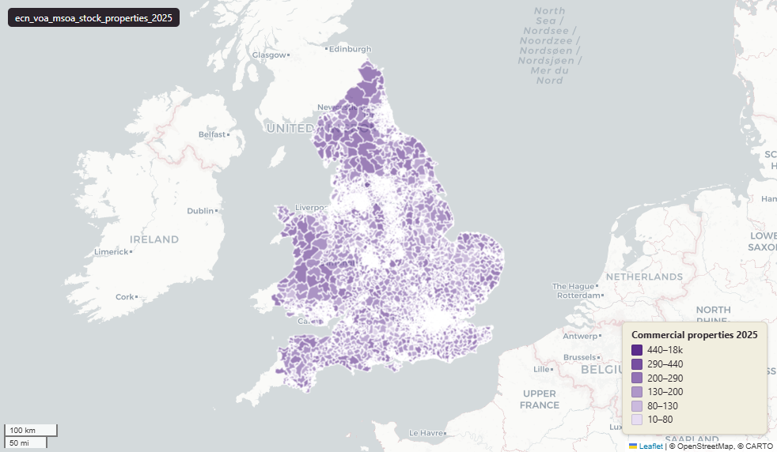

# Valuation Office Agency (VOA) Stock of Properties at Middle Super Output Area (MSOA), 2025

VOA Stock of Properties - MSOA

`ecn_voa_msoa_stock_properties_2025`

**SOURCE**

- Valuation Office Agency (VOA) Non-Domestic Rating (NDR), gov.uk publication 2025-06 (reference date 31 March 2025).

**DOCUMENTATION**

- Dataset page : https://www.gov.uk/government/statistics/non-domestic-rating-stock-of-properties-2025
- Background information : https://www.gov.uk/government/statistics/non-domestic-rating-stock-of-properties-2025/non-domestic-rating-stock-of-properties-background-information

**DEFINITIONS**

- Stock of Properties: "The statistics provide information on the number and value of the stock of rateable properties (known as 'hereditaments'), broken down by sector, geographic location, Special Category (SCat), property type and rateable value band." (gov.uk background-information page)
- Hereditament: "A rateable property is a property on which rates may be charged and is the unit to which the VOA assigns RV. In general, rateable properties are buildings or premises within buildings, appropriate for or used for single occupation. Rateable properties can be occupied or vacant." (gov.uk background-information page)
- Rateable Value (RV): "The RV of a property is broadly the value at which a property might be expected to be let for one year." (gov.uk background-information page)
- Rating list mapping: "those for 2011-2017 are based on the 2010 rating list; 2018-2023 are based on the 2017 rating list and 2024-2025 are based on the 2023 rating list." (gov.uk background-information page)

**SCOPE**

- Middle Super Output Area (MSOA) 2021 boundaries, England and Wales. 7,264 rows (E: 6,856; W: 408). Source CSV rows filtered to geography = 'MSOA'.

**CRS**

- EPSG:27700 (British National Grid).

**LICENCE**

- Open Government Licence v3.0 (OGL). © Crown copyright. https://www.nationalarchives.gov.uk/doc/open-government-licence/version/3/

**ENRICHMENT**

- `msoa21hclnm` — House of Commons Library readable MSOA name, joined at load on msoa21cd from House of Commons Library MSOA Names v2.3 (13 February 2026). Open Parliament Licence.

**LOADED INTO uk_baseline**

- Loaded by PNC, May 2026.

## Columns

| Column | Type | Description / unit |
|---|---|---|
| `fid` | `integer` |  |
| `msoa21cd` | `character varying(20)` | Source field `area_code` |
| `msoa21nm` | `character varying(255)` | Source field `area_name` |
| `count_all_2011` | `integer` | Unit: "Number of rateable properties (count)" |
| `count_retail_2011` | `integer` | Unit: "Number of rateable properties (count)" |
| `count_office_2011` | `integer` | Unit: "Number of rateable properties (count)" |
| `count_industrial_2011` | `integer` | Unit: "Number of rateable properties (count)" |
| `count_other_2011` | `integer` | Unit: "Number of rateable properties (count)" |
| `rateable_value_all_2011` | `integer` | Unit: "total rateable value (£ in thousands)" |
| `rateable_value_retail_2011` | `integer` | Unit: "total rateable value (£ in thousands)" |
| `rateable_value_office_2011` | `integer` | Unit: "total rateable value (£ in thousands)" |
| `rateable_value_industrial_2011` | `integer` | Unit: "total rateable value (£ in thousands)" |
| `rateable_value_other_2011` | `integer` | Unit: "total rateable value (£ in thousands)" |
| `count_all_2012` | `integer` | Unit: "Number of rateable properties (count)" |
| `count_retail_2012` | `integer` | Unit: "Number of rateable properties (count)" |
| `count_office_2012` | `integer` | Unit: "Number of rateable properties (count)" |
| `count_industrial_2012` | `integer` | Unit: "Number of rateable properties (count)" |
| `count_other_2012` | `integer` | Unit: "Number of rateable properties (count)" |
| `rateable_value_all_2012` | `integer` | Unit: "total rateable value (£ in thousands)" |
| `rateable_value_retail_2012` | `integer` | Unit: "total rateable value (£ in thousands)" |
| `rateable_value_office_2012` | `integer` | Unit: "total rateable value (£ in thousands)" |
| `rateable_value_industrial_2012` | `integer` | Unit: "total rateable value (£ in thousands)" |
| `rateable_value_other_2012` | `integer` | Unit: "total rateable value (£ in thousands)" |
| `count_all_2013` | `integer` | Unit: "Number of rateable properties (count)" |
| `count_retail_2013` | `integer` | Unit: "Number of rateable properties (count)" |
| `count_office_2013` | `integer` | Unit: "Number of rateable properties (count)" |
| `count_industrial_2013` | `integer` | Unit: "Number of rateable properties (count)" |
| `count_other_2013` | `integer` | Unit: "Number of rateable properties (count)" |
| `rateable_value_all_2013` | `integer` | Unit: "total rateable value (£ in thousands)" |
| `rateable_value_retail_2013` | `integer` | Unit: "total rateable value (£ in thousands)" |
| `rateable_value_office_2013` | `integer` | Unit: "total rateable value (£ in thousands)" |
| `rateable_value_industrial_2013` | `integer` | Unit: "total rateable value (£ in thousands)" |
| `rateable_value_other_2013` | `integer` | Unit: "total rateable value (£ in thousands)" |
| `count_all_2014` | `integer` | Unit: "Number of rateable properties (count)" |
| `count_retail_2014` | `integer` | Unit: "Number of rateable properties (count)" |
| `count_office_2014` | `integer` | Unit: "Number of rateable properties (count)" |
| `count_industrial_2014` | `integer` | Unit: "Number of rateable properties (count)" |
| `count_other_2014` | `integer` | Unit: "Number of rateable properties (count)" |
| `rateable_value_all_2014` | `integer` | Unit: "total rateable value (£ in thousands)" |
| `rateable_value_retail_2014` | `integer` | Unit: "total rateable value (£ in thousands)" |
| `rateable_value_office_2014` | `integer` | Unit: "total rateable value (£ in thousands)" |
| `rateable_value_industrial_2014` | `integer` | Unit: "total rateable value (£ in thousands)" |
| `rateable_value_other_2014` | `integer` | Unit: "total rateable value (£ in thousands)" |
| `count_all_2015` | `integer` | Unit: "Number of rateable properties (count)" |
| `count_retail_2015` | `integer` | Unit: "Number of rateable properties (count)" |
| `count_office_2015` | `integer` | Unit: "Number of rateable properties (count)" |
| `count_industrial_2015` | `integer` | Unit: "Number of rateable properties (count)" |
| `count_other_2015` | `integer` | Unit: "Number of rateable properties (count)" |
| `rateable_value_all_2015` | `integer` | Unit: "total rateable value (£ in thousands)" |
| `rateable_value_retail_2015` | `integer` | Unit: "total rateable value (£ in thousands)" |
| `rateable_value_office_2015` | `integer` | Unit: "total rateable value (£ in thousands)" |
| `rateable_value_industrial_2015` | `integer` | Unit: "total rateable value (£ in thousands)" |
| `rateable_value_other_2015` | `integer` | Unit: "total rateable value (£ in thousands)" |
| `count_all_2016` | `integer` | Unit: "Number of rateable properties (count)" |
| `count_retail_2016` | `integer` | Unit: "Number of rateable properties (count)" |
| `count_office_2016` | `integer` | Unit: "Number of rateable properties (count)" |
| `count_industrial_2016` | `integer` | Unit: "Number of rateable properties (count)" |
| `count_other_2016` | `integer` | Unit: "Number of rateable properties (count)" |
| `rateable_value_all_2016` | `integer` | Unit: "total rateable value (£ in thousands)" |
| `rateable_value_retail_2016` | `integer` | Unit: "total rateable value (£ in thousands)" |
| `rateable_value_office_2016` | `integer` | Unit: "total rateable value (£ in thousands)" |
| `rateable_value_industrial_2016` | `integer` | Unit: "total rateable value (£ in thousands)" |
| `rateable_value_other_2016` | `integer` | Unit: "total rateable value (£ in thousands)" |
| `count_all_2017` | `integer` | Unit: "Number of rateable properties (count)" |
| `count_retail_2017` | `integer` | Unit: "Number of rateable properties (count)" |
| `count_office_2017` | `integer` | Unit: "Number of rateable properties (count)" |
| `count_industrial_2017` | `integer` | Unit: "Number of rateable properties (count)" |
| `count_other_2017` | `integer` | Unit: "Number of rateable properties (count)" |
| `rateable_value_all_2017` | `integer` | Unit: "total rateable value (£ in thousands)" |
| `rateable_value_retail_2017` | `integer` | Unit: "total rateable value (£ in thousands)" |
| `rateable_value_office_2017` | `integer` | Unit: "total rateable value (£ in thousands)" |
| `rateable_value_industrial_2017` | `integer` | Unit: "total rateable value (£ in thousands)" |
| `rateable_value_other_2017` | `integer` | Unit: "total rateable value (£ in thousands)" |
| `count_all_2018` | `integer` | Unit: "Number of rateable properties (count)" |
| `count_retail_2018` | `integer` | Unit: "Number of rateable properties (count)" |
| `count_office_2018` | `integer` | Unit: "Number of rateable properties (count)" |
| `count_industrial_2018` | `integer` | Unit: "Number of rateable properties (count)" |
| `count_other_2018` | `integer` | Unit: "Number of rateable properties (count)" |
| `rateable_value_all_2018` | `integer` | Unit: "total rateable value (£ in thousands)" |
| `rateable_value_retail_2018` | `integer` | Unit: "total rateable value (£ in thousands)" |
| `rateable_value_office_2018` | `integer` | Unit: "total rateable value (£ in thousands)" |
| `rateable_value_industrial_2018` | `integer` | Unit: "total rateable value (£ in thousands)" |
| `rateable_value_other_2018` | `integer` | Unit: "total rateable value (£ in thousands)" |
| `count_all_2019` | `integer` | Unit: "Number of rateable properties (count)" |
| `count_retail_2019` | `integer` | Unit: "Number of rateable properties (count)" |
| `count_office_2019` | `integer` | Unit: "Number of rateable properties (count)" |
| `count_industrial_2019` | `integer` | Unit: "Number of rateable properties (count)" |
| `count_other_2019` | `integer` | Unit: "Number of rateable properties (count)" |
| `rateable_value_all_2019` | `integer` | Unit: "total rateable value (£ in thousands)" |
| `rateable_value_retail_2019` | `integer` | Unit: "total rateable value (£ in thousands)" |
| `rateable_value_office_2019` | `integer` | Unit: "total rateable value (£ in thousands)" |
| `rateable_value_industrial_2019` | `integer` | Unit: "total rateable value (£ in thousands)" |
| `rateable_value_other_2019` | `integer` | Unit: "total rateable value (£ in thousands)" |
| `count_all_2020` | `integer` | Unit: "Number of rateable properties (count)" |
| `count_retail_2020` | `integer` | Unit: "Number of rateable properties (count)" |
| `count_office_2020` | `integer` | Unit: "Number of rateable properties (count)" |
| `count_industrial_2020` | `integer` | Unit: "Number of rateable properties (count)" |
| `count_other_2020` | `integer` | Unit: "Number of rateable properties (count)" |
| `rateable_value_all_2020` | `integer` | Unit: "total rateable value (£ in thousands)" |
| `rateable_value_retail_2020` | `integer` | Unit: "total rateable value (£ in thousands)" |
| `rateable_value_office_2020` | `integer` | Unit: "total rateable value (£ in thousands)" |
| `rateable_value_industrial_2020` | `integer` | Unit: "total rateable value (£ in thousands)" |
| `rateable_value_other_2020` | `integer` | Unit: "total rateable value (£ in thousands)" |
| `count_all_2021` | `integer` | Unit: "Number of rateable properties (count)" |
| `count_retail_2021` | `integer` | Unit: "Number of rateable properties (count)" |
| `count_office_2021` | `integer` | Unit: "Number of rateable properties (count)" |
| `count_industrial_2021` | `integer` | Unit: "Number of rateable properties (count)" |
| `count_other_2021` | `integer` | Unit: "Number of rateable properties (count)" |
| `rateable_value_all_2021` | `integer` | Unit: "total rateable value (£ in thousands)" |
| `rateable_value_retail_2021` | `integer` | Unit: "total rateable value (£ in thousands)" |
| `rateable_value_office_2021` | `integer` | Unit: "total rateable value (£ in thousands)" |
| `rateable_value_industrial_2021` | `integer` | Unit: "total rateable value (£ in thousands)" |
| `rateable_value_other_2021` | `integer` | Unit: "total rateable value (£ in thousands)" |
| `count_all_2022` | `integer` | Unit: "Number of rateable properties (count)" |
| `count_retail_2022` | `integer` | Unit: "Number of rateable properties (count)" |
| `count_office_2022` | `integer` | Unit: "Number of rateable properties (count)" |
| `count_industrial_2022` | `integer` | Unit: "Number of rateable properties (count)" |
| `count_other_2022` | `integer` | Unit: "Number of rateable properties (count)" |
| `rateable_value_all_2022` | `integer` | Unit: "total rateable value (£ in thousands)" |
| `rateable_value_retail_2022` | `integer` | Unit: "total rateable value (£ in thousands)" |
| `rateable_value_office_2022` | `integer` | Unit: "total rateable value (£ in thousands)" |
| `rateable_value_industrial_2022` | `integer` | Unit: "total rateable value (£ in thousands)" |
| `rateable_value_other_2022` | `integer` | Unit: "total rateable value (£ in thousands)" |
| `count_all_2023` | `integer` | Unit: "Number of rateable properties (count)" |
| `count_retail_2023` | `integer` | Unit: "Number of rateable properties (count)" |
| `count_office_2023` | `integer` | Unit: "Number of rateable properties (count)" |
| `count_industrial_2023` | `integer` | Unit: "Number of rateable properties (count)" |
| `count_other_2023` | `integer` | Unit: "Number of rateable properties (count)" |
| `rateable_value_all_2023` | `integer` | Unit: "total rateable value (£ in thousands)" |
| `rateable_value_retail_2023` | `integer` | Unit: "total rateable value (£ in thousands)" |
| `rateable_value_office_2023` | `integer` | Unit: "total rateable value (£ in thousands)" |
| `rateable_value_industrial_2023` | `integer` | Unit: "total rateable value (£ in thousands)" |
| `rateable_value_other_2023` | `integer` | Unit: "total rateable value (£ in thousands)" |
| `count_all_2024` | `integer` | Unit: "Number of rateable properties (count)" |
| `count_retail_2024` | `integer` | Unit: "Number of rateable properties (count)" |
| `count_office_2024` | `integer` | Unit: "Number of rateable properties (count)" |
| `count_industrial_2024` | `integer` | Unit: "Number of rateable properties (count)" |
| `count_other_2024` | `integer` | Unit: "Number of rateable properties (count)" |
| `rateable_value_all_2024` | `integer` | Unit: "total rateable value (£ in thousands)" |
| `rateable_value_retail_2024` | `integer` | Unit: "total rateable value (£ in thousands)" |
| `rateable_value_office_2024` | `integer` | Unit: "total rateable value (£ in thousands)" |
| `rateable_value_industrial_2024` | `integer` | Unit: "total rateable value (£ in thousands)" |
| `rateable_value_other_2024` | `integer` | Unit: "total rateable value (£ in thousands)" |
| `count_all_2025` | `integer` | Unit: "Number of rateable properties (count)" |
| `count_retail_2025` | `integer` | Unit: "Number of rateable properties (count)" |
| `count_office_2025` | `integer` | Unit: "Number of rateable properties (count)" |
| `count_industrial_2025` | `integer` | Unit: "Number of rateable properties (count)" |
| `count_other_2025` | `integer` | Unit: "Number of rateable properties (count)" |
| `rateable_value_all_2025` | `integer` | Unit: "total rateable value (£ in thousands)" |
| `rateable_value_retail_2025` | `integer` | Unit: "total rateable value (£ in thousands)" |
| `rateable_value_office_2025` | `integer` | Unit: "total rateable value (£ in thousands)" |
| `rateable_value_industrial_2025` | `integer` | Unit: "total rateable value (£ in thousands)" |
| `rateable_value_other_2025` | `integer` | Unit: "total rateable value (£ in thousands)" |
| `geom` | `geometry(MultiPolygon,27700)` | Geometry from uk_baseline.adm_ons_msoa_boundary_2021 |
| `msoa21hclnm` | `text` | House of Commons Library readable MSOA name. Source field `msoa21hclnm` from House of Commons Library MSOA Names v2.3 (13 February 2026), joined at load on msoa21cd. Open Parliament Licence. |
| `lad22cd` | `text` | Local Authority District 2022 code, best-fit assigned from the feature's Middle Layer Super Output Area (MSOA) 2021 code. The 2022 reference is the 2021 LAD geography that the MSOA 2021 names are scoped to. Joined at load from the ONS MSOA (2021) to LAD (2022) best-fit lookup on msoa21cd. Open Government Licence v3.0. |
| `lad22nm` | `text` | Local Authority District 2022 name, best-fit assigned from the feature's MSOA 2021 code (the 2021 LAD geography matching the MSOA 2021 name scoping). Joined at load from the ONS MSOA (2021) to LAD (2022) best-fit lookup on msoa21cd. Open Government Licence v3.0. |
| `lad25cd` | `text` | Local Authority District 2025 code (current administering authority), best-fit assigned from the feature's MSOA 2021 code. Joined at load from the ONS MSOA (2021) to Ward (2025) to LAD (2025) best-fit lookup on msoa21cd. Open Government Licence v3.0. |
| `lad25nm` | `text` | Local Authority District 2025 name (current administering authority), best-fit assigned from the feature's MSOA 2021 code. Joined at load from the ONS MSOA (2021) to Ward (2025) to LAD (2025) best-fit lookup on msoa21cd. Open Government Licence v3.0. |
